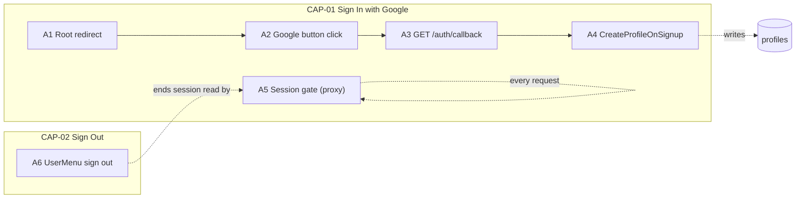
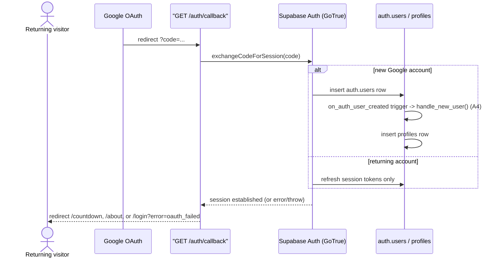
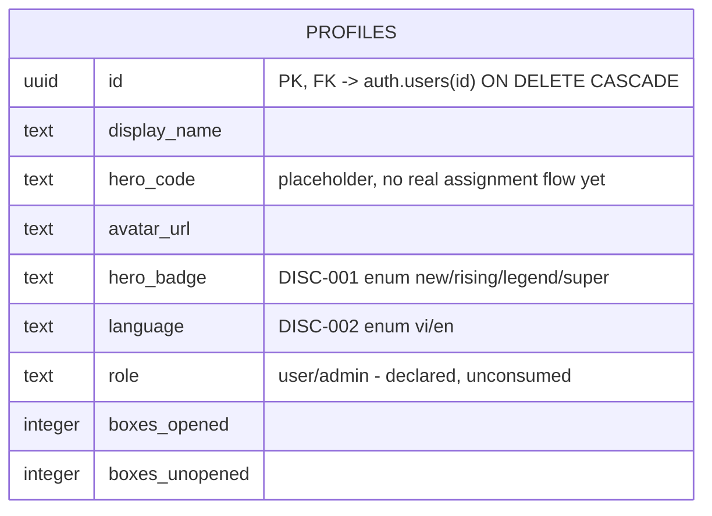
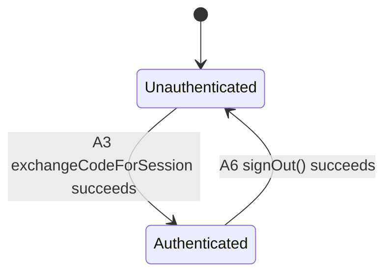

<!-- layout-exempt: rebuild-spec owns all docs/system|features|generated|flows paths -->
<!-- Contract: references/feature-spec-researcher-contract.md -->

# F001_GoogleSignIn — Technical Spec

**Priority**: P1
**Type**: mixed
**Generated**: 2026-09-07

**See also:** [`functional-spec.md`](./functional-spec.md) — plain-language overview, open
decisions, requirements/business rules stated in one-liners, screens, user stories, scenarios,
edge cases, and configuration for a BA/QA audience.

**How to read this file:** § 2 is the index — pick the action you care about and read its block
in § 3 straight through; each block is one complete thread, top to bottom. § 4 is the shared
appendix — jump in only when a § 3 block points you there.

## 1. Technical Overview

Sun\* members sign in with a Google account through Supabase Auth; the resulting session cookie
gates every other route in the app via a global route guard. A brand-new Google account gets a
`profiles` row provisioned by a database trigger, transparently, on the same round-trip. Signing
out is the reverse of the same lifecycle: it clears the same cookies the guard reads.



## 2. Action Index

| #      | Action (handler)                                    | Method · Path                          | Codes                                            | Writes                                                             | Detail              |
| ------ | --------------------------------------------------- | -------------------------------------- | ------------------------------------------------ | ------------------------------------------------------------------ | ------------------- |
| **A0** | _cross-cutting — belongs to no single action_       | —                                      | —                                                | —                                                                  | § 4.4               |
| **A1** | `RootPage` (default export, `app/page.tsx`)         | `GET` `/`                              | FR-101                                           | — _(read-only)_                                                    | § 3.1               |
| **A2** | `HeroSection#handleLogin`                           | _(client SDK call, no local endpoint)_ | FR-201, FR-202, US001                            | — _(read-only)_                                                    | § 3.1               |
| **A3** | `GET /auth/callback` (route handler default export) | `GET` `/auth/callback`                 | FR-203, DEC-001, DEC-003, US002, SM-001, INT-001 | — _(no app-table write; Supabase manages `auth.users` internally)_ | § 3.1 ▸ **diagram** |
| **A4** | `handle_new_user` _(background, no FE)_             | trigger · `on_auth_user_created`       | FR-001, BR-001, US002                            | `profiles`                                                         | § 3.1 ▸ **diagram** |
| **A5** | `updateSession` (proxy)                             | proxy · every request                  | FR-402, FR-601, DEC-002, DEC-004, BR-002         | — _(read-only)_                                                    | § 3.1               |
| **A6** | `UserMenu#handleSignOut`                            | _(client SDK call, no local endpoint)_ | FR-401, BR-003, BR-004, US004, SM-001            | — _(read-only)_                                                    | § 3.2               |

## 3. Actions

### 3.1 CAP-01 — Sign In with Google

#### A1 · Root redirect

`GET` `/` → `` `RootPage` ``
`FR-101`

**Who** · unauthenticated or authenticated visitor, either way
**FE** · `app/page.tsx:7-9` — a server component, no client logic
**BE** · same file; `redirect("/login")` unconditionally, no auth check performed here (the real
gate is A5, which still runs on this path first per the proxy matcher)
**Rule** · none — this file exists only as the `/` pointer to the Login screen
**Result** · no DB read/write; browser lands on `/login`
**Source:** `app/page.tsx:1-9`

<!-- No diagram: below threshold — a single unconditional redirect, no branching. -->

---

#### A2 · Google login button click

_(client SDK call, no local endpoint)_ → `` `HeroSection#handleLogin` ``
`FR-201` `FR-202` `US001` · `SCR002_LoginScreen` · `INT-001`

**Who** · unauthenticated visitor
**FE** · `components/login/hero-section.tsx:37-58` — `GoogleLoginButton` (`components/login/google-login-button.tsx`),
rendered at `hero-section.tsx:112`, shows a spinner and disables itself while `loading` is true
**Request** · no HTTP request from this app — `supabase.auth.signInWithOAuth({ provider: "google",
options: { redirectTo: "{origin}/auth/callback" } })` hands the browser to Google's consent screen
**BE** · none (client-only call); `INT-001` — the Supabase browser SDK brokers the handoff to
Google's OAuth consent screen, never a server-to-server call from this app
**Rule** · a client-side failure (missing env vars, offline, GoTrue unreachable) is caught and
shown inline rather than left as an unhandled rejection
**Result** · read-only — **no DB write**. On success the browser navigates away to Google (button
stays disabled until unload); on failure, `error` state is set and the inline
`role="alert"` message (`hero-section.tsx:115`) appears, button re-enables
**Source:** `components/login/hero-section.tsx:37-58` → `components/login/google-login-button.tsx:1-40`

<!-- No diagram: below threshold — single synchronous client call, one try/catch, no table write. -->

---

#### A3 · Complete Google sign-in _(background, no FE trigger of its own — Google redirects here)_

`GET` `/auth/callback` → `` `default export` ``
`FR-203` `DEC-001` `DEC-003` `US002` · `SCR002_LoginScreen` · `SM-001` · `INT-001`

**Who** · visitor returning from Google's consent screen
**FE** · _none_ — this is a server Route Handler; the browser lands here only because
`redirectTo` in A2 pointed at it
**Request** · query param `code` _(string, from Google via Supabase)_
**BE** · `` `exchangeCode(code)` `` calls `createClient().auth.exchangeCodeForSession(code)` —
`app/auth/callback/route.ts:52-62`. Wrapped in its own `try/catch` so a thrown exception (network
fault reaching GoTrue, malformed response, or the `handle_new_user` trigger erroring on first
sign-in) collapses to the same `false` result as a `{ error }` response — `redirect()` throws
`NEXT_REDIRECT` internally, so this catch is deliberately kept OUTSIDE the redirect calls below.
**Rule** · decides where the browser goes next, purely from whether the exchange succeeded and
(if so) whether the event has launched:

| DEC         | subtype | Condition                                                                                                  | What the user sees                                                                                                                              | Source                             |
| ----------- | ------- | ---------------------------------------------------------------------------------------------------------- | ----------------------------------------------------------------------------------------------------------------------------------------------- | ---------------------------------- |
| **DEC-001** | flow    | `signedIn === true`                                                                                        | routes onward without ever consulting anything the browser brought back — no `next`/redirect query param is read (open-redirect countermeasure) | `app/auth/callback/route.ts:64-70` |
| **DEC-003** | flow    | `signedIn === false` (missing `code`, a `{error}` result, or a thrown exception — all three collapse here) | lands on `/login?error=oauth_failed`; cancel, deny, expired code, and an infrastructure fault are indistinguishable to the client on purpose    | `app/auth/callback/route.ts:64-72` |

**Result** · no application-table write directly from this handler — a first-time signer's
`profiles` row is provisioned by **A4**, triggered transparently by the `auth.users` insert this
exchange causes inside Supabase Auth. User sees: redirected to `/countdown` (event not yet live) or
`/about` (event live) on success, `/login?error=oauth_failed` on any failure.
**State** · `SM-001`: `Unauthenticated` → `Authenticated` _(§ 4.3)_
**Source:** `app/auth/callback/route.ts:64-73` → `app/auth/callback/route.ts:52-62` → `lib/countdown-config.ts:25-28`



<!-- Capability-level diagram: A3 (HTTP callback) and A4 (background trigger) form one
     request -> background-step thread with no single handler owning the whole sequence. -->

---

#### A4 · CreateProfileOnSignup _(background, no FE)_

`trigger · on_auth_user_created` → `` `handle_new_user` ``
`FR-001` `BR-001` `US002` · `BL001`

**Who** · _no human actor — database trigger fired by Supabase Auth's own `auth.users` insert,
itself caused by A3's successful code exchange_
**FE** · _none_
**Request** · _no HTTP request_ — trigger payload is the new `auth.users` row (`NEW.id`,
`NEW.raw_user_meta_data`, `NEW.email`)
**BE** · `` `handle_new_user()` `` — `security definer` PL/pgSQL function —
`supabase/migrations/20260722090000_create_profile_on_signup.sql:7-27`
**Rule** · **BR-001 — a brand-new Google sign-in automatically gets a `profiles` row before
anything else in the app can depend on one existing.** `display_name` resolves from
`raw_user_meta_data.full_name` → `.name` → the email's local-part (first non-empty wins);
`hero_code` is a placeholder (`upper(left(md5(id),6))`, no real assignment flow exists yet);
`avatar_url` comes from OAuth metadata if present. `ON CONFLICT (id) DO NOTHING` makes the insert
idempotent against a re-fired trigger. `hero_badge`, `language`, `boxes_opened`,
`boxes_unopened`, and `role` are NOT in the INSERT column list, so each gets its column
`DEFAULT` (`'new'`, `'vi'`, `0`, `0`, `'user'` respectively) — this trigger never chooses those
values explicitly.
**Result**

- Writes `profiles.id, display_name, hero_code, avatar_url` ← derived as above —
  `supabase/migrations/20260722090000_create_profile_on_signup.sql:8-22`
- Writes `profiles.hero_badge, language, boxes_opened, boxes_unopened, role` ← column `DEFAULT`,
  not an explicit value from this function
  **State** · [UNVERIFIED] `SM-001`: transition not confirmed from this function alone — the
  session-level `Unauthenticated → Authenticated` transition is owned by A3's own exchange call,
  not by this row insert _(§ 4.3)_
  **Source:** `supabase/migrations/20260722090000_create_profile_on_signup.sql:7-27`

<!-- Diagram: see the shared sequenceDiagram under A3 above (capability-level, spans A3 -> A4). -->

---

#### A5 · Session gate (every request)

`proxy · every request` → `` `updateSession` ``
`FR-402` `FR-601` `DEC-002` `DEC-004` `BR-002`

**Who** · every request's visitor, authenticated or not
**FE** · _none_ — runs on the server before any page/route handler, via the project-root `proxy.ts`
(Next.js 16's renamed `middleware.ts`), matcher excludes only static assets
(`proxy.ts:12-14`)
**Request** · the inbound request's own cookies (session tokens)
**BE** · `` `updateSession(request)` `` — `lib/supabase/proxy.ts:44-91`
**Rule** · **BR-002 — the session is re-verified against the Auth server on every request, never
just trusted from the locally stored cookie.** `supabase.auth.getUser()` is used deliberately
instead of a lighter, unverified session read — `lib/supabase/proxy.ts:73-75`. Two routing
decisions follow from that check:

| DEC         | subtype | Condition                                                                                                                | What the user sees                                                                                    | Source                              |
| ----------- | ------- | ------------------------------------------------------------------------------------------------------------------------ | ----------------------------------------------------------------------------------------------------- | ----------------------------------- |
| **DEC-004** | flow    | `!user && !isPublicPath(pathname)` — `isPublicPath` is exactly `pathname === "/login" \|\| pathname.startsWith("/auth")` | redirected to `/login`, refreshed cookies preserved on the redirect response                          | `lib/supabase/proxy.ts:12-14,79-81` |
| **DEC-002** | flow    | `user && pathname === "/login"`                                                                                          | redirected onward to `/countdown` or `/about` per `isBeforeLaunch()` instead of seeing the login form | `lib/supabase/proxy.ts:83-85`       |

**Result** · read-only — **no DB write beyond the session cookie refresh itself**. Every
`NextResponse` this function returns (pass-through or redirect) carries forward whatever cookies
`supabase.auth.getUser()` rotated during the call — a bare redirect without them would strand the
browser on a stale refresh token (`lib/supabase/proxy.ts:16-27`).
**Source:** `proxy.ts:1-14` → `lib/supabase/proxy.ts:44-91`

<!-- No diagram: below threshold on the ≥2-tables/background-async criteria — this is a
     synchronous per-request check with two mutually exclusive branches, already fully captured
     by the DEC table above; a sequence diagram would not add ordering information the table
     doesn't already give. -->

---

### 3.2 CAP-02 — Sign Out

#### A6 · Sign out

_(client SDK call, no local endpoint)_ → `` `UserMenu#handleSignOut` ``
`FR-401` `BR-003` `BR-004` `US004` · `SCR004_AboutHomepage` `SCR005_AwardInfoScreen` `SCR006_SunKudosBoard` · `SM-001`

**Who** · signed-in member
**FE** · `components/homepage/user-menu.tsx:53-68` — "Sign out" menu item
(`user-menu.tsx:104-109`), inside the shared `UserMenu` chrome present on every authenticated
screen
**Request** · no HTTP request — `supabase.auth.signOut()` clears the browser's own session cookies
**BE** · none server-side; the same cookies **A5**'s `updateSession` reads are what this call
clears (`user-menu.tsx:53-56` comment)
**Rule** · **BR-003 — the UI never optimistically claims the member is signed out.** On failure,
`setOpen`/`router.push` are never reached; the error is only logged
(`user-menu.tsx:63-65`). **BR-004 — after a successful sign-out, the client Router Cache is
cleared** (`router.refresh()`, `user-menu.tsx:68`) so a subsequent back-navigation re-runs the
server request — and therefore **A5**'s guard — instead of serving a cached authenticated payload.
**Result** · read-only — no application-table write; browser's session cookies are cleared
client-side. On success: routes to `/login`. On failure: menu stays open, no navigation.
**State** · `SM-001`: `Authenticated` → `Unauthenticated` _(§ 4.3)_
**Source:** `components/homepage/user-menu.tsx:53-68`

<!-- No diagram: below threshold — single synchronous client call, no table write, two-branch
     try/catch already fully stated in the Rule/Result rungs above. -->

### 3.3 Edge cases

| Action  | Scenario                                                                                        | Behavior                                                                                                                                                                                                |
| ------- | ----------------------------------------------------------------------------------------------- | ------------------------------------------------------------------------------------------------------------------------------------------------------------------------------------------------------- |
| A2      | `NEXT_PUBLIC_SUPABASE_URL`/`ANON_KEY` missing at runtime                                        | `createClient()` throws synchronously inside the `try`; caught, inline error shown, button re-enables                                                                                                   |
| A2      | `signInWithOAuth` rejects (offline, DNS failure, GoTrue unreachable)                            | Same inline-error path as above — no unhandled rejection                                                                                                                                                |
| A3      | `code` query param missing entirely                                                             | `exchangeCode()` never called (`signedIn` short-circuits to `false`); falls straight to `/login?error=oauth_failed`                                                                                     |
| A3      | `exchangeCodeForSession` throws (network fault, malformed response, or the A4 trigger erroring) | Caught by `exchangeCode`'s own `try/catch`, treated identically to a `{ error }` result — same opaque redirect                                                                                          |
| A3 · A4 | A first-time signer's `handle_new_user` trigger errors (e.g. a constraint violation)            | The exception propagates out of `exchangeCodeForSession`'s underlying call and is caught by A3 — same opaque `/login?error=oauth_failed` redirect; no partial-session state is left visible to the user |
| A5      | Authenticated visitor requests `/login` directly                                                | Redirected onward per DEC-002 instead of rendering the login form                                                                                                                                       |
| A5      | Unauthenticated visitor requests any non-public path                                            | Redirected to `/login` per DEC-004; refreshed cookies preserved on the redirect response                                                                                                                |
| A6      | `signOut()` throws or resolves with an `error`                                                  | Menu stays open; error logged via `console.error`; no navigation, no false "signed out" UI state                                                                                                        |

## 4. Shared Foundation

### 4.1 Components

| Component                            | Responsibility                                                                       | Used in | File                                                                   |
| ------------------------------------ | ------------------------------------------------------------------------------------ | ------- | ---------------------------------------------------------------------- |
| `RootPage`                           | Unconditional entry-point redirect at `/`                                            | A1      | `app/page.tsx`                                                         |
| `HeroSection`                        | Renders the Google login CTA, owns `loading`/`error` client state                    | A2      | `components/login/hero-section.tsx`                                    |
| `GoogleLoginButton`                  | Presentational button — spinner/label swap, disabled while loading                   | A2      | `components/login/google-login-button.tsx`                             |
| `SiteHeader`/`SiteFooter` (login)    | Screen-scoped chrome for the Login screen (brand + language selector, copyright bar) | A2      | `components/login/site-header.tsx`, `components/login/site-footer.tsx` |
| Auth Callback route handler          | Exchanges the OAuth code, decides the post-login redirect                            | A3      | `app/auth/callback/route.ts`                                           |
| `handle_new_user` (trigger function) | Provisions the `profiles` row on first sign-in                                       | A4      | `supabase/migrations/20260722090000_create_profile_on_signup.sql`      |
| `updateSession` (proxy)              | Session cookie refresh + route guard on every request                                | A5      | `lib/supabase/proxy.ts` (wired from root `proxy.ts`)                   |
| `UserMenu`                           | Sign-out control inside the shared authenticated header chrome                       | A6      | `components/homepage/user-menu.tsx`                                    |

### 4.2 Data Model



| Entity                           | Table      | Used for                                                             | Action |
| -------------------------------- | ---------- | -------------------------------------------------------------------- | ------ |
| `PROFILES` (`MODEL001_PROFILES`) | `profiles` | Auto-provisioned member record this feature creates on first sign-in | A4     |

#### Polymorphic Behavior

Neither discriminator on `profiles` is read, rendered, or validated by any of this feature's own
actions (A1–A6) — F001 only creates the row (A4) and never branches on either value itself. Both
are set to their column `DEFAULT` at creation time, not chosen explicitly by this feature's logic.
Documented here for completeness because `PROFILES` is this feature's own Key Entity; the
consuming behavior lives in other features (profile/board screens).

##### DISC-001 — PROFILES.hero_badge

| Value                       | Render                                                                                       | Validation                                                                      | Persistence                                                                            |
| --------------------------- | -------------------------------------------------------------------------------------------- | ------------------------------------------------------------------------------- | -------------------------------------------------------------------------------------- |
| `new`                       | Not rendered by any F001 action — this is the DB `DEFAULT` every new sign-in receives        | Enforced by the `CHECK` constraint at the DB layer, independent of this feature | Set by column `DEFAULT` on the `profiles` INSERT (A4); no F001 code chooses this value |
| `rising`, `legend`, `super` | N/A to this feature — never assigned by A4; assignment mechanism, if any, lives outside F001 | Same `CHECK` constraint                                                         | Not written by any F001 action                                                         |

**Source:** docs/generated/entities.md § MODEL001_PROFILES > Discriminator Fields

##### DISC-002 — PROFILES.language

| Value | Render                                                                                | Validation                                         | Persistence                                           |
| ----- | ------------------------------------------------------------------------------------- | -------------------------------------------------- | ----------------------------------------------------- |
| `vi`  | Not rendered by any F001 action — this is the DB `DEFAULT` every new sign-in receives | Enforced by the `CHECK` constraint at the DB layer | Set by column `DEFAULT` on the `profiles` INSERT (A4) |
| `en`  | N/A to this feature — never written by A4                                             | Same `CHECK` constraint                            | Not written by any F001 action                        |

**Source:** docs/generated/entities.md § MODEL001_PROFILES > Discriminator Fields

### 4.3 State Management

### Session lifecycle (SM-001)

**kind:** entity
**Linked FR:** FR-601
**Source:** `app/auth/callback/route.ts:64-73` (Unauthenticated → Authenticated) ·
`components/homepage/user-menu.tsx:53-68` (Authenticated → Unauthenticated)

<!-- The session itself is persisted by Supabase Auth's own internal schema (auth.users /
     GoTrue's session store), not one of this project's own `docs/generated/entities.md` rows —
     stated here so a reader does not go looking for a "SESSION" entity in § 4.2 above. -->



**Action transitions:** the guard and side effect for each edge live in the **Result**/**State**
rungs of the action named on that edge (A3, A6 in § 3.1/§ 3.2) — not repeated here.

### 4.4 Shared Rules

Every Business Rule and Decision in this feature is used by exactly one action (Bin 1) — each
lives inline in that action's own **Rule** rung in § 3, not here.

#### Bin 2 — used by ≥2 named actions

None — no shared BR/DEC crosses ≥2 actions in this feature.

#### Bin 3 — cross-cutting, belongs to no single action

None — **A0** claims nothing this feature; the closest candidate (blanket session protection) is
itself owned by a dedicated action (**A5**), not left cross-cutting with no owner.

### 4.5 Algorithms & Integrations

### Google OAuth handoff (INT-001)

**Linked FR:** FR-201
**Used in:** A2 → A3
**Source:** `components/login/hero-section.tsx:37-46` → `app/auth/callback/route.ts:64-73`
**Type:** api-call _(browser-redirect handoff, not a server-to-server call)_
**Target:** Google's OAuth consent screen, brokered by Supabase Auth (GoTrue)
**Payload:** none sent directly by this app's code — `signInWithOAuth` hands the browser to
Supabase's own authorize endpoint with `redirectTo={origin}/auth/callback`; no other fields
**Failure handling:** none — a rejected consent, an expired code, or any exchange failure all
surface only via the generic `/login?error=oauth_failed` redirect (`DEC-003`); there is no retry
and no distinct error per failure cause

### 4.6 Configuration

```text
NEXT_PUBLIC_SUPABASE_URL         # Supabase project URL — required; client.ts/server.ts/proxy.ts all throw via non-null assertion if unset (A2, A3, A5)
NEXT_PUBLIC_SUPABASE_ANON_KEY     # Supabase anon key — required, same throw behavior (A2, A3, A5)
NEXT_PUBLIC_LAUNCH_AT             # ISO 8601 event start; drives DEC-001/DEC-002's Countdown-vs-About branch (A3, A5). Unset -> now+8s (dev convenience only, per lib/countdown-config.ts:9-16)
```

**Client behavior:** see
[`behavior-logic.md`](../../generated/behavior-logic.md) (client-side patterns — debounce, optimistic UI, polling, upload, realtime),
[`permissions.md`](../../system/permissions.md) (feature flags / experiments / env / locale gates),
[`architecture.md`](../../system/architecture.md) (guards / deep-link state restoration / unsaved-changes protection).

## 5. Verification & Technical Notes

### 5.1 Technical Verification

- **SC-001** _(A3)_ `GET /auth/callback` with a valid `code` establishes a session and lands the
  browser on `/countdown` or `/about`, never on `/login` (covers FR-203, DEC-001)
- **SC-002** _(A3)_ `GET /auth/callback` with a missing or invalid `code`, or a thrown exception
  from the exchange call, always lands on `/login?error=oauth_failed` (covers FR-203, DEC-003)
- **SC-003** _(A5)_ Any unauthenticated request to a non-public path redirects to `/login`; any
  authenticated request to a non-public path passes through (covers FR-601, DEC-004)
- **SC-004** _(A5)_ An authenticated request to `/login` redirects onward instead of rendering the
  login form (covers FR-402, DEC-002)
- **SC-005** _(A6)_ A successful sign-out clears the session and lands on `/login`; a failed
  sign-out leaves the menu open with no visible state change (covers FR-401, BR-003)

#### US001_SignInWithGoogle _(A2)_

**Independent Test:** Trigger the Login screen's Google button with the Supabase client
throwing (e.g. by stubbing `signInWithOAuth` to reject) and confirm the inline
`data-testid="google-login-error"` element appears and the button re-enables — no navigation
attempted, no unhandled rejection in the console.

**Acceptance Scenarios:**

1. **Given** the visitor is on `/login`, unauthenticated, **When** the visitor clicks "Login With
   Google," **Then** `supabase.auth.signInWithOAuth` is called with
   `redirectTo: "{origin}/auth/callback"` and no other query params, and the button shows
   `aria-busy="true"`.
2. **Given** `signInWithOAuth` resolves with `{ error }` or the client throws, **When** the visitor
   has clicked "Login With Google," **Then** `error` state flips to `true`, the button re-enables,
   and no navigation occurs.

#### US002_CompleteGoogleSignIn _(A3, A4)_

**Independent Test:** Call `GET /auth/callback?code=<valid>` directly against a test environment
and confirm the response is a 3xx redirect to `/countdown` or `/about` (never a 200 or a 500), and
that a `profiles` row now exists for the signed-in user's `id`.

**Acceptance Scenarios:**

1. **Given** a valid `code` and the event has not launched (`isBeforeLaunch() === true`), **When**
   `GET /auth/callback` runs, **Then** the response redirects to `/countdown` and a `profiles` row
   exists for the new/returning user.
2. **Given** an invalid, expired, or missing `code`, **When** `GET /auth/callback` runs, **Then**
   the response redirects to `/login?error=oauth_failed` — status/response detail: no session
   cookie is set on this response.

#### US004_SignOut _(A6)_

**Independent Test:** With an authenticated session, invoke the sign-out handler and confirm the
session cookie is cleared (a subsequent request to a protected path is redirected by A5), and that
`router.refresh()` was called so the client Router Cache does not serve a stale authenticated page
on back-navigation.

**Acceptance Scenarios:**

1. **Given** the member is signed in with the account menu open, **When** "Sign out" is selected,
   **Then** `supabase.auth.signOut()` resolves without error, the menu closes, and the browser
   routes to `/login`.
2. **Given** `supabase.auth.signOut()` throws or resolves with `{ error }`, **When** "Sign out" is
   selected, **Then** the menu remains open, `router.push`/`router.refresh` are never called, and
   the error is logged via `console.error`.

### 5.2 Assumptions

- _(A3)_ `redirect()`'s host-relative `Location` header is assumed to be honored unchanged by
  whatever sits in front of this app in production (reverse proxy, CDN) — this pass verified the
  behavior only under `next start` locally (`curl -H "Host: ..."`), not against a deployed
  topology.
- _(A5)_ `enable_refresh_token_rotation = true` (`supabase/config.toml`) is assumed to stay enabled
  in every deployed environment — `redirectPreservingCookies`'s cookie-forwarding logic exists
  specifically to avoid the "randomly logged out" failure mode that setting introduces if a
  rotated refresh token were ever dropped from a redirect response.

### 5.3 Unresolved Questions

1. **Production monitoring of client-env misconfiguration** _(A2)_: whether a missing
   `NEXT_PUBLIC_SUPABASE_URL`/`ANON_KEY` in a deployed environment is monitored/alerted anywhere,
   or only ever surfaces as the client-side thrown exception this action's `try/catch` already
   handles.
2. **Edge/serverless env-value caching** _(A5)_: whether `isBeforeLaunch()` could read a
   server-cached `NEXT_PUBLIC_LAUNCH_AT` across requests in a way that serves a stale
   Countdown/About split right at the launch boundary — not confirmable from source alone.

### 5.4 Source References

| Action | Order | Symbol                      | Path                                                                   | Purpose                                                   |
| ------ | ----- | --------------------------- | ---------------------------------------------------------------------- | --------------------------------------------------------- |
| —      | 1     | `PROFILES`                  | `supabase/migrations/20260722090000_create_profile_on_signup.sql:1-40` | entity this feature provisions on first sign-in           |
| A1     | 2     | `RootPage`                  | `app/page.tsx:1-9`                                                     | unconditional entry-point redirect                        |
| A2     | 3     | `HeroSection#handleLogin`   | `components/login/hero-section.tsx:37-58`                              | starts the Google OAuth flow                              |
| A3     | 4     | Auth Callback route handler | `app/auth/callback/route.ts:1-73`                                      | exchanges the OAuth code, decides the post-login redirect |
| A4     | 5     | `handle_new_user`           | `supabase/migrations/20260722090000_create_profile_on_signup.sql:7-27` | provisions the `profiles` row on first sign-in            |
| A5     | 6     | `updateSession`             | `lib/supabase/proxy.ts:44-91`                                          | session refresh + route guard, wired from `proxy.ts:1-14` |
| A6     | 7     | `UserMenu#handleSignOut`    | `components/homepage/user-menu.tsx:53-68`                              | ends the session client-side                              |

#### Data Flow

```text
{Google ?code=... on GET /auth/callback} -> exchangeCode() calls exchangeCodeForSession(code)
  -> Supabase Auth issues/refreshes session cookies (+ auth.users insert on first sign-in,
     firing A4's trigger) -> post-login target computed by isBeforeLaunch() -> redirect response
```

### 5.5 Artifact References

| Artifact           | File                                                           | Codes Used                             | Reviewed |
| ------------------ | -------------------------------------------------------------- | -------------------------------------- | -------- |
| System Overview    | [overview.md](../../system/overview.md)                        | —                                      | [x]      |
| Architecture       | [architecture.md](../../system/architecture.md)                | —                                      | [x]      |
| Feature List       | [feature-list.md](../../generated/feature-list.md)             | F001                                   | [x]      |
| API Map            | [api-map.md](../../generated/api-map.md)                       | ROUTE001                               | [ ]      |
| Entities           | [entities.md](../../generated/entities.md)                     | MODEL001                               | [ ]      |
| Screens            | [functional-spec.md § 6](functional-spec.md#6-screens)         | SCR001, SCR002, SCR004, SCR005, SCR006 | [ ]      |
| Behavior Logic     | [behavior-logic.md](../../generated/behavior-logic.md)         | BL001                                  | [ ]      |
| Permissions Matrix | [permissions-matrix.md](../../generated/permissions-matrix.md) | PERM001                                | [ ]      |
| User Stories       | [user-stories.md](../../generated/user-stories.md)             | US001, US002, US004                    | [ ]      |
