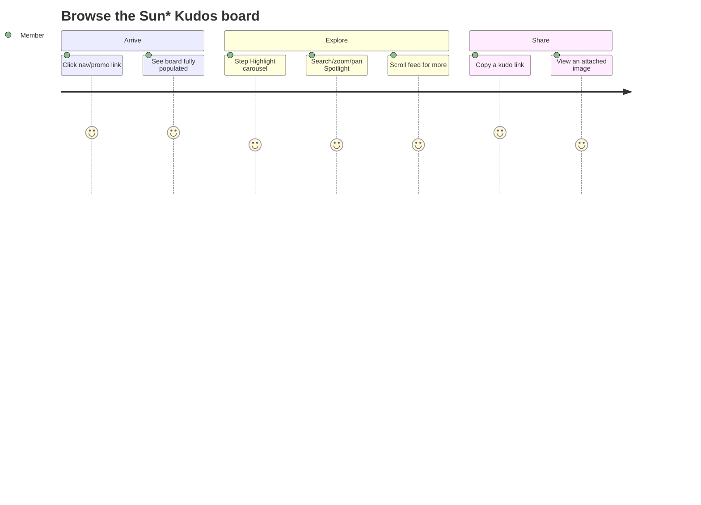

<!-- layout-exempt: rebuild-spec owns all docs/system|features|generated|flows paths -->
<!-- Contract: references/feature-spec-researcher-contract.md -->

# Functional Spec — F002_KudosBoardData

**Priority**: P0
**Type**: ui
**Generated**: 2026-09-07

**See also:** [`technical-spec.md`](./technical-spec.md) — endpoints, Source citations, pseudocode,
key entities, and DB writes for a Dev/QA/SA audience.

**Traceability:** F002 → SCR006_SunKudosBoard (+REG001/REG002/REG003) → US007, US014, US015, US016,
US018, US019, US020, US023, US024 → — (no background logic owned) → ROUTE007 → —

## 1. Overview

**Problem:** Members had no real Sun\* Kudos board to look at — the feed, the Highlight carousel,
the Spotlight name cloud, and the sidebar stats were all placeholder/mock data. A member wants to
open the board and see real appreciation activity: who has been thanking whom, which kudos have
the most hearts, and their own personal stats.
**Solution:** A single board page reads five real data sets at once — the All-Kudos feed (newest
first, loads more as you scroll), the Highlight carousel (the event's top 5 most-hearted kudos),
the Spotlight board (every person who has received a kudo, searchable/zoomable/pannable), and the
viewer's own sidebar stats (kudos sent/received, hearts received, secret-box counters) — plus lets
a member copy a direct link to any kudo and view an attached image at full size.
**Scope:** Reading and browsing the board's content: the feed with infinite scroll, the Highlight
carousel (stepping through slides, a decorative department narrow), the Spotlight name cloud
(search/zoom/pan), the sidebar stats display, sharing a kudo's link, and viewing an attachment
full-size.
**Non-Scope:** Writing a new kudo (see F003), hearting/un-hearting a kudo (see F004), the hashtag
filter mechanism itself — this feature only consumes it (see F005), and the secret-box draw
mutation in the sidebar (see F006). The two sidebar leaderboards are not implemented this batch —
see § 11.

**Actors**

| Actor            | Description                                       | Primary goal                                                                                |
| ---------------- | ------------------------------------------------- | ------------------------------------------------------------------------------------------- |
| Signed-in member | Any authenticated Sun\* Annual Awards participant | Browse who has received kudos, find standout kudos, check their own stats, and share a kudo |

## 2. Functional Capabilities

| ID     | Capability                                         | What the user can do                                                                                                                 | User Stories        | Requirements                                   | Business Rules                          | Screens                     |
| ------ | -------------------------------------------------- | ------------------------------------------------------------------------------------------------------------------------------------ | ------------------- | ---------------------------------------------- | --------------------------------------- | --------------------------- |
| CAP-01 | Enter & view the board                             | Reach the board from nav/hero/promo links and see the shell, feed, highlight, spotlight, and their own sidebar stats render together | US007               | FR-001, FR-101, FR-205, FR-206, FR-601, FR-602 | BR-001, BR-006, BR-010                  | SCR006_SunKudosBoard        |
| CAP-02 | Browse the Highlight carousel & copy a kudo's link | Step through the 5 top-hearted kudos, try narrowing them by department, and copy a link to any of them                               | US014, US015, US016 | FR-202, FR-203, FR-401                         | BR-002, BR-003, BR-004, BR-007, DEC-001 | SCR006_SunKudosBoard/REG001 |
| CAP-03 | Explore the Spotlight board                        | Search, zoom, and pan the recipient name cloud                                                                                       | US018, US019, US020 | FR-204                                         | BR-005, DEC-002                         | SCR006_SunKudosBoard/REG002 |
| CAP-04 | Browse the All-Kudos feed & view an attached image | Scroll the feed to fetch more posts and open an attached image full-size                                                             | US023, US024        | FR-201, FR-402                                 | BR-008, BR-009                          | SCR006_SunKudosBoard/REG003 |

**Note:** "Copy a kudo's link" (FR-401/BR-007/US016) is claimed once here under CAP-02, its
primary trigger point, even though the same control also appears on Feed cards (CAP-04) — one
requirement implemented by a shared control, not two requirements. BR-001 (star-tier badge) is a
cross-cutting display rule shown on both Highlight and Feed cards, claimed here under CAP-01 since
it is part of what renders on initial board entry.

## 3. Open Decisions

| D### | Decision                                                                                                                                                                                                                                                                                               | Default proposal                                                                                                                                         | Rationale                                                                                                                                      | Blocks work |
| ---- | ------------------------------------------------------------------------------------------------------------------------------------------------------------------------------------------------------------------------------------------------------------------------------------------------------ | -------------------------------------------------------------------------------------------------------------------------------------------------------- | ---------------------------------------------------------------------------------------------------------------------------------------------- | ----------- |
| D001 | The Highlight carousel's department narrow (US014) matches a kudo's `hero_code` against a hardcoded department label (`"CEVC1"`–`"CEVC4"`), but `hero_code` is a placeholder value that never takes that shape — should this control be wired to a real department field, or removed until one exists? | Keep the control as decorative/inert (selecting a department will show its empty state in practice) until a real department field is added to `profiles` | Removing a spec'd UI control is a bigger change than leaving it inert; the empty-state fallback already handles the "no match" case gracefully | no          |
| D002 | The two sidebar leaderboards ("newest gift recipients", "rising stars") have no backing table this batch — should a later batch add the underlying query, or should the boxes be hidden until then?                                                                                                    | Keep rendering both boxes in their empty state (current behavior) rather than hiding them                                                                | Matches the already-shipped behavior; hiding them would be a bigger UI change than this feature's scope                                        | no          |

## 4. Requirements

### Foundation (0xx)

- **FR-001** The board performs five independent reads — hashtags, the first feed page, the
  Highlight top-5, the Spotlight board, and the viewer's sidebar stats — together, in one page
  load, with no separate client refetch needed to see the initial content.

### Navigation (1xx)

- **FR-101** A signed-in member reaches the board via the header/footer nav link, the homepage
  hero's "About Kudos" CTA, or the Kudos promo banner shown on the About/Award-Info pages.

### Sun\* Kudos Board (2xx)

- **FR-201** The All-Kudos feed shows the 10 most recent non-spam kudos, newest first, and loads
  10 more as the member scrolls to the bottom.
- **FR-202** The Highlight carousel always shows exactly 5 kudos, ranked by heart count for the
  whole event, honoring whichever hashtag filter is currently active.
- **FR-203** The Highlight carousel's department control narrows only the 5 already-shown kudos on
  the member's screen — it never fetches different kudos from the server.
- **FR-204** The Spotlight board shows every distinct person who has ever received a kudo as a
  searchable, zoomable, pannable name in a word cloud, alongside a single total-kudos count for
  the whole event.
- **FR-205** The sidebar stats box shows the member's own kudos received, kudos sent, hearts
  received (with a "×2" badge during an active special-day window), and secret-box opened/unopened
  counts.
- **FR-206** Both sidebar leaderboard boxes always show their empty-state message this batch — see
  § 3 Open Decisions D002.

### Interaction (4xx)

- **FR-401** Clicking "Copy link" on any Highlight or Feed card copies a direct link to that kudo
  to the clipboard and shows a confirmation toast for 2.5 seconds, whether or not the copy actually
  succeeded.
- **FR-402** Clicking an attached image thumbnail on a feed kudo opens it full-size in a lightbox,
  closable via its close button, the Escape key, or clicking outside the image.

### Security (6xx)

- **FR-601** `/sun-kudos` requires a signed-in session — an unauthenticated visitor (or one whose
  session expires mid-visit) is sent to the login screen before seeing any board content.
- **FR-602** The underlying profile/kudos/stats data is broadly readable by design (needed for a
  public-feeling leaderboard-style board) — FR-601 is what actually keeps the board itself gated,
  not this data-level permission.

## 5. Business Rules

- A receiver's star-tier badge (★1–★3) appears once their total kudos-received crosses the 10/20/50
  thresholds; nothing shows below the first threshold (BR-001)
- The Highlight carousel always shows exactly 5 kudos, ranked by heart count across the whole
  event, tie-broken deterministically (BR-002)
- The department narrow only filters the 5 already-shown Highlight rows client-side; it can never
  bring in different kudos, and today its match key can never actually succeed against real data
  (see D001) (BR-003)
- The Highlight carousel and the feed both reset to their first slide/page whenever the shared
  hashtag filter changes; the Highlight carousel additionally resets on its own department filter
  (BR-004)
- The Spotlight board's total-kudos count and recipient list always reflect the whole event — they
  never honor the hashtag filter that narrows Highlight/Feed (BR-005)
- Both sidebar leaderboard boxes always show their empty state this batch — no backing data exists
  yet (see D002) (BR-006)
- The "Copy link" confirmation toast always appears for 2.5 seconds, even if the clipboard write
  silently failed — the member is never shown a failure for this action (BR-007)
- The feed never shows a kudo flagged as spam, and never shows the same kudo twice even under fast
  scrolling or a slow network (BR-008)
- A failed "load more" attempt fails silently — the feed simply stops growing until the member
  scrolls again, which retries automatically (BR-009)
- The sidebar's "×2" hearts badge reflects whether a special-day bonus window is active right now
  — display-only here; the actual bonus is granted elsewhere (BR-010)
- On a non-center Highlight slide, or on the member's own kudo, the Heart button shows as disabled
  (DEC-001)
- Clicking the Spotlight board's pan/zoom toggle opens or closes its zoom-in/zoom-out/reset popover
  (DEC-002)

## 6. Screens

| Screen Name                               | SCR###                      | What User Sees                                                                                                           | What User Can Do                                                |
| ----------------------------------------- | --------------------------- | ------------------------------------------------------------------------------------------------------------------------ | --------------------------------------------------------------- |
| Sun\* Kudos Board                         | SCR006_SunKudosBoard        | The board shell: header, banner, write-kudos bar, Highlight carousel, Spotlight board, All-Kudos feed, and sidebar stats | Navigate here from nav/promo links; view every region below     |
| Sun\* Kudos Board — Highlight region      | SCR006_SunKudosBoard/REG001 | 5 top-hearted kudos in a carousel, with hashtag/department filter controls                                               | Step through slides, narrow by department, copy a card's link   |
| Sun\* Kudos Board — Spotlight region      | SCR006_SunKudosBoard/REG002 | A word-cloud of every kudos recipient plus a total count                                                                 | Search a name, zoom in/out, pan the cloud when zoomed           |
| Sun\* Kudos Board — All-Kudos feed region | SCR006_SunKudosBoard/REG003 | The newest-first kudos feed, one card per kudo, plus the sidebar stats box                                               | Scroll to load more, copy a card's link, open an attached image |

### User Journey

1. A member clicks "Sun\* Kudos" in the nav (or a promo banner elsewhere) and arrives at the Sun\*
   Kudos Board, where the feed, Highlight carousel, Spotlight board, and their own sidebar stats
   all appear already populated.
2. The member steps through the Highlight carousel or tries the department narrow — the carousel
   updates instantly since it's working over data already on the page.
3. The member searches the Spotlight board for a colleague's name, or zooms in and pans around to
   read a crowded area.
4. The member scrolls the feed; more kudos load in automatically as they near the bottom.
5. The member clicks "Copy link" on a kudo they like, sees a confirmation toast, and shares the
   link elsewhere; or clicks an attached image to view it full-size.



## 7. User Stories

### US007_ViewSunKudosBoard — View Sun\* Kudos Board

**Actor:** Signed-in member
**Goal:** Open the Sun\* Kudos live board so I can see and give kudos.
**Business value:** Gets members to the board at all — without a working entry point, none of the
board's content matters.

**Acceptance Criteria:**

- [ ] Clicking "Sun\* Kudos" in the header or footer nav routes to the board
- [ ] Clicking the "About Kudos" CTA on the homepage hero routes to the board
- [ ] Clicking the Kudos promo banner (on either the About or Award-Info page) routes to the board

### US014_FilterHighlightKudosByDepartment — Filter Highlight Kudos by Department

**Actor:** Signed-in member
**Goal:** Narrow the Highlight carousel to a department so I can see standout kudos from a
specific team.
**Business value:** Lets a member focus the Highlight carousel on their own team's recognition
moments.

**Acceptance Criteria:**

- [ ] Selecting a department narrows the already-shown 5 Highlight rows
- [ ] No re-fetch happens — this filter stays local to what's already on screen (see D001)
- [ ] Choosing "Clear" restores all 5 rows

### US015_BrowseHighlightCarousel — Browse the Highlight Carousel

**Actor:** Signed-in member
**Goal:** Step through the Highlight carousel to see each top-hearted kudo in turn.
**Business value:** Surfaces the event's most-appreciated moments one at a time, in a focused view.

**Acceptance Criteria:**

- [ ] Clicking the prev/next arrows (large or small) advances/retreats the current slide
- [ ] Arrows disable at the first/last slide
- [ ] The slide indicator shows "current/total"

### US016_CopyKudoShareLink — Copy a Kudo's Share Link

**Actor:** Signed-in member
**Goal:** Copy a direct link to a specific kudo so I can share it with someone else.
**Business value:** Lets a member spread a favorite kudo outside the board itself.

**Acceptance Criteria:**

- [ ] Clicking "Copy link" on a Highlight or Feed card copies a direct link to that kudo
- [ ] A confirmation toast shows for 2.5 seconds
- [ ] The toast still shows even when the clipboard write silently fails

### US018_SearchSpotlightBoard — Search the Spotlight Board

**Actor:** Signed-in member
**Goal:** Search for a name on the Spotlight board so I can quickly find a specific colleague's
node.
**Business value:** Makes a crowded name-cloud usable once the event has many recipients.

**Acceptance Criteria:**

- [ ] Typing in the search box narrows the name cloud to matching names (case-insensitive)
- [ ] An empty result set shows the board's empty-state message
- [ ] Clearing the search restores the full name cloud

### US019_ZoomSpotlightBoard — Zoom the Spotlight Board

**Actor:** Signed-in member
**Goal:** Zoom the Spotlight name cloud so I can read names in a crowded area.
**Business value:** Keeps individual names legible as the board fills up with more recipients.

**Acceptance Criteria:**

- [ ] Clicking the zoom toggle opens a popover with zoom-in, zoom-out, and reset controls
- [ ] Zoom is clamped between a minimum and maximum, moving in fixed steps
- [ ] "Reset" returns zoom (and pan) to their starting position

### US020_PanSpotlightBoard — Pan the Spotlight Board

**Actor:** Signed-in member
**Goal:** Drag the zoomed-in Spotlight name cloud so I can bring an off-screen part into view.
**Business value:** Completes the zoom feature — without panning, zooming in would strand content
off-screen with no way back.

**Acceptance Criteria:**

- [ ] Dragging the name cloud pans it, but only once zoomed in past the starting level
- [ ] The pan is clamped so content can never be dragged fully off-screen
- [ ] The cursor shows a grab/grabbing affordance while zoomed in
- [ ] Releasing the pointer, or moving it off the board, ends the drag

### US023_ViewKudoAttachedImage — View a Kudo's Attached Image

**Actor:** Signed-in member
**Goal:** View a kudo's attached image at full size so I can see it clearly.
**Business value:** Lets a member appreciate a shared photo/image without leaving the board.

**Acceptance Criteria:**

- [ ] Clicking an attachment thumbnail on a feed kudo opens it full-size
- [ ] The full-size view closes on its close button, Escape, or clicking outside the image
- [ ] Clicking the image itself does not close the view

### US024_LoadMoreKudosInFeed — Load More Kudos in the Feed

**Actor:** Signed-in member
**Goal:** Have the kudos feed load more posts as I scroll so I can keep browsing without pagination
clicks.
**Business value:** Keeps the feed usable as the event accumulates hundreds of kudos, without
forcing a "next page" click.

**Acceptance Criteria:**

- [ ] Scrolling near the bottom of the feed fetches and appends the next page automatically
- [ ] The same page of kudos is never appended twice, even under fast scrolling
- [ ] A failed page fetch fails silently — scrolling further retries automatically
- [ ] An expired session mid-scroll simply stops the feed growing, rather than showing an error

## 8. Scenarios

### US007_ViewSunKudosBoard — Happy Path

**Given** a member is signed in and on the Award-Info page, **When** they click the Kudos promo
banner, **Then** the browser routes them to the Sun\* Kudos Board with all content already
populated.

### US007_ViewSunKudosBoard — Error: session expired

**Given** a member's session has expired, **When** they navigate to the Sun\* Kudos Board,
**Then** they are redirected to the login screen instead of seeing any board content.

### US015_BrowseHighlightCarousel — Happy Path

**Given** the Highlight carousel is on slide 1 of 5, **When** the member clicks the next arrow,
**Then** the carousel advances to slide 2 of 5.

### US015_BrowseHighlightCarousel — Error: at the boundary

**Given** the Highlight carousel is on its last slide, **When** the member looks at the next
arrow, **Then** it shows disabled and clicking it does nothing.

### US024_LoadMoreKudosInFeed — Happy Path

**Given** the feed has more pages available, **When** the member scrolls the sentinel into view,
**Then** the next page's kudos append to the list.

### US024_LoadMoreKudosInFeed — Error: fetch fails

**Given** the "load more" request fails (e.g. a network error), **When** the member scrolls
further, **Then** nothing appends this time, but scrolling again retries the fetch.

### US016_CopyKudoShareLink — Happy Path

**Given** a member is viewing a kudo card, **When** they click "Copy link", **Then** the link is
on their clipboard and a confirmation toast appears.

### US016_CopyKudoShareLink — Error: clipboard unavailable

**Given** the clipboard API is unavailable in the member's browser, **When** they click "Copy
link", **Then** the confirmation toast still appears — no error is shown to the member.

## 9. Edge Cases

| Scenario                                                                                    | What Happens                                                                            | User-Facing Message                                                     |
| ------------------------------------------------------------------------------------------- | --------------------------------------------------------------------------------------- | ----------------------------------------------------------------------- |
| Hashtag filter matches zero kudos                                                           | Both the feed and the Highlight carousel show nothing for that filter                   | "No kudos found for this filter" (Highlight carousel's own empty state) |
| Department narrow matches none of the current 5 Highlight rows (the common case — see D001) | The carousel shows its empty state instead of a broken/blank slide                      | "No kudos found for this filter"                                        |
| Two scroll events fire back-to-back while a "load more" fetch is already running            | Only one fetch is made; the second is ignored until the first finishes                  | None — silent handling                                                  |
| A "load more" fetch fails (network error)                                                   | Nothing appends this time; scrolling further retries automatically                      | None — silent handling, feed simply stops growing until retried         |
| Clipboard write silently fails (insecure context / permission denied)                       | The confirmation toast still shows                                                      | "Link copied — ready to share!" (shown regardless of success)           |
| Member clicks the lightbox's own image                                                      | Nothing closes — only the close button, Escape, or clicking outside the image closes it | None                                                                    |
| Spotlight search matches no names                                                           | The name cloud is replaced with the board's empty-state message                         | Board's built-in empty-state copy                                       |
| Member drags the Spotlight board while not zoomed in                                        | Nothing happens — dragging only pans once zoomed past the starting level                | None                                                                    |

## 10. Edge Behaviours to Verify

- **FR-201** → Confirm scrolling near the bottom of the feed loads the next page exactly once, with
  no duplicate kudos appearing.
- **FR-203** → Confirm selecting a department narrows only the currently-shown Highlight rows and
  never triggers a new server fetch.
- **FR-204** → Confirm zoom and pan on the Spotlight board never leave the name cloud fully
  off-screen at any allowed zoom level.
- **FR-601** → Confirm an expired session redirects to login before any board content is shown.

## 11. Risks & Known Issues

| ID      | Type        | Description                                                                                                                                                                                                                                                                                  | Impact                                                                                                                                        | Status                                                                             |
| ------- | ----------- | -------------------------------------------------------------------------------------------------------------------------------------------------------------------------------------------------------------------------------------------------------------------------------------------- | --------------------------------------------------------------------------------------------------------------------------------------------- | ---------------------------------------------------------------------------------- |
| RISK-01 | known-issue | The Highlight carousel's department filter compares a kudo's `hero_code` (a placeholder, auto-generated value) against a fixed set of department labels that `hero_code` can never actually equal — selecting any department will show the empty state in practice, not a real narrowed list | Members trying the department filter today will almost always see "no results", which may read as broken rather than "filter matched nothing" | [UNVERIFIED] — not confirmed whether this is a known, deferred gap or an oversight |
| RISK-02 | known-issue | Both sidebar leaderboard boxes always render their empty state — no backing data exists this batch                                                                                                                                                                                           | Members see two permanently-empty leaderboard boxes on every visit                                                                            | confirmed                                                                          |
| RISK-03 | known-issue | A feed kudo's category chip (the free-text label shown above the message) is rendered as plain, non-clickable text, even though the design implies it should filter by category                                                                                                              | A control that looks static works exactly as static, but a future reader of the design may expect it to be clickable                          | confirmed                                                                          |
| RISK-04 | known-issue | Clicking a Spotlight name-cloud node does nothing beyond a hover tooltip — no recipient detail page exists to navigate to                                                                                                                                                                    | Members may expect a click to lead somewhere, since the node shows a pointer cursor                                                           | confirmed                                                                          |

## 12. Dependencies

| Dependency                | Type    | Why this feature needs it                                                                                                                                                                       | Evidence                            |
| ------------------------- | ------- | ----------------------------------------------------------------------------------------------------------------------------------------------------------------------------------------------- | ----------------------------------- |
| F005_HashtagTaxonomy      | feature | The board's hashtag filter (`?tag=`) that both the Highlight carousel and the feed narrow against is owned and written by F005; this feature only reads/consumes it                             | US013 (F005), shared by US014/US024 |
| F004_KudoHearts           | feature | The Heart button rendered on every Highlight and Feed card (heart count, liked state, the special-day "×2" badge this feature's sidebar also displays) is owned by F004                         | US017 (F004)                        |
| F006_SecretBoxReveal      | feature | The "Open Secret Box" button and its dialog sit in the same sidebar panel this feature's stats box lives in; F002 only supplies the read-only opened/unopened counters F006's dialog also shows | US021/US022 (F006)                  |
| profile_kudo_stats (data) | data    | Sidebar stats and every card's star-tier badge read from this view rather than re-deriving the counts per row                                                                                   | PERM013                             |

## 13. Configuration

```text
FEED_PAGE_SIZE = 10          # kudos shown per feed page before "load more" triggers
HIGHLIGHT_SIZE = 5           # fixed number of slides in the Highlight carousel
COPY_LINK_TOAST_SECONDS = 2.5 # how long the "Link copied" confirmation stays visible
```

`N/A — no other business-visible configuration constants beyond the three above.`
