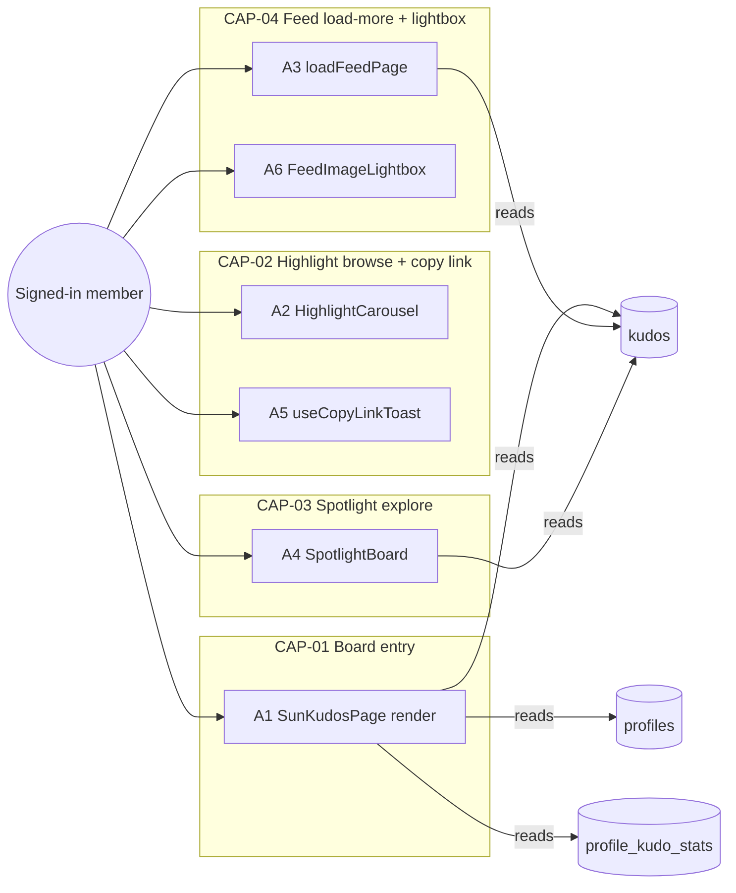
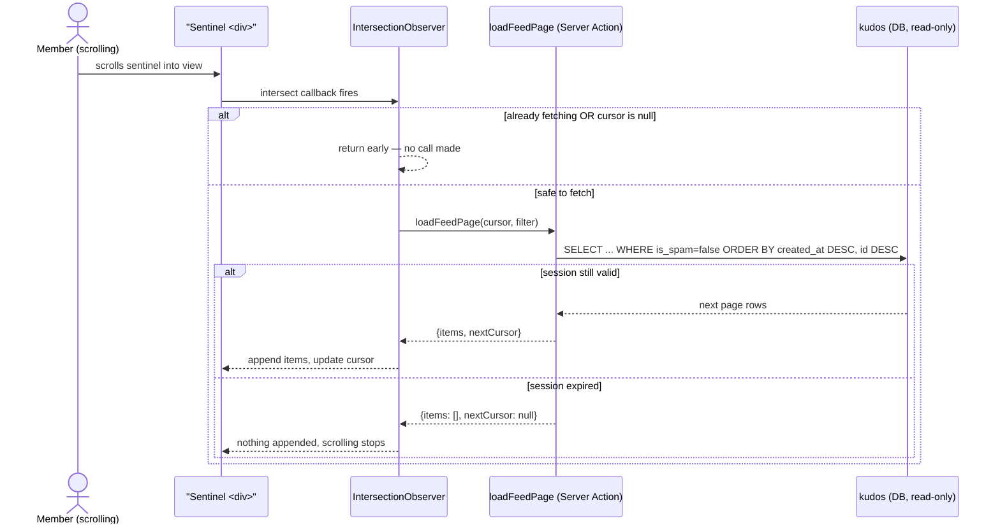
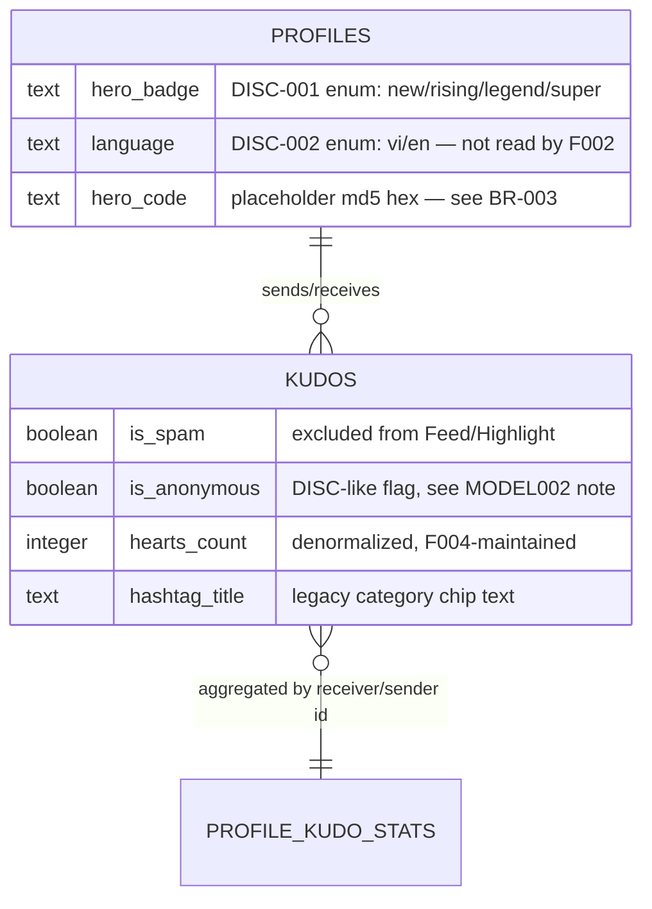

<!-- layout-exempt: rebuild-spec owns all docs/system|features|generated|flows paths -->
<!-- Contract: references/feature-spec-researcher-contract.md -->

# F002_KudosBoardData — Technical Spec

**Priority**: P0
**Type**: ui
**Generated**: 2026-09-07

**See also:** [`functional-spec.md`](./functional-spec.md) — plain-language overview, open
decisions, requirements/business rules stated in one-liners, screens, user stories, scenarios,
edge cases, and configuration for a BA/QA audience.

**How to read this file:** § 2 is the index — pick the action you care about and read its block
in § 3 straight through; each block is one complete thread, top to bottom. § 4 is the shared
appendix — jump in only when a § 3 block points you there.

## 1. Technical Overview

`/sun-kudos` is a single Next.js Server Component (`app/sun-kudos/page.tsx`) that fires 5
independent Supabase reads in parallel — hashtags, the first feed page, the top-5 Highlight
kudos, the Spotlight recipient set + total count, and the viewer's own sidebar stats — behind a
double auth gate. F002 owns that page shell plus the client-interactive pieces layered on top:
Highlight carousel stepping + a decorative department narrow, the All-Kudos feed's keyset
infinite-scroll (via the `loadFeedPage` Server Action), the Spotlight name-cloud's search/zoom/pan,
the "Copy link" toast shared by Highlight and Feed cards, and the feed's image lightbox. It does
**not** own the shared hashtag `?tag=` filter mechanism (F005), the heart button (F004), or the
secret-box mutation surface in the sidebar (F006) — it renders their UI but the behavior lives in
those features' own specs.



## 2. Action Index

| #      | Action (handler)                                                     | Method · Path                                             | Codes                                                                                                                    | Writes          | Detail              |
| ------ | -------------------------------------------------------------------- | --------------------------------------------------------- | ------------------------------------------------------------------------------------------------------------------------ | --------------- | ------------------- |
| **A0** | _cross-cutting — belongs to no single action_                        | —                                                         | {FR-601, FR-602}                                                                                                         | —               | § 4.4               |
| **A1** | `SunKudosPage`                                                       | `GET` `/sun-kudos`                                        | {FR-001, FR-101, FR-201, FR-202, FR-204, FR-205, FR-206, BR-001, BR-002, BR-004, BR-005, BR-006, BR-010, ALG-001, US007} | — _(read-only)_ | § 3.1               |
| **A2** | `HighlightCarousel`/`HighlightSection` _(client, no HTTP surface)_   | —                                                         | {FR-203, BR-001, BR-003, BR-004, DEC-001, ALG-001, US014, US015}                                                         | — _(read-only)_ | § 3.2               |
| **A3** | `loadFeedPage`                                                       | `Server Action` `loadFeedPage(cursor, filter)` (ROUTE007) | {FR-201, BR-001, BR-008, BR-009, ALG-001, US024}                                                                         | — _(read-only)_ | § 3.4 ▸ **diagram** |
| **A4** | `SpotlightBoard`/`useSpotlightPanZoom` _(client, no HTTP surface)_   | —                                                         | {FR-204, BR-005, DEC-002, ALG-002, US018, US019, US020}                                                                  | — _(read-only)_ | § 3.3               |
| **A5** | `useCopyLinkToast` _(client hook, shared by Highlight + Feed cards)_ | —                                                         | {FR-401, BR-007, US016}                                                                                                  | — _(read-only)_ | § 3.2               |
| **A6** | `FeedImageLightbox` _(client, no HTTP surface)_                      | —                                                         | {FR-402, US023}                                                                                                          | — _(read-only)_ | § 3.4               |

**Column rules:** as `feature-spec-researcher-contract.md` § "New Technical Sections" defines. No
action in this feature writes to any table — F002 is a pure read-model + client-display feature;
all mutation (hearting, kudo authoring, secret-box draw) belongs to F003/F004/F006.

**Rung set** — **Who** → **FE** → **Request** → **BE** → **Rule** → **Result** → **State** → **Source**.
No action in this feature carries a **State** rung — F002 has no entity or UI state machine at or
above the SM threshold (see § 4.3).

**Diagram threshold met by:** A3 only (a genuinely async, multi-hop thread: client
`IntersectionObserver` → Server Action → DB read → client append, with a same-page-twice guard
worth showing as branching). A1/A2/A4/A5/A6 are single-hop, read-only, or purely client-local —
each states briefly in § 3 why no diagram was added.

## 3. Actions

### 3.1 CAP-01 — Enter & view the Sun\* Kudos board

#### A1 · Render the Sun\* Kudos board shell

`GET` `/sun-kudos` → `` `SunKudosPage` ``
`FR-001` `FR-101` `FR-201` `FR-202` `FR-204` `FR-205` `FR-206` `US007` · `SCR006_SunKudosBoard`

**Who** · any authenticated Sun\* member _(gate A0 — § 4.4)_
**FE** · `app/sun-kudos/page.tsx:64-93` — server component; parses the `?tag=` search param into a
hashtag id (`parseHashtagParam`, `page.tsx:43-48`) before firing any read, so an invalid/absent
value degrades to "no filter" rather than throwing.
**Request** · `searchParams.tag` _(optional string, validated as an integer at the boundary)_
**BE** · `` `Promise.all` `` over 5 independent reads (`page.tsx:73-79`): `getHashtags()`
(`lib/kudos/hashtags.ts:15-28`), `getKudoFeedPage()` (`lib/kudos/board-queries.ts:33-74`, `FR-201`),
`getHighlightKudos()` (`board-queries.ts:79-101`, `FR-202`), `getSpotlightBoard()`
(`lib/kudos/board-aggregates.ts:42-62`, `FR-204`), `getSidebarOverview()` (`board-aggregates.ts:67-106`,
`FR-205`/`FR-206`).
**Rule** · **BR-002 — the Highlight fetch always returns exactly 5 kudos, ranked by
`hearts_count DESC, created_at DESC, id ASC`, event-wide, honoring the active hashtag filter.**
The tie-break order is a plan-level decision (source comment, `board-queries.ts:76-78`) so the
top-5 is deterministic across renders. _(Bin 1 — used only here; full statement stays inline, not
duplicated in § 4.4.)_
**BR-005 — the Spotlight recipient set and its total-kudos count are a single unfiltered
`COUNT(*)`/distinct-recipient query — they never honor the active hashtag filter, unlike
Highlight/Feed.** This is an intentional invariant (`getSpotlightBoard`, `board-aggregates.ts:38-40`
comment cites "BR-005"), not a bug. _(§ 4.4)_
**BR-006 — both sidebar leaderboard boxes always render their empty state this batch** — no
backing query/table exists yet; `SidebarPanel` passes `entries={[]}` unconditionally
(`sidebar-panel.tsx:25-34`). _(Bin 1 — used only here.)_
**BR-010 — the sidebar's "x2" hearts-received badge reflects whether `event_settings`'s
special-day window is active right now** (`getSidebarOverview`, `board-aggregates.ts:88-96`) —
read-only display here; the actual heart-value grant is F004's `resolve_heart_value()` trigger
(BL004), not written by this feature. _(Bin 1 — used only here.)_
**Result** · read-only — **no DB write**. Renders `HighlightSection`, `SpotlightSection`, and
`AllKudosSection` (which itself renders `FeedList` + `SidebarPanel`) with the 5 fetched results as
props; `AllKudosSection` is keyed on the active filter (`page.tsx:89`) so a filter change fully
remounts the feed with a fresh `initialPage` (`BR-004`, gloss: this is what makes the "reset to
page 1 on filter change" rule true for the feed half — the Highlight half achieves the same via its
own `key` in § 3.2).
**Source:** `app/sun-kudos/page.tsx:64-93` → `lib/kudos/hashtags.ts:15-28` →
`lib/kudos/board-queries.ts:33-101` → `lib/kudos/board-aggregates.ts:42-106`

<!-- No diagram: single synchronous server render, 5 parallel read-only queries, no branching a
     reader needs sequenced — the Promise.all in the Rule/BE rungs above already says "all 5 run
     together", and there is nothing conditional about which of the 5 runs. -->

---

### 3.2 CAP-02 — Browse the Highlight carousel & copy a kudo's share link

#### A2 · Step through Highlight slides + apply the department narrow

_(client-only — no HTTP surface)_ → `` `HighlightCarousel` `` / `` `HighlightSection` ``
`FR-203` `DEC-001` `US014` `US015` · `SCR006_SunKudosBoard/REG001`

**Who** · any authenticated Sun\* member _(gate A0)_
**FE** · Prev/Next arrows (`NavArrowButton`, `highlight-nav-arrow.tsx:30-44`) advance/retreat a
local `index` `useState` (`highlight-carousel.tsx:32,63-69,109-115,122-140`); arrows disable at
`atFirst`/`atLast`. The "Phòng ban" (department) dropdown (`HighlightFilterDropdown`,
`components/kudos-board/highlight-section.tsx:75-80`) sets a local `department` `useState` (`components/kudos-board/highlight-section.tsx:34`).
**Request** · _no HTTP request_ — both controls mutate client-only state.
**BE** · _none_ — `filtered = kudos.filter(...)` (`components/kudos-board/highlight-section.tsx:38-42`) runs entirely
client-side over the top-5 rows `A1` already fetched.
**Rule** · **BR-003 — the department narrow filters only the already-fetched 5 Highlight rows; it
never re-queries the server.** It matches a kudo's sender/receiver `hero_code` against a
hardcoded department label (`DEPARTMENTS`/`departmentLabel`, `constants/index.ts:6-15`) —
`hero_code` is a placeholder value auto-generated as `upper(left(md5(id),6))` on signup
(`entities.md` MODEL001), an uppercase hex string, never one of `"CEVC1"`–`"CEVC4"`. This match can
never succeed against real data today — see § 3 Open Decisions D001 in the twin
`functional-spec.md`. _(Bin 1 — used only here.)_
**BR-004 — the carousel remounts (and resets `index` to 0) whenever either the shared hashtag
filter or this department filter changes**, via a composite `key` prop
(`components/kudos-board/highlight-section.tsx:90`, ``key={`${activeHashtagId ?? "all"}-${department ?? "all"}`}``).
_(§ 4.4)_

| DEC         | subtype | Condition                                               | What the user sees                                     | Source                                                   |
| ----------- | ------- | ------------------------------------------------------- | ------------------------------------------------------ | -------------------------------------------------------- |
| **DEC-001** | render  | `!interactive` (a non-center slide) `OR kudo.isOwnKudo` | the card's Heart button is disabled (greyed, no click) | `components/kudos-board/highlight-kudo-card.tsx:144-148` |

**Result** · read-only — **no DB write**. `interactive={false}` on the side slides also drops them
to 40% opacity and disables their hashtag-chip/copy-link clicks (`highlight-kudo-card.tsx:46-48,
95,118-125`) — same single-field `interactive` gate, not a second DEC (see anti-pattern list:
single-field presence guard).
**Source:** `components/kudos-board/highlight-carousel.tsx:30-146` →
`components/kudos-board/highlight-section.tsx:30-100` → `components/kudos-board/highlight-kudo-card.tsx:30-153`

<!-- No diagram: no server round-trip at all — a table (the DEC row above) already shows the one
     real branch; a sequenceDiagram would force a client-only state update into a false
     request/response shape. -->

---

#### A5 · Copy link + confirmation toast _(shared with the Feed, see § 3.4's card)_

_(client-only — no HTTP surface, shared hook)_ → `` `useCopyLinkToast` ``
`FR-401` `BR-007` `US016` · `SCR006_SunKudosBoard/REG001` · `SCR006_SunKudosBoard/REG003`

**Who** · any authenticated Sun\* member _(gate A0)_
**FE** · "Copy link" button on a Highlight card (`components/kudos-board/highlight-kudo-card.tsx:116-130`) or a Feed card
(`components/kudos-board/feed-kudo-post-card.tsx:34-38,144-151`) both call the same `copyLink(url)` from
`useCopyLinkToast()` (`use-copy-link-toast.tsx:12-38`), rendered once per owning section
(`components/kudos-board/highlight-section.tsx:32,97`; `all-kudos-section.tsx:24,39`).
**Request** · _no HTTP request_ — `navigator.clipboard.writeText(url)`, `url` built client-side as
`` `${window.location.origin}/sun-kudos#${kudo.id}` `` (`components/kudos-board/highlight-kudo-card.tsx:121-123`,
`components/kudos-board/feed-kudo-post-card.tsx:35-37`).
**BE** · _none_.
**Rule** · **BR-007 — the "Link copied — ready to share!" toast always shows for 2.5s, even when
the clipboard write silently fails** (`.catch(() => {})`, `use-copy-link-toast.tsx:21-27`) — e.g. an
insecure context or missing permission never surfaces as an error to the user. _(Bin 1 — used
only here.)_
**Result** · read-only — **no DB write**. `setVisible(true)` mounts the toast; a `setTimeout`
clears it after 2500ms (`use-copy-link-toast.tsx:15-19`).
**Source:** `components/kudos-board/use-copy-link-toast.tsx:1-39`

<!-- No diagram: single client-side function call, one linear happy path, no server hop, no
     branching worth sequencing. Bucketed under CAP-02 (its primary Highlight-card trigger point)
     even though the same hook is also called from a Feed card in § 3.4 — FR-401/BR-007/US016 are
     claimed exactly once here, not re-claimed by CAP-04, per the Functional Capabilities
     exhaustiveness rule (functional-spec.md § 2). -->

---

### 3.3 CAP-03 — Explore the Spotlight board

#### A4 · Search, zoom and pan the Spotlight name cloud

_(client-only — no HTTP surface)_ → `` `SpotlightBoard` `` / `` `useSpotlightPanZoom` ``
`FR-204` `DEC-002` `US018` `US019` `US020` · `SCR006_SunKudosBoard/REG002`

**Who** · any authenticated Sun\* member _(gate A0)_
**FE** · a text input filters the client-held node list case-insensitively
(`spotlight-board.tsx:46-50,67-75`); a zoom-toggle button + popover (`SpotlightZoomControls`,
`spotlight-zoom-controls.tsx:22-74`) drives `zoom`/`pan` via `useSpotlightPanZoom`
(`use-spotlight-pan-zoom.ts:19-57`); pointer drag on the board pans while `zoom > 1`
(`spotlight-board.tsx:87-94`, `use-spotlight-pan-zoom.ts:33-37`).
**Request** · _no HTTP request_ — all three interactions are client-only transform/array-filter state.
**BE** · _none_ — `nodes`/`totalCount` were already fetched by A1; this action only reads them.
**Rule** · **BR-005 — the Spotlight board renders exactly what A1 fetched: every distinct
recipient plus the single unfiltered total count** — gloss repeated here per the self-sufficiency
rule (full statement lives in § 4.4, cited from A1). _(§ 4.4)_

| DEC         | subtype     | Condition                                                                  | What the user sees                                       | Source                                                                |
| ----------- | ----------- | -------------------------------------------------------------------------- | -------------------------------------------------------- | --------------------------------------------------------------------- |
| **DEC-002** | interaction | click on the pan/zoom toggle flips `zoomControlsOpen` (`useState` boolean) | the zoom-in/zoom-out/reset popover appears or disappears | `spotlight-zoom-controls.tsx:22-34`, `spotlight-board.tsx:38,122-129` |

**Result** · read-only — **no DB write**. Zoom is clamped to `[0.5, 2]` in `0.25` steps and any
existing pan offset is re-clamped to `±((zoom-1)/2) × boardDimension` on every zoom change
(`use-spotlight-pan-zoom.ts:5-7,24-31,50-54`) so content can never be dragged/zoomed off-screen. A
pointer-down at `zoom <= 1` is a no-op (`use-spotlight-pan-zoom.ts:34`) — panning is inert until
zoomed in, per US020.
**Source:** `components/kudos-board/spotlight-board.tsx:34-132` →
`components/kudos-board/use-spotlight-pan-zoom.ts:1-57` →
`components/kudos-board/spotlight-zoom-controls.tsx:1-75` →
`components/kudos-board/spotlight-name-node.tsx:1-92`

<!-- No diagram: no server round-trip and no ≥2-table write; the DEC table above already shows the
     one meaningful branch (the popover reveal). -->

---

### 3.4 CAP-04 — Browse the All-Kudos feed & view an attached image

#### A3 · Fetch the next keyset feed page on scroll _(async-step: client sentinel → Server Action)_

`Server Action` `loadFeedPage(cursor, filter)` → `` `loadFeedPage` `` (ROUTE007)
`FR-201` `BR-008` `BR-009` `US024` · `SCR006_SunKudosBoard/REG003`

**Who** · any authenticated Sun\* member whose session is still valid _(gate A0)_
**FE** · an `IntersectionObserver` on a sentinel `<div>` (`components/kudos-board/feed-list.tsx:67-96`, `rootMargin: "200px"`),
created once per mount (never re-created on `cursor` change — recreating it on a still-intersecting
sentinel was found to double-fire the callback, see the source comment at `components/kudos-board/feed-list.tsx:60-66`).
**Request** · `cursor` _(`{createdAt, id} | null`)_, `filter` _(`{hashtagId, department: null}`)_ —
both read from refs (`cursorRef`, `activeHashtagIdRef`) inside the observer callback, not from
`useEffect` dependencies, for the same double-fire reason.
**BE** · `` `loadFeedPage(cursor, filter)` `` (`app/sun-kudos/actions/load-feed-page.ts:30-43`) —
re-validates both arguments at the boundary (`isValidCursor`/`isValidFilter`, `load-feed-page.ts:6-19`)
since a Server Action is a public HTTP endpoint regardless of caller; falls back to "no cursor"/"no
filter" on a malformed payload instead of throwing. Delegates to `getKudoFeedPage()`
(`lib/kudos/board-queries.ts:33-74`), same query shape A1 uses for the first page.
**Rule** · **BR-008 — the feed excludes any `is_spam` kudo, orders strictly
`created_at DESC, id DESC` (keyset, not `.range()`, `board-queries.ts:48-49,56-58`), and guards
against a duplicate/overlapping fetch** via `isFetchingRef` and a `cursorRef === null` check
(`components/kudos-board/feed-list.tsx:73`). _(§ 4.4)_
**BR-009 — a rejected `loadFeedPage` promise stops appending silently; the sentinel stays mounted**
so the next scroll intersection retries (`components/kudos-board/feed-list.tsx:82-89`), rather than surfacing an error to
the user. _(Bin 1 — used only here.)_
**Result** · read-only — **no DB write**. On success: `setItems` appends `page.items`,
`setCursor(page.nextCursor)` (`components/kudos-board/feed-list.tsx:78-81`); `hasMore` (`cursor !== null`) controls whether
the sentinel `<div>` still renders (`components/kudos-board/feed-list.tsx:128`). An expired session mid-scroll makes
`getViewerId()` return `null` inside `loadFeedPage`, which returns `{items: [], nextCursor: null}`
(`load-feed-page.ts:31-37`) rather than throwing — the scroll silently stops, same as BR-009's
network-failure path.
**Source:** `components/kudos-board/feed-list.tsx:36-131` →
`app/sun-kudos/actions/load-feed-page.ts:1-43` → `lib/kudos/board-queries.ts:33-74`



---

#### A6 · Open/close the full-size image lightbox

_(client-only — no HTTP surface)_ → `` `FeedImageLightbox` ``
`FR-402` `US023` · `SCR006_SunKudosBoard/REG003`

**Who** · any authenticated Sun\* member _(gate A0)_
**FE** · clicking an attachment thumbnail sets `lightboxSrc` (`components/kudos-board/feed-kudo-post-card.tsx:32,90-93,154-160`);
the lightbox listens for `Escape` (`feed-image-lightbox.tsx:22-28`) and closes on backdrop click
(the outer `onClick={onClose}`, `feed-image-lightbox.tsx:35`) or its own close button
(`feed-image-lightbox.tsx:43-50`); clicking the image itself stops propagation so it does not close
(`feed-image-lightbox.tsx:39`).
**Request** · _no HTTP request_ — the image URL is already in `kudo.imageUrls`, loaded with the
feed page.
**BE** · _none_.
**Rule** · _no BR/DEC beyond the presence-check "is an image attached" guard_ — the pattern is a
standard show/hide, excluded per the DEC anti-pattern list (single-field presence check).
**Result** · read-only — **no DB write**. Purely a client-state full-size viewer; no analytics/API
call on open or close.
**Source:** `components/kudos-board/feed-kudo-post-card.tsx:30-163` →
`components/kudos-board/feed-image-lightbox.tsx:1-54`

<!-- No diagram: single client-state toggle, 3 equivalent close triggers, no server hop. -->

---

### 3.5 Edge cases

| Action  | Scenario                                                                                  | Behavior                                                                                                                                                                 |
| ------- | ----------------------------------------------------------------------------------------- | ------------------------------------------------------------------------------------------------------------------------------------------------------------------------ |
| A1      | Hashtag filter active, zero matching kudos                                                | `getKudoFeedPage`/`getHighlightKudos` both short-circuit to `{items: []}` before the main query (`resolveHashtagKudoIds` returns `[]`, `board-queries.ts:39-42,82`)      |
| A1      | Viewer session expired between `proxy.ts`'s check and this render                         | `getViewerId()` returns `null`, page calls `redirect("/login")` (`page.tsx:68-71`) before any of the 5 reads run                                                         |
| A2      | Department selected that matches zero of the current top-5 (the common case — see BR-003) | Carousel's `filtered` array is empty; `HighlightCarousel` renders its own empty-state paragraph (`highlight-carousel.tsx:41-49`) rather than nothing                     |
| A2 · A4 | Both the hashtag dropdown and a card's own hashtag chip target the same shared filter     | Either click path calls the same `setHashtag`, so state never diverges between the two entry points (`components/kudos-board/highlight-section.tsx:72,93`)               |
| A3      | Concurrent scroll events while a fetch is already in flight                               | `isFetchingRef.current` guards a second call from firing until `.finally()` resets it (`components/kudos-board/feed-list.tsx:73-74,87-89`) — never double-appends a page |
| A3      | `loadFeedPage` network rejection                                                          | Caught, nothing appended, sentinel stays mounted for a retry on the next intersection (`components/kudos-board/feed-list.tsx:82-89`)                                     |
| A5      | Clipboard API unavailable (insecure context / permission denied)                          | `navigator.clipboard?.writeText(...).catch(() => {})` — write failure is swallowed, toast still shows (`use-copy-link-toast.tsx:21-27`)                                  |
| A6      | User clicks the lightbox image itself                                                     | `event.stopPropagation()` on the inner wrapper (`feed-image-lightbox.tsx:39`) — only the backdrop, Esc, or close button actually close it                                |
| A1-A6   | Unauthenticated request to `/sun-kudos` or to the `loadFeedPage` Server Action            | Both fall under A0's cross-cutting gate — page redirects to `/login`; the Server Action returns an empty page instead of throwing                                        |

## 4. Shared Foundation

### 4.1 Components

| Component                                                                                            | Responsibility                                                           | Used in | File                                                                                                              |
| ---------------------------------------------------------------------------------------------------- | ------------------------------------------------------------------------ | ------- | ----------------------------------------------------------------------------------------------------------------- |
| `SunKudosPage`                                                                                       | server entry point; fires the 5 parallel reads, viewer gate              | A1      | `app/sun-kudos/page.tsx`                                                                                          |
| `HighlightSection` / `HighlightCarousel`                                                             | Highlight header, filters, slide stepping                                | A2      | `components/kudos-board/highlight-section.tsx`, `highlight-carousel.tsx`                                          |
| `HighlightKudoCard` / `HighlightPersonInfo`                                                          | one Highlight slide's content                                            | A2      | `components/kudos-board/highlight-kudo-card.tsx`, `highlight-person-info.tsx`                                     |
| `AllKudosSection` / `FeedList`                                                                       | feed header + infinite-scroll list                                       | A1, A3  | `components/kudos-board/all-kudos-section.tsx`, `components/kudos-board/feed-list.tsx`                            |
| `KudoPostCard` / `FeedPostPersonBlock`                                                               | one feed card's content                                                  | A1, A3  | `components/kudos-board/feed-kudo-post-card.tsx`, `feed-post-person-block.tsx`                                    |
| `SpotlightSection` / `SpotlightBoard`                                                                | Spotlight header + name cloud                                            | A1, A4  | `components/kudos-board/spotlight-section.tsx`, `spotlight-board.tsx`                                             |
| `SpotlightNameNode` / `SpotlightZoomControls`                                                        | one node; zoom popover                                                   | A4      | `components/kudos-board/spotlight-name-node.tsx`, `spotlight-zoom-controls.tsx`                                   |
| `SidebarPanel` / `SidebarStats` / `SidebarLeaderboard`                                               | sidebar stats box + 2 empty leaderboards                                 | A1      | `components/kudos-board/sidebar-panel.tsx`, `components/kudos-board/sidebar-stats.tsx`, `sidebar-leaderboard.tsx` |
| `useCopyLinkToast`                                                                                   | shared copy-link + toast state                                           | A5      | `components/kudos-board/use-copy-link-toast.tsx`                                                                  |
| `useHashtagFilter`                                                                                   | reads/writes the shared `?tag=` URL param (owned by F005; consumed here) | A2, A3  | `components/kudos-board/use-hashtag-filter.ts`                                                                    |
| `getKudoFeedPage` / `getHighlightKudos` / `getSpotlightBoard` / `getSidebarOverview` / `getHashtags` | the 5 server reads                                                       | A1, A3  | `lib/kudos/board-queries.ts`, `board-aggregates.ts`, `hashtags.ts`                                                |
| `mapRowsToCards` / `fetchStarTiers`                                                                  | maps raw DB rows into `KudoCardData`, batches star-tier lookup           | A1, A3  | `lib/kudos/board-query-helpers.ts`                                                                                |
| `loadFeedPage`                                                                                       | Server Action, next feed page                                            | A3      | `app/sun-kudos/actions/load-feed-page.ts`                                                                         |
| `renderKudoMessage`                                                                                  | safe React-element message renderer (no `dangerouslySetInnerHTML`)       | A1, A3  | `lib/kudos/render-kudo-message.tsx`                                                                               |

### 4.2 Data Model



| Entity                                         | Table                        | Used for                                                                                                           | Action         |
| ---------------------------------------------- | ---------------------------- | ------------------------------------------------------------------------------------------------------------------ | -------------- |
| `MODEL001_PROFILES`                            | `profiles`                   | sender/receiver display blocks, sidebar `boxes_opened`/`boxes_unopened`                                            | A1, A2, A3, A4 |
| `MODEL002_KUDOS`                               | `kudos`                      | feed rows, Highlight rows, Spotlight recipient set/count                                                           | A1, A3, A4     |
| `PROFILE_KUDO_STATS` (view)                    | `profile_kudo_stats`         | star-tier lookup (ALG-001), sidebar `kudosReceived`/`kudosSent`/`heartsReceived`                                   | A1             |
| `MODEL009_EVENT_SETTINGS`                      | `event_settings`             | sidebar "x2" badge read (`heartsMultiplierActive`) — read-only here, F004 owns the write-side trigger              | A1             |
| `MODEL004_HASHTAGS` / `MODEL005_KUDO_HASHTAGS` | `hashtags` / `kudo_hashtags` | resolving the active hashtag filter to matching kudo ids (`resolveHashtagKudoIds`) — owned by F005, read-only here | A1, A3         |

#### Polymorphic Behavior

##### DISC-001 — PROFILES.hero_badge

| Value    | Render                                                                               | Validation                                                                                       | Persistence                                |
| -------- | ------------------------------------------------------------------------------------ | ------------------------------------------------------------------------------------------------ | ------------------------------------------ |
| `new`    | `HeroBadge` renders "New Hero" label/icon (`hero-badge-type.ts:16-27`, default case) | `asHeroBadgeType` falls back to `new` for any unrecognized DB value (`hero-badge-type.ts:11-13`) | not written by this feature — display-only |
| `rising` | "Rising Hero" badge                                                                  | same fallback guard                                                                              | not written by this feature                |
| `legend` | "Legend Hero" badge                                                                  | same fallback guard                                                                              | not written by this feature                |
| `super`  | "Super Hero" badge                                                                   | same fallback guard                                                                              | not written by this feature                |

**Source:** docs/generated/entities.md § MODEL001_PROFILES > Discriminator Fields;
`components/kudos-board/hero-badge-type.ts:11-27`

##### DISC-002 — PROFILES.language

N/A for this feature — `MODEL001_PROFILES` appears in the Data Model table above only for its
`display_name`/`hero_code`/`hero_badge`/`avatar_url`/`boxes_*` columns; F002 never reads or
branches on `profiles.language` (interface locale is F009's concern). Listed here only to satisfy
the "cover all DISC-### of an entity in this table" completeness rule — `vi`/`en` values, per
`entities.md`, are not read or rendered by this feature.

### 4.3 State Management

None.

<!-- Every candidate UI toggle in this feature (carousel `index`, zoom-controls popover `open`,
     Highlight/Feed keyed remount) is a plain boolean/counter below the SM threshold (≥3 states OR
     ≥2 transitions with named meaning) — modeling any of them as a state machine would be
     over-engineering a simple toggle. The zoom-controls popover's open/closed toggle is captured
     as DEC-002 (§ 3.3) instead. -->

### 4.4 Shared Rules

#### Bin 3 — cross-cutting, belongs to no single action

**A0 · {FR-601} — every action in this feature requires an authenticated session, checked twice.**
`lib/supabase/proxy.ts` (`isPublicPath`/`redirect`, `proxy.ts:12,79-80`) is the blanket guard on
every non-public path — applies to `/sun-kudos` the same as every other protected route, not a
rule of this feature. `app/sun-kudos/page.tsx:68-71`'s own `getViewerId()` + `redirect("/login")`
is a second, page-level check, explicitly commented "defense in depth, not the primary gate" — this
resolves the earlier feature-spec discrepancy noted in `route-list.md` ("no login required" vs.
guarded): the shipped behavior is guarded, deliberately, on both layers. On gate failure: redirect
to `/login` before any of the 5 reads run (A1) or, for `A3`'s Server Action, an empty page returned
instead of an error (BR-009's same-shaped fallback).
**Source:** `lib/supabase/proxy.ts:12,79-80` · `app/sun-kudos/page.tsx:68-71` ·
`app/sun-kudos/actions/load-feed-page.ts:31-37`

**A0 · {FR-602} — `profiles`, `kudos`, and `profile_kudo_stats` are readable by both `anon` and
`authenticated` at the data layer.** `profiles`: RLS `SELECT USING (true)` (PERM003).
`kudos`: RLS `SELECT USING (true)`. `profile_kudo_stats`: an explicit `REVOKE ALL` then
`GRANT SELECT` to `anon, authenticated`, plus `security_invoker=on` so the view runs with the
CALLER's own privileges rather than its owner's (PERM013) — load-bearing, or the view would
silently bypass the underlying tables' RLS. This is a data-layer permission, not this feature's
entry gate — FR-601/A0 above is what actually keeps `/sun-kudos` itself behind a session.
**Source:** `supabase/migrations/20260906191500_profile_stats_view.sql:17-31` ·
`supabase/migrations/20260714070000_profile_schema.sql`

#### Bin 2 — used by ≥2 named actions

**BR-001 — a receiver's star-tier badge (1–3 ★) appears once their total kudos-received crosses
the 10/20/50 thresholds (`ALG-001`); nothing renders below the first threshold.**
Used in: **A1** · **A2** · **A3**. `StarTierBadge` (`star-tier-badge.tsx:18-32`) renders
`"★".repeat(tier)` where `tier` is `Exclude<StarTier, 0>` — a `0` result from `starTier()` renders
no badge element at all, by the `starTier ? <StarTierBadge/> : null` guard in both
`FeedPostPersonBlock` (`feed-post-person-block.tsx:36`) and `HighlightPersonInfo`
(`highlight-person-info.tsx:46`).
**Source:** `lib/kudos/hashtags.ts:36-40` · `components/kudos-board/star-tier-badge.tsx:18-32`

```text
function starTier(receivedCount):
  if receivedCount >= 50: return 3
  if receivedCount >= 20: return 2
  if receivedCount >= 10: return 1
  return 0
```

**BR-004 — the Highlight carousel and the All-Kudos feed both remount and reset to their first
slide/page whenever the shared hashtag filter changes; Highlight additionally resets on its own
department filter.** Used in: **A1** · **A2**. `page.tsx:89` keys `AllKudosSection` on
`filter.hashtagId`; `components/kudos-board/highlight-section.tsx:90` keys `HighlightCarousel` on the composite
`${activeHashtagId}-${department}` string — two different mechanisms achieving the same "reset on
filter change" outcome for the two regions.
**Source:** `app/sun-kudos/page.tsx:89` · `components/kudos-board/highlight-section.tsx:90`

**BR-005 — the Spotlight board's total-kudos count and recipient node set are a single unfiltered
`COUNT(*)`/distinct-recipient query — they never honor the hashtag filter that narrows
Highlight/Feed.** Used in: **A1** · **A4**. An intentional invariant per the source's own "BR-005"
comment (`board-aggregates.ts:38-40`), not an oversight — Spotlight always reflects the whole
event, Highlight/Feed reflect the current filter.
**Source:** `lib/kudos/board-aggregates.ts:42-62`

**BR-008 — the feed excludes `is_spam` kudos, orders strictly `created_at DESC, id DESC`
(keyset pagination, not `.range()`), and guards against a duplicate/overlapping fetch.**
Used in: **A1** · **A3**. `getKudoFeedPage` applies `.eq("is_spam", false)` before ordering
(`board-queries.ts:44-50`); `FeedList`'s `isFetchingRef`/`cursorRef` guard a second call from firing
while one is already in flight, or after `cursor` reaches `null` (`components/kudos-board/feed-list.tsx:73-74`).
**Source:** `lib/kudos/board-queries.ts:33-74` · `components/kudos-board/feed-list.tsx:67-96`

### 4.5 Algorithms & Integrations

None beyond the two ALG blocks below — no external API calls, webhooks, or queue jobs exist in
this feature (INT-### N/A).

### {Star-tier threshold classification} (ALG-001)

**Linked FR:** FR-001
**Used in:** A1, A2, A3
**Source:** `lib/kudos/hashtags.ts:36-40`
**Input:** a receiver's `profile_kudo_stats.kudos_received` count (bigint) · **Output:** a
`0 | 1 | 2 | 3` tier · **Complexity:** O(1)
**Description:** Classifies a receiver's total kudos-received count into a 0-3 star tier via 3
fixed thresholds (10/20/50). Batched once per page via `fetchStarTiers` (`board-query-helpers.ts:145-161`)
— one `profile_kudo_stats` query for every distinct receiver on the page, not a per-row join.

**Pseudocode:**

```text
function starTier(receivedCount):
  if receivedCount >= 50: return 3
  if receivedCount >= 20: return 2
  if receivedCount >= 10: return 1
  return 0
```

### {Spotlight node scatter position and size} (ALG-002)

**Linked FR:** FR-204
**Used in:** A4
**Source:** `components/kudos-board/spotlight-layout.ts:9-32`
**Input:** a `SpotlightNode.id` (uuid string) · **Output:** `{xPct, yPct, size}` · **Complexity:** O(n)
**Description:** Deterministic string hash (`hash = (hash*31 + charCode) % 1000000007`, keeping the
running value bounded so it never loses precision past `Number.MAX_SAFE_INTEGER`) turns each node's
id into 3 independent [0,1) values, seeded with distinct suffixes (`-x`, `-y`, `-size`) so the 3
outputs don't correlate. Purely decorative — no DB column backs the scatter position; stable across
renders (including server/client hydration) because it is a pure function of the id.

**Pseudocode:**

```text
function hashToUnit(input):
  hash = 0
  for ch in input: hash = (hash * 31 + charCode(ch)) % 1000000007
  return (hash % 10000) / 10000

xPct = 8 + hashToUnit(id + "-x") * 84
yPct = 8 + hashToUnit(id + "-y") * 84
size = hashToUnit(id + "-size") > 0.5 ? "md" : "sm"
```

### 4.6 Configuration

```text
FEED_PAGE_SIZE = 10          # rows per feed page, keyset-paginated (A1, A3)
HIGHLIGHT_SIZE = 5           # fixed Highlight carousel length, event-wide (A1)
COPY_TOAST_DURATION_MS = 2500 # confirmation toast auto-dismiss (A5)
ZOOM_MIN = 0.5               # Spotlight zoom lower clamp (A4)
ZOOM_MAX = 2                 # Spotlight zoom upper clamp (A4)
ZOOM_STEP = 0.25             # Spotlight zoom increment per click (A4)
```

`FEED_PAGE_SIZE`/`HIGHLIGHT_SIZE` per source comment are "never stated in any spec; a plan-level
decision" (`board-queries.ts:11-15`) — recorded here as the only source of truth for their values.

**Client behavior:** see
[`behavior-logic.md`](../../generated/behavior-logic.md) (client-side patterns — debounce, optimistic UI, polling, upload, realtime),
[`permissions.md`](../../system/permissions.md) (feature flags / experiments / env / locale gates),
[`screen-flow.md`](../../generated/screen-flow.md) (guards / deep-link state restoration / unsaved-changes protection).

## 5. Verification & Technical Notes

### 5.1 Technical Verification

- **SC-001** _(A3)_ Scrolling the sentinel into view while a fetch is already in flight never
  produces two calls to `loadFeedPage` for the same cursor (covers FR-201, BR-008).
- **SC-002** _(A2)_ Selecting a department that matches none of the current top-5 Highlight rows
  renders the carousel's empty state, not a broken/blank slide (covers FR-203, BR-003).
- **SC-003** _(A4)_ Zoom and pan never leave the name cloud fully off-screen at any zoom level in
  `[0.5, 2]` (covers FR-204).
- **SC-004** _(A1)_ An expired session at render time redirects to `/login` before any of the 5
  reads execute (covers FR-601).

#### US014_FilterHighlightKudosByDepartment · US015_BrowseHighlightCarousel _(A2)_

**Independent Test:** Select each of the 4 hardcoded departments in turn against a Highlight set
containing at least one kudo whose sender/receiver `hero_code` happens to collide with a department
label (a contrived fixture, since real `hero_code` values never match — see BR-003) and confirm the
carousel narrows correctly; separately, step through all 5 slides via both the large and small
arrow pairs and confirm the indicator and disabled states track `index`.

**Acceptance Scenarios:**

1. **Given** the Highlight carousel is showing all 5 top kudos, **When** the user selects a
   department, **Then** the carousel narrows to rows whose sender/receiver `hero_code` matches that
   department's label (in practice: usually zero, per BR-003).
2. **Given** the carousel is on slide 5 of 5, **When** the user views the next arrow, **Then** it
   renders `disabled`.

#### US024_LoadMoreKudosInFeed _(A3)_

**Independent Test:** Seed >10 non-spam kudos, load `/sun-kudos`, scroll to the sentinel, and
confirm exactly one more page of up to 10 items appends with no duplicate ids; then simulate a
`loadFeedPage` rejection and confirm the sentinel remains mounted with no items appended.

**Acceptance Scenarios:**

1. **Given** the feed has a `nextCursor`, **When** the sentinel intersects the viewport, **Then**
   the next 10-item page appends once, in `created_at DESC, id DESC` order.
2. **Given** `loadFeedPage` rejects (network failure), **When** the sentinel intersects, **Then** no
   items append and the sentinel stays mounted for a retry on the next intersection.

### 5.2 Assumptions

- _(A2)_ The department filter (BR-003) is assumed to be genuinely unable to match real data today
  (`hero_code` is a placeholder md5-derived hex string, never a `"CEVC1"`-style label) — this is
  read directly from both the filter's comparison code and the column's own generation logic, not
  merely inferred from naming.
- _(A4)_ The Spotlight recency ticker (`TICKER_MESSAGE`/`TICKER_OPACITIES`,
  `spotlight-board.tsx:18-19`) is assumed to be permanently decorative/hardcoded — no DB-backed
  "recent activity" feed exists in this codebase to source it from a real event.
- _(A1)_ This pass does not run the app end-to-end; the 5-read `Promise.all` behavior and the
  double auth gate are recorded as observed source, not confirmed live-request behavior.

### 5.3 Unresolved Questions

1. **Department taxonomy source** _(A2)_: is `DEPARTMENTS`/`hero_code`-matching intended to be
   replaced by a real department column on `profiles`, or is the department filter itself
   slated for removal? Not confirmable from source alone — flagged as a business decision instead
   (see `functional-spec.md` § 3 Open Decisions D001).
2. **Spotlight "recent activity" ticker data source** _(A4)_: no code path suggests a real feed was
   ever planned to back `TICKER_MESSAGE` — unconfirmed whether this is intentionally permanent
   decoration or a stubbed placeholder awaiting a later batch.

### 5.4 Source References

| Action | Order | Symbol                                                       | Path                                                                                                        | Purpose                                           |
| ------ | ----- | ------------------------------------------------------------ | ----------------------------------------------------------------------------------------------------------- | ------------------------------------------------- |
| —      | 1     | `MODEL001_PROFILES` / `MODEL002_KUDOS`                       | `supabase/migrations/20260714070000_profile_schema.sql:1-65`, `20260716100000_write_kudos.sql:1-36`         | entities this feature revolves around             |
| A1     | 2     | `SunKudosPage`                                               | `app/sun-kudos/page.tsx:1-94`                                                                               | server entry point, 5 parallel reads, viewer gate |
| A1, A3 | 3     | `board-queries` / `board-aggregates` / `board-query-helpers` | `lib/kudos/board-queries.ts:1-101`, `board-aggregates.ts:1-106`, `board-query-helpers.ts:1-184`             | shared read-model query layer                     |
| A3     | 4     | `loadFeedPage`                                               | `app/sun-kudos/actions/load-feed-page.ts:1-43`                                                              | Server Action, next feed page                     |
| A2     | 5     | `HighlightCarousel`/`HighlightSection`                       | `components/kudos-board/highlight-carousel.tsx:1-146`, `components/kudos-board/highlight-section.tsx:1-100` | Highlight browse UI                               |
| A4     | 6     | `SpotlightBoard`/`useSpotlightPanZoom`                       | `components/kudos-board/spotlight-board.tsx:1-133`, `use-spotlight-pan-zoom.ts:1-57`                        | Spotlight explore UI                              |
| A5     | 7     | `useCopyLinkToast`                                           | `components/kudos-board/use-copy-link-toast.tsx:1-39`                                                       | shared copy-link + toast                          |
| A6     | 8     | `FeedImageLightbox`                                          | `components/kudos-board/feed-image-lightbox.tsx:1-54`                                                       | image lightbox                                    |

#### Data Flow

```text
{?tag= search param} -> parseHashtagParam -> BoardFilter{hashtagId, department:null}
  -> Promise.all(getHashtags, getKudoFeedPage, getHighlightKudos, getSpotlightBoard, getSidebarOverview)
  -> mapRowsToCards (batched star-tier lookup) -> KudoCardData[] props
  -> client components render; further pages via loadFeedPage(cursor, filter) same shape
```

### 5.5 Artifact References

| Artifact           | File                                                           | Codes Used                                                    | Reviewed |
| ------------------ | -------------------------------------------------------------- | ------------------------------------------------------------- | -------- |
| System Overview    | [overview.md](../../system/overview.md)                        | —                                                             | [x]      |
| Architecture       | [architecture.md](../../system/architecture.md)                | —                                                             | [x]      |
| Feature List       | [feature-list.md](../../generated/feature-list.md)             | F002                                                          | [x]      |
| API Map            | [api-map.md](../../generated/api-map.md)                       | ROUTE007                                                      | [x]      |
| Entities           | [entities.md](../../generated/entities.md)                     | MODEL001, MODEL002, MODEL004, MODEL005, MODEL009              | [x]      |
| Screens            | [functional-spec.md § 6](./functional-spec.md#6-screens)       | SCR006, SCR006/REG001, SCR006/REG002, SCR006/REG003           | [x]      |
| Behavior Logic     | [behavior-logic.md](../../generated/behavior-logic.md)         | —                                                             | [x]      |
| Permissions Matrix | [permissions-matrix.md](../../generated/permissions-matrix.md) | PERM002, PERM003, PERM013                                     | [x]      |
| User Stories       | [user-stories.md](../../generated/user-stories.md)             | US007, US014, US015, US016, US018, US019, US020, US023, US024 | [x]      |
