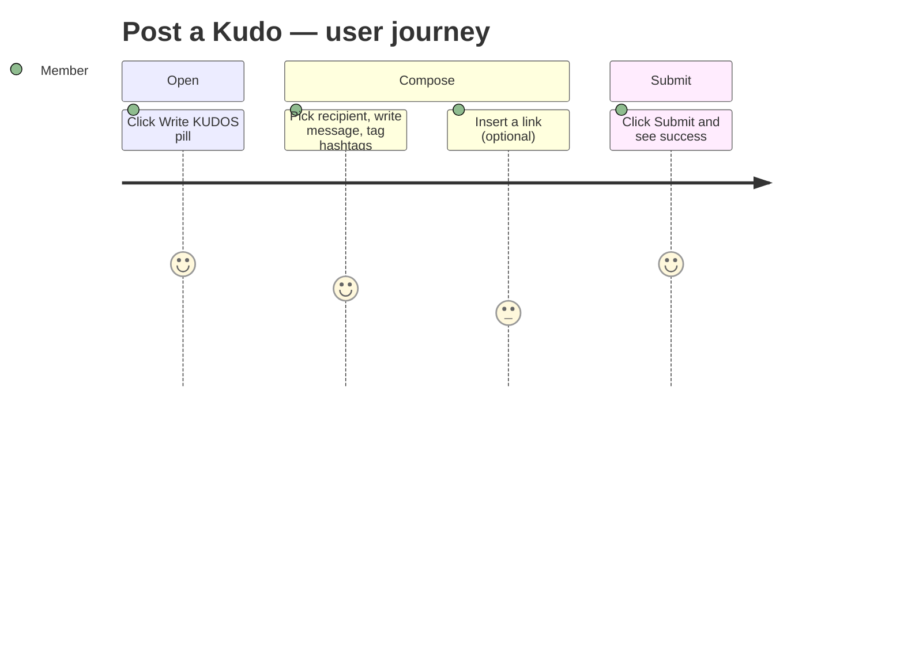

<!-- Contract: references/feature-spec-researcher-contract.md -->

# Functional Spec — F003_KudoAuthoring

**Priority**: P0
**Type**: ui
**Generated**: 2026-09-07

**See also:** [`technical-spec.md`](./technical-spec.md) — endpoints, Source citations,
pseudocode, key entities, and DB writes for a Dev/QA/SA audience.

**Traceability:** F003 → SCR004, SCR006 → US010, US011, US012 → — → ROUTE002 → —

## 1. Overview

**Problem:** A member who wants to publicly recognize a colleague has no way to compose and post
that recognition themselves.
**Solution:** A member opens a write-kudo composer from either the About page or the Sun* Kudos
Board, picks a recipient, writes a message, tags it with up to 5 hashtags, optionally attaches up
to 5 images or an inserted link, and posts it — the post is attributed to their own session and
appears on the shared kudos board.
**Scope:** Composing a new kudo (recipient, message, hashtags, images, an inserted link,
optional anonymity) and submitting it for everyone to see.
**Non-Scope:** Editing or deleting a kudo once posted (no such flow exists); reacting to a kudo
(hearting — see F004); browsing or filtering posted kudos (see F002/F005).

**Actors**

| Actor            | Description                                  | Primary goal                                                                      |
| ---------------- | -------------------------------------------- | --------------------------------------------------------------------------------- |
| Signed-in member | Any authenticated user of the Sun* Kudos app | Publicly recognize a colleague with a message, hashtags, and optional link/images |

## 2. Functional Capabilities

| ID     | Capability                     | What the user can do                                                            | User Stories | Requirements                                           | Business Rules                                                                            | Screens                                                             |
| ------ | ------------------------------ | ------------------------------------------------------------------------------- | ------------ | ------------------------------------------------------ | ----------------------------------------------------------------------------------------- | ------------------------------------------------------------------- |
| CAP-01 | Open Kudo Composer             | Open a blank write-kudo composer from either entry point                        | US010        | FR-101, FR-201                                         | BR-009                                                                                    | SCR004, SCR006                                                      |
| CAP-02 | Compose & Submit a Kudo        | Fill in recipient, message, hashtags, images, and anonymity, then post the kudo | US011        | FR-001, FR-202, FR-203, FR-401, FR-402, FR-601, FR-602 | BR-001, BR-002, BR-003, BR-004, BR-005, BR-006, BR-007, DEC-001, DEC-002, DEC-003, SM-001 | N/A — happens inside the same composer CAP-01 opens; see Note below |
| CAP-03 | Insert a Link into the Message | Add a labeled link into the message body while composing                        | US012        | FR-204                                                 | BR-008                                                                                    | N/A — happens inside the same composer CAP-01 opens; see Note below |

**Note:** `SCR004`/`SCR006` are claimed once here under CAP-01, the entry point whose behavior
actually differs per screen (the About widget opens the composer with zero hashtags preloaded;
the Sun* Kudos Board opens it with all 13). CAP-02's compose/submit flow and CAP-03's link
insertion both run inside that same `KudosFormModal` instance regardless of which screen opened
it, with no screen-specific behavior of their own — so neither owns a screen claim independently
of CAP-01's.

## 3. Open Decisions

None — no unresolved domain confirmations.

## 4. Requirements

### Foundation (0xx)

- **FR-001** The recipient chosen and every hashtag selected must already exist in the system —
  a kudo can never reference a made-up recipient or hashtag.

### Navigation (1xx)

- **FR-101** A member reaches the composer from the "Write KUDOS" pill on the About page (either
  directly, or via the open rules drawer's own footer button) or from the give-kudos bar on the
  Sun* Kudos Board.

### Kudo Composer (2xx)

- **FR-201** The composer always opens as a blank draft — there is no pre-filled "edit an
  existing kudo" flow.
- **FR-202** The composer requires a recipient, a non-empty message, and at least one hashtag
  before it can be submitted; choosing to post anonymously also requires an anonymous display
  name.
- **FR-203** A member can attach up to 5 images (JPG or PNG only) and select up to 5 hashtags.
- **FR-204** A member can insert a labeled link into the message via the Addlink Box, which
  places the link at the current cursor position.

### Interaction (4xx)

- **FR-401** Submitting shows a brief success confirmation, then closes the composer and
  refreshes the board so the new kudo appears.
- **FR-402** A field-level validation failure shows its own inline message; any other failure
  shows a generic error message instead.

### Security (6xx)

- **FR-601** Every posted kudo is always attributed to the signed-in member who posted it — the
  sender identity can never be supplied by the client.
- **FR-602** The message, recipient, and hashtags are all re-checked on the server before
  anything is saved, regardless of what the composer already checked.

## 5. Business Rules

- The 500-character message cap is enforced by the server, not just shown as a counter to the user (BR-001)
- The recipient and every selected hashtag are confirmed to still exist right before the post is saved (BR-002)
- Only JPG or PNG images are accepted, checked by both file type and extension (BR-003)
- A kudo may carry at most 5 hashtags and 5 images (BR-004)
- The sender of a kudo is always the signed-in member who posted it, never a value the composer itself sends (BR-005)
- If tagging a posted kudo with its hashtags fails, the kudo still stays posted, just untagged, with no error shown to the poster (BR-006)
- A posted message is always shown as safe plain text; only a link the user inserted with `http`/`https` becomes clickable (BR-007)
- An inserted link needs 1-100 characters of label text and a valid `http`/`https` web address (BR-008)
- The composer always resets to a blank draft every time it is opened — there is no "edit" flow (BR-009)
- The Submit button stays disabled until every required field is filled in (DEC-001)
- Checking "post anonymously" reveals the anonymous display-name field; unchecking it hides and clears that field (DEC-002)
- Once 5 hashtags are selected, the remaining rows in the hashtag dropdown become unpickable (DEC-003)
- The composer tracks whether a submit is idle, in progress, succeeded, or failed, so it can show the right state to the user (SM-001)

## 6. Screens

| Screen Name             | SCR###               | What User Sees                                                                    | What User Can Do                                           |
| ----------------------- | -------------------- | --------------------------------------------------------------------------------- | ---------------------------------------------------------- |
| About / Homepage        | SCR004_AboutHomepage | A floating widget button that expands into quick actions, including "Write KUDOS" | Open the composer with no hashtags preloaded               |
| Sun* Kudos — Live Board | SCR006_SunKudosBoard | A give-kudos bar at the top of the board                                          | Open the composer with the 13 canonical hashtags preloaded |

### User Journey

1. The user is on the About page or the Sun* Kudos Board and sees a "Write KUDOS" entry point.
2. The user clicks it — the write-kudo composer opens as a blank form.
3. The user picks a recipient, writes a message, optionally inserts a link, picks up to 5
   hashtags, optionally attaches images, and optionally chooses to post anonymously.
4. Once every required field is filled, the user clicks Submit — a brief success message shows,
   then the composer closes and the board refreshes to show the new kudo.



## 7. User Stories

### US010_OpenKudoComposer — Open Kudo Composer

**Actor:** Signed-in member
**Goal:** Open the write-a-kudo form so I can begin composing a kudo for a colleague.
**Business value:** Gives the member a clear, low-friction way to start recognizing a colleague
from wherever they already are on the site.

**Acceptance Criteria:**

- [ ] On the About page, clicking the widget's "Write KUDOS" pill opens the composer with no
      hashtags pre-loaded.
- [ ] On the About page, clicking "Write KUDOS" inside the open rules drawer closes the drawer
      and opens the same composer.
- [ ] On the Sun* Kudos Board, clicking the give-kudos pill opens the composer with the 13
      canonical hashtags loaded.
- [ ] The composer always resets to a blank draft on open — no pre-filled "edit" flow exists.

### US011_PostAKudo — Post a Kudo

**Actor:** Signed-in member
**Goal:** Submit a kudo message to a colleague so they are publicly recognized on the board.
**Business value:** Delivers the core value of the feature — public, attributable recognition
between colleagues.

**Acceptance Criteria:**

- [ ] The Submit button stays disabled until recipient, message, and at least one hashtag are
      set (and an anonymous display name, when posting anonymously).
- [ ] Submitting re-checks the recipient and hashtags on the server and uploads any attached
      images before saving the kudo.
- [ ] The sender is always resolved from the poster's own session — never something the
      composer itself sends.
- [ ] On success, a brief success message shows, then the composer closes and the board
      refreshes.
- [ ] A field-level error shows its own inline message; any other failure shows a generic error.

### US012_InsertLinkIntoKudoMessage — Insert a Link into a Kudo Message

**Actor:** Signed-in member
**Goal:** Insert a labeled link into my message so I can reference an external page.
**Business value:** Lets a member's recognition point to supporting context (an article, a
document, a project page) without leaving the composer.

**Acceptance Criteria:**

- [ ] Clicking the editor's link icon opens the Addlink Box.
- [ ] Saving with valid label text and a valid web address inserts the link into the message at
      the cursor and returns focus to the message field.
- [ ] Invalid label text or web address blocks the save and shows an inline error.
- [ ] Cancel, Escape, or clicking outside the box discards the draft link without touching the
      message.

## 8. Scenarios

### US010_OpenKudoComposer — Happy Path

**Given** the user is on the Sun* Kudos Board, **When** the user clicks the give-kudos pill,
**Then** the composer opens with the hashtag picker already populated.

### US010_OpenKudoComposer — Error: N/A

**Given** no async call happens on open, **When** the composer opens, **Then** there is no error
path to exercise for this story.

### US011_PostAKudo — Happy Path

**Given** the composer is open with recipient, message, and at least one hashtag filled in,
**When** the user clicks Submit, **Then** the kudo is saved, a success message shows, and the
composer auto-closes.

### US011_PostAKudo — Error: Message Too Long

**Given** the composer is open with a message over 500 characters, **When** the user clicks
Submit, **Then** the server rejects it and an inline "message too long" error shows.

### US012_InsertLinkIntoKudoMessage — Happy Path

**Given** the Addlink Box is open with valid label text and a valid web address, **When** the
user clicks save, **Then** the link is inserted into the message and the box closes.

### US012_InsertLinkIntoKudoMessage — Error: Invalid Web Address

**Given** the Addlink Box is open with an invalid web address, **When** the user clicks save,
**Then** the box stays open and shows an inline "invalid" error on the web-address field.

## 9. Edge Cases

| Scenario                                                                    | What Happens                                                                                       | User-Facing Message                                 |
| --------------------------------------------------------------------------- | -------------------------------------------------------------------------------------------------- | --------------------------------------------------- |
| A message longer than 500 characters is submitted                           | The server rejects the post; nothing is saved                                                      | "Your message is too long"                          |
| A chosen recipient or hashtag no longer exists by the time the user submits | The server rejects the specific field; nothing is saved                                            | "This recipient/hashtag could not be found"         |
| An image of an unsupported type (e.g. GIF or PDF) is picked                 | The file is rejected before it is added to the draft                                               | "This file type isn't supported"                    |
| One image in a batch fails to upload                                        | Any images already uploaded in that attempt are removed and the whole post fails; nothing is saved | "Something went wrong — please try again"           |
| Saving a kudo's hashtags fails right after the kudo itself is saved         | The kudo still appears on the board, just without any hashtag tags                                 | "None — the poster sees the normal success message" |
| Choosing "post anonymously" without filling in a display name               | Submit stays disabled                                                                              | "Please enter a name to post anonymously"           |

## 10. Edge Behaviours to Verify

- **FR-202** → Confirm the Submit button only enables once recipient, message, ≥1 hashtag (and
  anonymous name, if chosen) are all filled in.
- **FR-602** → Confirm a message over the 500-character cap is rejected server-side even when
  submitted directly, bypassing the composer's own character counter.
- **FR-601** → Confirm the posted kudo's sender always matches the signed-in poster, never a
  value taken from the request itself.

## 11. Risks & Known Issues

| ID      | Type        | Description                                                                                                                              | Impact                                                                                                    | Status       |
| ------- | ----------- | ---------------------------------------------------------------------------------------------------------------------------------------- | --------------------------------------------------------------------------------------------------------- | ------------ |
| RISK-01 | known-issue | The message editor's bold/italic/strikethrough/list/quote toolbar buttons render but do nothing when clicked — no formatting is applied. | Users may expect basic text formatting to work; it silently does nothing.                                 | confirmed    |
| RISK-02 | known-issue | The editor's "community standards" link does nothing when clicked.                                                                       | A user looking for the community-standards page finds no content.                                         | confirmed    |
| RISK-03 | known-issue | The search box next to the Sun* Kudos Board's give-kudos pill accepts typed text, but nothing reads or acts on it.                       | A user typing there expects a profile search and gets no results or feedback.                             | confirmed    |
| RISK-04 | risk        | `kudos.attachment_count` is never written when a kudo is posted, even though images are attached.                                        | Any future feature reading `attachment_count` directly (instead of `image_urls`) would see it stuck at 0. | [UNVERIFIED] |

## 12. Dependencies

| Dependency                               | Type           | Why this feature needs it                                                                                  | Evidence           |
| ---------------------------------------- | -------------- | ---------------------------------------------------------------------------------------------------------- | ------------------ |
| F005_HashtagTaxonomy                     | feature        | The hashtag picker reads the same canonical hashtag master list this feature also writes join rows against | MODEL004, MODEL005 |
| F002_KudosBoardData                      | feature        | A successful post triggers a refresh of the shared board feed this feature does not itself own             | FR-401             |
| Supabase Storage (`kudos-images` bucket) | infrastructure | Attached images are uploaded here before the kudo itself is saved                                          | BR-003             |

## 13. Configuration

```text
KUDOS_MESSAGE_MAX_LENGTH = 500   # maximum characters allowed in a kudo message
KUDOS_MAX_HASHTAGS = 5           # maximum hashtags a single kudo can carry
KUDOS_MAX_IMAGES = 5             # maximum images a single kudo can carry
```
