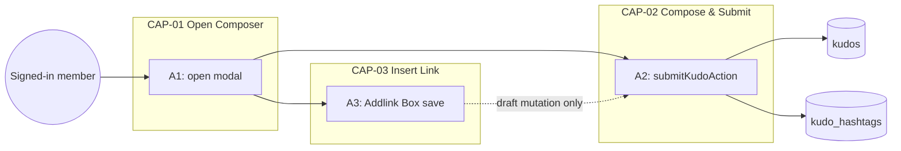
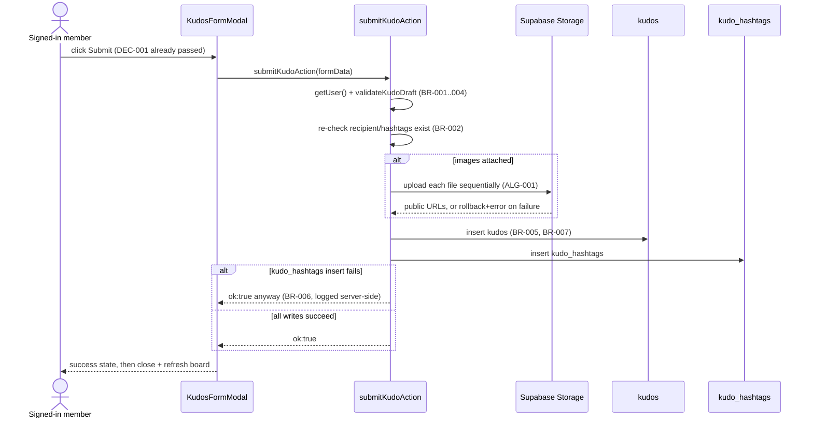
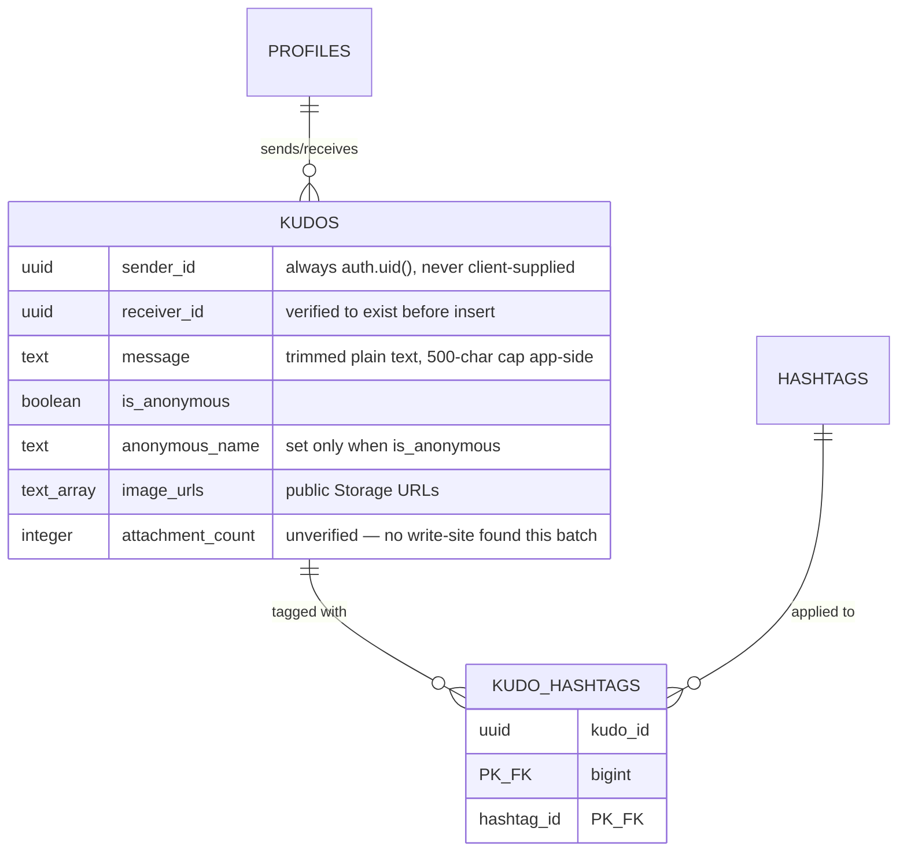
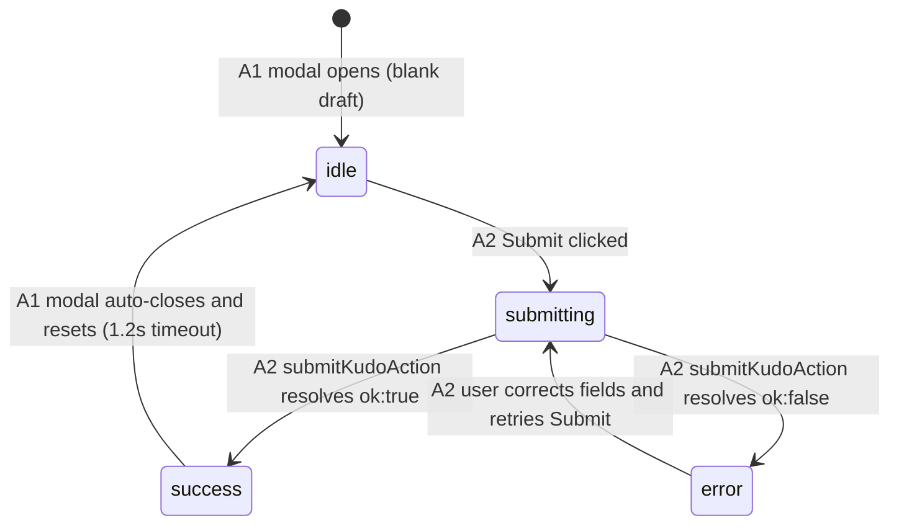

<!-- Contract: references/feature-spec-researcher-contract.md -->

# F003_KudoAuthoring — Technical Spec

**Priority**: P0
**Type**: ui
**Generated**: 2026-09-07

**See also:** [`functional-spec.md`](./functional-spec.md) — plain-language overview, open
decisions, requirements/business rules in one-liners, screens, user stories, scenarios, edge
cases, and configuration for a BA/QA audience.

**How to read this file:** § 2 is the index — pick the action you care about and read its block
in § 3 straight through. § 4 is the shared appendix — jump in only when a § 3 block points you
there.

## 1. Technical Overview

A signed-in member composes and posts a kudo to a colleague through `KudosFormModal`, a shared
client component mounted from two trigger points: the `/about` widget button (`components/homepage/widget-button.tsx`)
and the `/sun-kudos` give-kudos bar (`components/kudos-board/write-kudos-bar.tsx` → `components/kudos/write-kudos-bar-button.tsx`).
Opening is entirely client-side; submitting calls the `submitKudoAction(formData)` Server Action
(`app/sun-kudos/actions/submit-kudo.ts`), which re-validates every field server-side, uploads any
attached images to Supabase Storage, then inserts one `kudos` row and its `kudo_hashtags` join
rows. A third, fully client-only action lets the user splice a `[text](url)` link into the draft
via the Addlink Box before submitting.



## 2. Action Index

| #      | Action (handler)                                                                         | Method · Path                                  | Codes                                                                                                                                                               | Writes                   | Detail              |
| ------ | ---------------------------------------------------------------------------------------- | ---------------------------------------------- | ------------------------------------------------------------------------------------------------------------------------------------------------------------------- | ------------------------ | ------------------- |
| **A0** | _cross-cutting — belongs to no single action_                                            | —                                              | {FR-601}                                                                                                                                                            | —                        | § 4.4               |
| **A1** | `WidgetButton#handleWriteKudos` / `WriteKudosBarButton` pill `onClick` _(client, no BE)_ | —                                              | {FR-101, FR-201, US010, BR-009}                                                                                                                                     | — _(read-only)_          | § 3.1               |
| **A2** | `submitKudoAction`                                                                       | _(Server Action)_ `submitKudoAction(formData)` | {FR-001, FR-202, FR-203, FR-401, FR-402, FR-601, FR-602, US011, BR-001, BR-002, BR-003, BR-004, BR-005, BR-006, BR-007, DEC-001, DEC-002, DEC-003, SM-001, ALG-001} | `kudos`, `kudo_hashtags` | § 3.2 ▸ **diagram** |
| **A3** | `AddlinkBox#handleSave` → `KudosContentEditor#insertLink` _(client, no BE)_              | —                                              | {FR-204, US012, BR-008}                                                                                                                                             | — _(read-only)_          | § 3.3               |

**Note on ROUTE002:** `route-list.md` documents `submitKudoAction(formData)` as a single Server
Action export (`ROUTE002`), not a REST verb+path pair — the `Method · Path` cell above reflects
that shape rather than inventing an HTTP verb.

## 3. Actions

### 3.1 CAP-01 — Open Kudo Composer

#### A1 · Open the composer modal

`—` → `` `WidgetButton#handleWriteKudos` `` / `` `WriteKudosBarButton` `` pill click
`FR-101` `FR-201` `US010` `BR-009` · `SCR004_AboutHomepage` `SCR006_SunKudosBoard`

**Who** · any visitor who can reach `/about` or `/sun-kudos` — no auth check on open (only the
eventual submit, A2, requires a session).
**FE** · Three trigger sites all flip a local `open` boolean and mount the same `KudosFormModal`:

- `components/homepage/widget-button.tsx:88-93` — the widget's own "Write KUDOS" pill, `setKudosOpen(true)`.
- `components/homepage/widget-button.tsx:58-61` (wired via `components/homepage/saa-rules-drawer.tsx:151`'s
  `onWriteKudos` prop) — the open rules drawer's own "Write KUDOS" footer button; closes the
  drawer first, then opens the same modal.
- `components/kudos/write-kudos-bar-button.tsx:32-34` — the `/sun-kudos` give-kudos pill,
  `setOpen(true)`.
  **Request** · _no HTTP request_ — client-only state flip.
  **BE** · _none_.
  **Rule** · The two trigger sites pass different `hashtags` props into the same `KudosFormModal`:
  `components/homepage/widget-button.tsx:146` renders it with **no** `hashtags` prop (defaults to `[]` per
  `components/kudos/kudos-form-modal.tsx:38`), so the SCR004 instance's hashtag picker has zero rows to offer; the
  SCR006 instance (`components/kudos-board/write-kudos-bar.tsx:13-16`) resolves the 13 canonical rows server-side via
  `getHashtags()` and passes them down. **BR-009 — the modal always resets to a blank draft on
  open, no pre-filled "edit" flow exists.** Enforced by a prev-open guard, not an effect:
  `components/kudos/kudos-form-modal.tsx:93-101` re-initializes `form`/`errors`/`status` to their initial values the
  render after `open` flips true. _(no separate full block — Bin 1, this action only)_
  **Result** · No DB write, no side effect beyond mounting the modal in its default state.
  **Source:** `components/homepage/widget-button.tsx:47-96` → `components/homepage/saa-rules-drawer.tsx:151` → `components/kudos-board/write-kudos-bar.tsx:13-16` → `components/kudos/write-kudos-bar-button.tsx:23-34` → `components/kudos/kudos-form-modal.tsx:38,93-101`

<!-- No diagram: below threshold — client-only state flip, single table (zero, actually), no
     branching worth drawing; the two-props difference above is fully stated as a Rule-rung fact. -->

---

### 3.2 CAP-02 — Compose & Submit a Kudo

#### A2 · Submit the kudo draft

_(Server Action)_ `submitKudoAction(formData)` → `` `submitKudoAction` ``
`FR-001` `FR-202` `FR-203` `FR-401` `FR-402` `FR-601` `FR-602` `US011` · `SCR004_AboutHomepage` `SCR006_SunKudosBoard` · `SM-001`

**Who** · signed-in member _(gate A0 — § 4.4)_
**FE** · `components/kudos/kudos-form-modal.tsx:54-61` gates the Submit button's `disabled` state (`isValid`);
`kudos-form-fields.tsx:112-127` reveals the anonymous-name input when the "post anonymously"
checkbox is checked; `components/kudos/kudos-hashtag-input.tsx:46,109` disables unselected hashtag rows once 5 are
picked. `components/kudos/kudos-form-modal.tsx:108-120` (`handleSubmit`) builds the request via
`buildKudoSubmitFormData` (`kudos-form-fields.tsx:30-41`) and calls the action.
**Request** · `FormData`: `recipientId` (string), `message` (string, ≤500 chars server-enforced),
repeated `hashtagIds` (string-encoded numbers), `isAnonymous` (`"true"`/`"false"`), `anonymousName`
(string), repeated `images` (`File`, ≤5, jpg/png only)
**BE** · `` `submitKudoAction` `` — `app/sun-kudos/actions/submit-kudo.ts:49-134` — `getUser()` → `parseDraft` →
`validateKudoDraft` → re-validate recipient/hashtag existence → `uploadKudoImages` →
insert `kudos` → insert `kudo_hashtags` → `revalidatePath("/sun-kudos")`.
**Rule** · decides whether the Submit button is enabled, whether the anonymous-name field shows,
and which hashtag rows are still pickable:

| DEC         | subtype     | Condition                                                                                                               | What the user sees                                                                   | Source                                                                                             |
| ----------- | ----------- | ----------------------------------------------------------------------------------------------------------------------- | ------------------------------------------------------------------------------------ | -------------------------------------------------------------------------------------------------- |
| **DEC-001** | render      | `recipient !== null && content.trim() !== "" && hashtagIds.length > 0 && (!anonymous \|\| anonymousName.trim() !== "")` | Submit button is enabled only once every required field is set                       | `components/kudos/kudos-form-modal.tsx:54-61`                                                      |
| **DEC-002** | interaction | on "post anonymously" checkbox toggle: `checked`                                                                        | Checking it reveals the anonymous display-name input; unchecking clears and hides it | `kudos-form-fields.tsx:112-127`                                                                    |
| **DEC-003** | render      | `!selected && atMax` (5 hashtags already chosen)                                                                        | Unselected hashtag rows in the dropdown render disabled/greyed                       | `components/kudos/kudos-hashtag-input.tsx:46` · `components/kudos/kudos-hashtag-input.tsx:109-120` |

- **BR-001 — the 500-char message cap is a real server control, not just a UX counter.**
  `components/kudos/kudos-content-editor.tsx:69,118-122` shows a live `value.length/500` counter and turns it red
  over the limit, but never blocks typing or submit itself — only `validateKudoDraft` (called
  from `submitKudoAction`, never re-run client-side on submit) can reject an over-length message.
  **Source:** `lib/kudos/kudo-validation.ts:81-86` · `app/sun-kudos/actions/submit-kudo.ts:62-65`
- **BR-002 — recipient and hashtag ids are re-checked against the DB before anything is written.**
  A client-supplied id is a claim, not a fact: `submitKudoAction` queries `profiles`/`hashtags` for
  the exact id(s) and rejects with a field error if the recipient is missing or the matched
  hashtag count doesn't equal the requested count. **Source:** `app/sun-kudos/actions/submit-kudo.ts:69-90`
- **BR-003 — only JPG/PNG images are accepted, checked twice.** `kudos-image-upload.tsx:57`
  rejects a picked file client-side by MIME **and** extension (`accept="image/*"` alone is a
  picker hint, bypassable by drag-and-drop); `app/sun-kudos/actions/submit-kudo.ts` relies on the same
  `isAllowedImageFile` — no server-side re-check of file bytes beyond MIME/extension.
  **Source:** `lib/kudos/kudo-validation.ts:30-37`
- **BR-004 — at most 5 hashtags and 5 images per kudo.** Enforced client-side by disabling the
  add-controls at the cap (`components/kudos/kudos-hashtag-input.tsx:46`, `kudos-image-upload.tsx:106`) and
  re-checked server-side in `validateKudoDraft`. **Source:** `lib/kudos/kudo-validation.ts:88-98` ·
  `constants/index.ts:37,40`
- **BR-005 — `sender_id` is always the caller's own session id, never client-supplied.**
  `formData` carries no sender field at all; `submitKudoAction` writes `user.id` from
  `getUser()` directly. **Source:** `app/sun-kudos/actions/submit-kudo.ts:99-103`
- **BR-006 — a `kudo_hashtags` insert failure does not roll back the kudo.** If the join-table
  insert fails after the `kudos` row is already committed, the kudo stays posted (visible in the
  feed) but untagged; the failure is logged server-side only, with no user-facing error and no
  retry. **Source:** `app/sun-kudos/actions/submit-kudo.ts:121-130`
- **BR-007 — the message is stored and rendered as safe plain text.** `message` is trimmed and
  inserted with no HTML wrapper or escaping; render-side, `renderKudoMessage` builds only React
  elements/strings (never `dangerouslySetInnerHTML`), and only an inserted link whose URL scheme
  is literally `http:`/`https:` becomes a clickable `<a>` — any other scheme stays inert literal
  text, brackets included. **Source:** `app/sun-kudos/actions/submit-kudo.ts:104-109` · `lib/kudos/render-kudo-message.tsx:23-30,44-50`

**Result**

- Writes `kudos` (`sender_id`, `receiver_id`, `message`, `is_anonymous`, `anonymous_name`,
  `image_urls`) ← from the validated draft — `app/sun-kudos/actions/submit-kudo.ts:99-115`
- Writes `kudo_hashtags` (`kudo_id`, `hashtag_id`) ← one row per selected hashtag id —
  `app/sun-kudos/actions/submit-kudo.ts:121-123`
- Uploads accepted images to the `kudos-images` Storage bucket before the `kudos` insert, under
  `{userId}/{uuid}-{filename}`; a mid-batch upload failure rolls back the objects already
  uploaded this call and aborts the whole submit with no `kudos` row written — `ALG-001` (§ 4.5)
- On success: shows a ~1.2s success state, then closes and calls `router.refresh()` — `components/kudos/kudos-form-modal.tsx:117-119`
- On failure: a field-level error renders inline against the offending field, or a generic error
  message when no field error was returned — `components/kudos/kudos-form-modal.tsx:111-114,159-167`
  **State** · `SM-001`: `idle` → `submitting` → `success` _(or)_ `error` _(§ 4.3)_
  **Source:** `components/kudos/kudos-form-modal.tsx:108-120` → `app/sun-kudos/actions/submit-kudo.ts:49-134` → `lib/kudos/kudo-validation.ts:74-105` → `lib/kudos/upload-kudo-images.ts:51-71`



---

### 3.3 CAP-03 — Insert a Link into the Kudo Message

#### A3 · Save the Addlink Box

`—` → `` `AddlinkBox#handleSave` `` → `` `KudosContentEditor#insertLink` `` _(client, no BE)_
`FR-204` `US012` · `SCR004_AboutHomepage` `SCR006_SunKudosBoard`

**Who** · signed-in member composing a kudo, with the composer already open (A1).
**FE** · `components/kudos/kudos-content-editor.tsx:89-97` — the editor toolbar's link icon (the one working
button in that row) opens the Addlink Box. `components/kudos/addlink-box.tsx:52-58` (`handleSave`) validates the
draft text/URL and, on success, calls `onInsert` then closes. `components/kudos/kudos-content-editor.tsx:52-67`
(`insertLink`) splices `` `[text](url)` `` into the message at the textarea's caret position and
refocuses it after React commits the new value.
**Request** · _no HTTP request_ — client-only draft mutation.
**BE** · _none_.
**Rule** · **BR-008 — Addlink fields are validated before the link is inserted.** Text: 1-100
non-whitespace characters. URL: 5-2048 characters, and must parse with an `http:`/`https:`
scheme — any other scheme or an unparseable string is rejected inline, never silently accepted.
Cancel, Escape, or a backdrop click discards the draft link without touching the message (the
shared shadcn `Dialog` primitive's own built-in dismissal — no hand-rolled listener needed).
_(no separate full block — Bin 1, this action only)_
**Result** · No DB write. The message textarea's value gains the spliced markdown link; nothing
else in the draft changes.
**Source:** `lib/kudos/kudo-validation.ts:112-121,124-140` → `components/kudos/kudos-content-editor.tsx:52-67,89-97` → `components/kudos/addlink-box.tsx:31-58`

<!-- No diagram: below threshold — single client-only mutation, no branching beyond the
     validation gate already stated as a Rule-rung fact. -->

### 3.4 Edge cases

| Action | Scenario                                                                                           | Behavior                                                                                                                                                          |
| ------ | -------------------------------------------------------------------------------------------------- | ----------------------------------------------------------------------------------------------------------------------------------------------------------------- |
| A2     | Message exceeds 500 chars after the client counter is bypassed (e.g. programmatic `formData` edit) | `validateKudoDraft` rejects with `fieldErrors.message = "tooLong"`; no DB write happens                                                                           |
| A2     | Recipient or a selected hashtag id is deleted/renamed between composer-open and submit             | Existence re-check fails; `fieldErrors.recipientId`/`hashtagIds = "notFound"`; no DB write                                                                        |
| A2     | One image in a multi-image batch fails to upload                                                   | Already-uploaded objects in that batch are deleted (best-effort); the whole submit aborts with an error, no `kudos` row is written                                |
| A2     | `kudos` insert succeeds but the `kudo_hashtags` insert fails                                       | Kudo is posted and visible in the feed, but carries no hashtags; failure is logged server-side only (BR-006), `ok:true` still returned to the client              |
| A1, A3 | Unauthenticated visitor opens the composer and inserts a link, then attempts submit                | Open and link-insert both succeed (no auth gate on either); A2's own `getUser()` check rejects the eventual submit with `{ ok: false, error: "unauthenticated" }` |

## 4. Shared Foundation

### 4.1 Components

| Component                               | Responsibility                                                                                        | Used in                     | File                                                                                        |
| --------------------------------------- | ----------------------------------------------------------------------------------------------------- | --------------------------- | ------------------------------------------------------------------------------------------- |
| `KudosFormModal`                        | Owns composer open/close state, submit status, orchestrates the sub-fields and the Server Action call | A1, A2                      | `components/kudos/kudos-form-modal.tsx`                                                     |
| `KudosFormFields`                       | Recipient/hashtag/image/anonymous field rows + `buildKudoSubmitFormData`                              | A2                          | `components/kudos/kudos-form-fields.tsx`                                                    |
| `KudosContentEditor`                    | Message textarea, inert formatting toolbar, opens the Addlink Box, splices the inserted link          | A3                          | `components/kudos/kudos-content-editor.tsx`                                                 |
| `AddlinkBox`                            | Text/URL fields for the inserted link, validates and hands the pair back to the editor                | A3                          | `components/kudos/addlink-box.tsx`                                                          |
| `KudosRecipientSelect`                  | Debounced `profiles.display_name` search + autocomplete                                               | A2                          | `components/kudos/kudos-recipient-select.tsx`                                               |
| `KudosHashtagInput`                     | Multi-select hashtag dropdown + removable chips, max 5                                                | A2                          | `components/kudos/kudos-hashtag-input.tsx`                                                  |
| `KudosImageUpload`                      | File picker + local object-URL previews, max 5, jpg/png only                                          | A2                          | `components/kudos/kudos-image-upload.tsx`                                                   |
| `WriteKudosBarButton` / `WriteKudosBar` | SCR006 trigger pill; server half resolves the 13 canonical hashtags                                   | A1                          | `components/kudos/write-kudos-bar-button.tsx`, `components/kudos-board/write-kudos-bar.tsx` |
| `WidgetButton`                          | SCR004 trigger pill (direct, and via the rules drawer's footer button)                                | A1                          | `components/homepage/widget-button.tsx`                                                     |
| `submitKudoAction`                      | Server Action: validate, upload, insert `kudos` + `kudo_hashtags`                                     | A2                          | `app/sun-kudos/actions/submit-kudo.ts`                                                      |
| `lib/kudos/kudo-validation.ts`          | Shared, dependency-free validation rules for both the client fields and the server action             | A2, A3                      | `lib/kudos/kudo-validation.ts`                                                              |
| `uploadKudoImages`                      | Sequential image upload with rollback (ALG-001)                                                       | A2                          | `lib/kudos/upload-kudo-images.ts`                                                           |
| `getHashtags`                           | Reads the 13-row hashtag master list, server-only                                                     | A1, A2                      | `lib/kudos/hashtags.ts`                                                                     |
| `renderKudoMessage`                     | Safe render of a stored kudo message, converting `[text](url)` to a real anchor                       | — _(read path, F002/board)_ | `lib/kudos/render-kudo-message.tsx`                                                         |

### 4.2 Data Model



| Entity                   | Table           | Used for                                                               | Action |
| ------------------------ | --------------- | ---------------------------------------------------------------------- | ------ |
| `MODEL002_KUDOS`         | `kudos`         | The posted kudo itself — message, sender/receiver, images, anonymity   | A2     |
| `MODEL004_HASHTAGS`      | `hashtags`      | 13-row canonical taxonomy read for the picker and re-checked at submit | A1, A2 |
| `MODEL005_KUDO_HASHTAGS` | `kudo_hashtags` | Join rows recording which hashtags this kudo carries                   | A2     |

#### Polymorphic Behavior

N/A — no discriminator fields in Key Entities. `entities.md` explicitly declines to assign
`is_spam`/`is_anonymous` a `DISC-###` (both are plain booleans, documented as Business Rules
instead — `is_anonymous` is BR-007's identity-hiding condition, `is_spam` is out of F003's own
write path).

### 4.3 State Management

### Kudo composer submit status (SM-001)

**kind:** ui
**Linked FR:** FR-401, FR-402
**Source:** `components/kudos/kudos-form-modal.tsx:28,43,108-120`



**Action transitions:** the guard and side effect for each edge live in A2's own **Result** rung
(§ 3.2) — not repeated here.

### 4.4 Shared Rules

#### Bin 3 — cross-cutting, belongs to no single action

**A0 · {FR-601} — every write against `kudos`/`kudo_hashtags` requires an authenticated Supabase
session, and the identity used is always the caller's own.** `submitKudoAction`'s own
`getUser()` call (`app/sun-kudos/actions/submit-kudo.ts:52-59`) rejects with `{ ok: false, error: "unauthenticated" }`
before any validation runs. Independently, Postgres RLS enforces the same boundary at the
database layer regardless of what the application code does: `kudos` insert is scoped
`with check (sender_id = auth.uid())`, and `kudo_hashtags` insert is scoped to the kudo's own
sender via a subquery — **not any one action's own rule, the whole write surface's gate**.
**Source:** `app/sun-kudos/actions/submit-kudo.ts:52-59` · `supabase/migrations/20260716100000_write_kudos.sql:13-15` ·
`supabase/migrations/20260906191000_kudo_hashtags.sql:56-60`

_(No Bin 2 entries — every BR/DEC/SM extracted for this feature is used by exactly one named
action and stays inline in that action's own Rule rung, § 3.)_

### 4.5 Algorithms & Integrations

### Sequential image upload with rollback (ALG-001)

**Linked FR:** FR-203
**Used in:** A2
**Source:** `lib/kudos/upload-kudo-images.ts:51-71`
**Input:** `File[]` (≤5, already jpg/png-checked) + the caller's `userId` · **Output:**
`UploadedKudoImage[]` (`path`, `publicUrl` per file) · **Complexity:** O(n)
**Description:** Uploads each file to the `kudos-images` Storage bucket under
`{userId}/{uuid}-{filename}`, one at a time via `Array.prototype.reduce` (not a `for` loop — this
project's lint config bans loop statements). If any upload fails partway through, every object
already uploaded in this call is deleted (best-effort, logged not thrown on its own failure) and
the error is re-thrown, so `submitKudoAction` never inserts a `kudos` row with a partial
`image_urls` array.

**Pseudocode:**

```text
uploaded = []
for file in files:              # actually reduce(), sequential by design
  path = `${userId}/${uuid()}-${file.name}`
  try:
    upload(bucket, path, file)
  except:
    rollback(uploaded)         # best-effort delete, swallow its own errors
    throw
  uploaded.append({ path, publicUrl: getPublicUrl(path) })
return uploaded
```

None. _(no INT-### this feature — Supabase Storage/Postgres access is already fully described via
§ 4.1 Components and § 4.2 Data Model; no external API call, webhook, or queue job is involved.)_

### 4.6 Configuration

```text
KUDOS_IMAGES_BUCKET = "kudos-images"   # Supabase Storage bucket name (A2)
SEARCH_DEBOUNCE_MS = 250               # recipient search debounce (A2, KudosRecipientSelect)
SEARCH_LIMIT = 10                      # max recipient rows returned per search (A2)
ALLOWED_IMAGE_MIME_TYPES = image/jpeg, image/png   # A2 image accept-list
ALLOWED_IMAGE_EXTENSIONS = .jpg, .jpeg, .png        # A2 image accept-list, paired with MIME check
```

**Client behavior:** see
[`behavior-logic.md`](../../generated/behavior-logic.md) (client-side patterns — debounce, optimistic UI, polling, upload, realtime),
[`permissions.md`](../../system/permissions.md) (feature flags / experiments / env / locale gates),
[`screen-flow.md`](../../generated/screen-flow.md) (guards / deep-link state restoration / unsaved-changes protection).

## 5. Verification & Technical Notes

### 5.1 Technical Verification

- **SC-001** _(A2)_ After a successful submit, a new `kudos` row exists whose `sender_id` equals
  the caller's own session id, never a client-supplied value (covers FR-601, BR-005)
- **SC-002** _(A2)_ Submitting a message over 500 chars (bypassing the client counter) is
  rejected server-side with no `kudos` row written (covers FR-602, BR-001)
- **SC-003** _(A2)_ A `kudo_hashtags` insert failure after a successful `kudos` insert still
  returns `ok:true` and leaves the kudo visible, untagged (covers BR-006)

#### US010_OpenKudoComposer _(A1)_

**Independent Test:** Click each of the 3 trigger sites (About widget pill, About rules-drawer
footer button, Sun* Kudos Board give-kudos pill) and confirm the modal opens with a blank draft;
confirm the About instance's hashtag picker offers zero rows and the Sun* Kudos Board instance
offers all 13.

**Acceptance Scenarios:**

1. **Given** the About page, **When** the user clicks the widget's "Write KUDOS" pill, **Then**
   `KudosFormModal` opens with `hashtags=[]` and a blank draft.
2. **Given** the Sun* Kudos Board, **When** the user clicks the give-kudos pill, **Then**
   `KudosFormModal` opens with the 13 canonical hashtags available to pick.

#### US011_PostAKudo _(A2)_

**Independent Test:** Submit a complete valid draft and confirm both a `kudos` row and its
`kudo_hashtags` rows exist with `sender_id` equal to the session user; submit an over-length
message and confirm the server rejects it even though the client never blocked typing.

**Acceptance Scenarios:**

1. **Given** a composer with recipient, message, and ≥1 hashtag set, **When** the user clicks
   Submit, **Then** `submitKudoAction` returns `{ ok: true }`, the modal shows a success state for
   ~1.2s, then closes and the board refreshes.
2. **Given** a message longer than 500 characters, **When** the user clicks Submit, **Then**
   `submitKudoAction` returns `{ ok: false, fieldErrors: { message: "tooLong" } }` and no row is
   written.

#### US012_InsertLinkIntoKudoMessage _(A3)_

**Independent Test:** Open the Addlink Box, enter valid text/URL, save, and confirm the exact
`[text](url)` substring appears in the message at the prior caret position with focus restored.

**Acceptance Scenarios:**

1. **Given** the Addlink Box is open with valid text and an `https://` URL, **When** the user
   clicks save, **Then** `[text](url)` is spliced into the message at the caret and the box
   closes.
2. **Given** the Addlink Box is open with a `javascript:` URL, **When** the user clicks save,
   **Then** the URL field shows an inline "invalid" error and nothing is inserted.

### 5.2 Assumptions

- _(A1)_ Both trigger surfaces are assumed to always mount the exact same `KudosFormModal`
  version — no per-screen behavioral fork exists beyond the `hashtags` prop, confirmed by reading
  both call sites, but not confirmed against a running app in this pass.
- _(A2)_ A freshly-uploaded Storage object's public URL is assumed immediately servable once
  `getPublicUrl` returns it — no confirmed CDN-propagation delay is handled or observed in code.
- _(A2)_ `kudos.attachment_count` (NOT NULL DEFAULT 0) is assumed safe to leave unwritten because
  `image_urls.length` already carries the same information for every current read path — not
  confirmed this is the intended long-term design.

### 5.3 Unresolved Questions

1. **`attachment_count` non-write** _(A2)_: no write-site exists for `kudos.attachment_count` in
   `app/sun-kudos/actions/submit-kudo.ts` — could not confirm from source whether this column is dead, planned for a
   later batch, or an oversight.
2. **Partial `kudo_hashtags` batch insert** _(A2)_: `app/sun-kudos/actions/submit-kudo.ts:121-123` inserts all hashtag
   rows in one call; whether Postgres/PostgREST can partially succeed on that batch (some hashtag
   ids inserted, others not) rather than failing atomically was not confirmed from source.

### 5.4 Source References

| Action | Order | Symbol                                  | Path                                                                                                  | Purpose                                                  |
| ------ | ----- | --------------------------------------- | ----------------------------------------------------------------------------------------------------- | -------------------------------------------------------- |
| —      | 1     | `MODEL002_KUDOS`                        | `supabase/migrations/20260714070000_profile_schema.sql:20-35`                                         | the entity this feature revolves around                  |
| A1     | 2     | `WidgetButton`                          | `components/homepage/widget-button.tsx:1-150`                                                         | SCR004 trigger, direct pill + drawer-footer wiring       |
| A1     | 3     | `WriteKudosBar` / `WriteKudosBarButton` | `components/kudos-board/write-kudos-bar.tsx:1-16`, `components/kudos/write-kudos-bar-button.tsx:1-67` | SCR006 trigger, resolves real hashtags server-side       |
| A2     | 4     | `KudosFormModal`                        | `components/kudos/kudos-form-modal.tsx:1-193`                                                         | owns submit status + orchestrates the Server Action call |
| A2     | 5     | `submitKudoAction`                      | `app/sun-kudos/actions/submit-kudo.ts:1-134`                                                          | validate, upload, insert `kudos` + `kudo_hashtags`       |
| A2     | 6     | `lib/kudos/kudo-validation.ts`          | `lib/kudos/kudo-validation.ts:1-141`                                                                  | shared client+server validation rules                    |
| A3     | 7     | `AddlinkBox` / `KudosContentEditor`     | `components/kudos/addlink-box.tsx:1-147`, `components/kudos/kudos-content-editor.tsx:1-127`           | link-insertion field pair + caret splice                 |

#### Data Flow

```text
FormData (recipientId, message, hashtagIds[], images[], isAnonymous, anonymousName)
  -> parseDraft() coerces every field defensively (submit-kudo.ts:26-39)
  -> validateKudoDraft() (BR-001..004) -> reject with fieldErrors on failure
  -> re-check recipient + hashtag ids exist in profiles/hashtags (BR-002)
  -> uploadKudoImages() (ALG-001) -> UploadedKudoImage[] (path, publicUrl)
  -> insert kudos {sender_id: session user.id, receiver_id, message, is_anonymous,
       anonymous_name, image_urls} (BR-005, BR-007)
  -> insert kudo_hashtags rows (one per hashtagId) (BR-006 on partial failure)
  -> revalidatePath("/sun-kudos")
  -> SubmitKudoResult { ok: true } | { ok: false, error, fieldErrors }
```

### 5.5 Artifact References

| Artifact           | File                                                           | Codes Used                                                                                                                               | Reviewed |
| ------------------ | -------------------------------------------------------------- | ---------------------------------------------------------------------------------------------------------------------------------------- | -------- |
| System Overview    | [overview.md](../../system/overview.md)                        | —                                                                                                                                        | [x]      |
| Feature List       | [feature-list.md](../../generated/feature-list.md)             | F003                                                                                                                                     | [x]      |
| API Map            | [route-list.md](../../generated/route-list.md)                 | ROUTE002                                                                                                                                 | [x]      |
| Entities           | [entities.md](../../generated/entities.md)                     | MODEL002, MODEL004, MODEL005                                                                                                             | [x]      |
| Screens            | [functional-spec.md § 6](./functional-spec.md#6-screens)       | SCR004, SCR006                                                                                                                           | [x]      |
| Behavior Logic     | [behavior-logic.md](../../generated/behavior-logic.md)         | — _(no BL### touches F003 — see behavior-logic.md § Client-Side Logic BL-C01 for the recipient-search debounce, not a numbered BL item)_ | [x]      |
| Permissions Matrix | [permissions-matrix.md](../../generated/permissions-matrix.md) | PERM005, PERM007, PERM008                                                                                                                | [x]      |
| User Stories       | [user-stories.md](../../generated/user-stories.md)             | US010, US011, US012                                                                                                                      | [x]      |
