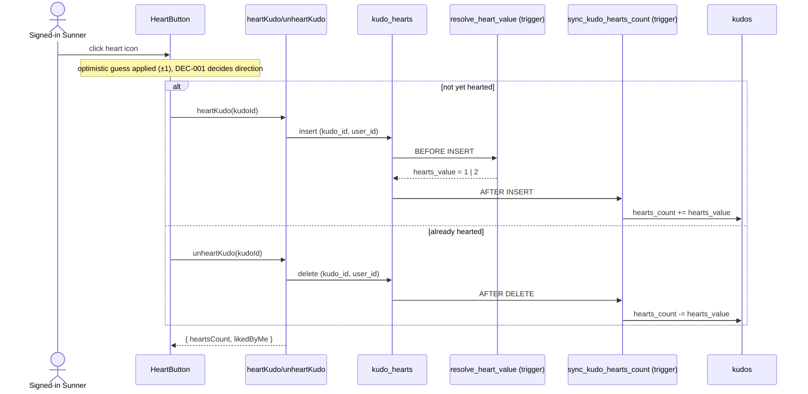
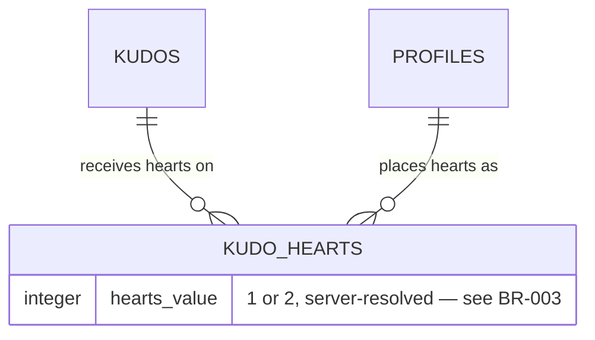
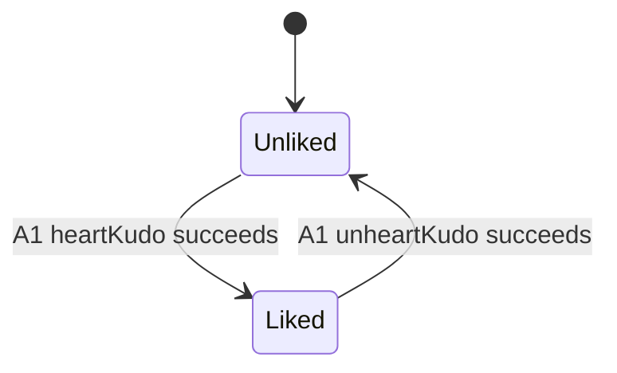

<!-- Contract: references/feature-spec-researcher-contract.md -->

# F004_KudoHearts — Technical Spec

**Priority**: P1
**Type**: mixed
**Generated**: 2026-09-07

**See also:** [`functional-spec.md`](./functional-spec.md) — plain-language overview, open
decisions, requirements/business rules stated in one-liners, screens, user stories, scenarios,
edge cases, and configuration for a BA/QA audience.

**How to read this file:** § 2 is the index — pick the action you care about and read its block
in § 3 straight through; each block is one complete thread, top to bottom. § 4 is the shared
appendix — jump in only when a § 3 block points you there.

## 1. Technical Overview

A signed-in member reacts to a kudo (that isn't their own) by clicking a heart control on its
card, on either the scrolling feed (`SCR006_SunKudosBoard/REG003`) or the highlight carousel
(`SCR006_SunKudosBoard/REG001`). The control is a single client-side toggle backed by two Server
Actions — `heartKudo` (insert) and `unheartKudo` (delete) — chosen by the control's own current
liked state, never two independently-triggered actions. `hearts_value` (1, or 2 on an
admin-configured special day) is resolved entirely server-side by a `BEFORE INSERT` trigger on
`kudo_hearts`, so it can never be forged by the client; a second `AFTER INSERT OR DELETE` trigger
keeps the denormalized `kudos.hearts_count` counter exactly in sync with the `kudo_hearts` rows
that actually exist.

## 2. Action Index

| #      | Action (handler)                                                                       | Method · Path                            | Codes                                                                                                    | Writes                                 | Detail              |
| ------ | -------------------------------------------------------------------------------------- | ---------------------------------------- | -------------------------------------------------------------------------------------------------------- | -------------------------------------- | ------------------- |
| **A0** | _cross-cutting — belongs to no single action_                                          | —                                        | {FR-601}                                                                                                 | —                                      | § 4.4               |
| **A1** | `heartKudo` / `unheartKudo` _(one client toggle dispatches whichever handler applies)_ | `server action` `.../actions/heart-kudo` | {FR-001, FR-201, FR-401, FR-402, FR-403, FR-602, BR-001, BR-002, BR-003, BR-004, DEC-001, SM-001, US017} | `kudo_hearts`, `kudos` _(via trigger)_ | § 3.1 ▸ **diagram** |

**Rung set** — every block in § 3 uses this exact order; an absent rung is simply omitted, never
rendered as `N/A` or `None.`:

> **Who** → **FE** → **Request** → **BE** → **Rule** → **Result** → **State** → **Source**

## 3. Actions

### 3.1 CAP-01 — React to a kudo with a heart

#### A1 · Toggle a heart on a kudo

`server action` `.../actions/heart-kudo` → `` `heartKudo` `` / `` `unheartKudo` ``
`FR-401` `FR-402` `FR-403` `DEC-001` `SM-001` `US017` · `SCR006_SunKudosBoard/REG001` ·
`SCR006_SunKudosBoard/REG003`

**Who** · Signed-in Sunner _(gate A0 — § 4.4)_
**FE** · `HeartButton` (`components/kudos-board/heart-button.tsx:52-113`), shared by both card
types. Click sets an immediate optimistic guess via `useOptimistic`/`reduceHeart`
(`components/kudos-board/heart-button.tsx:14-17,63,73`) — heart glyph flips, count moves ±1 — before the Server Action
resolves. The control is disabled on the viewer's own kudo (`components/kudos-board/feed-kudo-post-card.tsx:137`,
`components/kudos-board/highlight-kudo-card.tsx:144` — the latter also disables on a non-interactive carousel slide) and
disables itself again while `isPending` (`components/kudos-board/heart-button.tsx:64,68,96`), so a second click during an
in-flight request is a no-op.
**Request** · `kudoId` _(string, the target kudo's id — no other payload; `hearts_value` is never
sent by the client)_
**BE** · `` `heartKudo(kudoId)` ``/`` `unheartKudo(kudoId)` `` (`app/sun-kudos/actions/heart-kudo.ts:52-97`)
— resolves the caller via `supabase.auth.getUser()`, then inserts or deletes the caller's own
`kudo_hearts` row.
**Rule** · Decides which of the two Server Actions to call, purely from the control's own current
liked state — this is one toggle, not two independently-wired actions:

| DEC         | subtype     | Condition                                                        | What the user sees                                                                                                                                              | Source                                          |
| ----------- | ----------- | ---------------------------------------------------------------- | --------------------------------------------------------------------------------------------------------------------------------------------------------------- | ----------------------------------------------- |
| **DEC-001** | interaction | `wasLiked` (the control's own `serverState.liked` at click time) | not yet liked → heart fills in, count +1 optimistically, `heartKudo` is called; already liked → heart empties, count −1 optimistically, `unheartKudo` is called | `components/kudos-board/heart-button.tsx:70-74` |

- **BR-001 — one heart per member per kudo; a second click removes it rather than adding a
  second.** The composite primary key `(kudo_id, user_id)` on `kudo_hearts` makes a second insert
  from the same user physically impossible; the client-side toggle logic (DEC-001 above) is what
  routes a second click to `unheartKudo` instead of a rejected duplicate insert. _(§ 4.4 — Bin 1,
  inline only)_
  **Source:** `supabase/migrations/20260722100000_kudo_hearts.sql:8-14`
- **BR-002 — a member can never heart their own kudo.** Enforced twice: the UI disables the
  control on the viewer's own kudo (`isOwnKudo`, derived at `lib/kudos/board-query-helpers.ts:137`
  as `sender.id === viewerId`), and the `kudo_hearts` INSERT RLS policy independently rejects any
  insert where `auth.uid()` equals the kudo's `sender_id` — the real boundary, since the UI check
  alone is bypassable via a direct write.
  **Source:** `supabase/migrations/20260722100000_kudo_hearts.sql:41-47`
- **BR-003 — during an admin-configured special-day window, a heart grants +2 instead of +1.**
  `resolve_heart_value()` (a `BEFORE INSERT` trigger) overwrites `NEW.hearts_value` to `2` when
  `now()` falls between `event_settings.special_day_start` and `special_day_end` (both required
  non-null), else `1` — this runs regardless of what value the client insert payload carries, so
  the multiplier cannot be forged.
  **Source:** `supabase/migrations/20260906193000_resolve_heart_value_no_definer.sql:20-39`
  ```text
  # resolve_heart_value() — BEFORE INSERT ON kudo_hearts
  if event_settings.special_day_start IS NOT NULL
     and event_settings.special_day_end IS NOT NULL
     and now() BETWEEN special_day_start AND special_day_end:
       NEW.hearts_value := 2
  else:
       NEW.hearts_value := 1
  ```
- **BR-004 — un-hearting revokes exactly the amount that heart originally granted, not a flat 1.**
  `sync_kudo_hearts_count()`'s `DELETE` branch subtracts `OLD.hearts_value` (whichever value was
  actually stored on the deleted row), so un-hearting a kudo that was granted 2 during a
  special-day window still correctly revokes 2, even after the window has closed.
  **Source:** `supabase/migrations/20260722100000_kudo_hearts.sql:74-76`

**Result**

- Writes `kudo_hearts` ← one row inserted (self-heal not possible, BR-002) or the caller's own row
  deleted — `app/sun-kudos/actions/heart-kudo.ts:60,88`
- Writes `kudos.hearts_count` ← `greatest(hearts_count ± hearts_value, 0)`, via the
  `on_kudo_hearts_change` `AFTER INSERT OR DELETE` trigger, never written directly by application
  code — `supabase/migrations/20260722100000_kudo_hearts.sql:63-80`
- A raced double-click that re-sends the same insert (`23505`, duplicate composite key) is treated
  as the no-op it is, not an error — the caller already has the one row the constraint guarantees.
- A kudo deleted mid-click (`23503`, foreign-key violation) maps to a `"gone"` result rather than a
  raw exception.
- User sees: `serverState` is set from the Server Action's own returned `heartsCount`/`likedByMe`
  once it resolves, reconciling the optimistic ±1 guess to the authoritative value (correcting for
  a special-day 2× grant the guess did not anticipate) — `components/kudos-board/heart-button.tsx:86`. A failed write
  leaves `serverState` untouched, so the next render falls back to the pre-click truth, and an
  inline `role="alert"` error shows (`components/kudos-board/heart-button.tsx:82,106-109`). `revalidatePath("/sun-kudos")`
  refreshes the page's server-rendered data on success (`heart-kudo.ts:65,94`).
  **State** · `SM-001`: `Unliked` → `Liked` _(on `heartKudo` success)_ / `Liked` → `Unliked` _(on
  `unheartKudo` success)_ _(§ 4.3)_
  **Source:** `components/kudos-board/heart-button.tsx:52-113` → `app/sun-kudos/actions/heart-kudo.ts:52-97` →
  `supabase/migrations/20260906193000_resolve_heart_value_no_definer.sql:20-39` →
  `supabase/migrations/20260722100000_kudo_hearts.sql:63-80`



---

### 3.2 Edge cases

| Action | Scenario                                                                                              | Behavior                                                                                                                                                              |
| ------ | ----------------------------------------------------------------------------------------------------- | --------------------------------------------------------------------------------------------------------------------------------------------------------------------- |
| A1     | Rapid repeat click while a request is already pending                                                 | Button is disabled during `isPending`; the second click is a no-op — at most one write per gesture (`components/kudos-board/heart-button.tsx:68,96`)                  |
| A1     | A raced double-click still reaches the server twice for the same insert                               | Postgres `23505` (duplicate composite key) is treated as success, not an error — the caller already has the one row the constraint guarantees (`heart-kudo.ts:60-62`) |
| A1     | Kudo deleted between render and click                                                                 | Foreign-key violation `23503` maps to `"gone"`; UI shows the generic inline error, count unchanged (`heart-kudo.ts:19-20`)                                            |
| A1     | Attempt to heart the caller's own kudo bypassing the disabled UI control (e.g. direct PostgREST call) | RLS insert policy rejects with `42501`, mapped to `"forbidden"` — the UI disable is a convenience, RLS is the real gate (BR-002)                                      |
| A1     | Un-hearting a kudo that was granted 2 during a special-day window, after the window has closed        | `sync_kudo_hearts_count`'s DELETE branch subtracts the row's own stored `hearts_value` (2), not a hardcoded 1 — count still comes down correctly (BR-004)             |

## 4. Shared Foundation

### 4.1 Components

| Component                  | Responsibility                                                                            | Used in | File                                                                    |
| -------------------------- | ----------------------------------------------------------------------------------------- | ------- | ----------------------------------------------------------------------- |
| `HeartButton`              | Client toggle control; optimistic guess via `useOptimistic`, disables on own-kudo/pending | A1      | `components/kudos-board/heart-button.tsx`                               |
| `heartKudo`/`unheartKudo`  | Server Actions — insert/delete the caller's own `kudo_hearts` row                         | A1      | `app/sun-kudos/actions/heart-kudo.ts`                                   |
| `resolve_heart_value()`    | `BEFORE INSERT` trigger resolving `hearts_value` (1 vs 2)                                 | A1      | `supabase/migrations/20260906193000_resolve_heart_value_no_definer.sql` |
| `sync_kudo_hearts_count()` | `AFTER INSERT OR DELETE` trigger keeping `kudos.hearts_count` in sync                     | A1      | `supabase/migrations/20260722100000_kudo_hearts.sql`                    |

### 4.2 Data Model



_(`EVENT_SETTINGS` is read — not FK-linked — by `resolve_heart_value()`; a runtime read, not a
schema relationship, so it is omitted from the diagram above and listed in the table below only.)_

| Entity           | Table            | Used for                                                                                   | Action |
| ---------------- | ---------------- | ------------------------------------------------------------------------------------------ | ------ |
| `KUDOS`          | `kudos`          | Target of the heart; `hearts_count` is the denormalized counter this feature keeps in sync | A1     |
| `KUDO_HEARTS`    | `kudo_hearts`    | One row per (kudo, user) heart; `hearts_value` resolved server-side, never client-supplied | A1     |
| `EVENT_SETTINGS` | `event_settings` | Read-only source of the `special_day_start`/`special_day_end` window                       | A1     |

#### Polymorphic Behavior

N/A — no discriminator fields in Key Entities (`entities.md` MODEL002_KUDOS, MODEL003_KUDO_HEARTS,
MODEL009_EVENT_SETTINGS all list `Discriminator Fields: None`).

### 4.3 State Management

### Heart toggle liked/unliked (SM-001)

**kind:** ui
**Linked FR:** FR-401
**Source:** `components/kudos-board/heart-button.tsx:7-17,62-63`



**Action transitions:** the guard and side effect for each edge live in A1's own **Result** rung
(§ 3.1) — not repeated here.

### 4.4 Shared Rules

#### Bin 3 — cross-cutting, belongs to no single action

**A0 · FR-601 — a member must be signed in to heart or un-heart a kudo.**
Both `heartKudo` and `unheartKudo` independently call `supabase.auth.getUser()` at their own top
and return `{ ok: false, error: "unauthenticated" }` when no session resolves — a duplicated gate
in each handler, not a shared middleware; **applies to both entry points of this feature**, not
one screen.
**Source:** `app/sun-kudos/actions/heart-kudo.ts:53-56,84-87`

_(No Bin 2 entries — this feature has only one real action, so every Bin-1 rule above lives inline
in A1's own Rule rung instead.)_

### 4.5 Algorithms & Integrations

None. _(The special-day window check is a single time-range comparison, captured as BR-003 above
rather than a standalone ALG block; there is no external API call, webhook, queue job, or
notification anywhere in this feature — the `notifications` table exists but nothing in this
codebase queries it, per `NotificationMenu`'s own always-empty presentational state.)_

### 4.6 Configuration

`N/A — no technical configuration beyond framework defaults.`

**Client behavior:** see
[`behavior-logic.md`](../../generated/behavior-logic.md) (client-side patterns — debounce, optimistic UI, polling, upload, realtime),
[`permissions.md`](../../system/permissions.md) (feature flags / experiments / env / locale gates),
[`screen-flow.md`](../../generated/screen-flow.md) (guards / deep-link state restoration / unsaved-changes protection).

## 5. Verification & Technical Notes

### 5.1 Technical Verification

- **SC-001** _(A1)_ `heartKudo`/`unheartKudo` mutate exactly one `kudo_hearts` row, and the
  response's `heartsCount` matches the live `kudos.hearts_count` for that kudo (covers FR-401,
  BR-001)
- **SC-002** _(A1)_ A self-heart attempt returns Postgres error `42501`, mapped to
  `{ ok: false, error: "forbidden" }` (covers FR-602, BR-002)
- **SC-003** _(A1)_ An INSERT during the special-day window sets `hearts_value = 2` regardless of
  any client-sent value (covers FR-403, BR-003)

#### US017_ReactToKudoWithHeart _(A1)_

**Independent Test:** Call `heartKudo(kudoId)` against a kudo not authored by the caller with no
special-day window active; assert the response's `heartsCount` increments by 1 and `likedByMe` is
`true`. Then call `unheartKudo(kudoId)`; assert `heartsCount` decrements by 1 and `likedByMe` is
`false`.

**Acceptance Scenarios:**

1. **Given** a kudo the caller has not yet hearted and no special-day window active, **When**
   `heartKudo(kudoId)` is called, **Then** `kudo_hearts` gains one row with `hearts_value = 1`,
   `kudos.hearts_count` increments by 1, and the action returns
   `{ ok: true, heartsCount, likedByMe: true }`.
2. **Given** the special-day window is active, **When** `heartKudo(kudoId)` is called, **Then**
   `hearts_value` resolves to `2` regardless of any client-sent value, and `hearts_count`
   increments by 2.
3. **Given** a kudo already hearted by the caller, **When** `unheartKudo(kudoId)` is called,
   **Then** the caller's `kudo_hearts` row is deleted and `hearts_count` decrements by exactly the
   row's own stored `hearts_value` (1 or 2).
4. **Given** a direct write attempts to heart the caller's own kudo (bypassing the disabled UI
   control), **When** the insert executes, **Then** RLS rejects it with `42501` and the action
   returns `{ ok: false, error: "forbidden" }`.

### 5.2 Assumptions

- _(A1)_ The `disabled` prop on `HeartButton` is assumed to be the UI's only client-side guard
  against self-hearting; no matching check was found inside `heart-kudo.ts` itself — enforcement in
  application code (as distinct from RLS) is not implemented, despite a migration comment
  suggesting otherwise (see § 5.3 below).
- _(A1)_ `readHeartsCount`'s post-write re-read is assumed to always observe the trigger's
  already-committed effect within the same request — this pass does not run the app, so this is
  recorded as observed code, not confirmed runtime behavior under concurrent load.

### 5.3 Unresolved Questions

1. **Self-heart "defense-in-depth" claim** _(A1)_: the `kudo_hearts insert by self, not own kudo`
   RLS policy's own migration comment (`20260722100000_kudo_hearts.sql:38-40`) states "the server
   action also rejects self-like in code since the mock-auth write path runs on the service-role
   client" — no such check exists in `heart-kudo.ts` today; unconfirmed whether this was
   implemented and later removed, or was aspirational and never implemented. Self-heart is blocked
   by RLS alone, a single layer, not the two described.
2. **`event_settings` write path** _(A1)_: no `INSERT`/`UPDATE` RLS policy or admin screen was
   found for `event_settings.special_day_start`/`special_day_end` (PERM012 — read-only for every
   role); unconfirmed how these values are meant to be set outside a direct database/migration
   edit.

### 5.4 Source References

| Action | Order | Symbol                    | Path                                                                          | Purpose                                                               |
| ------ | ----- | ------------------------- | ----------------------------------------------------------------------------- | --------------------------------------------------------------------- |
| A1     | 1     | `KUDO_HEARTS`             | `supabase/migrations/20260722100000_kudo_hearts.sql:8-14`                     | Composite-PK entity this feature revolves around                      |
| A1     | 2     | `heartKudo`/`unheartKudo` | `app/sun-kudos/actions/heart-kudo.ts:1-97`                                    | Server Action entry points (ROUTE003/ROUTE004)                        |
| A1     | 3     | `HeartButton`             | `components/kudos-board/heart-button.tsx:1-113`                               | Client toggle control, optimistic UI                                  |
| A1     | 4     | `resolve_heart_value`     | `supabase/migrations/20260906193000_resolve_heart_value_no_definer.sql:20-39` | `BEFORE INSERT` trigger resolving 1 vs 2                              |
| A1     | 5     | `sync_kudo_hearts_count`  | `supabase/migrations/20260722100000_kudo_hearts.sql:63-80`                    | `AFTER INSERT OR DELETE` trigger keeping `kudos.hearts_count` in sync |

#### Data Flow

```text
{click on HeartButton, kudoId} -> {useOptimistic applies ±1 guess, DEC-001 picks handler}
  -> {heartKudo/unheartKudo Server Action} -> {kudo_hearts INSERT/DELETE}
  -> {resolve_heart_value BEFORE trigger sets hearts_value, INSERT only}
  -> {sync_kudo_hearts_count AFTER trigger adjusts kudos.hearts_count}
  -> {readHeartsCount re-reads kudos.hearts_count}
  -> {{ ok: true, heartsCount, likedByMe }} -> {serverState reconciled, revalidatePath("/sun-kudos")}
```

### 5.5 Artifact References

| Artifact           | File                                                           | Codes Used                   | Reviewed |
| ------------------ | -------------------------------------------------------------- | ---------------------------- | -------- |
| System Overview    | [overview.md](../../system/overview.md)                        | —                            | [x]      |
| Architecture       | [architecture.md](../../system/architecture.md)                | —                            | [x]      |
| Feature List       | [feature-list.md](../../generated/feature-list.md)             | F004                         | [x]      |
| API Map            | [api-map.md](../../generated/api-map.md)                       | ROUTE003, ROUTE004           | [x]      |
| Entities           | [entities.md](../../generated/entities.md)                     | MODEL002, MODEL003, MODEL009 | [x]      |
| Screens            | [functional-spec.md § 6](./functional-spec.md#6-screens)       | SCR006/REG001, SCR006/REG003 | [x]      |
| Behavior Logic     | [behavior-logic.md](../../generated/behavior-logic.md)         | BL002, BL003, BL004          | [x]      |
| Permissions Matrix | [permissions-matrix.md](../../generated/permissions-matrix.md) | PERM006, PERM012             | [x]      |
| User Stories       | [user-stories.md](../../generated/user-stories.md)             | US017                        | [x]      |

**Rule:** Every code listed in Codes Used exists in its source artifact. `ROUTE003`/`ROUTE004`
resolve to `route-list.md`'s `Code` column, both owned by F004.
