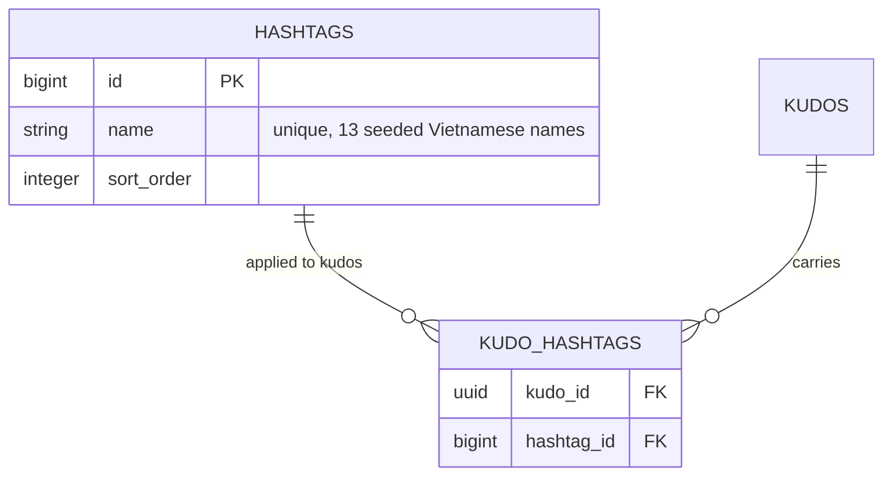
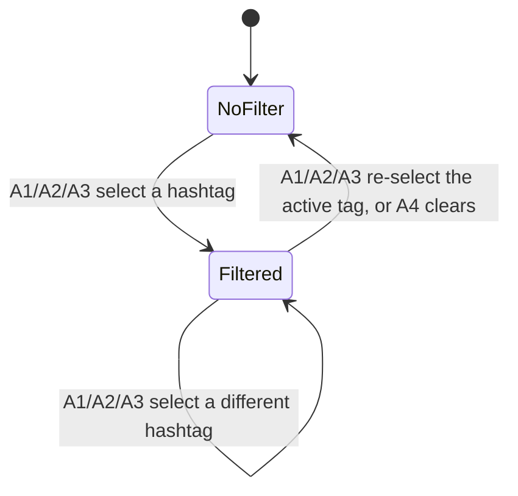

# F005_HashtagTaxonomy — Technical Spec

**Priority**: P1
**Type**: mixed
**Generated**: 2026-09-07

**See also:** [`functional-spec.md`](./functional-spec.md) — plain-language overview, open
decisions, requirements/business rules stated in one-liners, screens, user stories, scenarios,
edge cases, and configuration for a BA/QA audience.

**How to read this file:** § 2 is the index — pick the action you care about and read its block
in § 3 straight through; each block is one complete thread, top to bottom. § 4 is the shared
appendix — jump in only when a § 3 block points you there.

## 1. Technical Overview

A DB-backed `hashtags` catalog (13 seeded Vietnamese categories) and a `kudo_hashtags` join table
replace what used to be two independently hardcoded, drifting hashtag lists. The same catalog
feeds two different UI surfaces on `/sun-kudos`: a single-select board filter (`?tag=<id>`,
shared by the Highlight carousel and the All-Kudos feed) and a max-5 multi-select picker in the
kudo composer (`KudosHashtagInput`, shared with F003). This feature owns the catalog read, the
board-filter surface, and the RLS/GRANT gate on both tables; F003's own submission action is the
only path that ever writes a `kudo_hashtags` row.

## 2. Action Index

| #      | Action (handler)                                   | Method · Path                   | Codes                                                         | Writes                                    | Detail |
| ------ | -------------------------------------------------- | ------------------------------- | ------------------------------------------------------------- | ----------------------------------------- | ------ |
| **A0** | _cross-cutting — hashtag read/write gate_          | —                               | FR-001, FR-601                                                | —                                         | § 4.4  |
| **A1** | `HighlightFilterDropdown` (hashtag instance)       | — _(client selection, no HTTP)_ | FR-101, FR-201, FR-401, FR-402, BR-001, BR-002, SM-001, US013 | — _(read-only)_                           | § 3.1  |
| **A2** | `HighlightKudoCard#onHashtagClick`                 | — _(client selection, no HTTP)_ | FR-202, FR-401, FR-402, BR-001, BR-002, US013                 | — _(read-only)_                           | § 3.1  |
| **A3** | `KudoPostCard#onHashtagClick`                      | — _(client selection, no HTTP)_ | FR-203, FR-401, FR-402, BR-001, BR-002, US013                 | — _(read-only)_                           | § 3.1  |
| **A4** | `FeedList` clear-filter chip                       | — _(client selection, no HTTP)_ | FR-204, FR-401, FR-402, BR-002, US013                         | — _(read-only)_                           | § 3.1  |
| **A5** | `KudosHashtagInput#toggleTag` _(shared with F003)_ | — _(client selection, no HTTP)_ | FR-205, BR-003, DEC-001                                       | — _(read-only — feeds F003's own insert)_ | § 3.1  |

**Column rules:** as defined by `templates/technical-spec-template.md` § 2 (imported, not restated).

**Rung set** — every block in § 3 uses the fixed order **Who → FE → Request → BE → Rule → Result →
State → Source**; an absent rung is omitted, never rendered as `N/A`/`None.`.

## 3. Actions

### 3.1 CAP-01 — Hashtag taxonomy: filter the board and tag a kudo

#### A1 · Board hashtag filter dropdown

`—` _(client-side selection, no HTTP request)_ → `` `HighlightFilterDropdown` ``
`FR-101` `FR-201` `FR-401` `FR-402` `US013` · `SCR006_SunKudosBoard/REG001` · `SM-001`

**Who** · any signed-in Sunner viewing the board (session enforced upstream by the page's own
guard — not this feature's gate; see A0 for this feature's own hashtag RLS gate)
**FE** · `components/kudos-board/highlight-filter-dropdown.tsx:30-104` renders the filter button
and its popover option list, opened/closed by its own local `open` state. `components/kudos-board/highlight-section.tsx:68-74`
instantiates this SAME component twice on one screen — once for the hashtag filter (this action)
and once, separately, for F002's department narrow (owned by F002 — see that feature's spec, not part of this one) — both
share one presentational component but drive unrelated state. This instance's `options` prop is
built from the server-fetched `hashtags` array (`components/kudos-board/highlight-section.tsx:36`, `#${h.name}` labels)
and its `selected`/`onSelect` props are wired straight to `useHashtagFilter()`
(`components/kudos-board/highlight-section.tsx:33,71-72`). **FR-101** — the same `useHashtagFilter()` read also resolves
the filter on a fresh page load, so opening `/sun-kudos?tag=<id>` directly restores this same
selected state with no client-side re-pick needed (`app/sun-kudos/page.tsx:41-46,66`).
**Request** · none — client-only URL mutation of the `?tag=` search param
**BE** · none — `useHashtagFilter().setHashtag` (`components/kudos-board/use-hashtag-filter.ts:24-36`) rewrites the URL via
`router.replace`, no server round trip; the option's own toggle predicate (re-clicking the active
option clears it) is computed inside the dropdown component itself
(`components/kudos-board/highlight-filter-dropdown.tsx:76`) before calling `onSelect`.
**Rule**

- **BR-001 — Selecting a hashtag from any entry point (this dropdown, a Highlight-card chip, or a
  Feed-card chip) applies ONE shared filter across the Highlight carousel and the All-Kudos feed,
  and resets the carousel to its first slide.** _(§ 4.4)_
- **BR-002 — Re-selecting the dropdown's already-active hashtag clears the filter instead of
  re-applying it, and the dropdown always closes after any pick.** _(§ 4.4)_

**Result** · No DB write. Sets (or clears) `?tag=<id>` via `router.replace`
(`components/kudos-board/use-hashtag-filter.ts:33`); on the next server render both `HighlightSection`'s carousel
(remounted via its own `key` prop, `components/kudos-board/highlight-section.tsx:90`) and `AllKudosSection`'s `FeedList`
(remounted via `app/sun-kudos/page.tsx:89`'s `key={filter.hashtagId ?? "all"}`) re-derive their
visible rows from the new filter.
**State** · `SM-001`: `NoFilter` → `Filtered` _(§ 4.3)_
**Source:** `components/kudos-board/highlight-filter-dropdown.tsx:75-78` → `components/kudos-board/highlight-section.tsx:33,68-74` →
`components/kudos-board/use-hashtag-filter.ts:24-36`

<!-- No diagram — below threshold: single client-side URL mutation, no DB write, no
     background step. -->

---

#### A2 · Highlight card hashtag chip click

`—` _(client-side selection, no HTTP request)_ → `` `HighlightKudoCard` `` prop `onHashtagClick`
`FR-202` `US013` · `SCR006_SunKudosBoard/REG001`

**Who** · any signed-in Sunner viewing the board _(this feature's own gate is A0, § 4.4)_
**FE** · `components/kudos-board/highlight-kudo-card.tsx:92-99` renders each card's visible
hashtag chips (capped at 5 per card, `MAX_HASHTAGS`; an unstyled `...` marks any hashtags beyond
that), gated by the card's own `interactive` flag — only the carousel's CENTER slide is clickable;
the two faded side slides render `pointer-events-none` (a display rule of the carousel itself, not
of this feature). Clicking a chip calls `onHashtagClick(tag)`, wired at
`components/kudos-board/highlight-section.tsx:93` to `setHashtag(activeHashtagId === tag ? null : tag)` — the same toggle
predicate A1's dropdown computes internally.
**BE** · none — same `useHashtagFilter().setHashtag` call as A1
**Rule** · **BR-001**, **BR-002** _(§ 4.4 — same rule pair as A1; this action is its second and
third user respectively)_
**Result** · Same effect as A1: sets/toggles `?tag=`, both regions re-render filtered, the
carousel resets to slide 1.
**State** · `SM-001`: `NoFilter` → `Filtered`, or `Filtered(tagA)` → `Filtered(tagB)` _(§ 4.3)_
**Source:** `components/kudos-board/highlight-kudo-card.tsx:92-99` → `components/kudos-board/highlight-section.tsx:93` →
`components/kudos-board/use-hashtag-filter.ts:24-36`

<!-- No diagram — below threshold. -->

---

#### A3 · Feed card hashtag chip click

`—` _(client-side selection, no HTTP request)_ → `` `KudoPostCard` `` prop `onHashtagClick`
`FR-203` `US013` · `SCR006_SunKudosBoard/REG003`

**Who** · any signed-in Sunner viewing the board _(gate A0)_
**FE** · `components/kudos-board/feed-kudo-post-card.tsx:111-119` renders each card's visible
hashtag chips (capped at 5, `MAX_HASHTAGS`; an ellipsis string marks any hashtags beyond that,
`t("kudosFeed:post.moreHashtags")`, same literal `"..."` value the Highlight card's own overflow
marker uses) — every chip
is clickable, no `interactive` gate (unlike A2's faded Highlight side-slides). Clicking calls
`onHashtagClick(tag)`, wired at `components/kudos-board/feed-list.tsx:98-100`'s `handleHashtagClick` to
`setHashtag(activeHashtagId === tag ? null : tag)`.
**BE** · none — same `useHashtagFilter().setHashtag` call as A1/A2
**Rule** · **BR-001**, **BR-002** _(§ 4.4 — same rule pair as A1/A2)_
**Result** · Same shared-filter effect as A1/A2.
**State** · `SM-001`: same transitions as A2 _(§ 4.3)_
**Source:** `components/kudos-board/feed-kudo-post-card.tsx:111-119` → `components/kudos-board/feed-list.tsx:98-103` →
`components/kudos-board/use-hashtag-filter.ts:24-36`

<!-- No diagram — below threshold. -->

---

#### A4 · Feed clear-filter chip

`—` _(client-side selection, no HTTP request)_ → `` `FeedList` `` inline clear button
`FR-204` `US013` · `SCR006_SunKudosBoard/REG003`

**Who** · any signed-in Sunner viewing the board _(gate A0)_
**FE** · `components/kudos-board/feed-list.tsx:104-111` renders a dismissible chip (`#{name} ×`, no icon, plain text
"×") only while `activeHashtagId !== null` — the ONLY board-level UI element whose entire purpose
is clearing the filter, as opposed to A1/A2/A3's toggle-while-selecting.
**BE** · `setHashtag(null)` (`components/kudos-board/use-hashtag-filter.ts:24-36`) — an unconditional clear, never a
toggle; this is the terminal case of BR-002's toggle-to-null branch, always taken.
**Rule** · **BR-002** _(§ 4.4 — this action always takes the "clear" branch, never the
re-apply branch A1-A3 also carry)_
**Result** · Removes `?tag=` entirely; both Highlight and the feed revert to their unfiltered
render.
**State** · `SM-001`: `Filtered` → `NoFilter` _(§ 4.3)_
**Source:** `components/kudos-board/feed-list.tsx:104-111` → `components/kudos-board/use-hashtag-filter.ts:24-36`

<!-- No diagram — below threshold. -->

---

#### A5 · Write-form hashtag picker _(shared with F003)_

`—` _(client-side selection, no HTTP request)_ → `` `KudosHashtagInput#toggleTag` ``
`FR-205` `DEC-001` · `SCR006_SunKudosBoard`

**Who** · the Sunner composing a kudo (authenticated) _(gate A0)_
**FE** · `components/kudos/kudos-hashtag-input.tsx:38-132` renders already-picked hashtags as
removable chips, a "+ Hashtag / max 5" toggle button (`:80-96`, hidden entirely once 5 are picked
— not merely disabled), and a listbox of all catalog rows (`:98-129`); a selected row shows a
check icon (`:122-123`). The catalog itself is resolved server-side and passed down as a prop —
this component never calls `getHashtags()` itself. Two instantiation sites exist:
`components/kudos-board/write-kudos-bar.tsx:14` (SCR006's give-kudos pill) resolves the real 13-row catalog via
`getHashtags()`; `components/kudos/kudos-form-modal.tsx:38`'s SCR004 (`/about`) instance defaults `hashtags` to
`[]`, so the picker there renders zero selectable rows.
**Request** · none — client selection only. The finished `tags: number[]` becomes the
`hashtagIds` field of F003's own submission payload; this action never itself calls the server.
**BE** · none in this action — F003's `submitKudoAction` (ROUTE002, out of this feature's scope)
re-validates every id exists (`app/sun-kudos/actions/submit-kudo.ts:79-90`) and inserts `kudo_hashtags`
(`app/sun-kudos/actions/submit-kudo.ts:121-123`), gated by this feature's own A0 RLS/GRANT policy.
**Rule** · **BR-003 — At most 5 hashtags may be selected; once 5 are chosen, every unselected row
disables (and the add-button itself hides) until one is removed.** `atMax` (`:46`) gates both the
toggle (`:49-55`) and the button's own render (`:80`).

| DEC         | subtype | Condition                                        | What the user sees                                                        | Source                                                                                                                                              |
| ----------- | ------- | ------------------------------------------------ | ------------------------------------------------------------------------- | --------------------------------------------------------------------------------------------------------------------------------------------------- |
| **DEC-001** | render  | `tags.length >= 5 AND !tags.includes(row.value)` | the unselected row renders disabled, dimmed (`opacity-40`), non-clickable | `components/kudos/kudos-hashtag-input.tsx:46` · `components/kudos/kudos-hashtag-input.tsx:109` · `components/kudos/kudos-hashtag-input.tsx:116-120` |

**Result** · No DB write in this action — the selected array lives entirely in the write-form's
own state until F003's submission action inserts it (out of scope here).
**Source:** `components/kudos/kudos-hashtag-input.tsx:38-57,109-120` → _(F003, out of scope)_
`app/sun-kudos/actions/submit-kudo.ts:121-123`

<!-- No diagram — below threshold: single-component client state, no DB write in this action. -->

### 3.2 Edge cases

| Action | Scenario                                                                                                                               | Behavior                                                                                                                                                                                                                                                                                 |
| ------ | -------------------------------------------------------------------------------------------------------------------------------------- | ---------------------------------------------------------------------------------------------------------------------------------------------------------------------------------------------------------------------------------------------------------------------------------------- |
| A1-A4  | `?tag=` holds an id with zero matching `kudo_hashtags` rows (nonexistent id, or genuinely zero-tagged kudos)                           | Both regions render their existing generic empty state ("There are no Kudos yet." — the same copy shown with no filter at all); the filter chip stays visible so the user can clear it. `resolveHashtagKudoIds` returns `[]`, distinct from "no filter" (`board-query-helpers.ts:59-71`) |
| A1-A4  | `?tag=` holds a non-numeric or missing value                                                                                           | `parseHashtagParam` (`app/sun-kudos/page.tsx:41-46`) resolves to `null` — treated as no filter, no error surfaced                                                                                                                                                                        |
| A2, A3 | A kudo carries zero hashtags (a legacy seed row the one-time backfill matched 0 free-text tokens against, or any future zero-tag kudo) | The chip row's wrapping element still renders but shows no chips; the kudo also never matches any hashtag filter                                                                                                                                                                         |
| A5     | Sender attempts to pick a 6th hashtag                                                                                                  | No-op — the add-button is already hidden past 5, and `toggleTag`'s own `atMax` guard blocks any further selection even if triggered another way                                                                                                                                          |
| A5     | Picker rendered via `KudosFormModal`'s SCR004 instance                                                                                 | `hashtags` prop defaults to `[]` (`components/kudos/kudos-form-modal.tsx:38`) — the picker shows zero selectable rows, only the always-present add-button (until removed by having 0 items to disable against)                                                                           |
| A0     | A non-sender client attempts a direct `kudo_hashtags` insert (bypassing the web app entirely)                                          | Rejected by the RLS `WITH CHECK` clause (PERM008) regardless of any app-layer check in F003's Server Action                                                                                                                                                                              |
| A1     | The catalog itself resolves to zero rows (e.g. a database issue wipes the 13 seeded rows)                                              | `HighlightFilterDropdown` renders its own "No options" placeholder (`kudosBoard:highlight.filters.empty`) instead of an option list                                                                                                                                                      |

## 4. Shared Foundation

### 4.1 Components

| Component                                 | Responsibility                                                                                                                            | Used in        | File                                                                           |
| ----------------------------------------- | ----------------------------------------------------------------------------------------------------------------------------------------- | -------------- | ------------------------------------------------------------------------------ |
| `getHashtags()`                           | server-only read of the 13-row hashtag catalog, ordered by `sort_order`                                                                   | A1, A5         | `lib/kudos/hashtags.ts:15-28`                                                  |
| `hashtagLabelMap()` / `hashtagLabelFor()` | id → name lookup so a chip/dropdown can render a label without re-querying                                                                | A1-A4          | `lib/kudos/hashtags.ts:31-33`, `components/kudos-board/hashtag-label.ts:13-15` |
| `useHashtagFilter()`                      | client hook reading/writing the shared `?tag=` URL param via `router.replace`                                                             | A1, A2, A3, A4 | `components/kudos-board/use-hashtag-filter.ts`                                 |
| `HighlightFilterDropdown`                 | single-select filter button + popover menu (this instance: hashtag; a second instance elsewhere feeds F002's unrelated department filter) | A1             | `components/kudos-board/highlight-filter-dropdown.tsx`                         |
| `KudosHashtagInput`                       | multi-select (max 5) hashtag picker for the write form, shared with F003                                                                  | A5             | `components/kudos/kudos-hashtag-input.tsx`                                     |

### 4.2 Data Model



| Entity      | Table           | Used for                                                                                              | Action    |
| ----------- | --------------- | ----------------------------------------------------------------------------------------------------- | --------- |
| Hashtag     | `hashtags`      | the 13-category master list served to both the board filter and the composer picker                   | A1, A5    |
| KudoHashtag | `kudo_hashtags` | which hashtags a given kudo carries; read by A1-A4's filter resolution, written only by F003's insert | A0, A1-A4 |

**Not this feature's table, cited for boundary clarity only:** `kudos.hashtag_title` (a separate
legacy free-text column) drives an unrelated single "category chip" rendered next to this
feature's structured hashtag chips on both card types — read by `board-query-helpers.ts:34,131`
into `KudoCardData.category`. It is a distinct, still-live concern (not superseded), owned by
neither F005 nor this technical spec; see `functional-spec.md § 1 Non-Scope`.

#### Polymorphic Behavior

N/A — no discriminator fields in Key Entities (`entities.md` MODEL004/MODEL005 both list
`**Discriminator Fields**: None.`).

### 4.3 State Management

**kind:** ui
**Threshold met:** 2 states, 3 distinct transitions (first select, switch-to-another, clear).

### The shared board hashtag filter (SM-001)

**kind:** ui
**Linked FR:** FR-401
**Source:** `components/kudos-board/use-hashtag-filter.ts:15-39` (derives/writes the state) ·
`app/sun-kudos/page.tsx:41-46` (parses the URL param server-side for the initial render)



**Action transitions:** the guard and side effect for each edge live in the **Result** rung of the
action named on that edge (§ 3.1) — not repeated here.

### 4.4 Shared Rules

#### Bin 3 — cross-cutting, belongs to no single action

**A0 · FR-001, FR-601 — the hashtag catalog is public-read; attaching a hashtag to a kudo is
gated to that kudo's own sender.**
`hashtags` grants `SELECT` only, to `anon, authenticated` — no INSERT/UPDATE/DELETE policy exists
at all (writes are seed/migration only). `kudo_hashtags` grants `SELECT` to both roles and
`INSERT` to `authenticated` only, gated by a `WITH CHECK (auth.uid() = (SELECT sender_id FROM
kudos WHERE id = kudo_hashtags.kudo_id))` subquery. Both tables were explicitly `REVOKE ALL`'d
from `anon, authenticated` before these narrow grants were applied, in the SAME migration that
created them — unlike six sibling tables (`event_settings`, `kudos`, `kudo_hearts`,
`notifications`, `secret_box_icons`, `user_icon_unlocks`) whose equivalent default-ACL hole was
only closed by a later, separate hardening migration. The project's own schema-level default ACL
otherwise grants `ALL` (`arwdDxtm`) to both roles the instant ANY table is created by role
`postgres` — RLS never governs `TRUNCATE`, so the explicit revoke+grant pair, not the RLS policy
alone, is what closes that hole for these two tables.
**Source:** `supabase/migrations/20260906191000_kudo_hashtags.sql:47-56,73-78` ·
`20260906193500_default_privileges_baseline.sql` (the later, project-wide DEFAULT-privilege fix
this migration's tables did not need)

#### Bin 2 — used by ≥2 named actions

**BR-001 — Selecting a hashtag from ANY entry point (dropdown, Highlight-card chip, or Feed-card
chip) applies ONE shared filter across the Highlight carousel and the All-Kudos feed, and resets
the carousel to its first slide.**
Used in: **A1** · **A2** · **A3**. The filter itself is a single URL search param (`?tag=`, no
separate client state per section) — `HighlightSection`'s carousel is remounted via its own `key`
prop (`components/kudos-board/highlight-section.tsx:90`) whenever the filter changes, which resets its internal slide
index to 0; `AllKudosSection`'s `FeedList` is remounted the same way, one level up
(`app/sun-kudos/page.tsx:89`), so its `items`/`cursor` state re-initializes from a freshly
server-fetched first page rather than re-syncing from a changed prop.
**Source:** `components/kudos-board/use-hashtag-filter.ts:24-36` · `components/kudos-board/highlight-section.tsx:90` ·
`app/sun-kudos/page.tsx:89`

```text
function setHashtag(id):
  next = current URLSearchParams
  if id is null: next.delete("tag") else: next.set("tag", id)
  router.replace(pathname + "?" + next)   # both regions re-derive on the resulting server render
```

**BR-002 — Re-selecting the currently active hashtag (dropdown re-click, or an already-active
chip re-click) clears the filter instead of re-applying it; the dropdown itself always closes
after any pick.**
Used in: **A1** · **A2** · **A3** · **A4**. A1's dropdown computes this ternary internally
(`components/kudos-board/highlight-filter-dropdown.tsx:76`) before calling the shared setter; A2/A3 compute the identical
ternary at their own call sites (`components/kudos-board/highlight-section.tsx:93`, `components/kudos-board/feed-list.tsx:99`) rather than
sharing one function — three independent copies of the same one-line predicate. A4 is this rule's
unconditional terminal case: it always clears, it never has an "already active" branch to toggle
against.
**Source:** `components/kudos-board/highlight-filter-dropdown.tsx:76` · `components/kudos-board/highlight-section.tsx:93` ·
`components/kudos-board/feed-list.tsx:99` · `components/kudos-board/feed-list.tsx:107`

### 4.5 Algorithms & Integrations

None — no non-trivial computation or external integration in this feature beyond the filter
set/toggle/clear logic already captured as BR-001/BR-002 (§ 4.4).

### 4.6 Configuration

```text
KUDOS_MAX_HASHTAGS = 5   # max hashtags selectable in the write-form picker (constants/index.ts:40, A5)
```

**Client behavior:** see
[`behavior-logic.md`](../../generated/behavior-logic.md) (client-side patterns — none specific to this feature; the project's only two client-side patterns, `BL-C01`/`BL-C02`, belong to the recipient search and heart button respectively),
[`permissions.md`](../../system/permissions.md) (feature flags / experiments / env / locale gates — none apply to this feature),
[`screen-flow.md`](../../generated/screen-flow.md) (guards / deep-link state restoration — the `?tag=` param this feature owns is documented there under Deep-Link State Restoration).

## 5. Verification & Technical Notes

### 5.1 Technical Verification

- **SC-001** _(A1, A2, A3)_ picking any hashtag (dropdown or either chip type) narrows both the
  Highlight carousel and the All-Kudos feed to it, in the same render pass (covers FR-401,
  BR-001)
- **SC-002** _(A1, A2, A3)_ re-picking the currently active hashtag clears the filter; the
  dropdown additionally closes (covers FR-201, FR-202, FR-203, BR-002)
- **SC-003** _(A4)_ clicking the feed's active-filter chip clears the filter unconditionally
  (covers FR-204, BR-002)
- **SC-004** _(A5)_ selecting a 6th hashtag in the write-form picker is a no-op; the remaining
  unselected rows stay disabled and the add-button stays hidden (covers FR-205, BR-003, DEC-001)
- **SC-005** _(A0)_ a `kudo_hashtags` insert attempted by a user who is not the kudo's own sender
  is rejected by RLS (covers FR-601)

#### US013_FilterKudosByHashtag _(A1, A2, A3, A4)_

**Independent Test:** Apply the board filter (from the dropdown) to a hashtag with at least one
known matching kudo and confirm both sections narrow to it and the Highlight carousel shows its
first slide; then apply a hashtag with zero matches and confirm both sections' existing empty
state renders instead of an error; finally reload the page at the resulting `?tag=` URL and
confirm the same filtered state is restored server-side.

**Acceptance Scenarios:**

1. **Given** the board shows all kudos, **When** the Sunner picks a hashtag with matches (from
   the dropdown, a Highlight chip, or a Feed chip), **Then** Highlight and All-Kudos both narrow
   to it and the carousel resets to slide 1.
2. **Given** a hashtag filter is active, **When** the Sunner re-picks the same tag (or clicks the
   feed's clear chip), **Then** the filter clears and both sections show all kudos again.
3. **Given** a hashtag filter is active via `?tag=`, **When** the page is reloaded, **Then** the
   same filtered state renders without any client-side re-selection.

### 5.2 Assumptions

- _(A1-A4)_ The hashtag filter (`?tag=`) and F002's department narrow (owned by F002, client-only, no URL
  param) are read as fully independent — the department narrow filters only the already-fetched,
  already-hashtag-filtered rows client-side, with no confirmed evidence either filter was ever
  meant to write back into the other.
- _(A0)_ `hashtags`/`kudo_hashtags` are read as correctly hardened from their own creation
  migration onward (their `REVOKE ALL` + narrow `GRANT` pair lives in the same file that creates
  them), unlike six other tables whose equivalent hole needed a later, separate fix — this
  reading is based on `git log`/migration-file inspection, not a live database probe.
- _(A5)_ The composer's max-5 cap and disable behavior (BR-003, DEC-001) is read as this
  feature's own rule rather than F003's, because it lives entirely inside the shared
  `KudosHashtagInput` component this feature also feeds via `getHashtags()`; F003 owns only what
  happens to the finished `tags` array after submit.

### 5.3 Unresolved Questions

1. **Department/hashtag filter composition** _(A1-A4)_: whether the two filters were ever
   designed to compose (e.g. filter by both at once) is not confirmed from source — today they
   are independent by construction, but no clarification or test case in this pass settles
   whether that is the intended final behavior or a scoping gap.
2. **Picker feedback at the cap** _(A5)_: no test case or clarification backs whether the
   composer's max-5 cap should surface an inline message when a 6th pick is blocked (today the
   design shows disabled rows only, no toast/tooltip) — not confirmed whether an explicit message
   was considered and dropped.

### 5.4 Source References

| Action | Order | Symbol                                | Path                                                          | Purpose                                                                 |
| ------ | ----- | ------------------------------------- | ------------------------------------------------------------- | ----------------------------------------------------------------------- |
| —      | 1     | `hashtags` / `kudo_hashtags` (schema) | `supabase/migrations/20260906191000_kudo_hashtags.sql:16-78`  | the two tables this feature's catalog and taxonomy live in              |
| A1-A4  | 2     | `useHashtagFilter`                    | `components/kudos-board/use-hashtag-filter.ts:15-39`          | the shared client hook every board filter entry point reads/writes      |
| —      | 3     | `getHashtags()`                       | `lib/kudos/hashtags.ts:15-33`                                 | the shared server-only catalog read + label-map helper                  |
| A1     | 4     | `HighlightFilterDropdown`             | `components/kudos-board/highlight-filter-dropdown.tsx:30-104` | the board's hashtag (and F002's separate department) filter button+menu |
| A2     | 5     | `HighlightKudoCard`                   | `components/kudos-board/highlight-kudo-card.tsx:92-99`        | Highlight card's clickable hashtag chips                                |
| A3, A4 | 6     | `FeedList`                            | `components/kudos-board/feed-list.tsx:98-111`                 | feed card's chip handler + the active-filter clear chip                 |
| A5     | 7     | `KudosHashtagInput`                   | `components/kudos/kudos-hashtag-input.tsx:38-132`             | the composer's max-5 picker (shared with F003)                          |

#### Data Flow

```text
{dropdown/chip click} -> useHashtagFilter.setHashtag(id) -> router.replace(?tag=id)
  -> Next.js server re-render of /sun-kudos with the new searchParams
  -> HighlightSection/FeedList re-derive their visible rows from the new filter
```

### 5.5 Artifact References

| Artifact           | File                                                           | Codes Used                           | Reviewed |
| ------------------ | -------------------------------------------------------------- | ------------------------------------ | -------- |
| System Overview    | [overview.md](../../system/overview.md)                        | —                                    | [x]      |
| Architecture       | [architecture.md](../../system/architecture.md)                | —                                    | [x]      |
| Feature List       | [feature-list.md](../../generated/feature-list.md)             | F005                                 | [x]      |
| API Map            | [api-map.md](../../generated/api-map.md)                       | —                                    | [ ]      |
| Entities           | [entities.md](../../generated/entities.md)                     | MODEL004, MODEL005                   | [ ]      |
| Screens            | [functional-spec.md § 6](./functional-spec.md#6-screens)       | SCR006, SCR006/REG001, SCR006/REG003 | [ ]      |
| Behavior Logic     | [behavior-logic.md](../../generated/behavior-logic.md)         | —                                    | [ ]      |
| Permissions Matrix | [permissions-matrix.md](../../generated/permissions-matrix.md) | PERM007, PERM008                     | [ ]      |
| User Stories       | [user-stories.md](../../generated/user-stories.md)             | US013                                | [ ]      |

**Note:** `API Map` and `Behavior Logic` carry no codes because this feature owns zero `ROUTE###`
(client `router.replace` only, no Server Action) and zero `BL###` (no trigger, no scheduled work
— its non-screen evidence is PERM007/PERM008's RLS/GRANT policy instead, per `feature-list.md`).
