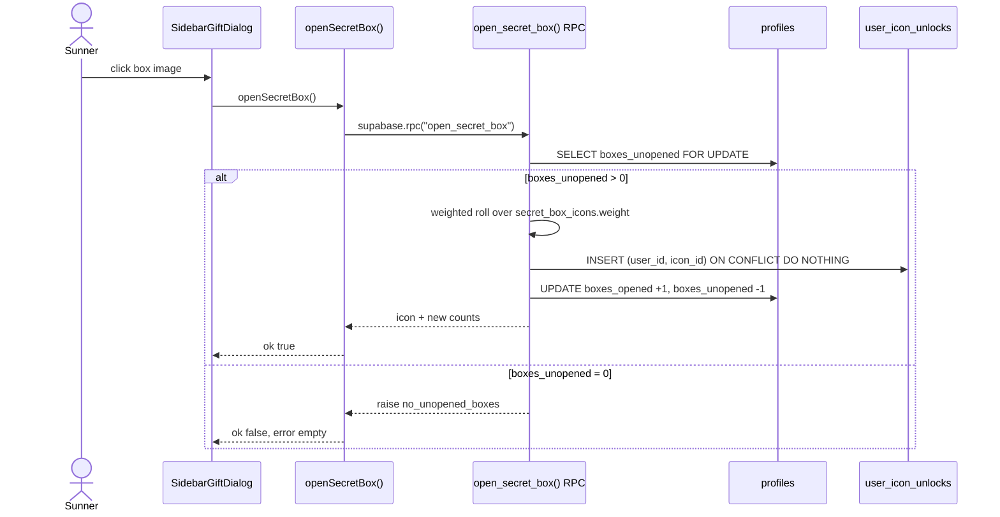
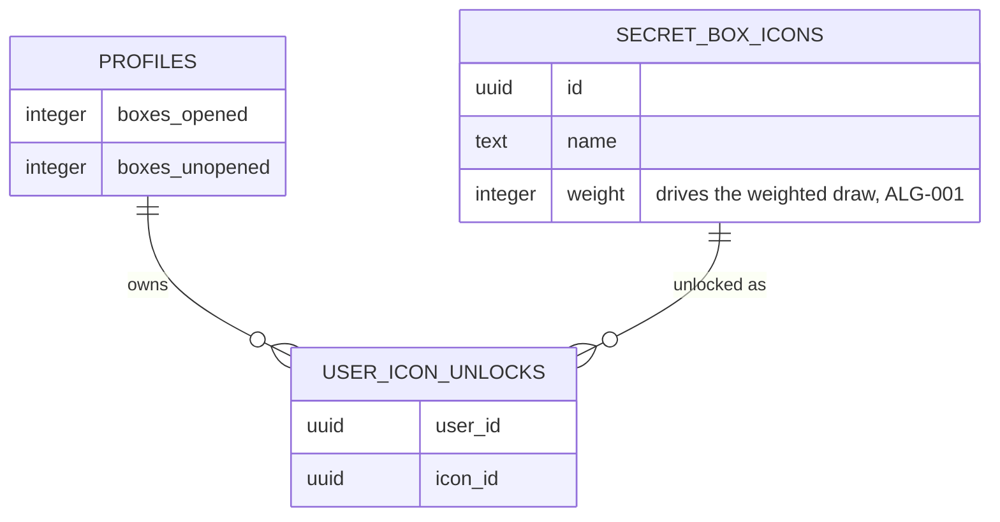

# F006_SecretBoxReveal — Technical Spec

**Priority**: P2
**Type**: mixed
**Generated**: 2026-09-07

**See also:** [`functional-spec.md`](./functional-spec.md) — plain-language overview, open
decisions, requirements/business rules stated in one-liners, screens, user stories, scenarios,
edge cases, and configuration for a BA/QA audience.

**How to read this file:** § 2 is the index — pick the action you care about and read its block
in § 3 straight through; each block is one complete thread, top to bottom. § 4 is the shared
appendix — jump in only when a § 3 block points you there.

## 1. Technical Overview

A signed-in member opens the secret-box dialog from the Kudos Board sidebar and draws one
collectible badge per unopened box. The draw is a parameterless, `security definer` Postgres RPC
(`open_secret_box()`) — row-locked and atomic against a double-click or a race, weighted by
`secret_box_icons.weight`, and idempotent when the roll lands on an icon the member already owns.
Two Server Actions bridge the client: `getSecretBoxStatus()` (read-only re-check) and
`openSecretBox()` (the draw itself). Drawn badge artwork does not exist on disk yet, so the
reveal view always falls back to rendering the badge's name as text.

## 2. Action Index

<!-- Every FR/BR/DEC/SM/US code declared in § 3 or § 4 is claimed by at least one row below (or
     by A0). ALG-001 is tracked via its own § 4.5 "Used in" tag, not this table. -->

| #      | Action (handler)                                           | Method · Path                                                        | Codes                                                                          | Writes                                    | Detail              |
| ------ | ---------------------------------------------------------- | -------------------------------------------------------------------- | ------------------------------------------------------------------------------ | ----------------------------------------- | ------------------- |
| **A0** | _cross-cutting — `open_secret_box()` RPC execute boundary_ | —                                                                    | FR-601                                                                         | — _(function-level grant only, no table)_ | § 4.4               |
| **A1** | `getSecretBoxStatus()`                                     | — _(Server Action, invoked from `SidebarGiftDialog`'s mount effect)_ | FR-101, FR-201, FR-202, BR-004, US021                                          | — _(read-only)_                           | § 3.1               |
| **A2** | `openSecretBox()`                                          | — _(Server Action, invoked from the box-image button)_               | FR-001, FR-203, FR-204, FR-401, BR-001, BR-002, BR-003, BR-004, DEC-001, US022 | `user_icon_unlocks`, `profiles`           | § 3.1 ▸ **diagram** |

## 3. Actions

### 3.1 CAP-01 — Secret Box Draw

#### A1 · Open the secret-box dialog and read authoritative status

`—` → `` `getSecretBoxStatus()` `` (ROUTE006)
`FR-101` `FR-201` `FR-202` `BR-004` `US021` · `SCR006_SunKudosBoard/REG004`

**Who** · Signed-in Sunner (Kudos Board member) _(gate A0 — § 4.4)_
**FE** · `components/kudos-board/sidebar-stats.tsx:64-75` renders the "Open Secret Box" button;
clicking it flips `SidebarStats`' local `dialogOpen` state to `true` (`components/kudos-board/sidebar-stats.tsx:26,66`),
mounting `SidebarGiftDialog`. On mount, `components/kudos-board/sidebar-gift-dialog.tsx:48-56` calls
`getSecretBoxStatus()`; if it resolves to a non-null value, the dialog overwrites its own `count`
state with the server's answer, superseding the `unopenedCount` prop the parent passed in.
**Request** · no params — the read always resolves to the caller's own session (`auth.uid()`)
**BE** · `getSecretBoxStatus()` (`app/sun-kudos/actions/open-secret-box.ts:94-112`) reads the
caller's session via `getUser()`, then selects `boxes_unopened, boxes_opened` from `profiles`
where `id = auth.uid()`
**Rule** · **BR-004 — drawing is blocked once `boxes_unopened` reaches zero.** Hides the "click to
open" instruction paragraph entirely (`hasBoxes = count > 0`, `components/kudos-board/sidebar-gift-dialog.tsx:58,104-109`)
and, via A2, disables the box button — full rule and Source _(§ 4.4)_.
**Result** · No DB write. Re-renders the dialog with the DB-authoritative `count`. If the read
fails (`getSecretBoxStatus()` resolves `null` — e.g. an expired session mid-mount), the dialog
silently keeps showing the `unopenedCount` prop value it was passed; no error is surfaced for this
specific path.
**Source:** `components/kudos-board/sidebar-stats.tsx:64-75` → `components/kudos-board/sidebar-gift-dialog.tsx:40-58` → `app/sun-kudos/actions/open-secret-box.ts:94-112`

<!-- No diagram: below threshold — single read, one table, synchronous, no background step. -->

---

#### A2 · Draw one badge from the secret box

`—` → `` `openSecretBox()` `` (ROUTE005)
`FR-001` `FR-203` `FR-204` `FR-401` `BR-001` `BR-002` `BR-003` `BR-004` `DEC-001` `US022` ·
`SCR006_SunKudosBoard/REG004`

**Who** · Signed-in Sunner, same dialog session as A1 _(gate A0)_
**FE** · `components/kudos-board/sidebar-gift-dialog.tsx:112-130` renders the box image as a real `<button>` (keyboard
reachable), `disabled={!hasBoxes || isPending}` (`:115`). `handleOpenBox` (`:60-74`) no-ops on a
disabled/pending click, clears any prior error, and calls `openSecretBox()` inside a transition.
**Request** · no params — zero-parameter RPC; the acted-on user is always `auth.uid()`, read
server-side, never client-selected (FR-601)
**BE** · `openSecretBox()` (`app/sun-kudos/actions/open-secret-box.ts:47-83`) re-checks the session via `getUser()`, then
calls `supabase.rpc("open_secret_box")` — the `security definer` function `open_secret_box()`
(`supabase/migrations/20260906192500_secret_box_draw.sql:44-124`)
**Rule**

- **BR-001 — each draw's odds are proportional to `secret_box_icons.weight`.** The RPC sums all
  six weights (currently 30/25/20/10/10/5 = 100), rolls a uniform integer in `[1, total]`, then
  walks the catalog by `sort_order`, accumulating weight until the roll falls inside an icon's band
  — the mechanism is `ALG-001` _(§ 4.5)_.
- **BR-002 — the draw is atomic against a double-click or a race.** The caller's own `profiles`
  row is locked `FOR UPDATE` (`:70-73`) before the zero-box check runs, so two overlapping calls
  serialize: the first consumes the box, the second observes `boxes_unopened = 0` under the same
  lock and raises before drawing or writing anything (verified live:
  `e2e/board/secret-box-reveal.spec.ts` — two concurrent draws against 1 remaining box grant
  exactly one badge total).
- **BR-003 — drawing an already-owned icon still consumes the box, without a duplicate unlock
  row.** `INSERT ... ON CONFLICT ON CONSTRAINT user_icon_unlocks_pkey DO NOTHING` (`:107-109`) — the
  same badge is returned to the caller either way; the box is still spent.
- **BR-004 — drawing is refused once `boxes_unopened` reaches zero.** The RPC raises
  `no_unopened_boxes` (`:79-81`) before reading the icon catalog at all — the client-disabled
  button (A1) is a UX convenience only; this exception is the actual enforcement boundary _(§ 4.4)_.

| DEC         | subtype | Condition                                | What the user sees                                                                                                     | Source                                                                                                               |
| ----------- | ------- | ---------------------------------------- | ---------------------------------------------------------------------------------------------------------------------- | -------------------------------------------------------------------------------------------------------------------- |
| **DEC-001** | render  | `Boolean(icon.imageUrl) && !imageFailed` | the drawn badge's ``; once that image 404s (`onError`) or `image_url` was never usable, a name-text badge instead | `components/kudos-board/secret-box-reveal-panel.tsx:28` · `components/kudos-board/secret-box-reveal-panel.tsx:36-53` |

**Result**

- Writes `user_icon_unlocks (user_id, icon_id)` ← the drawn icon, no-op on conflict (BR-003) —
  `supabase/migrations/20260906192500_secret_box_draw.sql:107-109`
- Writes `profiles.boxes_opened` (+1), `profiles.boxes_unopened` (−1) —
  `supabase/migrations/20260906192500_secret_box_draw.sql:111-115`
- On success: dialog switches to the "revealed" view showing `DEC-001`'s chosen badge; the footer
  count is set from the RPC's own returned `boxesUnopened`, never recomputed client-side
  (`app/sun-kudos/actions/open-secret-box.ts:75-82`, `components/kudos-board/sidebar-gift-dialog.tsx:65-69`)
- On `no_unopened_boxes`: count is forced to 0 and the error message renders
  (`components/kudos-board/sidebar-gift-dialog.tsx:71-72`)
- `revalidatePath("/sun-kudos")` (`app/sun-kudos/actions/open-secret-box.ts:75`) also refreshes the sidebar's own
  opened/unopened stat rows on the page's next render
  **Source:** `components/kudos-board/sidebar-gift-dialog.tsx:60-74` → `app/sun-kudos/actions/open-secret-box.ts:47-83` →
  `supabase/migrations/20260906192500_secret_box_draw.sql:44-124`



### 3.2 Edge cases

| Action | Scenario                                                                                        | Behavior                                                                                                                                                                                                                                            |
| ------ | ----------------------------------------------------------------------------------------------- | --------------------------------------------------------------------------------------------------------------------------------------------------------------------------------------------------------------------------------------------------- |
| A2     | Draw attempted with 0 unopened boxes (stale client state, or a race)                            | RPC raises `no_unopened_boxes`; `openSecretBox()` returns `{ok:false, error:"empty"}`; dialog forces `count` to 0 and shows the generic error message                                                                                               |
| A2     | Two overlapping draw requests against a single remaining box                                    | The caller's `profiles` row is locked `FOR UPDATE` before the unopened check; the first request's transaction serializes ahead of the second, which observes `boxes_unopened = 0` under the same lock and raises before drawing or writing anything |
| A2     | Draw resolves to an icon the user already owns                                                  | `ON CONFLICT ... DO NOTHING` on the `user_icon_unlocks` composite PK skips the insert; `boxes_opened`/`boxes_unopened` still update and the same badge is returned                                                                                  |
| A1     | `getSecretBoxStatus()` resolves `null` (session expired mid-mount)                              | The dialog keeps showing the `unopenedCount` prop value it was passed instead of the (missing) authoritative reread                                                                                                                                 |
| A2     | `openSecretBox()`'s own session check fails (session expired between dialog open and the click) | Returns `{ok:false, error:"unauthenticated"}`; the same generic error message renders as the "empty" case — the two failure codes are not distinguished in the UI                                                                                   |
| —      | Drawn badge's `image_url` 404s, or never pointed at real artwork in the first place             | `SecretBoxRevealPanel`'s `onError` swaps to the name-text fallback (`icon.name` in a styled span) — see § 4.2 and `functional-spec.md § 11` for the underlying gap                                                                                  |

## 4. Shared Foundation

### 4.1 Components

| Component                                               | Responsibility                                                                                   | Used in    | File                                                     |
| ------------------------------------------------------- | ------------------------------------------------------------------------------------------------ | ---------- | -------------------------------------------------------- |
| `SidebarStats`                                          | Renders sidebar counters + the "Open Secret Box" trigger button                                  | A1         | `components/kudos-board/sidebar-stats.tsx`               |
| `SidebarGiftDialog`                                     | Two-state modal shell (unopened/revealed); owns `view`/`icon`/`count`/`errorMessage` local state | A1, A2     | `components/kudos-board/sidebar-gift-dialog.tsx`         |
| `SecretBoxRevealPanel`                                  | Renders the drawn badge (image or name-text fallback, `DEC-001`)                                 | A2         | `components/kudos-board/secret-box-reveal-panel.tsx`     |
| `openSecretBox` / `getSecretBoxStatus` (Server Actions) | Session check, RPC call / direct `profiles` read                                                 | A0, A1, A2 | `app/sun-kudos/actions/open-secret-box.ts`               |
| `open_secret_box()` (Postgres function)                 | Weighted draw, atomic counter update, idempotent unlock insert                                   | A0, A2     | `supabase/migrations/20260906192500_secret_box_draw.sql` |

### 4.2 Data Model



| Entity         | Table               | Used for                                                               | Action |
| -------------- | ------------------- | ---------------------------------------------------------------------- | ------ |
| Profile        | `profiles`          | `boxes_opened`/`boxes_unopened` counters this feature reads and writes | A1, A2 |
| SecretBoxIcon  | `secret_box_icons`  | 6-row weighted catalog the draw rolls against                          | A2     |
| UserIconUnlock | `user_icon_unlocks` | one row per (user, icon) owned badge                                   | A2     |

#### Polymorphic Behavior

`secret_box_icons` and `user_icon_unlocks` carry no discriminator fields (`entities.md` — both
confirmed `None`). `profiles` (included above only for its `boxes_opened`/`boxes_unopened`
counters) does carry two catalogued discriminators — `DISC-001` (`hero_badge`) and `DISC-002`
(`language`) — but neither field is read, written, or branched on by any action in this feature;
their full render/validation/persistence behavior belongs to whichever feature owns
`hero_badge`/`language` rendering, not this one. Recorded here only so this section is not
silently incomplete against `entities.md`.

### 4.3 State Management

None. <!-- The dialog's own `view` state ("unopened" | "revealed") is 2 states with exactly 1
     transition (A2's success path) — below the kind:ui threshold of ≥3 states or ≥2 transitions.
     Fully described already by BR-004's gloss (A1) and A2's Result rung; modeling it as a formal
     SM-### would restate the same fact a second way. -->

### 4.4 Shared Rules

#### Bin 3 — cross-cutting, belongs to no single action

**A0 · FR-601 — only an authenticated caller may execute `open_secret_box()`, and it always acts
on that caller alone.** `EXECUTE` is revoked from `public`/`anon` and granted only to
`authenticated` (`supabase/migrations/20260906192500_secret_box_draw.sql:130-131`, live-verified per `permissions-matrix.md`
PERM014); the function takes zero parameters, so `auth.uid()` (read inside the function body, not
passed in) is the only possible target — no client value can select a different user's row.
`getSecretBoxStatus()` enforces the same boundary its own way: an absent session returns `null`
rather than another user's row (`app/sun-kudos/actions/open-secret-box.ts:94-101`).
**Source:** `supabase/migrations/20260906192500_secret_box_draw.sql:44-57,130-131` · `app/sun-kudos/actions/open-secret-box.ts:47-57,94-101`

#### Bin 2 — used by ≥2 named actions

**BR-004 — drawing is refused, and the client UI is disabled, once `boxes_unopened` reaches
zero.**
Used in: **A1** · **A2**. `components/kudos-board/sidebar-gift-dialog.tsx`'s `hasBoxes = count > 0` (`:58`) drives both
halves: it hides the entire "click to open" instruction paragraph (`:104-109`, A1's render) and
disables the box button (`:115`, gating A2's click). Server-side, `open_secret_box()` raises
`no_unopened_boxes` (`supabase/migrations/20260906192500_secret_box_draw.sql:79-81`) at the same threshold — the client disable is a
UX convenience, the RPC exception is the actual enforcement boundary; a tampered client that
enabled the button anyway would still be rejected server-side (verified:
`e2e/board/secret-box-security.spec.ts`).
**Source:** `components/kudos-board/sidebar-gift-dialog.tsx:58,104-109,115` · `supabase/migrations/20260906192500_secret_box_draw.sql:79-81`

### 4.5 Algorithms & Integrations

### Weighted random badge draw (ALG-001)

**Linked FR:** FR-001
**Used in:** A2
**Source:** `supabase/migrations/20260906192500_secret_box_draw.sql:83-99`
**Input:** the six `secret_box_icons` rows (`weight`, `sort_order`) · **Output:** one selected icon
row · **Complexity:** O(n), n=6 (fixed catalog size)
**Description:** Sums all weights (`v_total_weight`); rejects the draw if the sum is ≤0 (empty or
misconfigured catalog, `no_icons_configured`). Rolls a uniform random integer `v_roll` in
`[1, v_total_weight]` (`floor(random() * total) + 1`). Walks the catalog ordered by `sort_order`,
accumulating each row's weight into `v_cumulative`, and selects the first row where
`v_roll <= v_cumulative` — a standard cumulative-weight walk, so each icon's selection probability
equals `weight / total_weight` (currently 30/25/20/10/10/5 out of 100).

**Pseudocode:**

```text
total = sum(icon.weight for icon in catalog)
if total <= 0: raise no_icons_configured
roll = floor(random() * total) + 1
cumulative = 0
for icon in catalog.order_by(sort_order):
    cumulative += icon.weight
    if roll <= cumulative:
        return icon
```

None. <!-- No INT-### — the only external call this feature makes is BE-to-DB (the RPC itself),
     which is already the BE/Result rungs' own territory, not an api-call/event-publish/webhook/
     queue-job/notification integration. -->

### 4.6 Configuration

`N/A — no technical configuration beyond framework defaults.`

**Client behavior:** see
[`behavior-logic.md`](../../generated/behavior-logic.md) (client-side patterns — debounce,
optimistic UI, polling, upload, realtime),
[`permissions.md`](../../system/permissions.md) (feature flags / experiments / env / locale
gates),
[`architecture.md`](../../system/architecture.md) (guards / deep-link state restoration /
unsaved-changes protection).

## 5. Verification & Technical Notes

### 5.1 Technical Verification

- **SC-001** _(A1)_ opening the dialog always shows the DB's own `boxes_unopened` value within one
  render, even when the parent's prop is stale (covers FR-202)
- **SC-002** _(A2)_ exactly one badge is drawn and `user_icon_unlocks` gains at most one new row
  per available box, even under two concurrent draw requests (covers FR-401, BR-002)
- **SC-003** _(A2)_ drawing at `boxes_unopened = 0` never inserts into `user_icon_unlocks` and
  never decrements either counter (covers BR-004)
- **SC-004** _(A2)_ a broken or missing badge image always falls back to the name-text badge,
  never a broken `` (covers FR-204, DEC-001)
- **SC-005** _(A0)_ an unauthenticated caller cannot execute `open_secret_box()` at all (covers
  FR-601)

#### US021_OpenSecretBoxDialog _(A1)_

**Independent Test:** As a signed-in member with 2 unopened boxes, open the dialog and confirm it
shows "02" — sourced from a direct `getSecretBoxStatus()` read, not the prop passed in.

**Acceptance Scenarios:**

1. **Given** 2 unopened boxes, **When** the member clicks "Open Secret Box", **Then** the dialog
   opens on the "unopened" view showing count 02.
2. **Given** `getSecretBoxStatus()` resolves `null` (expired session mid-mount), **When** the
   dialog mounts, **Then** it keeps showing the `unopenedCount` prop it was passed, without
   crashing.

#### US022_DrawFromSecretBox _(A2)_

**Independent Test:** As a signed-in member with 1 unopened box, click the box image and confirm
(via a direct DB query) that `user_icon_unlocks` gained a row, `boxes_opened` incremented by 1, and
`boxes_unopened` dropped to 0.

**Acceptance Scenarios:**

1. **Given** 1 unopened box, **When** the member clicks the box image, **Then** a badge is drawn
   and shown, and the unopened count drops to 0.
2. **Given** 0 unopened boxes, **When** the member clicks the (disabled) box image, or two
   concurrent requests race against the same last box, **Then** exactly one badge is drawn in
   total and the loser sees the "no boxes left" error, with no crash.

### 5.2 Assumptions

- _(A2)_ The current weight distribution (30/25/20/10/10/5, summing to 100) is assumed to be the
  final, intended reward-tier balance — confirmed only as "what the migration seeds today", not
  against any separate game-design document.
- _(A1)_ The dialog's `unopenedCount` prop (sourced from the page-level `getSidebarOverview()`
  read, owned by F002, outside this feature's own actions) is assumed superseded within one render
  cycle by A1's own read in the common case; a stale prop is only user-visible in the
  already-documented session-expiry edge case.

### 5.3 Unresolved Questions

1. **How a member's `boxes_unopened` is ever increased** _(A2)_: an exhaustive grep across
   `app/`, `components/`, `supabase/migrations/` finds no INSERT/UPDATE of
   `profiles.boxes_unopened` other than one-time seed data and `open_secret_box()`'s own
   decrement — no in-app grant mechanism exists yet. Whether this is a planned future feature or
   an intentional seed-only demo state is not confirmed from code.
2. **Lock contention with other `profiles` writers** _(A2)_: whether `open_secret_box()`'s
   `FOR UPDATE` lock on the caller's `profiles` row could contend with an unrelated concurrent
   write to the same row (e.g. a future profile-edit action) is not confirmed against any
   concurrent-load test.

### 5.4 Source References

| Action | Order | Symbol                                                | Path                                                           | Purpose                                                               |
| ------ | ----- | ----------------------------------------------------- | -------------------------------------------------------------- | --------------------------------------------------------------------- |
| —      | 1     | `secret_box_icons` / `user_icon_unlocks` / `profiles` | `supabase/migrations/20260906192500_secret_box_draw.sql:1-131` | The catalog, unlock ledger, and counters this feature revolves around |
| A1, A2 | 2     | `SidebarStats`                                        | `components/kudos-board/sidebar-stats.tsx:1-78`                | Sidebar counters + dialog trigger                                     |
| A1, A2 | 3     | `SidebarGiftDialog`                                   | `components/kudos-board/sidebar-gift-dialog.tsx:1-154`         | Two-state dialog shell, both actions' FE home                         |
| A2     | 4     | `SecretBoxRevealPanel`                                | `components/kudos-board/secret-box-reveal-panel.tsx:1-57`      | Badge render, `DEC-001`'s image/name-fallback branch                  |
| A1, A2 | 5     | `openSecretBox` / `getSecretBoxStatus`                | `app/sun-kudos/actions/open-secret-box.ts:1-112`               | Server Actions bridging the client to the RPC/table read              |

#### Data Flow

```text
Click box image (A2) -> openSecretBox() -> getUser() -> supabase.rpc("open_secret_box") ->
[FOR UPDATE lock profiles] -> weighted roll over secret_box_icons -> INSERT user_icon_unlocks
(ON CONFLICT DO NOTHING) -> UPDATE profiles boxes_opened/boxes_unopened -> RPC row returned ->
dialog switches to "revealed" view, footer count set from the RPC's own returned value
```

### 5.5 Artifact References

| Artifact           | File                                                           | Codes Used                   | Reviewed |
| ------------------ | -------------------------------------------------------------- | ---------------------------- | -------- |
| System Overview    | [overview.md](../../system/overview.md)                        | —                            | [x]      |
| Architecture       | [architecture.md](../../system/architecture.md)                | —                            | [x]      |
| Feature List       | [feature-list.md](../../generated/feature-list.md)             | F006                         | [x]      |
| API Map            | [api-map.md](../../generated/api-map.md)                       | ROUTE005, ROUTE006           | [ ]      |
| Entities           | [entities.md](../../generated/entities.md)                     | MODEL001, MODEL006, MODEL007 | [ ]      |
| Screens            | [functional-spec.md § 6](./functional-spec.md#6-screens)       | SCR006/REG004                | [ ]      |
| Behavior Logic     | [behavior-logic.md](../../generated/behavior-logic.md)         | —                            | [ ]      |
| Permissions Matrix | [permissions-matrix.md](../../generated/permissions-matrix.md) | PERM009, PERM010, PERM014    | [ ]      |
| User Stories       | [user-stories.md](../../generated/user-stories.md)             | US021, US022                 | [ ]      |

**Note:** the API Map and Behavior Logic rows carry no codes for this feature — `open_secret_box()`
fits no canonical Behavior Logic type (see `behavior-logic.md`'s own `open_secret_box()`
classification decision) and `api-map.md` has no code scheme of its own (`ROUTE###` bridges to
`route-list.md` instead, cited above).
