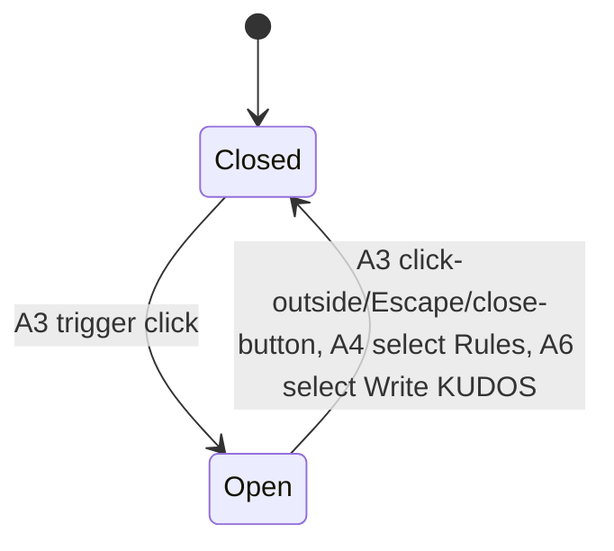

<!-- layout-exempt: rebuild-spec owns all docs/system|features|generated|flows paths -->
<!-- Contract: references/feature-spec-researcher-contract.md -->

# F007_HomepageOverview — Technical Spec

**Priority**: P1
**Type**: ui
**Generated**: 2026-09-07

**See also:** [`functional-spec.md`](./functional-spec.md) — plain-language overview, open
decisions, requirements/business rules stated in one-liners, screens, user stories, scenarios,
edge cases, and configuration for a BA/QA audience.

**How to read this file:** § 2 is the index — pick the action you care about and read its block
in § 3 straight through; each block is one complete thread, top to bottom. § 4 is the shared
appendix — jump in only when a § 3 block points you there.

## 1. Technical Overview

`/about` (`app/about/page.tsx`) is a client-composed, entirely static page: no Server Component
data fetch, no route handler, no Server Action, and no database table read or written anywhere in
this feature. Every signed-in member reaching this URL sees the same hero/award/kudos/rules
content, sourced from component literals and i18n copy. The only genuinely dynamic pieces are two
small client-state machines: a once-per-minute countdown tick (`HeroInfoBlock`) and a floating
widget that toggles between its own trigger, a Rules drawer, and a hand-off into the (externally
owned) Kudo Composer.

## 2. Action Index

| #      | Action (handler)                                  | Method · Path               | Codes                                         | Writes                  | Detail |
| ------ | ------------------------------------------------- | --------------------------- | --------------------------------------------- | ----------------------- | ------ |
| **A0** | _cross-cutting — belongs to no single action_     | —                           | FR-001                                        | —                       | § 4.4  |
| **A1** | `HomePage` (default export, `app/about/page.tsx`) | — _(page render)_           | FR-101, FR-201, FR-203, FR-204, BR-002, US005 | — _(read-only)_         | § 3.1  |
| **A2** | `HeroInfoBlock`                                   | — _(client ticking widget)_ | FR-202, BR-001, ALG-001, US005                | — _(client-state only)_ | § 3.1  |
| **A3** | `WidgetButton` (trigger/close paths)              | — _(client toggle)_         | FR-205, FR-401, SM-001                        | —                       | § 3.1  |
| **A4** | `WidgetButton` (Rules pill)                       | — _(client interaction)_    | FR-402, DEC-001, SM-001, US009                | —                       | § 3.1  |
| **A5** | `SaaRulesDrawer` (backdrop / Esc / close button)  | — _(client interaction)_    | FR-402, US009                                 | —                       | § 3.1  |
| **A6** | `WidgetButton` (Write KUDOS pill)                 | — _(client interaction)_    | FR-403, DEC-002, SM-001                       | —                       | § 3.1  |
| **A7** | `WidgetButton#handleWriteKudos`                   | — _(client interaction)_    | FR-403, DEC-003, US009                        | —                       | § 3.1  |

**Rung set** — see `references/feature-spec-researcher-contract.md` § "The rung set". This feature
has zero DB writes anywhere, so no action's **Result** rung ever reports a table write.

## 3. Actions

### 3.1 CAP-01 — View the SAA 2025 homepage overview and its SAA Rules widget

#### A1 · Render the homepage overview

`—` → `` `HomePage` `` (default export)
`FR-101` `FR-201` `FR-203` `FR-204` `BR-002` `US005` · `SCR004_AboutHomepage`

**Who** · Signed-in Sun\* member _(gate A0 — § 4.4)_
**FE** · `app/about/page.tsx:31-53` composes `SiteHeader` → `HeroSection` (hero, includes A2) →
`AwardSection`/`AwardCard` (static 6-card grid) → `SunkudosSection` (static promo) → `SiteFooter` →
`WidgetButton` (§ 3.1 A3-A7). No loading/empty state exists because nothing is fetched.
**Request** · none — pure Server/Client Component render, no query params consumed.
**Rule** · **BR-002 — the award teaser grid and Sun\* Kudos promo banner render only
static/mock content extracted from Figma.** `AwardSection` (`components/homepage/award-section.tsx:14-124`)
hardcodes both `AWARDS_ROW_1`/`AWARDS_ROW_2` arrays (image paths, only title/description resolve
via i18n); `SunkudosSection` (`components/homepage/sunkudos-section.tsx:14-71`) is a single static
image + copy block with one `next/link` to `/sun-kudos`. Zero database reads back this screen.
**Result** · read-only — **no DB write**. `HeroCta` (`components/homepage/hero-cta.tsx:14-29`) and
each `AwardCard` (`components/homepage/award-card.tsx:46-49`) link out via plain `<a href>` (full
page reload), unlike `SunkudosSection`'s `next/link` (`sunkudos-section.tsx:54`) and the shared
`NavLinks`/`SiteFooter` (both `next/link`) — see RISK-01 in functional-spec.md § 11.
**Source:** `app/about/page.tsx:31-53` → `components/homepage/award-section.tsx:14-124` →
`components/homepage/award-card.tsx:29-82` → `components/homepage/sunkudos-section.tsx:14-71`

<!-- No diagram: below threshold — zero DB writes, no background/async step; the composition is
     a single synchronous render with no branching worth a sequenceDiagram. -->

---

#### A2 · Tick the decorative ceremony countdown

`—` → `` `HeroInfoBlock` ``
`FR-202` `BR-001` `ALG-001` `US005` · `SCR004_AboutHomepage`

**Who** · Signed-in Sun\* member _(gate A0)_
**FE** · `components/homepage/hero-info-block.tsx:119-188` renders the DAYS/HOURS/MINUTES digit
tiles plus a "coming soon" banner (shown while `showComingSoon` is true, hidden once the target
passes — a single boolean toggle, not a DEC-worthy branch).
**Request** · none — reads only the local system clock via `Date.now()`.
**Rule** · **BR-001 — the hero countdown ticks toward a hardcoded ceremony date, independent of
the site-launch gate.** `EVENT_DATE = new Date("2026-12-26T18:30:00+07:00")`
(`hero-info-block.tsx:11`) is a literal, unrelated to `NEXT_PUBLIC_LAUNCH_AT` (`.env.example:20` =
`2026-12-31T18:00:00+07:00`, read by `lib/countdown-config.ts:17` and driving `/countdown` +
`isBeforeLaunch()`) or to `event_settings.launch_at` (DB column, unread by any app code, per
`data-model.md` MODEL009). These are 3 independent values, currently **5 days apart** between the
homepage's ceremony date and `/countdown`'s launch date — see functional-spec.md § 3 D001 (open
decision, not resolved by this pass).
**Result** · no DB write, no navigation. `ALG-001` (§ 4.5) recomputes `{days, hours, minutes}` once
per minute via a shared `useSyncExternalStore` store; once `EVENT_DATE` has passed, all digits
freeze at `00` and `showComingSoon` flips to `false` — no redirect, unlike `/countdown`'s own
`CountdownTimer` (`components/countdown/countdown-timer.tsx:47-50`), which auto-navigates on
expiry.
**Source:** `components/homepage/hero-info-block.tsx:11,49-107,119-188`
**Shared structure:** `ALG-001` — derives the DAYS/HOURS/MINUTES remaining until `EVENT_DATE`,
padded to 2 digits, full detail _(§ 4.5)_

<!-- No diagram: below threshold — a single client-side interval reading a local clock, no I/O,
     no background/queue step, and no ≥2-table write. -->

---

#### A3 · Expand / collapse the floating widget

`—` → `` `WidgetButton` `` (trigger button + `useClickOutside`)
`FR-205` `FR-401` `SM-001` · `SCR004_AboutHomepage`

**Who** · Signed-in Sun\* member _(gate A0)_
**FE** · Closed state renders one gold pill trigger (`components/homepage/widget-button.tsx:117-140`); clicking it sets
`isOpen = true`, revealing 2 labelled action pills + a round close button
(`components/homepage/widget-button.tsx:70-113`). `useClickOutside` (`hooks/use-click-outside.ts:10-33`) is attached
only while `isOpen` — it collapses the widget on an outside `pointerdown` **or** the `Escape` key
(both wired inside the same hook, `use-click-outside.ts:14-24`).
**Rule** · **FR-205/FR-401 — the widget is the entry point to both the SAA Rules drawer (A4) and
the Kudo Composer hand-off (A6).** No branching beyond the open/closed toggle itself.
**Result** · client state only — **no DB write**. Toggles `isOpen`; when expanded, shows the
"Rules" and "Write KUDOS" pills plus a red round close button.
**State** · `SM-001`: `Closed` → `Open` _(§ 4.3)_
**Source:** `components/homepage/widget-button.tsx:50-70,102-140` → `hooks/use-click-outside.ts:10-33`

<!-- No diagram: below threshold — a single boolean toggle with no DB write and no background
     step; a sequence diagram would not clarify anything a plain toggle doesn't already say. -->

---

#### A4 · Select "Rules" — open the SAA Rules drawer

`—` → `` `WidgetButton` `` (Rules pill)
`FR-402` `DEC-001` `SM-001` `US009` · `SCR004_AboutHomepage`

**Who** · Signed-in Sun\* member _(gate A0)_
**FE** · `components/homepage/widget-button.tsx:73-85` — visible only while the widget is expanded (A3) _(§ 3.1)_.
Clicking it sets `isOpen = false` and `rulesOpen = true` in the same handler.
**Rule** · decides whether the SAA Rules drawer becomes visible:

| DEC         | subtype     | Condition                                                 | What the user sees                                                            | Source                                        |
| ----------- | ----------- | --------------------------------------------------------- | ----------------------------------------------------------------------------- | --------------------------------------------- |
| **DEC-001** | interaction | user clicks the "Rules" pill while the widget is expanded | `SaaRulesDrawer` slides in from the right; the widget's action pills collapse | `components/homepage/widget-button.tsx:73-85` |

**Result** · client state only — **no DB write**. `SaaRulesDrawer` (§ 4.1) renders its static
content (4 hero-tier badges, 6 collectible icons, national-kudos copy — see BR-002's sibling note
in A1; this content is likewise static, no fetch).
**State** · `SM-001`: `Open` → `Closed` _(§ 4.3)_
**Source:** `components/homepage/widget-button.tsx:73-85` → `components/homepage/saa-rules-drawer.tsx:56-161`

<!-- No diagram: below threshold — a single client interaction revealing a static panel, no DB
     write, no background step. -->

---

#### A5 · Close the SAA Rules drawer

`—` → `` `SaaRulesDrawer` `` (backdrop click / Escape / close button)
`FR-402` `US009` · `SCR004_AboutHomepage`

**Who** · Signed-in Sun\* member _(gate A0)_
**FE** · Three independent close paths, all calling the same `onClose` prop: backdrop click
(`components/homepage/saa-rules-drawer.tsx:77-80`), `Escape` keydown (own `useEffect` listener,
`components/homepage/saa-rules-drawer.tsx:60-72` — separate from `WidgetButton`'s own Escape handling in A3, since
this listener is attached directly by the drawer, not via `useClickOutside`), and its own footer
close button (`components/homepage/saa-rules-drawer.tsx:141-148`).
**Rule** · no branching — any of the 3 paths produces the same outcome.
**Result** · client state only — **no DB write**. `rulesOpen` flips to `false`; the drawer slides
out (`translate-x-full`, `components/homepage/saa-rules-drawer.tsx:87-89`); `document.body.style.overflow` is restored
to its prior value (`components/homepage/saa-rules-drawer.tsx:66,70`).
**Source:** `components/homepage/saa-rules-drawer.tsx:60-72,77-80,141-148`

<!-- No diagram: below threshold — 3 equivalent close paths converging on one boolean flip, no
     DB write, no background step. -->

---

#### A6 · Select "Write KUDOS" from the widget

`—` → `` `WidgetButton` `` (Write KUDOS pill)
`FR-403` `DEC-002` `SM-001` · `SCR004_AboutHomepage`

**Who** · Signed-in Sun\* member _(gate A0)_
**FE** · `components/homepage/widget-button.tsx:88-100` — visible only while the widget is expanded (A3). Clicking it
sets `isOpen = false` and `kudosOpen = true` in the same handler.
**Rule** · decides whether the Kudo Composer becomes visible:

| DEC         | subtype     | Condition                                                       | What the user sees                                                                                                              | Source                                         |
| ----------- | ----------- | --------------------------------------------------------------- | ------------------------------------------------------------------------------------------------------------------------------- | ---------------------------------------------- |
| **DEC-002** | interaction | user clicks the "Write KUDOS" pill while the widget is expanded | `KudosFormModal` opens (component owned by F003 — see functional-spec.md § 12 Dependencies); the widget's action pills collapse | `components/homepage/widget-button.tsx:88-100` |

**Result** · client state only — **no DB write** in this feature (`KudosFormModal`'s own submit is
F003's ROUTE002, out of scope here). See RISK-02 (functional-spec.md § 11): `rulesOpen` is never
forced false here, so if the drawer was already open when the widget is reopened and this pill is
clicked, both panels can end up visible at once.
**State** · `SM-001`: `Open` → `Closed` _(§ 4.3)_
**Source:** `components/homepage/widget-button.tsx:88-100,146`

<!-- No diagram: below threshold — a single client interaction, no DB write, no background step. -->

---

#### A7 · Hand off from the Rules drawer to the Kudo Composer

`—` → `` `WidgetButton#handleWriteKudos` ``
`FR-403` `DEC-003` `US009` · `SCR004_AboutHomepage`

**Who** · Signed-in Sun\* member _(gate A0)_
**FE** · The Rules drawer's own sticky footer "Write KUDOS" button
(`components/homepage/saa-rules-drawer.tsx:149-156`) calls the `onWriteKudos` prop, wired in `WidgetButton` to
`handleWriteKudos` (`components/homepage/widget-button.tsx:57-61,144`).
**Rule** · decides the drawer→composer hand-off:

| DEC         | subtype     | Condition                                                           | What the user sees                                                 | Source                                        |
| ----------- | ----------- | ------------------------------------------------------------------- | ------------------------------------------------------------------ | --------------------------------------------- |
| **DEC-003** | interaction | user clicks "Write KUDOS" inside the open SAA Rules drawer's footer | the Rules drawer closes and `KudosFormModal` opens (owned by F003) | `components/homepage/widget-button.tsx:57-61` |

**Result** · client state only — **no DB write**. `rulesOpen` flips to `false`, `kudosOpen` flips
to `true`, in the same handler — an explicit, deliberate hand-off (unlike A6's independent path,
this one DOES clear `rulesOpen`, so the drawer never stays open after this specific action).
**Source:** `components/homepage/widget-button.tsx:57-61` → `components/homepage/saa-rules-drawer.tsx:149-156`

<!-- No diagram: below threshold — a single 2-field state hand-off, no DB write, no background
     step. -->

### 3.2 Edge cases

| Action       | Scenario                                                                        | Behavior                                                                                                                                                                                               |
| ------------ | ------------------------------------------------------------------------------- | ------------------------------------------------------------------------------------------------------------------------------------------------------------------------------------------------------ |
| A2           | `EVENT_DATE` passes while the member is still on `/about`                       | Digits freeze at `00`, `showComingSoon` flips false; no redirect, no reload — contrast with `/countdown`'s `CountdownTimer`, which does auto-navigate on its own expiry                                |
| A4 · A6      | Widget reopened and a second pill selected while the Rules drawer is still open | `rulesOpen` and `kudosOpen` can both be `true` simultaneously — no mutual-exclusion guard exists between them (RISK-02)                                                                                |
| A1           | Member clicks a Hero CTA button or an Award Card link                           | Native `<a href>` triggers a full page reload rather than a client-side transition, unlike every `next/link` elsewhere on this screen (RISK-01)                                                        |
| A2 · A3 · A4 | JavaScript fails to load or is disabled                                         | The countdown never ticks past its zeroed server snapshot and the widget/drawer never become interactive — the static markup (hero, award grid, kudos promo) still renders since it needs no client JS |

## 4. Shared Foundation

### 4.1 Components

| Component                                     | Responsibility                                                                      | Used in        | File                                                                                                          |
| --------------------------------------------- | ----------------------------------------------------------------------------------- | -------------- | ------------------------------------------------------------------------------------------------------------- |
| `HomePage` (default export)                   | Composes the whole `/about` screen                                                  | A1             | `app/about/page.tsx`                                                                                          |
| `HeroSection`                                 | Hero key visual; composes `HeroInfoBlock`/`HeroCta`/`HeroContent`                   | A1, A2         | `components/homepage/hero-section.tsx`                                                                        |
| `HeroInfoBlock`                               | Ticks the decorative ceremony countdown (ALG-001)                                   | A2             | `components/homepage/hero-info-block.tsx`                                                                     |
| `HeroCta`                                     | Renders the 2 hero CTA links (native `<a>`, full reload — RISK-01)                  | A1             | `components/homepage/hero-cta.tsx`                                                                            |
| `AwardSection` / `AwardCard`                  | Renders the static 6-card award teaser grid                                         | A1             | `components/homepage/award-section.tsx`, `award-card.tsx`                                                     |
| `SunkudosSection`                             | Renders the static kudos promo banner                                               | A1             | `components/homepage/sunkudos-section.tsx`                                                                    |
| `WidgetButton`                                | Floating action button; owns `isOpen`/`rulesOpen`/`kudosOpen` client state (SM-001) | A3, A4, A6, A7 | `components/homepage/widget-button.tsx`                                                                       |
| `SaaRulesDrawer`                              | Renders the static SAA rules content; owns its own Esc/backdrop close               | A4, A5, A7     | `components/homepage/saa-rules-drawer.tsx`                                                                    |
| `SiteHeader` / `SiteFooter` / `NavLinks`      | Shared chrome — nav links routing to/from the homepage                              | A1             | `components/homepage/site-header.tsx`, `components/common/site-footer.tsx`, `components/common/nav-links.tsx` |
| `KudosFormModal` _(external — owned by F003)_ | Rendered here only as the target of DEC-002/DEC-003's hand-off                      | A6, A7         | `components/kudos/kudos-form-modal.tsx`                                                                       |

### 4.2 Data Model

This feature reads **zero** database tables. Every visual element (hero, award grid, kudos promo,
SAA rules drawer content) is static/mock content sourced from component literals and i18n copy
(BR-002). No `erDiagram` is drawn since there are no entities to relate.

| Entity | Table | Used for                                                    | Action |
| ------ | ----- | ----------------------------------------------------------- | ------ |
| —      | —     | N/A — no database entity is read or written by this feature | —      |

#### Polymorphic Behavior

N/A — no discriminator fields in Key Entities.

### 4.3 State Management

### The floating widget's expand/collapse state (SM-001)

**kind:** ui
**Linked FR:** FR-401
**Source:** `components/homepage/widget-button.tsx:50-70`



**Action transitions:** the guard and side effect for each edge live in the **Result** rung of the
action named on that edge (A3, A4, A6 — § 3.1), not repeated here.

_(`rulesOpen`/`kudosOpen` are each a plain 2-state boolean below the `kind: ui` threshold on their
own — documented instead as inline facts in A4/A5/A6/A7's own rungs, per the three-bin/self-
sufficiency rules; modeling them as separate state machines would also misrepresent them as
mutually exclusive, which RISK-02 shows they are not.)_

### 4.4 Shared Rules

#### Bin 3 — cross-cutting, belongs to no single action

**A0 · FR-001 — every `/about` request requires an active Supabase session.**
Enforced globally by `lib/supabase/proxy.ts`'s blanket guard (PERM001, owned by F001) — **not a
rule this feature defines itself**; recorded here only because it gates this whole screen.
**Source:** `lib/supabase/proxy.ts` (see `docs/generated/permissions-matrix.md` § PERM001)

#### Bin 2 — used by ≥2 named actions

None — no shared rule in this feature is used by 2 or more named actions; every Business Rule
found (BR-001, BR-002) is owned by exactly one action and lives inline in that action's Rule rung
in § 3.

### 4.5 Algorithms & Integrations

None — no external integration (API call, event publish, webhook, queue job, notification) exists
in this feature.

### {Decorative ceremony countdown} (ALG-001)

**Linked FR:** FR-202
**Used in:** A2
**Source:** `components/homepage/hero-info-block.tsx:49-107`
**Input:** current wall-clock time (`Date.now()`, no params) · **Output:**
`{countdown: [{label, value}], showComingSoon}` · **Complexity:** O(1)
**Description:** Computes DAYS/HOURS/MINUTES remaining until the hardcoded `EVENT_DATE`
(`hero-info-block.tsx:11`). Once the difference is `<= 0`, returns the zeroed countdown with
`showComingSoon: false` (the terminal state — never reverses). A module-level store
(`hero-info-block.tsx:74-99`) recomputes and notifies subscribers once every 60 seconds via a
single shared `setInterval`, regardless of how many `HeroInfoBlock` instances are mounted; the
first subscriber triggers an immediate recompute rather than waiting up to 60s. Server render and
first client render both use a fixed zeroed snapshot (`getServerSnapshot`) to avoid a hydration
mismatch — the real time is read only after mount.

**Pseudocode:**

```text
function computeState():
  diffMs = EVENT_DATE - now()
  if diffMs <= 0:
    return { countdown: ZERO, showComingSoon: false }
  totalMinutes = floor(diffMs / 60000)
  days    = floor(totalMinutes / 1440)
  hours   = floor((totalMinutes % 1440) / 60)
  minutes = totalMinutes % 60
  return { countdown: [pad2(days), pad2(hours), pad2(minutes)], showComingSoon: true }
```

### 4.6 Configuration

```text
N/A — no technical configuration beyond framework defaults. The hero's ceremony countdown target
(EVENT_DATE, hero-info-block.tsx:11) is a hardcoded literal, not read from any env var — see
BR-001 and functional-spec.md § 3 D001.
```

**Client behavior:** see
[`behavior-logic.md`](../../generated/behavior-logic.md) (client-side patterns — debounce, optimistic UI, polling, upload, realtime),
[`permissions.md`](../../system/permissions.md) (feature flags / experiments / env / locale gates),
[`screen-flow.md`](../../generated/screen-flow.md) (guards / deep-link state restoration / unsaved-changes protection).

## 5. Verification & Technical Notes

### 5.1 Technical Verification

- **SC-001** _(A1)_ the homepage renders the hero, award grid (6 cards), kudos promo, and floating
  widget with zero network requests beyond static assets/i18n bundles (covers FR-201, FR-203,
  FR-204, BR-002)
- **SC-002** _(A2)_ the countdown digits recompute at least once per 60s tick and freeze at `00`
  once `EVENT_DATE` passes, without any page navigation (covers FR-202, BR-001)
- **SC-003** _(A3, A4, A6, A7)_ the widget's pills, the drawer's 3 close paths, and its Write-KUDOS
  hand-off each produce the documented DEC-001/DEC-002/DEC-003 render change (covers FR-401,
  FR-402, FR-403)

#### US005_ViewHomepage _(A1, A2)_

**Independent Test:** Load `/about` directly while already authenticated and confirm the
hero/award/kudos sections all render without navigating from another page first.

**Acceptance Scenarios:**

1. **Given** an authenticated session on `/award-info`, **When** the member clicks "About SAA
   2025" in the header, **Then** the browser routes to `/about` and the nav item highlights
   active.
2. **Given** an authenticated session, **When** the `/countdown` timer reaches zero, **Then** the
   app auto-navigates to `/about` (that redirect is owned by `CountdownTimer`, outside this
   feature — see Edge cases A2 note above for the contrast with this feature's own non-redirecting
   countdown).

#### US009_ViewSaaRules _(A3, A4, A5, A7)_

**Independent Test:** Open `/about`, click the floating widget's trigger, then "Rules", and
confirm the drawer renders static content with no network request.

**Acceptance Scenarios:**

1. **Given** the widget is closed, **When** the member clicks the trigger then "Rules", **Then**
   the SAA Rules drawer slides in showing 4 hero-tier badges, 6 collectibles, and national-kudos
   copy (DEC-001).
2. **Given** the drawer is open, **When** the member presses Escape, clicks the backdrop, or
   clicks the close button, **Then** the drawer slides out and no navigation occurs.

### 5.2 Assumptions

- _(A2)_ The hero's ceremony countdown is assumed to be intentionally independent from
  `NEXT_PUBLIC_LAUNCH_AT`/`event_settings.launch_at` (a ceremony date vs. a site-launch date being
  genuinely different real-world events) — not confirmed with product; see functional-spec.md § 3
  D001.
- _(A1)_ Assumes every award/kudos-promo asset path referenced in `award-section.tsx`/
  `sunkudos-section.tsx` (e.g. `/homepage-saa/Award_BG.png`) resolves under `public/` at build
  time — this pass did not verify every asset file exists on disk.
- _(A3, A4, A6)_ Assumes `useClickOutside`'s `pointerdown` listener
  (`hooks/use-click-outside.ts:14-18`) reliably fires on touch devices across every supported
  mobile browser — not verified via device testing this pass.

### 5.3 Unresolved Questions

1. **Asset existence** _(A1)_: Not confirmed in this pass whether every referenced
   `/homepage-saa/*.png` and `/rules/*.png` asset actually exists under `public/` — a missing file
   would 404 silently in `next/image`, with no fallback UI coded.
2. **Mobile FAB positioning** _(A3)_: `components/homepage/widget-button.tsx:45-48`'s own comment notes the Figma
   anchor (`top: 830px; right: 19px`) was reinterpreted as viewport-fixed bottom-right; not
   confirmed against every breakpoint whether this collides with any other fixed element.

### 5.4 Source References

| Action     | Order | Symbol                       | Path                                                                 | Purpose                                                                        |
| ---------- | ----- | ---------------------------- | -------------------------------------------------------------------- | ------------------------------------------------------------------------------ |
| —          | 1     | `HomePage`                   | `app/about/page.tsx:1-53`                                            | Composition root — entry point for the whole screen                            |
| A1         | 2     | `AwardSection` / `AwardCard` | `components/homepage/award-section.tsx:1-124`, `award-card.tsx:1-82` | Static award teaser grid (BR-002)                                              |
| A1         | 3     | `SunkudosSection`            | `components/homepage/sunkudos-section.tsx:1-71`                      | Static kudos promo banner (BR-002)                                             |
| A2         | 4     | `HeroInfoBlock`              | `components/homepage/hero-info-block.tsx:1-188`                      | Decorative ceremony countdown (BR-001, ALG-001)                                |
| A3, A4, A6 | 5     | `WidgetButton`               | `components/homepage/widget-button.tsx:1-149`                        | Floating widget — FAB, Rules pill, Write KUDOS pill (SM-001, DEC-001, DEC-002) |
| A5, A7     | 6     | `SaaRulesDrawer`             | `components/homepage/saa-rules-drawer.tsx:1-161`                     | Rules drawer content, 3 close paths, write-kudos hand-off (DEC-003)            |

#### Data Flow

```text
{FAB trigger click} -> {WidgetButton: isOpen=true} -> {select "Rules": isOpen=false, rulesOpen=true}
  -> {SaaRulesDrawer renders static content} -> {footer "Write KUDOS" click}
  -> {handleWriteKudos: rulesOpen=false, kudosOpen=true} -> {KudosFormModal renders (owned by F003)}
```

### 5.5 Artifact References

| Artifact           | File                                                           | Codes Used   | Reviewed |
| ------------------ | -------------------------------------------------------------- | ------------ | -------- |
| System Overview    | [overview.md](../../system/overview.md)                        | —            | [x]      |
| Feature List       | [feature-list.md](../../generated/feature-list.md)             | F007         | [x]      |
| API Map            | [api-map.md](../../generated/api-map.md)                       | —            | [x]      |
| Entities           | [entities.md](../../generated/entities.md)                     | —            | [x]      |
| Screens            | [functional-spec.md § 6](./functional-spec.md#6-screens)       | SCR004       | [x]      |
| Behavior Logic     | [behavior-logic.md](../../generated/behavior-logic.md)         | —            | [x]      |
| Permissions Matrix | [permissions-matrix.md](../../generated/permissions-matrix.md) | PERM001      | [x]      |
| User Stories       | [user-stories.md](../../generated/user-stories.md)             | US005, US009 | [x]      |

**Codes are written BARE — no braces.** A row with genuinely no codes takes a literal `—`.
