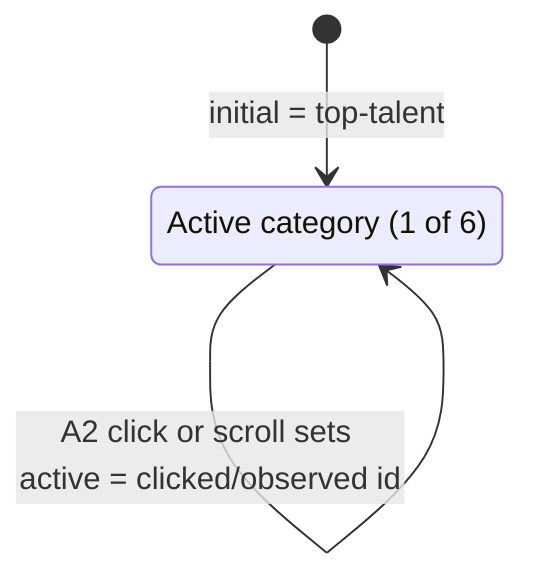

<!-- layout-exempt: rebuild-spec owns all docs/system|features|generated|flows paths -->
<!-- Contract: references/feature-spec-researcher-contract.md -->

# F008_AwardInformationBrowsing — Technical Spec

**Priority**: P1
**Type**: ui
**Generated**: 2026-09-07

**See also:** [`functional-spec.md`](./functional-spec.md) — plain-language overview, open
decisions, requirements/business rules stated in one-liners, screens, user stories, scenarios,
edge cases, and configuration for a BA/QA audience.

**How to read this file:** § 2 is the index — pick the action you care about and read its block
in § 3 straight through; each block is one complete thread, top to bottom. § 4 is the shared
appendix — jump in only when a § 3 block points you there.

## 1. Technical Overview

A signed-in member opens the static Award Information page (`/award-info`) and reads all 6 award
categories — prize amount, quantity, and artwork — rendered from a hardcoded array, zero database
reads. A sticky left-hand nav lets the member jump straight to any category (smooth-scroll) or
just scroll manually; an `IntersectionObserver` keeps the nav's active highlight in sync with
whichever section is currently in view. No `DEC-###` applies: every conditional in this feature's
source is either a single-field, non-user-facing config value (which array item is `reverse`) or a
plain iteration over a static list — neither meets the DEC subtype signatures (see
`references/feature-spec-researcher-contract.md` § Decision Logic Extraction). No `DISC-###`
applies either — this feature declares zero Key Entities (§ 4.2).

## 2. Action Index

| #      | Action (handler)                                            | Method · Path                             | Codes                                 | Writes          | Detail |
| ------ | ----------------------------------------------------------- | ----------------------------------------- | ------------------------------------- | --------------- | ------ |
| **A0** | _cross-cutting — belongs to no single action_               | —                                         | FR-601                                | —               | § 4.4  |
| **A1** | `AwardsPage` (default export, `app/award-info/page.tsx`)    | `GET` `/award-info`                       | FR-001, FR-101, FR-201, US006         | — _(read-only)_ | § 3.1  |
| **A2** | `CategoryNav#handleClick` / `IntersectionObserver` callback | _(client-only interaction, no HTTP path)_ | FR-401, BR-001, BR-002, US008, SM-001 | — _(read-only)_ | § 3.2  |

**Rung set** — every block in § 3 uses this exact order; an absent rung is simply omitted, never
rendered as `N/A` or `None.`:

> **Who** → **FE** → **Request** → **BE** → **Rule** → **Result** → **State** → **Source**

## 3. Actions

### 3.1 CAP-01 — View Award Information

#### A1 · View Award Information page

`GET` `/award-info` → `` `AwardsPage` ``
`FR-001` `FR-101` `FR-201` `US006` · `SCR005_AwardInfoScreen`

**Who** · signed-in member _(gate A0 — § 4.4)_
**FE** · `app/award-info/page.tsx:30-48` — server component composing `SiteHeader`,
`KeyvisualBanner`, `CategoryNav`, `AwardDetailSection`, `SunkudosSection`, `SiteFooter`. No client
fetch, no loading state — the whole page is static markup.
**BE** · none — the page performs no data fetch of any kind. Every award category's title,
description, prize amount, quantity, and image reference is a literal entry in
`AwardDetailSection`'s `AWARDS` array — `components/awards/award-detail-section.tsx:32-93` —
resolved through i18n only for the translatable text fields (title, description, quantity unit,
prize notes); the prize amounts/quantities themselves are plain strings, not translation keys.
**Rule** · **FR-001 — none of the 6 award categories' prize amounts, quantities, or images come
from a database table.** Changing award content for a future event requires editing this array in
source, not a data migration or admin action.
**Result** · read-only — **no DB read, no DB write**. Renders the keyvisual banner, then all 6
award categories in fixed source-array order (`top-talent`, `top-project`,
`top-project-leader`, `best-manager`, `signature-2025`, `mvp`), alternating left/right image
placement per each item's own hardcoded `reverse` flag (a static layout value, not a per-request
decision — `award-detail-section.tsx:42-92`).
**Source:** `app/award-info/page.tsx:30-48` → `components/awards/award-detail-section.tsx:32-131` →
`components/awards/award-detail-card.tsx:39-126`

<!-- No diagram: below threshold — single synchronous render, zero DB writes, no branching. -->

---

### 3.2 CAP-02 — Browse Award Categories

#### A2 · Category nav click / scrollspy

_(client-only interaction, no HTTP path)_ → `` `CategoryNav#handleClick` `` / `` `IntersectionObserver` `` callback
`FR-401` `US008` · `SCR005_AwardInfoScreen` · `SM-001`

**Who** · signed-in member already viewing the Award Information page _(gate A0 — § 4.4)_
**FE** · `components/awards/category-nav.tsx:31-93` — sticky left nav (`"use client"`), rendering
the same 6 category ids `AwardDetailSection` anchors its `<section>`s with
(`category-nav.tsx:12-19`).
**Request** · no HTTP request — a DOM interaction (`scrollIntoView`) and an `IntersectionObserver`
callback, both entirely client-local.
**Rule** · **BR-001 — the active category is whichever currently-intersecting section has the
topmost `boundingClientRect.top`**, per an `IntersectionObserver` configured with
`rootMargin: "-112px 0px -60% 0px"` (offsets for the sticky 80px header) and `threshold: 0` —
`category-nav.tsx:36-54`. **BR-002 — clicking a category suppresses that same observer for 800ms**
(`CLICK_SCROLL_SUPPRESS_MS`), so the smooth-scroll the click triggers cannot be overridden by an
intermediate section passing through the viewport mid-scroll — `category-nav.tsx:56-64`.
**Result** · read-only — **no DB write, no page navigation**. The clicked (or observed) category's
`<a>` gets the active visual treatment (gold underline + glow, `aria-current="true"`);
`document.getElementById(id)?.scrollIntoView({ behavior: "smooth", block: "start" })` moves the
viewport to the matching `<section>` rendered by `AwardDetailSection` (A1).
**State** · `SM-001`: `{previously active category}` → `{clicked or observed category}` _(§ 4.3)_
**Source:** `components/awards/category-nav.tsx:31-93`

<!-- No diagram: below threshold — single client-side interaction, no table write, no
     background/async step; the two-rule Rule rung above already states the branching plainly. -->

### 3.3 Edge cases

| Action | Scenario                                                                                                     | Behavior                                                                                                                                                                                              |
| ------ | ------------------------------------------------------------------------------------------------------------ | ----------------------------------------------------------------------------------------------------------------------------------------------------------------------------------------------------- |
| A1     | Unauthenticated visitor requests `/award-info` directly                                                      | Redirected to `/login` by A0's session gate before this page ever renders — cite A0 § 4.4                                                                                                             |
| A2     | Member scrolls quickly past several sections without clicking                                                | Observer picks whichever intersecting section currently has the topmost `boundingClientRect`, updating on every intersection change — no debounce beyond the browser's own observer callback batching |
| A2     | Member clicks a category, then scrolls manually within the 800ms suppression window                          | Active state stays pinned to the clicked target; observer-driven updates are ignored until the window elapses (`category-nav.tsx:58-63`)                                                              |
| A1     | An award's static image (`bgImg`/`nameImg`) fails to load (e.g. a missing file under `public/homepage-saa/`) | Next.js `<Image>` renders its own broken-image fallback; no in-app placeholder or error message is shown                                                                                              |

## 4. Shared Foundation

### 4.1 Components

| Component                                       | Responsibility                                                                           | Used in | File                                                                                                                   |
| ----------------------------------------------- | ---------------------------------------------------------------------------------------- | ------- | ---------------------------------------------------------------------------------------------------------------------- |
| `AwardsPage`                                    | Composes the whole screen: header, banner, nav + detail list, promo, footer              | A1      | `app/award-info/page.tsx`                                                                                              |
| `KeyvisualBanner`                               | Decorative hero banner, no interaction                                                   | A1      | `components/awards/keyvisual-banner.tsx`                                                                               |
| `CategoryNav`                                   | Sticky scrollspy nav for the 6 award categories                                          | A2      | `components/awards/category-nav.tsx`                                                                                   |
| `AwardDetailSection`                            | Owns the hardcoded `AWARDS` array; renders the 6 anchored `<section>`s in zigzag layout  | A1      | `components/awards/award-detail-section.tsx`                                                                           |
| `AwardDetailCard`                               | Presentational single-award card (image + content block)                                 | A1      | `components/awards/award-detail-card.tsx`                                                                              |
| `SiteHeader` / `SiteFooter` / `SunkudosSection` | Shared chrome reused verbatim from the homepage/kudos-board screens (see F001/F002/F007) | A1      | `components/homepage/site-header.tsx`, `components/common/site-footer.tsx`, `components/homepage/sunkudos-section.tsx` |

### 4.2 Data Model

N/A — this feature reads and writes no database table. The `AWARDS` array
(`components/awards/award-detail-section.tsx:32-93`) is a compile-time literal, not a row in any
table `docs/generated/entities.md` documents.

#### Polymorphic Behavior

N/A — no discriminator fields in Key Entities (this feature declares zero Key Entities).

### 4.3 State Management

### Active award category (SM-001)

**kind:** ui
**Linked FR:** FR-401
**Source:** `components/awards/category-nav.tsx:33` (`useState<string>`, initial value = the first
category, `top-talent`)



<!-- Drawn as a single self-transitioning state, not a 6-node mesh: any of the 6 categories can
     become active from any other in one step (click) or via scroll order, so a full 6x6 diagram
     would only restate the same single fact — "active is whichever id A2 last resolved" — with no
     added ordering information. The Rule rung on A2 (§ 3.2) already states exactly how a
     transition is chosen. -->

**Action transitions:** the click/observer logic and its 800ms suppression window are documented
in **A2**'s own **Rule**/**Result** rungs (§ 3.2) — not repeated here.

### 4.4 Shared Rules

Every Business Rule in this feature (BR-001, BR-002) is used by exactly one action (**A2**, Bin 1)
— each lives inline in A2's own **Rule** rung in § 3, not here. FR-001's rule statement is likewise
Bin 1, inline in **A1**'s Rule rung.

#### Bin 2 — used by ≥2 named actions

None — no shared BR/DEC crosses ≥2 actions in this feature.

#### Bin 3 — cross-cutting, belongs to no single action

**A0 · FR-601 — every action on this screen requires an active session.**
`lib/supabase/proxy.ts`'s blanket route guard (**PERM001_GlobalSessionGate**) redirects an
unauthenticated visitor to `/login` before `/award-info` ever renders — **not a rule of this
feature**; the identical gate applies to every other non-public route in the app (see
`docs/features/F001_GoogleSignIn/technical-spec.md § 3.1 A5`, the gate's owning feature). The
page's own inline comment ("Presentational, no auth guard... deferred to a later auth epic") is
stale relative to this shipped guard — see § 11 Risks & Known Issues in the twin
`functional-spec.md`.
**Source:** `lib/supabase/proxy.ts:44-91` · `docs/generated/permissions-matrix.md` §
PERM001_GlobalSessionGate

### 4.5 Algorithms & Integrations

None — no non-trivial computation (beyond iterating a static array) and no external
integration/webhook/queue/notification in this feature.

### 4.6 Configuration

`N/A — no technical configuration beyond framework defaults.` (Next.js `<Image>` optimization and
the i18n resource loader are project-wide, not specific to this feature.)

**Client behavior:** see
[`behavior-logic.md`](../../generated/behavior-logic.md) (client-side patterns — debounce, optimistic UI, polling, upload, realtime),
[`permissions.md`](../../system/permissions.md) (feature flags / experiments / env / locale gates),
[`screen-flow.md`](../../generated/screen-flow.md) (guards / deep-link state restoration / unsaved-changes protection).

## 5. Verification & Technical Notes

### 5.1 Technical Verification

- **SC-001** _(A1)_ Visiting `/award-info` while unauthenticated redirects to `/login` before any
  award content renders (covers FR-601)
- **SC-002** _(A1)_ Visiting `/award-info` while authenticated renders the keyvisual banner and all
  6 award categories in fixed order, with zero network/database calls (covers FR-001, FR-201)
- **SC-003** _(A2)_ Clicking any category-nav item scrolls to and marks active the matching
  section, and holds that active state through any observer-driven interruption for 800ms (covers
  FR-401, BR-001, BR-002)

#### US006_ViewAwardInformation _(A1)_

**Independent Test:** Navigate to `/award-info` directly while authenticated and confirm the page
renders the 6-category award list with zero XHR/fetch entries in the network panel.

**Acceptance Scenarios:**

1. **Given** a signed-in member on the header/footer nav or the homepage hero, **When** they select
   "Award Information" / "About Awards," **Then** the browser navigates to `/award-info` and the
   keyvisual banner plus all 6 award cards render.
2. **Given** an unauthenticated visitor, **When** they request `/award-info` directly, **Then**
   they are redirected to `/login` (**A0**) instead of seeing any award content.

#### US008_BrowseAwardCategories _(A2)_

**Independent Test:** Click a category-nav item whose section is off-screen and confirm
`scrollIntoView` is invoked and the item's `aria-current` flips to `"true"` immediately, without
waiting for the scroll animation to finish.

**Acceptance Scenarios:**

1. **Given** the member is on `/award-info` with a category off-screen, **When** they click that
   category in the left nav, **Then** the page smooth-scrolls to the matching section and that nav
   item shows active immediately.
2. **Given** the member scrolls manually with no click, **When** a new section's top crosses the
   sticky-header boundary, **Then** the nav updates its active item to match, via the
   `IntersectionObserver`.

### 5.2 Assumptions

- _(A1)_ The i18n resource files (`lib/i18n/locales/{en,vi}/awards.json`, confirmed present) are
  assumed to stay in lockstep with the `AWARDS`/`CATEGORIES` id lists in source — this pass
  confirmed both locale files exist but did not diff every `t(...)` call site's key against both
  files' contents.
- _(A2)_ The `-112px 0px -60% 0px` `rootMargin` is assumed tuned for the current sticky header
  height (80px, `site-header.tsx:27`); a future header-height change would need this constant
  re-tuned, and nothing in source enforces that coupling automatically.

### 5.3 Unresolved Questions

1. **Award-content update process** _(A1)_: whether prize amounts/quantities are expected to
   change per event year, and if so what non-code process (if any) is intended to update
   `award-detail-section.tsx`'s hardcoded `AWARDS` array — not confirmable from source alone.

### 5.4 Source References

| Action | Order | Symbol            | Path                                               | Purpose                                                           |
| ------ | ----- | ----------------- | -------------------------------------------------- | ----------------------------------------------------------------- |
| A1     | 1     | `AwardsPage`      | `app/award-info/page.tsx:1-48`                     | entry point; composes the whole screen                            |
| A1     | 2     | `AWARDS` (data)   | `components/awards/award-detail-section.tsx:32-93` | this feature's only "data" — a hardcoded literal, not a DB entity |
| A1     | 3     | `AwardDetailCard` | `components/awards/award-detail-card.tsx:39-126`   | renders one award's image + content block                         |
| A2     | 4     | `CategoryNav`     | `components/awards/category-nav.tsx:31-93`         | scrollspy nav driving the active-category state                   |

#### Data Flow

```text
{AWARDS array literal, compile-time} -> AwardDetailSection.map() over 6 items
  -> per-item i18n t() resolution (title/description/quantityUnit/prizeNotes)
  -> AwardDetailCard props -> rendered <section id="{category-id}">
```

### 5.5 Artifact References

| Artifact           | File                                                           | Codes Used   | Reviewed |
| ------------------ | -------------------------------------------------------------- | ------------ | -------- |
| System Overview    | [overview.md](../../system/overview.md)                        | —            | [x]      |
| Architecture       | [architecture.md](../../system/architecture.md)                | —            | [x]      |
| Feature List       | [feature-list.md](../../generated/feature-list.md)             | F008         | [x]      |
| API Map            | [api-map.md](../../generated/api-map.md)                       | —            | [ ]      |
| Entities           | [entities.md](../../generated/entities.md)                     | —            | [ ]      |
| Screens            | [functional-spec.md § 6](functional-spec.md#6-screens)         | SCR005       | [ ]      |
| Behavior Logic     | [behavior-logic.md](../../generated/behavior-logic.md)         | —            | [ ]      |
| Permissions Matrix | [permissions-matrix.md](../../generated/permissions-matrix.md) | PERM001      | [ ]      |
| User Stories       | [user-stories.md](../../generated/user-stories.md)             | US006, US008 | [ ]      |
