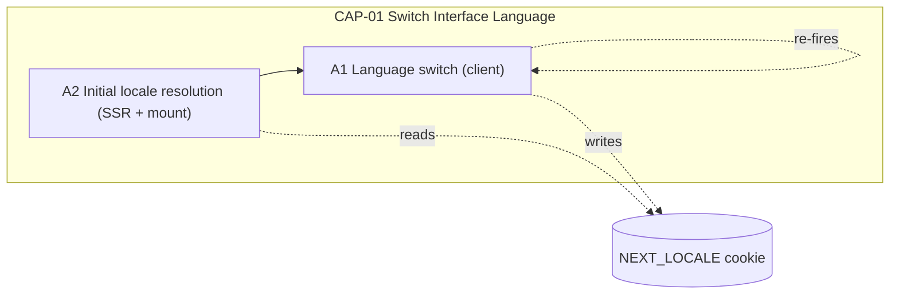

<!-- layout-exempt: rebuild-spec owns all docs/system|features|generated|flows paths -->
<!-- Contract: references/feature-spec-researcher-contract.md -->

# F009_InterfaceLocalization — Technical Spec

**Priority**: P2
**Type**: ui
**Generated**: 2026-09-07

**See also:** [`functional-spec.md`](./functional-spec.md) — plain-language overview, open
decisions, requirements/business rules stated in one-liners, screens, user stories, scenarios,
edge cases, and configuration for a BA/QA audience.

**How to read this file:** § 2 is the index — pick the action you care about and read its block
in § 3 straight through; each block is one complete thread, top to bottom. § 4 is the shared
appendix — jump in only when a § 3 block points you there.

## 1. Technical Overview

A shared header widget (`LanguageSelector`) lets any visitor or member switch the active
`react-i18next` locale between Vietnamese and English on any screen; the switch re-renders
translated text immediately and persists to a `NEXT_LOCALE` cookie so the server-rendered markup
on the next request/reload already matches. No route, Server Action, or database table is
involved anywhere in this feature — the only persisted state is the cookie. No `DEC-###` applies:
the one locale-resolution branch (`resolveLocale`) is a single-field validity check, not
multi-predicate decision logic, so it is captured as a Business Rule (BR-001) instead. No
`DISC-###` applies either — this feature declares zero Key Entities.



## 2. Action Index

| #      | Action (handler)                                      | Method · Path          | Codes                                                                 | Writes                         | Detail |
| ------ | ----------------------------------------------------- | ---------------------- | --------------------------------------------------------------------- | ------------------------------ | ------ |
| **A0** | _cross-cutting — belongs to no single action_         | —                      | BR-004                                                                | —                              | § 4.4  |
| **A1** | `LanguageSelector#changeLanguage`                     | —                      | FR-002, FR-401, FR-402, FR-403, BR-001, BR-002, BR-003, BR-005, US003 | — _(cookie only, no DB write)_ | § 3.1  |
| **A2** | `RootLayout` _(background, no FE trigger of its own)_ | render · every request | FR-001, FR-403, BR-001, BR-005, BR-006, US003                         | — _(cookie read only)_         | § 3.1  |

**Column note:** `FR-001`/`BR-001` are claimed by both A1 and A2 (legitimate fan-out — one
foundational rule, two handling actions: A2 applies it on first SSR render, A1's own `selected`
lookup re-applies the identical fallback on every client render).

## 3. Actions

### 3.1 CAP-01 — Switch Interface Language

#### A1 · Language switch (client)

`—` → `` `LanguageSelector#changeLanguage` ``
`FR-002` `FR-401` `FR-402` `FR-403` `US003` · `SCR002_LoginScreen` `SCR004_AboutHomepage` `SCR005_AwardInfoScreen` `SCR006_SunKudosBoard`

**Who** · any visitor or signed-in member, on any of the four screens
**FE** · `components/common/language-selector.tsx:28-108` — a header dropdown showing the active
locale's flag + code (VN/EN); rendered inside `SiteHeader`'s login variant on
`SCR002_LoginScreen` (selector only, no notification/account menu — correct for an
unauthenticated visitor) and the full variant on `SCR004`/`SCR005`/`SCR006`
(`screen-list.md`'s Region Guidance § 6 note)
**Request** · none — client-side call `i18n.changeLanguage(code)` against the mounted `i18next`
instance (`language-selector.tsx:36-44`); no HTTP request leaves the browser
**BE** · none — purely client-side, no server round-trip
**Rule** · decides which locale renders and what gets remembered:

- **BR-001 — a value outside the two supported locales resolves to Vietnamese.** This action's own
  `selected` lookup (`resolveLocale(i18n.language)`, `language-selector.tsx:33`) re-applies the same
  fallback A2 uses on first render, so the highlighted/active option is never undefined. _(§ 4.4)_
- **BR-002 — a failed switch leaves the previously rendered locale in place, silently.**
  `i18n.changeLanguage(...).catch(...)` swallows the rejection with no logging —
  `language-selector.tsx:39-42`.
- **BR-003 — the cookie is refreshed for a further year every time the active locale is set,
  not only on an explicit switch.** The write sits in a `useEffect` keyed on `selected`, which
  also fires once on mount — `language-selector.tsx:48-51`.
  **Result**
- `i18n.language` flips synchronously; every `useTranslation()` consumer re-renders with the new
  strings — no page reload (`language-selector.tsx:36-44`)
- Writes the `NEXT_LOCALE` cookie ← the newly selected code, `path=/`, `max-age=31536000` (1 year),
  `samesite=lax` — `language-selector.tsx:48-51` (BR-003; also see BR-005 below, § 4.4)
- On a rejected switch (BR-002): no write occurs, no re-render, nothing thrown to the caller
  **Source:** `components/common/language-selector.tsx:28-108`

<!-- No diagram: below threshold — a single synchronous client call with one already-fully-stated
     branch (BR-002); a sequence diagram would not add ordering information the Rule/Result rungs
     above don't already give. -->

---

#### A2 · Initial locale resolution (SSR + client mount) _(background, no FE trigger of its own)_

`render · every request` → `` `RootLayout` ``
`FR-001` `FR-403` `US003` · `SCR002_LoginScreen` `SCR004_AboutHomepage` `SCR005_AwardInfoScreen` `SCR006_SunKudosBoard`

**Who** · every request's visitor or member — no user action triggers this; it runs once per
request (server) and once per mount (client), before any translated text is visible
**FE** · none of its own — the server root layout (`app/layout.tsx:30-55`) plus its client
boundary (`components/common/i18n-provider.tsx:14-28`); the very first thing a user sees is
already in the resolved locale, so there is nothing to "trigger" from a user's perspective
**Request** · the inbound request's own `NEXT_LOCALE` cookie, read via `cookies()` —
`app/layout.tsx:37-38`
**BE** · `` `resolveLocale(cookieStore.get(cookieName)?.value)` `` — `lib/i18n/settings.ts:27-29`,
called server-side (`app/layout.tsx:38`) and again client-side when the provider mounts
(`components/common/i18n-provider.tsx:21`)
**Rule**

- **BR-001 — a cookie value outside the two supported locales resolves to Vietnamese, same as no
  cookie at all.** _(§ 4.4, full statement)_
- **BR-006 — a brand-new `i18next` instance is created per client mount (so per server request,
  too), so concurrent requests with different cookies never share or mutate one global
  instance.** `createI18nInstance(locale)` — `lib/i18n/i18n.ts:65-77`, invoked from
  `components/common/i18n-provider.tsx:21`.
  **Result**
- Sets `<html lang>` on the server-rendered markup to the resolved locale —
  `app/layout.tsx:46` (BR-005, § 4.4)
- Creates a fresh `i18next` instance seeded with the same resolved locale for this mount —
  `components/common/i18n-provider.tsx:21` → `lib/i18n/i18n.ts:65-77` — so the first client render
  already matches what the server sent (no hydration flash)
- Re-syncs `<html lang>` from the mounted instance's own `.language` once on the client —
  `components/common/i18n-provider.tsx:23-25` (BR-005, § 4.4)
  **Source:** `app/layout.tsx:30-55` → `components/common/i18n-provider.tsx:14-28` →
  `lib/i18n/i18n.ts:65-77`

<!-- No diagram: below threshold — a single linear read -> resolve -> render path, no table
     write, no branching worth a sequence diagram. -->

### 3.2 Edge cases

| Action  | Scenario                                                                     | Behavior                                                                                                                                              |
| ------- | ---------------------------------------------------------------------------- | ----------------------------------------------------------------------------------------------------------------------------------------------------- |
| A1      | User selects the language that is already active                             | `changeLanguage` still runs; `i18next` treats it as a no-op re-render — the cookie/`<html lang>` effect re-fires with the same value (BR-003, BR-005) |
| A1      | The client-side switch call rejects (BR-002)                                 | Previous locale keeps rendering; nothing is logged anywhere — see § 11 Risks & Known Issues in `functional-spec.md`                                   |
| A2      | `NEXT_LOCALE` cookie holds a value outside `vi`/`en` (tampered or corrupted) | `resolveLocale` falls back to `vi` (BR-001), identical to a missing cookie                                                                            |
| A1 · A2 | A screen renders a translation key with no entry for the active language     | Falls back to the Vietnamese wording for that key (BR-004), regardless of which action last set the locale                                            |

## 4. Shared Foundation

Every Business Rule below is claimed by at least one § 2 row. No `DEC-###` applies to this
feature — the only locale-resolution branch (`resolveLocale`, `lib/i18n/settings.ts:27-29`) is a
single-field validity check against a 2-value allowlist, not multi-predicate decision logic; it is
fully captured as BR-001 above.

### 4.1 Components

| Component            | Responsibility                                                                                                  | Used in | File                                      |
| -------------------- | --------------------------------------------------------------------------------------------------------------- | ------- | ----------------------------------------- |
| `LanguageSelector`   | Header dropdown; switches the active locale, persists the cookie, syncs `<html lang>` on switch                 | A1      | `components/common/language-selector.tsx` |
| `RootLayout`         | Server root layout; reads the `NEXT_LOCALE` cookie, resolves the initial locale, sets the initial `<html lang>` | A2      | `app/layout.tsx`                          |
| `I18nProvider`       | Client i18n boundary; creates one fresh `i18next` instance per mount matching the SSR-resolved locale           | A2      | `components/common/i18n-provider.tsx`     |
| `createI18nInstance` | Builds an `i18next` instance from the `vi`/`en` resource bundles, with `vi` as `fallbackLng`                    | A1, A2  | `lib/i18n/i18n.ts`                        |
| `resolveLocale`      | Narrows any stored value to a supported locale, defaulting to `vi`                                              | A1, A2  | `lib/i18n/settings.ts`                    |

### 4.2 Data Model

N/A — no database entities. This feature's only persisted state is a browser cookie (see § 4.6
Configuration and A1's Result rung above); nothing in this feature reads or writes a database
table. `profiles.language` exists as a column with its own owner-scoped UPDATE grant (PERM004),
but grepping this feature's entire source (`lib/i18n/`, `components/common/language-selector.tsx`,
`components/common/i18n-provider.tsx`, `app/layout.tsx`) turns up zero calls into a `profiles`
table — confirmed by cross-checking every `.from("profiles")` call site in `app/` and
`components/` (`app/sun-kudos/actions/submit-kudo.ts`, `app/sun-kudos/actions/open-secret-box.ts`,
`components/kudos/kudos-recipient-select.tsx`, `lib/kudos/board-aggregates.ts`), none of which
touch `language`. See `docs/generated/feature-list.md`'s F009 entry and F011_ProfileSelfService
for the declared-but-unimplemented account-level write path.

#### Polymorphic Behavior

N/A — no discriminator fields in Key Entities.

### 4.3 State Management

None — no persisted or client-local state machine meets the modeling threshold (≥3 states or ≥2
transitions). The selector's own open/closed dropdown boolean is common shared-chrome UI state
(the same pattern used by the header's other menus) with only 2 states — not a language-specific
concept worth modeling here.

### 4.4 Shared Rules

#### Bin 3 — cross-cutting, belongs to no single action

**A0 · BR-004 — a translation key with no entry for the active language falls back to its
Vietnamese wording.** `fallbackLng: defaultLocale` (`vi`) on the `i18next` instance
(`lib/i18n/i18n.ts:70`) — applies to **every** `useTranslation()`/`t()` call across the entire
app, not any one screen or action; this is why it sits at A0 rather than being attributed to A1 or
A2 alone.
**Source:** `lib/i18n/i18n.ts:65-77`

#### Bin 2 — used by ≥2 named actions

**BR-001 — a locale value outside the supported two (`vi`, `en`) resolves to Vietnamese, the
same as no value at all.**
Used in: **A1** · **A2**. `resolveLocale` narrows any string to a supported `Locale` via
`locales.includes(value)`, else returns `defaultLocale` — a single-field allowlist check, not a
branching decision.
**Source:** `lib/i18n/settings.ts:27-29`

```text
function resolveLocale(value):
  if value in ["vi", "en"]: return value
  return "vi"
```

**BR-005 — the page's declared language (`<html lang>`) is always kept in sync with the active
locale, both from the initial server render and after every client-side switch.**
Used in: **A1** · **A2**. Enforced redundantly at three points so no render path can leave it
stale: the initial server markup (`app/layout.tsx:46`), once on client mount from the created
instance's own language (`components/common/i18n-provider.tsx:23-25`), and again on every locale
change inside the selector itself (`components/common/language-selector.tsx:49-50`).
**Source:** `app/layout.tsx:46` · `components/common/i18n-provider.tsx:23-25` ·
`components/common/language-selector.tsx:49-50`

<!-- BR-002, BR-003, BR-006 are Bin 1 — used by exactly one action each — and therefore live
     inline in that action's own Rule rung above (A1 for BR-002/BR-003, A2 for BR-006), not
     repeated here. -->

### 4.5 Algorithms & Integrations

None — no non-trivial computation and no external integration (API call, webhook, queue job,
notification) exists in this feature; the locale switch and cookie/`<html lang>` sync are all
handled in-process by the `i18next`/`react-i18next` libraries already covered under § 4.1
Components.

### 4.6 Configuration

```text
NEXT_LOCALE cookie: path=/, max-age=31536000 (1yr), samesite=lax   # persists the active locale (A1) — lib/i18n/settings.ts:8, components/common/language-selector.tsx:49
locales = ["vi", "en"]                                              # supported locale allowlist; anything else resolves to "vi" (BR-001) — lib/i18n/settings.ts:2
defaultLocale = "vi"                                                # fallback for a missing/invalid cookie value and for missing translation keys (BR-001, BR-004) — lib/i18n/settings.ts:5
```

**Client behavior:** see
[`behavior-logic.md`](../../generated/behavior-logic.md) (client-side patterns — debounce, optimistic UI, polling, upload, realtime),
[`permissions.md`](../../system/permissions.md) (feature flags / experiments / env / locale gates),
[`architecture.md`](../../system/architecture.md) (guards / deep-link state restoration / unsaved-changes protection).

## 5. Verification & Technical Notes

### 5.1 Technical Verification

- **SC-001** _(A1)_ Selecting a language immediately re-renders every visible translated string in
  that language and writes the `NEXT_LOCALE` cookie with a 1-year `max-age` (covers FR-401,
  FR-402, BR-003)
- **SC-002** _(A2)_ Loading any of the four screens with a valid `NEXT_LOCALE` cookie renders the
  server markup in that locale with a matching `<html lang>`, and the first client render matches
  it exactly — no hydration flash (covers FR-001, FR-403, BR-001, BR-005)
- **SC-003** _(A2)_ Loading with no cookie, or a cookie value outside `vi`/`en`, renders Vietnamese
  by default (covers FR-001, BR-001)

#### US003_SwitchInterfaceLanguage _(A1, A2)_

**Independent Test:** With the browser initially on the Vietnamese interface, stub
`i18n.changeLanguage` to reject once, select "EN," and confirm the interface still shows
Vietnamese text and the `NEXT_LOCALE` cookie is unchanged (BR-002); then let a real switch
succeed and confirm the cookie now reads `en` and a fresh page load renders English server-side.

**Acceptance Scenarios:**

1. **Given** the Vietnamese interface is showing, **When** the visitor selects "EN," **Then**
   `i18n.changeLanguage("en")` resolves, every visible translated string re-renders in English
   synchronously (no navigation), the `NEXT_LOCALE` cookie is set to `en` (`path=/`,
   `max-age=31536000`), and `<html lang>` reads `en`.
2. **Given** `i18n.changeLanguage` rejects, **When** the visitor selects a language, **Then** no
   cookie write occurs, `<html lang>` is unchanged, and the interface keeps rendering whatever
   locale was already active — with no error surfaced to the console or the UI.

### 5.2 Assumptions

- _(A1)_ `i18n.changeLanguage`'s rejection path is assumed to be reachable only by an internal
  `i18next` failure (e.g., a malformed resource bundle) — this pass did not find a way to trigger
  it against the current bundled `vi`/`en` resources, so the silent-fallback branch (BR-002) is
  confirmed by reading the code, not by reproducing a real rejection.
- _(A2)_ SSR and the first client render are assumed to always agree because both resolve the
  identical cookie value through the same `resolveLocale` function — this pass did not verify
  behavior when the cookie value changes between the SSR request and client hydration (e.g., a
  second browser tab switching language mid-request).

### 5.3 Unresolved Questions

1. **Cookie tampering beyond a missing value** _(A2)_: `resolveLocale`'s allowlist check
   (`lib/i18n/settings.ts:27-29`) suggests a hand-edited `NEXT_LOCALE` cookie outside `vi`/`en` is
   rejected identically to a missing cookie, but this pass did not add a runtime test confirming no
   upstream code path lets an unresolved string reach `createI18nInstance` directly.
2. **Cross-request caching of the resolved locale** _(A2)_: whether any deployed hosting layer
   (edge/serverless runtime) could cache `RootLayout`'s render output across requests in a way
   that serves one visitor's resolved locale to another — not confirmable from application source
   alone, since it depends on the deployment topology, not this feature's code.

### 5.4 Source References

| Action | Order | Symbol               | Path                                             | Purpose                                                                          |
| ------ | ----- | -------------------- | ------------------------------------------------ | -------------------------------------------------------------------------------- |
| —      | 1     | locale settings      | `lib/i18n/settings.ts:1-29`                      | supported locales, default, cookie name, `resolveLocale`                         |
| A2     | 2     | `RootLayout`         | `app/layout.tsx:30-55`                           | resolves the initial locale from the cookie, sets the initial `<html lang>`      |
| A2     | 3     | `I18nProvider`       | `components/common/i18n-provider.tsx:14-28`      | client i18n boundary; creates the per-mount instance                             |
| A1, A2 | 4     | `createI18nInstance` | `lib/i18n/i18n.ts:65-77`                         | builds the `i18next` instance from the `vi`/`en` resource bundles, `vi` fallback |
| A1     | 5     | `LanguageSelector`   | `components/common/language-selector.tsx:28-108` | switch handler, cookie write, `<html lang>` sync                                 |

#### Data Flow

```text
{NEXT_LOCALE cookie, inbound request} -> resolveLocale() narrows to vi|en
  -> RootLayout sets <html lang>, passes resolved locale as initialLocale
  -> I18nProvider creates a fresh i18next instance seeded with that locale
  -> first client render matches the server-rendered locale exactly
```

### 5.5 Artifact References

| Artifact           | File                                                           | Codes Used                     | Reviewed |
| ------------------ | -------------------------------------------------------------- | ------------------------------ | -------- |
| System Overview    | [overview.md](../../system/overview.md)                        | —                              | [x]      |
| Architecture       | [architecture.md](../../system/architecture.md)                | —                              | [x]      |
| Feature List       | [feature-list.md](../../generated/feature-list.md)             | F009                           | [x]      |
| API Map            | [api-map.md](../../generated/api-map.md)                       | —                              | [ ]      |
| Entities           | [entities.md](../../generated/entities.md)                     | —                              | [ ]      |
| Screens            | [functional-spec.md § 6](functional-spec.md#6-screens)         | SCR002, SCR004, SCR005, SCR006 | [ ]      |
| Behavior Logic     | [behavior-logic.md](../../generated/behavior-logic.md)         | —                              | [ ]      |
| Permissions Matrix | [permissions-matrix.md](../../generated/permissions-matrix.md) | —                              | [ ]      |
| User Stories       | [user-stories.md](../../generated/user-stories.md)             | US003                          | [ ]      |
