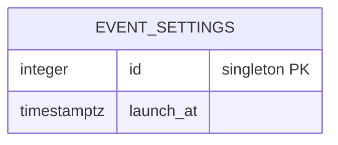
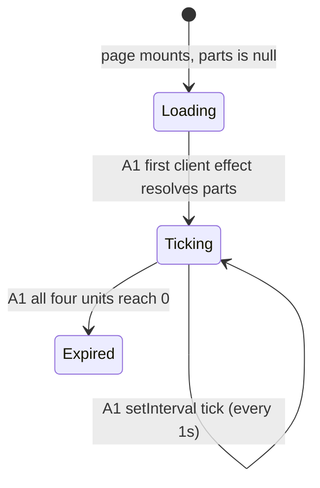

<!-- Contract: references/feature-spec-researcher-contract.md -->

# F010_PrelaunchCountdownGate — Technical Spec

**Priority**: P2
**Type**: ui
**Generated**: 2026-09-07

**See also:** [`functional-spec.md`](./functional-spec.md) — plain-language overview, open
decisions, requirements/business rules stated in one-liners, screens, user stories, scenarios,
edge cases, and configuration for a BA/QA audience.

**How to read this file:** § 2 is the index — pick the action you care about and read its block
in § 3 straight through. § 4 is the shared appendix — jump in only when § 3 points you there.

## 1. Technical Overview

`/countdown` (`SCR003_CountdownScreen`) is a single client-ticking page: it renders a
Days/Hours/Minutes/Seconds countdown to a launch instant read from an environment setting, and the
moment all four units reach zero it client-side navigates the visitor to `/about`. There is no
Server Action, no API route, and no database read or write owned by this feature — the only
"backend" involvement is `lib/countdown-config.ts` resolving the launch instant at module load.
The screen is reached only by a signed-in visitor (gated by `proxy.ts`, owned by F001), either
right after OAuth sign-in or by revisiting `/login` while already signed in, and only while the
event has not yet launched. No overview diagram — this is a single-action feature and a diagram
would not clarify anything a sentence does not already say.

## 2. Action Index

| #      | Action (handler)                                    | Method · Path                                                  | Codes                                                           | Writes          | Detail |
| ------ | --------------------------------------------------- | -------------------------------------------------------------- | --------------------------------------------------------------- | --------------- | ------ |
| **A0** | _cross-cutting — belongs to no single action_       | —                                                              | FR-601                                                          | —               | § 4.4  |
| **A1** | `` `CountdownTimer` `` (client mount + tick effect) | — _(client page; no HTTP handler or queue trigger of its own)_ | FR-001, FR-101, FR-201, FR-401, BR-001, BR-002, DEC-001, SM-001 | — _(read-only)_ | § 3.1  |

**Note on scope:** `ROUTE001 GET /auth/callback` and the `proxy.ts` session guard both decide
_whether/when_ a visitor lands on `/countdown`, but both are owned by F001 (Google Sign-In) — they
are cited here only as context for A0's cross-cutting gate, never claimed as F010 actions.

## 3. Actions

### 3.1 CAP-01 — Prelaunch Countdown & Auto-Continue

#### A1 · Countdown ticks down, then auto-continues to the homepage

`—` (client component, no HTTP path) → `` `CountdownTimer` ``
`FR-001` `FR-101` `FR-201` `FR-401` `DEC-001` `SM-001` · `SCR003_CountdownScreen`

**Who** · any signed-in visitor arriving here right after sign-in, or by revisiting Login while
already signed in (FR-101), while the event has not yet launched _(gate A0 — § 4.4)_.
**FE** · `app/countdown/page.tsx:25-47` renders the full-bleed background art + dark overlay and
centers `CountdownTimer`; `components/countdown/countdown-timer.tsx:32-67` reads
`useCountdown(LAUNCH_AT)` and re-renders four `CountdownUnit`/`CountdownDigitBox` pairs
(Days/Hours/Minutes/Seconds) every second (FR-201).
**BE** · `lib/countdown-config.ts:17` resolves `LAUNCH_AT` once at module load from
`process.env.NEXT_PUBLIC_LAUNCH_AT` (FR-001) — see RISK-02 (`functional-spec.md § 11`) for the
missing-env fallback.
**Rule**

- **BR-001 — The countdown recalculates and redisplays itself automatically every second.**
  `hooks/use-countdown.ts:41-47`'s `setInterval(tick, 1000)` re-runs `computeParts` on every tick
  while the component stays mounted; no server round-trip is involved.
  **Source:** `hooks/use-countdown.ts:41-47`
- **BR-002 — Before the browser has ticked once, all four counters read zero instead of the real
  remaining time.** `useCountdown` returns `null` until its first client-side effect runs
  (`hooks/use-countdown.ts:38-39`); `CountdownTimer` substitutes an all-zero fallback for that
  instant (`components/countdown/countdown-timer.tsx:36-41`) so the server-rendered markup and the
  very first client render agree — no hydration mismatch.
  **Source:** `components/countdown/countdown-timer.tsx:36-41`, `hooks/use-countdown.ts:38-39`

| DEC         | subtype | Condition                                                                   | What the user sees                                                 | Source                                           |
| ----------- | ------- | --------------------------------------------------------------------------- | ------------------------------------------------------------------ | ------------------------------------------------ |
| **DEC-001** | flow    | `parts !== null` AND all four of `days`/`hours`/`minutes`/`seconds` `=== 0` | automatically taken to the About/Homepage screen — no click needed | `components/countdown/countdown-timer.tsx:47-50` |

**Result** · **no DB write** — the countdown target comes from an environment setting, not the
database (see § 4.2). On expiry, calls `router.replace("/about")` (FR-401), which drops the
countdown page from browser history so the visitor cannot navigate back to it with the Back
button.
**State** · `SM-001`: `ticking` → `expired` _(§ 4.3)_
**Source:** `app/countdown/page.tsx:25-47` → `components/countdown/countdown-timer.tsx:32-67` →
`hooks/use-countdown.ts:38-50` → `lib/countdown-config.ts:17-28`

<!-- No diagram: below threshold — single action, zero table writes, synchronous client effect. -->

### 3.2 Edge cases

| Action  | Scenario                                                          | Behavior                                                                                                                                                                                                                                                                                                                                                                                      |
| ------- | ----------------------------------------------------------------- | --------------------------------------------------------------------------------------------------------------------------------------------------------------------------------------------------------------------------------------------------------------------------------------------------------------------------------------------------------------------------------------------- |
| A1      | `NEXT_PUBLIC_LAUNCH_AT` unset in a deployed environment           | `LAUNCH_AT` falls back to `Date.now() + 8_000` (`lib/countdown-config.ts:17`), so the countdown reaches zero roughly 8 seconds after page load and the page immediately navigates to `/about` (see RISK-02)                                                                                                                                                                                   |
| A1      | `NEXT_PUBLIC_LAUNCH_AT` is set but unparseable by `new Date(...)` | `isBeforeLaunch()`'s `Number.isFinite(launchMs)` check returns `false` (treated as already launched) for routing purposes (`lib/countdown-config.ts:25-28`); a direct visit to `/countdown` itself still mounts and computes an all-zero countdown via `computeParts`'s own `!Number.isFinite(diff)` guard (`hooks/use-countdown.ts:19-21`), then fires the expiry redirect on the first tick |
| A1      | Session expires while the countdown is still ticking              | The client timer keeps running locally, but the next navigation/request is caught by `proxy.ts`'s guard and redirected to `/login` before the countdown would have reached zero                                                                                                                                                                                                               |
| A0 · A1 | Unauthenticated request to `/countdown`                           | `proxy.ts` redirects to `/login` before this page's own code ever runs                                                                                                                                                                                                                                                                                                                        |

## 4. Shared Foundation

### 4.1 Components

| Component                        | Responsibility                                                            | Used in | File                                           |
| -------------------------------- | ------------------------------------------------------------------------- | ------- | ---------------------------------------------- |
| `CountdownPage` (default export) | Page shell — full-bleed background art + dark overlay + centers the timer | A1      | `app/countdown/page.tsx`                       |
| `CountdownTimer`                 | Ticks every second, renders 4 units, fires the expiry auto-redirect       | A1      | `components/countdown/countdown-timer.tsx`     |
| `CountdownDigitBox`              | Renders one frosted-box 7-segment-style digit glyph, 2 per unit           | A1      | `components/countdown/countdown-digit-box.tsx` |
| `useCountdown` (hook)            | Computes days/hours/minutes/seconds remaining, recomputed every second    | A1      | `hooks/use-countdown.ts`                       |

### 4.2 Data Model



| Entity                    | Table            | Used for                                                                                                                                                                                                          | Action                       |
| ------------------------- | ---------------- | ----------------------------------------------------------------------------------------------------------------------------------------------------------------------------------------------------------------- | ---------------------------- |
| EVENT_SETTINGS (MODEL009) | `event_settings` | Documents the DB-seeded launch instant this feature appears to have been designed around — confirmed by grep that no query against this table exists anywhere in `app/`/`lib/` (see `functional-spec.md` RISK-01) | — _(unread by this feature)_ |

`id` is the singleton primary key (`CHECK (id = 1)`); `launch_at` is seeded to
`2026-07-21 09:00:00+07` (`supabase/migrations/20260714080000_event_settings.sql:28`) — not read
by any F010 code.

#### Polymorphic Behavior

N/A — no discriminator fields in Key Entities (`EVENT_SETTINGS` has none, per `entities.md`).

### 4.3 State Management

### The countdown's own display lifecycle (SM-001)

**kind:** ui
**Linked FR:** FR-201
**Source:** `components/countdown/countdown-timer.tsx:38-50`, `hooks/use-countdown.ts:38-50`



**Action transitions:** the guard and side effect for each edge live in A1's own **Result** rung
(§ 3.1) — not repeated here. `Loading` renders the all-zero fallback (BR-002); `Expired` is the
state that fires DEC-001's `router.replace("/about")`.

### 4.4 Shared Rules

#### Bin 3 — cross-cutting, belongs to no single action

**A0 · FR-601 — every non-public path, including `/countdown`, requires an active session.**
Enforced once, site-wide, in `lib/supabase/proxy.ts`'s `isPublicPath`/`updateSession` guard — an
unauthenticated request to any path other than `/login` or `/auth/*` is redirected to `/login`
before that page's own code ever runs. **Not a rule of this feature** — owned by F001. This
screen's own file comment (`app/countdown/page.tsx:23`) claims "no auth guard... per plan
clarifications," but that describes only the absence of a page-level check in this file; the
proxy's guard still applies at the routing layer, since `/countdown` is not in `isPublicPath`.
`[UNVERIFIED]` whether the comment is stale or was always intended to describe page-level-only
(not proxy-level) guarding.
**Source:** `lib/supabase/proxy.ts:12-14,44-91` · owned by F001, cited here only as this screen's
gate.

<!-- No Bin 2 entries — the feature has exactly one real action (A1), so every BR it uses is Bin 1
     and lives inline in A1's Rule rung above. -->

### 4.5 Algorithms & Integrations

None.

### 4.6 Configuration

```text
NEXT_PUBLIC_LAUNCH_AT = 2026-12-31T18:00:00+07:00   # (.env.example:20) launch instant this page counts down to (FR-001)
```

`N/A` beyond the one setting above — no retry/timeout config applies to a purely client-side timer.

**Client behavior:** see
[`behavior-logic.md`](../../generated/behavior-logic.md) (client-side patterns — debounce, optimistic UI, polling, upload, realtime),
[`permissions.md`](../../system/permissions.md) (feature flags / experiments / env / locale gates),
[`screen-flow.md`](../../generated/screen-flow.md) (guards / deep-link state restoration / unsaved-changes protection).

## 5. Verification & Technical Notes

### 5.1 Technical Verification

- **SC-001** _(A1)_ The four counters (Days/Hours/Minutes/Seconds) update every second and never
  render a negative number, mirroring `computeParts`'s `diff <= 0` clamp to all-zero (covers
  FR-201, BR-001).
- **SC-002** _(A1)_ The instant all four counters read `00`, the browser navigates to `/about`
  with no further user action, and the countdown page is not reachable via the Back button
  (covers FR-401, DEC-001).

No `#### {US###}` sub-block — this feature attributes zero `US###` codes (`[IPE_ZERO]`; see
`functional-spec.md § 7`).

### 5.2 Assumptions

- _(A1)_ The three-way launch-date mismatch documented in `functional-spec.md § 11` (RISK-01) is
  recorded purely from reading the three literal values in source (`event_settings.launch_at`,
  `NEXT_PUBLIC_LAUNCH_AT`, and the hardcoded `EVENT_DATE` on `/about`) — this pass did not run the
  app in a browser to visually confirm the two pages display different countdowns simultaneously.
- _(A1)_ `.env`/`.env.local`/`.env.example` are assumed to reflect the value actually deployed;
  whether a hosting platform's own environment configuration (e.g. a Vercel project setting)
  overrides `NEXT_PUBLIC_LAUNCH_AT` with a different value was not checked, since no deployment
  config was found in this repo.

### 5.3 Unresolved Questions

1. **`event_settings.launch_at` wiring** _(A1)_: no code path anywhere in `app/`/`lib/` constructs
   a Supabase query against `event_settings` — confirmed by grep. Whether this table was once read
   and the call site was later removed, or the table was seeded ahead of a read path that was
   never implemented, is not determinable from source alone.

### 5.4 Source References

| Action | Order | Symbol                           | Path                                            | Purpose                                                                                                                       |
| ------ | ----- | -------------------------------- | ----------------------------------------------- | ----------------------------------------------------------------------------------------------------------------------------- |
| A1     | 1     | `CountdownPage` (default export) | `app/countdown/page.tsx:1-47`                   | Page shell — background art + centers the timer                                                                               |
| A1     | 2     | `CountdownTimer`                 | `components/countdown/countdown-timer.tsx:1-67` | Ticks every second, renders units, fires the expiry redirect                                                                  |
| A1     | 3     | `useCountdown`                   | `hooks/use-countdown.ts:1-50`                   | Computes remaining days/hours/minutes/seconds                                                                                 |
| A1     | 4     | `LAUNCH_AT` / `isBeforeLaunch`   | `lib/countdown-config.ts:1-28`                  | Resolves the launch instant from env; used by A1 for display and by F001 (`proxy.ts`, `auth/callback`) for post-login routing |

#### Data Flow

```text
NEXT_PUBLIC_LAUNCH_AT (env, read once at module load) -> LAUNCH_AT constant (lib/countdown-config.ts:17)
  -> useCountdown(LAUNCH_AT) recomputes {days,hours,minutes,seconds} every 1000ms (hooks/use-countdown.ts:41-47)
  -> CountdownTimer re-renders 4 CountdownUnit/CountdownDigitBox pairs (components/countdown/countdown-timer.tsx:52-66)
  -> on all-zero: router.replace("/about") (components/countdown/countdown-timer.tsx:47-50)
```

### 5.5 Artifact References

| Artifact           | File                                                           | Codes Used | Reviewed |
| ------------------ | -------------------------------------------------------------- | ---------- | -------- |
| System Overview    | [overview.md](../../system/overview.md)                        | —          | [x]      |
| Architecture       | [architecture.md](../../system/architecture.md)                | —          | [x]      |
| Feature List       | [feature-list.md](../../generated/feature-list.md)             | F010       | [x]      |
| API Map            | [api-map.md](../../generated/api-map.md)                       | —          | [x]      |
| Entities           | [entities.md](../../generated/entities.md)                     | MODEL009   | [x]      |
| Screens            | [functional-spec.md § 6](functional-spec.md#6-screens)         | SCR003     | [x]      |
| Behavior Logic     | [behavior-logic.md](../../generated/behavior-logic.md)         | —          | [x]      |
| Permissions Matrix | [permissions-matrix.md](../../generated/permissions-matrix.md) | —          | [x]      |
| User Stories       | [user-stories.md](../../generated/user-stories.md)             | —          | [x]      |

**Note:** API Map, Behavior Logic, Permissions Matrix, and User Stories all show `—` deliberately —
this feature owns zero `ROUTE###`, `BL###`, `PERM###`, and `US###` codes (`[IPE_ZERO]`; the
`/countdown` session gate and `ROUTE001` are owned and cited by F001, not by this feature).
