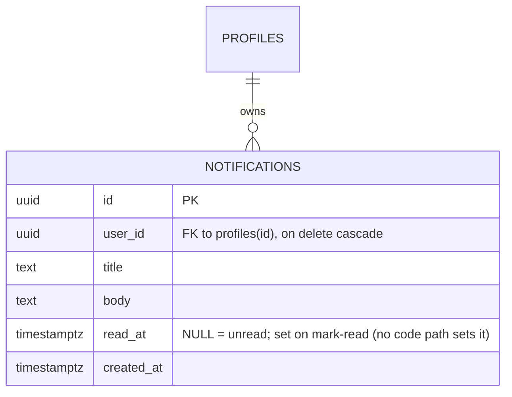

<!-- Contract: references/feature-spec-researcher-contract.md -->

# F012_InAppNotifications — Technical Spec

**Priority**: P3
**Type**: background
**Generated**: 2026-09-07

**See also:** [`functional-spec.md`](./functional-spec.md) — plain-language overview, open
decisions, requirements/business rules stated in one-liners, screens, user stories, scenarios,
edge cases, and configuration for a BA/QA audience.

**How to read this file:** this feature has no real handler. § 2 has one row (`A0`, cross-cutting)
plus one component-local UI row (`A1`) that never reaches a backend. § 3 documents exactly where
that UI stops. § 4 documents the live database side, which no code path ever calls.

## 1. Technical Overview

`notifications` is a live, RLS-protected, owner-scoped Postgres table (the only table in the schema
with zero `anon` grant of any kind), seeded with 4 demo rows for one user. `NotificationMenu`
(`components/common/notification-menu.tsx`) is the only UI surface that could consume it — a
client-only toggle that opens a panel always showing a hardcoded empty-state string. No file under
`app/`, `components/`, or `lib/` issues a Supabase query against `notifications` in either
direction. The two halves — schema and UI — were built independently and never wired together.

## 2. Action Index

| #      | Action (handler)                                          | Method · Path                          | Codes                        | Writes                                     | Detail |
| ------ | --------------------------------------------------------- | -------------------------------------- | ---------------------------- | ------------------------------------------ | ------ |
| **A0** | _cross-cutting — belongs to no single action_             | —                                      | `FR-001`, `FR-601`, `BR-001` | —                                          | § 4.4  |
| **A1** | `NotificationMenu` (client component, no backend handler) | — _(no HTTP path — pure client state)_ | `FR-401`                     | — _(no DB write — no backend call exists)_ | § 3.1  |

**Column rules:** same as `references/feature-spec-researcher-contract.md` / template — see there;
not restated here.

## 3. Actions

### 3.1 CAP-01 — Notification bell chrome (presentational only, disconnected from data)

#### A1 · Bell toggle and empty-state panel

`NotificationMenu` (client component) — no HTTP method/path; no `Controller#method` exists for this
feature.
`FR-401` · `SCR004_AboutHomepage/SCR005_AwardInfoScreen/SCR006_SunKudosBoard` (chrome only — F012
owns none of these screens)

**Who** · any signed-in user who reaches a screen using `SiteHeader` — those screens already sit
behind `PERM001_GlobalSessionGate` (functional-spec.md's twin never elaborates this further; the
gate belongs to the screens' owning features, not F012).
**FE** · `components/common/notification-menu.tsx:25-46` — a `useState` boolean (`open`) toggles on
bell click; `notification-menu.tsx:48-58` conditionally renders a `role="dialog"` panel that always
shows `t("common:notifications.empty")` — a single fixed i18n string, never data-driven. The red
badge dot (`notification-menu.tsx:45`) is unconditional markup in the button — no expression reads
any unread count or queries any table.
**Request** · _no HTTP request, no Supabase call_ — the toggle is 100% component-local React state.
**BE** · _none_ — no controller, no Server Action, no route handler exists for this feature.
**Rule** · this action decides nothing beyond open/closed panel visibility; there is no branching
logic that reads `notifications` data (confirmed — see § 5.3 for the searches run).
**Result** · **no DB write, no DB read** — opening the panel never issues a query. The badge dot is
static; it never reflects the 2 unread demo rows actually seeded for the demo user
(`supabase/seed.sql:453-464`) or any other user's rows. See functional-spec.md § 11 for the
known-issue framing of this gap.
**Source:** `components/common/notification-menu.tsx:1-61` (whole file — no deeper call chain
exists; this is the entire implementation)

<!-- No diagram: below threshold — writes 0 tables, is not a background/async action. The block's
     real content ("here is where the wiring stops") is better read as prose than forced into a
     sequence the code doesn't have. -->

---

### 3.2 Edge cases

| Action | Scenario                                                                                         | Behavior                                                                                                                                                                                             |
| ------ | ------------------------------------------------------------------------------------------------ | ---------------------------------------------------------------------------------------------------------------------------------------------------------------------------------------------------- |
| A1     | User clicks the bell with the demo user's 2 unread + 2 read seed rows present in `notifications` | Panel still shows the fixed empty-state string; seeded rows are never fetched or rendered                                                                                                            |
| A1     | User clicks the bell repeatedly                                                                  | Client-only toggle flips `open` each time; `useClickOutside` (`use-click-outside.ts`, referenced `notification-menu.tsx:5,30`) closes the panel on an outside click — no network activity either way |
| A0     | A future INSERT into `notifications` for any user (e.g., a kudo-received event)                  | No effect on any UI — no code path re-fetches or subscribes to this table; the row is invisible until a query layer is added                                                                         |

## 4. Shared Foundation

### 4.1 Components

| Component          | Responsibility                                           | Used in | File                                      |
| ------------------ | -------------------------------------------------------- | ------- | ----------------------------------------- |
| `NotificationMenu` | Toggle + hardcoded empty-state panel; zero data fetching | A1      | `components/common/notification-menu.tsx` |

### 4.2 Data Model



| Entity         | Table           | Used for                                                                                              | Action                         |
| -------------- | --------------- | ----------------------------------------------------------------------------------------------------- | ------------------------------ |
| `Notification` | `notifications` | One row per in-app notification for one user; unread state is `read_at IS NULL`, not a boolean column | A0 (schema exists, unconsumed) |

#### Polymorphic Behavior

N/A — no discriminator fields in Key Entities (`docs/generated/entities.md` § MODEL008_NOTIFICATIONS
records zero DISC-### entries; `read_at` null-vs-set is a state transition, not a fixed enum).

### 4.3 State Management

None. `read_at` transitions from NULL to a timestamp on mark-read in principle, but no code path
ever performs that write (no UPDATE against `notifications` found anywhere in `app/`, `components/`,
`lib/`), so there is no observed state machine to diagram — see § 5.3 Unresolved Questions.

### 4.4 Shared Rules

#### Bin 3 — cross-cutting, belongs to no single action

**A0 · `FR-001` / `FR-601` / `BR-001` — the database enforces owner-only access to `notifications`
independent of any application code.**
Row Level Security: `"notifications readable by self"` (`SELECT ... USING (user_id = auth.uid())`)
and `"notifications update by self"` (`UPDATE ... USING (user_id = auth.uid())`), both `to
authenticated` only. Table grants: `revoke all on public.notifications from anon, authenticated;
grant select, update on public.notifications to authenticated;` — the only table in the schema with
**zero `anon` grant of any kind** (`docs/generated/permissions-matrix.md` PERM011, live-verified).
No INSERT/DELETE policy exists for any role — new rows can only ever come from a seed script or a
`service_role` process (a future trigger, e.g. on kudo-received), never from client code even if the
UI were wired up. This is DB-layer defense-in-depth for a feature whose application layer does not
exist yet — **not this feature's own rule to satisfy, since it has no actions that touch the
table**, but recorded here because A0 is the only row that can claim `FR-601`.
**Source:** `supabase/migrations/20260723090000_notifications.sql:1-32` ·
`supabase/migrations/20260906195000_table_grants_hardening.sql:66-76`

### 4.5 Algorithms & Integrations

None. No computation, no external integration, no queue job, no notification-dispatch mechanism
exists for this feature — confirmed by the searches in § 5.3.

### 4.6 Configuration

`N/A — no technical configuration beyond framework defaults.`

**Client behavior:** see
[`behavior-logic.md`](../../generated/behavior-logic.md) (client-side patterns — debounce, optimistic UI, polling, upload, realtime),
[`permissions.md`](../../system/permissions.md) (feature flags / experiments / env / locale gates),
[`screen-flow.md`](../../generated/screen-flow.md) (guards / deep-link state restoration / unsaved-changes protection).

## 5. Verification & Technical Notes

### 5.1 Technical Verification

- **SC-000** _(A0)_ `notifications` table exists with columns `id`, `user_id`, `title`, `body`,
  `read_at`, `created_at`, RLS enabled, and owner-scoped `SELECT`/`UPDATE` policies —
  independently verifiable via `\d notifications` / `information_schema.columns` against
  `supabase/migrations/20260723090000_notifications.sql:1-32` (covers FR-001).
- **SC-001** _(A1)_ Clicking the bell toggles `role="dialog"` panel visibility; panel content is
  byte-identical regardless of what rows exist in `notifications` (covers FR-401).
- **SC-002** _(A0)_ `information_schema.role_table_grants` for `notifications` shows no `anon` row
  and no INSERT/DELETE grant for any role (covers FR-601, BR-001).

No `US###` block: `feature-list.md`'s F012 entry and `user-stories.md`'s Inert Elements table both
confirm zero User Stories are claimed by this feature — `NotificationMenu`'s toggle is classified as
an inert element, not a wired interaction.

### 5.2 Assumptions

- _(A1)_ The badge dot and panel are assumed to be intentionally left disconnected for this phase
  (matching the component's own source comment, "Presentational -- ... no real notification data is
  fetched") rather than a broken integration — this pass does not have access to a roadmap ticket
  confirming intent either way.
- _(A0)_ The 4 seed rows (`supabase/seed.sql:453-464`) are assumed to exist purely to make the
  schema/RLS demonstrable in local dev, not because any consumer reads them; no consumer was found.

### 5.3 Unresolved Questions

1. **Query-layer absence** _(A1)_: confirmed via `grep -rn '\.from("notifications"' app/ components/
lib/ supabase/` (zero matches) and `grep -rniI "notification" app/ components/ lib/ -l` (five
   files: `notification-menu.tsx` itself, `site-header.tsx`'s import of the component, the generated
   `lib/supabase/database.types.ts` type definitions, and the two locale files
   `lib/i18n/locales/en/common.json` / `lib/i18n/locales/vi/common.json` that define the
   `notifications.empty` i18n key the component renders) — no query, insert, or realtime
   subscription against `notifications` exists anywhere in the app or lib trees. Not confirmable:
   whether a query layer was ever started and reverted, or never attempted.
2. **Notification-generation trigger** _(A0)_: `grep -rn "INSERT INTO notifications" supabase/`
   matches nothing — the actual seed statement is lowercase and schema-qualified. Confirmed via
   `grep -rni "insert into.*notifications" supabase/`, matching only `supabase/seed.sql:453` (a
   one-time seed insert, not a trigger) — no `AFTER INSERT`/`AFTER UPDATE` trigger on `kudos`,
   `kudo_hearts`, or `secret_box_icons` writes a `notifications` row despite two of the four seeded
   demo titles ("Bạn nhận được Kudo mới", "Hộp bí mật đã mở khoá") thematically describing exactly
   those events. Not confirmable: whether such a trigger was planned and never built, since no
   ticket or comment states an intent either way.
3. **Mark-read UI** _(A1)_: the RLS policy `"notifications update by self"` exists at the DB layer,
   but no UI element (no button, no click handler) sets `read_at` anywhere in
   `notification-menu.tsx`. Not confirmable from source whether a mark-read affordance was designed
   and dropped, or never scoped for this phase.

### 5.4 Source References

| Action | Order | Symbol                                    | Path                                                                  | Purpose                                                                                               |
| ------ | ----- | ----------------------------------------- | --------------------------------------------------------------------- | ----------------------------------------------------------------------------------------------------- |
| —      | 1     | `Notification` (table)                    | `supabase/migrations/20260723090000_notifications.sql:1-32`           | entity this feature revolves around; RLS + grants defined here                                        |
| A0     | 2     | grant hardening                           | `supabase/migrations/20260906195000_table_grants_hardening.sql:66-76` | closes the `anon`/`authenticated` TRUNCATE/DELETE/UPDATE hole; re-states the SELECT/UPDATE-only grant |
| A1     | 3     | `NotificationMenu`                        | `components/common/notification-menu.tsx:1-61`                        | entire client-side implementation — toggle + hardcoded empty-state panel                              |
| A1     | 4     | `SiteHeader` (mount point, owned by F007) | `components/homepage/site-header.tsx:8,40`                            | mounts `NotificationMenu` in the shared header used on SCR004/SCR005/SCR006                           |
| —      | 5     | seed data                                 | `supabase/seed.sql:450-464`                                           | 4 demo rows (2 unread, 2 read) for the demo user — inert, never queried                               |

#### Data Flow

```text
{no request/event payload} -> button click flips local `open` boolean -> {no DB read/write} -> fixed empty-state string re-renders
```

The entire "flow" is client-local state; there is no payload, no handler transformation, and no DB
round-trip to trace.

### 5.5 Artifact References

| Artifact           | File                                                           | Codes Used             | Reviewed |
| ------------------ | -------------------------------------------------------------- | ---------------------- | -------- |
| System Overview    | [overview.md](../../system/overview.md)                        | —                      | [x]      |
| Feature List       | [feature-list.md](../../generated/feature-list.md)             | F012                   | [x]      |
| Entities           | [entities.md](../../generated/entities.md)                     | MODEL008               | [x]      |
| Screens            | [functional-spec.md § 6](./functional-spec.md#6-screens)       | SCR004, SCR005, SCR006 | [x]      |
| Permissions Matrix | [permissions-matrix.md](../../generated/permissions-matrix.md) | PERM011                | [x]      |
| User Stories       | [user-stories.md](../../generated/user-stories.md)             | —                      | [x]      |

**Rule:** Every code listed in Codes Used exists in its source artifact — verified above by direct
grep against each cited file.
