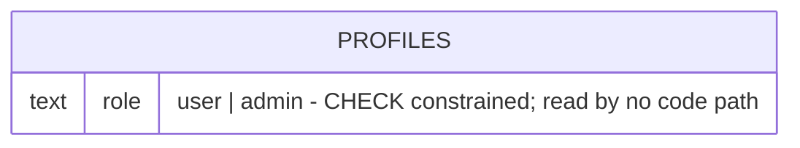

<!-- Contract: references/feature-spec-researcher-contract.md -->

# F013_AdminRoleGate — Technical Spec

**Priority**: P3
**Type**: background
**Generated**: 2026-09-07

**See also:** [`functional-spec.md`](./functional-spec.md) — plain-language overview, open
decisions, requirements/business rules stated in one-liners, screens, user stories, scenarios,
edge cases, and configuration for a BA/QA audience.

**How to read this file:** this feature has no real handler. § 2 has one cross-cutting row (`A0`,
the closed database-privilege boundary) plus one UI row (`A1`, an inert menu item that never
reaches a backend). § 3 documents exactly where that UI stops. § 4 documents the live database side
— a privilege hole that WAS real and IS now closed, independent of any application code.

## 1. Technical Overview

`profiles.role` (`MODEL001_PROFILES`) is a live, CHECK-constrained column (`user`/`admin`) read by
no application code anywhere in `app/`, `components/`, `lib/`, or `hooks/`. The one UI surface that
alludes to it — `UserMenu`'s "Admin Dashboard" item — renders unconditionally for every signed-in
member, with no `onClick` and no role check. No route, RLS policy, or screen branches on `role`
today. A separate, already-shipped migration closed the one real privilege-escalation path this
column could open — self-promotion via a direct column write — by scoping `authenticated`'s UPDATE
grant to exclude `role`.

## 2. Action Index

| #      | Action (handler)                              | Method · Path                           | Codes                        | Writes                        | Detail |
| ------ | --------------------------------------------- | --------------------------------------- | ---------------------------- | ----------------------------- | ------ |
| **A0** | _cross-cutting — belongs to no single action_ | —                                       | `FR-001`, `FR-602`, `BR-002` | —                             | § 4.4  |
| **A1** | _(no handler — button has no `onClick`)_      | — _(no HTTP path — pure static markup)_ | `FR-601`, `BR-001`           | — _(no write, no navigation)_ | § 3.1  |

**Column rules:** same as `references/feature-spec-researcher-contract.md` / template — see there;
not restated here.

## 3. Actions

### 3.1 CAP-01 — Admin role placeholder (declared, unenforced)

#### A1 · "Admin Dashboard" menu item (renders, no handler)

_(no handler wired — the button carries no `onClick` prop)_
`FR-601` `BR-001`

**Who** · any signed-in member — the item is not gated by role; a `user`-role row and an
`admin`-role row see it identically.
**FE** · `components/homepage/user-menu.tsx:95-99` renders the "Admin Dashboard" `<li>`/`<button>`
unconditionally, with no `onClick` prop and no conditional wrapper on `role`. Compare `user-menu.tsx:100-111`,
the "Sign out" `<li>` immediately below it, which DOES carry an `onClick={() => handleSignOut()}` —
the missing handler on this item is not a rendering-code limitation, the sibling item proves the
pattern for wiring one in.
**Request** · none — the button has no click handler, so no request, navigation, or state change is
triggered by clicking it.
**BE** · none — no route, Server Action, or API handler exists for this item.
**Rule** · **BR-001 — the `role` column is declared but read by no code path.** Confirmed by grep
across `app/`, `components/`, `lib/`, `hooks/`, `constants/` (see § 5.3) — the only match for
`role` as a data field (as opposed to an ARIA `role` attribute) is the generated
`lib/supabase/database.types.ts` type declaration; no `.role`, `isAdmin`, `is_admin`, or a literal
`'admin'`/`"admin"` comparison exists in application logic.
**Result** · no observable effect — clicking the button produces no navigation, no toast, no
network call, regardless of the clicking member's actual `role` value in the database.
**Source:** `components/homepage/user-menu.tsx:95-99`

<!-- No diagram: below threshold — writes 0 tables, is not a background/async action. The block's
     real content ("here is where the wiring stops") is better read as prose than forced into a
     sequence the code doesn't have. -->

---

### 3.2 Edge cases

| Action | Scenario                                                                                                                              | Behavior                                                                                                                                                      |
| ------ | ------------------------------------------------------------------------------------------------------------------------------------- | ------------------------------------------------------------------------------------------------------------------------------------------------------------- |
| A1     | A `user`-role member clicks "Admin Dashboard"                                                                                         | No navigation, no request, no error — the button has no handler                                                                                               |
| A1     | An `admin`-role member (`role='admin'` in the database, e.g. the seeded demo admin at `supabase/seed.sql:447`) clicks the same button | Identical to a `user`-role member — `role`'s value makes no observable difference anywhere in the app                                                         |
| A0     | Any authenticated member attempts to write `role` directly (e.g. a hand-crafted PostgREST `PATCH` naming the column)                  | Rejected at the database privilege layer with `insufficient_privilege` before RLS is even evaluated — `role` is outside `authenticated`'s UPDATE-column grant |

## 4. Shared Foundation

### 4.1 Components

| Component  | Responsibility                                                                                                                            | Used in | File                                |
| ---------- | ----------------------------------------------------------------------------------------------------------------------------------------- | ------- | ----------------------------------- |
| `UserMenu` | Account dropdown; renders the (inert) "Admin Dashboard" item alongside Profile/Sign out — F013 owns only this one item, not the component | A1      | `components/homepage/user-menu.tsx` |

### 4.2 Data Model



| Entity                        | Table      | Used for                                                  | Action |
| ----------------------------- | ---------- | --------------------------------------------------------- | ------ |
| `Profile` (MODEL001_PROFILES) | `profiles` | Declares the `role` classification this feature documents | A0, A1 |

#### Polymorphic Behavior

N/A — no discriminator fields in Key Entities. `docs/generated/entities.md` § MODEL001_PROFILES
explicitly withholds a `DISC-###` for `role` on this exact basis: it is a real 2-value enum, but no
consuming code branches on either value yet, so no discriminator was assigned.

### 4.3 State Management

None. `role` has two allowed values but no observed writer and no observed transition anywhere in
the app — see § 5.3 Unresolved Questions.

### 4.4 Shared Rules

#### Bin 3 — cross-cutting, belongs to no single action

**A0 · `FR-001` / `FR-602` / `BR-002` — `profiles.role` carries its own database-privilege
boundary, independent of any action, and that boundary was NOT always in place.**
`profiles.role` (`text NOT NULL DEFAULT 'user' CHECK IN ('user','admin')`, added
`supabase/migrations/20260723091000_profiles_role.sql:5-7`) is declared for every profile row.
Before `supabase/migrations/20260906190000_profiles_column_privileges.sql`, this was a live
privilege-escalation path: the only UPDATE policy on `profiles` ("profiles updatable by owner",
`20260716090000_profile_language.sql`) scopes WHICH ROW may be updated (`auth.uid() = id`) — Postgres
RLS has no per-column `WITH CHECK`, so it never restricted WHICH COLUMN — and a pre-existing
schema-level default ACL (`ALTER DEFAULT PRIVILEGES ... IN SCHEMA public`) granted `ALL` (`arwdDxtm`)
to both `anon` and `authenticated` on every table the instant it was created, `profiles` included.
Combined, any signed-in member could run an `UPDATE profiles SET role = 'admin'` on their own row
and self-promote (equally true of `hero_badge`/`hero_code`/`boxes_opened`/`boxes_unopened`).
`20260906190000_profiles_column_privileges.sql` closed it: `revoke all on public.profiles from
anon, authenticated;` then `grant select on public.profiles to anon, authenticated;` and `grant
update (display_name, avatar_url, language) on public.profiles to authenticated;` — `role` is
excluded from that column list, so the same `UPDATE ... SET role = 'admin'` now fails at the
database privilege layer, independent of and prior to RLS. `supabase/tests/privileges.sql`
codifies this live: it runs the exact escalation attempt as the `authenticated` role against a
seeded non-admin user and requires an `insufficient_privilege` exception (lines 40-48), plus a
`has_column_privilege('authenticated', 'public.profiles', 'role', 'UPDATE')` check that must read
false (lines 147-149) — both currently pass. This is a database-layer guarantee that applies to the
whole table, not any one action; it is why F013 records the hole as CLOSED rather than as an open
risk (see functional-spec.md § 11).
**Source:** `supabase/migrations/20260906190000_profiles_column_privileges.sql:53-57` ·
`supabase/tests/privileges.sql:40-48,147-149` ·
`supabase/migrations/20260723091000_profiles_role.sql:5-7`

### 4.5 Algorithms & Integrations

None. No computation, no external integration, no queue job consumes `role`.

### 4.6 Configuration

`N/A — no technical configuration beyond framework defaults.`

**Client behavior:** see
[`behavior-logic.md`](../../generated/behavior-logic.md) (client-side patterns — debounce, optimistic UI, polling, upload, realtime),
[`permissions.md`](../../system/permissions.md) (feature flags / experiments / env / locale gates),
[`screen-flow.md`](../../generated/screen-flow.md) (guards / deep-link state restoration / unsaved-changes protection).

## 5. Verification & Technical Notes

### 5.1 Technical Verification

- **SC-000** _(A0)_ `profiles.role` exists as declared — `text not null default 'user' check
(role in ('user', 'admin'))` — verifiable via `information_schema.columns` /
  `pg_get_constraintdef` against `supabase/migrations/20260723091000_profiles_role.sql:5-7`
  (covers FR-001).
- **SC-001** _(A1)_ Clicking "Admin Dashboard" produces zero observable effect (no navigation, no
  network call, no state change) for a member of either `role` value. (covers FR-601, BR-001)
- **SC-002** _(A0)_ An `authenticated`-role `UPDATE` naming the `role` column is rejected with
  `insufficient_privilege` before RLS is evaluated, for any signed-in member, and
  `has_column_privilege('authenticated', 'public.profiles', 'role', 'UPDATE')` reads `false`.
  (covers FR-602, BR-002)

No `US###` block: `feature-list.md`'s F013 entry and `user-stories.md`'s Inert Elements table both
confirm zero User Stories are claimed by this feature.

### 5.2 Assumptions

- _(A0)_ Assumed the migration's own account of the pre-fix default-ACL mechanism (`ALTER DEFAULT
PRIVILEGES ... IN SCHEMA public` granting `ALL` to `anon`/`authenticated` at table-creation time)
  is accurate as stated in its comment; this pass read the migration and `supabase/tests/
privileges.sql`'s passing assertions as corroboration, but did not independently query
  `pg_default_acl` against a live database.
- _(A1)_ Assumed no other file references `profiles.role` or gates on an "admin" concept beyond
  `user-menu.tsx`; this pass grepped `app/`, `components/`, `lib/`, `hooks/` for `role` (excluding
  ARIA usages), `isAdmin`, `is_admin`, and the literal `'admin'`/`"admin"`, and found no match — it
  did not run the application at runtime to rule out a dynamically-constructed check.

### 5.3 Unresolved Questions

1. **Regression coverage scope** _(A0)_: `supabase/tests/privileges.sql` is a manually-invoked
   psql script per its own header (`docker exec ... psql -f -`), not confirmed from source to run
   in CI on every pull request — whether a future migration re-widening the `authenticated` grant
   to include `role` would be caught automatically before merge is not established from source
   alone.
2. **Planned server-side gate shape** _(A0, A1)_: `plans/260906-1903-profile-and-menus/
phase-06-header-menus-admin-gate.md` describes a planned design (server-resolved `isAdmin`
   passed into `UserMenu`, plus a `/admin` route that independently re-checks `role`) — this is
   recorded as the AGREED forward direction (see functional-spec.md § Open Decisions is NOT used
   for this, since it is not this feature's open question to re-litigate), but it is unimplemented,
   and this pass cannot confirm whether or when it ships.

### 5.4 Source References

| Action | Order | Symbol                 | Path                                                                      | Purpose                                                          |
| ------ | ----- | ---------------------- | ------------------------------------------------------------------------- | ---------------------------------------------------------------- |
| —      | 1     | `profiles.role` column | `supabase/migrations/20260723091000_profiles_role.sql:5-7`                | declares the classification this feature documents               |
| A1     | 2     | `UserMenu`             | `components/homepage/user-menu.tsx:95-99`                                 | renders the inert "Admin Dashboard" item                         |
| A0     | 3     | column-privilege fix   | `supabase/migrations/20260906190000_profiles_column_privileges.sql:53-57` | closes the self-promotion hole via column-scoped GRANT           |
| A0     | 4     | regression test        | `supabase/tests/privileges.sql:40-48,147-149`                             | live assertion that `role` stays non-writable by `authenticated` |

#### Data Flow

```text
{click on "Admin Dashboard"} -> {no handler bound} -> {no request, no DB read/write, no response}
```

The entire "flow" for A1 is a rendered button with nothing wired behind it — there is no payload,
no handler transformation, and no DB round-trip to trace. A0's own thread (a rejected `UPDATE`) is
already fully stated in § 4.4's Source citation and is not a separate hop chain.

### 5.5 Artifact References

| Artifact           | File                                                           | Codes Used | Reviewed |
| ------------------ | -------------------------------------------------------------- | ---------- | -------- |
| System Overview    | [overview.md](../../system/overview.md)                        | —          | [x]      |
| Architecture       | [architecture.md](../../system/architecture.md)                | —          | [x]      |
| Feature List       | [feature-list.md](../../generated/feature-list.md)             | F013       | [x]      |
| API Map            | [api-map.md](../../generated/api-map.md)                       | —          | [x]      |
| Entities           | [entities.md](../../generated/entities.md)                     | MODEL001   | [x]      |
| Screens            | [functional-spec.md § 6](./functional-spec.md#6-screens)       | —          | [x]      |
| Behavior Logic     | [behavior-logic.md](../../generated/behavior-logic.md)         | —          | [x]      |
| Permissions Matrix | [permissions-matrix.md](../../generated/permissions-matrix.md) | PERM015    | [x]      |
| User Stories       | [user-stories.md](../../generated/user-stories.md)             | —          | [x]      |

**Rule:** Every code listed in Codes Used exists in its source artifact — verified above by direct
grep against each cited file.
