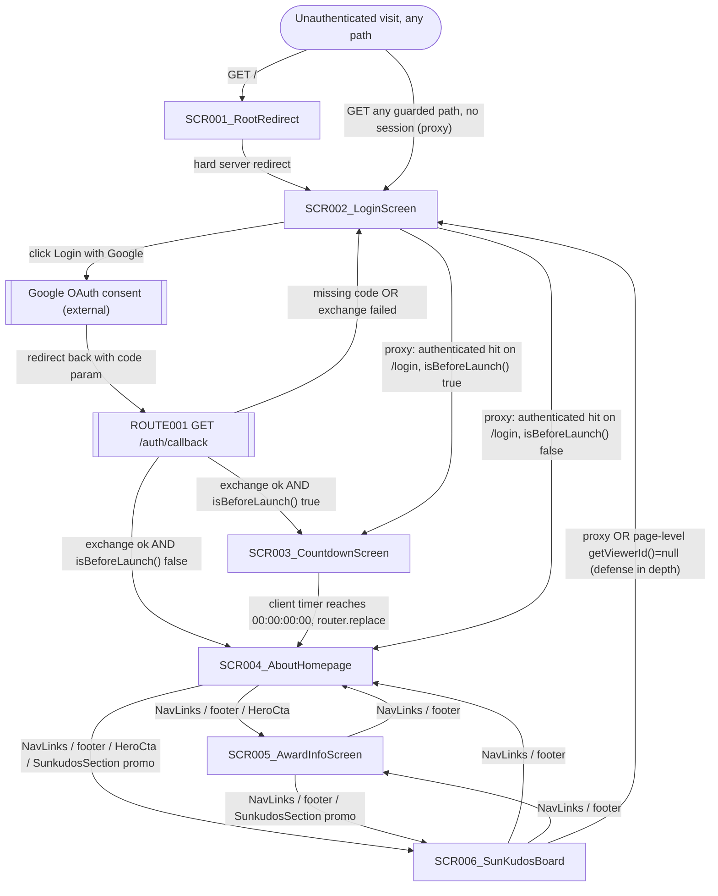
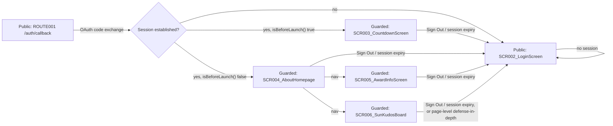

# Screen Flow

**Project**: Sun\* Annual Awards 2025 / Sun\* Kudos App
**Generated**: 2026-09-06
**Analysis Scope**: All 6 App Router pages (SCR001–SCR006, screen-list.md, W2 gate-passed draft) plus `app/auth/callback/route.ts` (ROUTE001) and the proxy auth guard (`lib/supabase/proxy.ts`).

**Code Format**: All SCR codes MUST follow `SCR###_NameSlug` format | `SCR###/REG###` for region-scoped transitions

## Navigation Map



## Feature Entry Points

_Populated by the FS.1 researchers of the `--feature-specs` pass, which is **not** part of this
core run. `feature-list.md` (F001–F013) and the scaffolded `artifacts/features/{slug}/` folders are
both in place, so FS.1 has everything it needs whenever it is run._

<!-- POPULATED_BY_W6 -->

---

## Screen Access Paths

| From Screen               | To Screen                 | Action/Trigger                                                  | Conditions                                                      | Region |
| ------------------------- | ------------------------- | --------------------------------------------------------------- | --------------------------------------------------------------- | ------ |
| Start                     | SCR001_RootRedirect       | Initial load, `GET /`                                           | None                                                            |        |
| SCR001_RootRedirect       | SCR002_LoginScreen        | Hard server `redirect("/login")`                                | None (unconditional)                                            |        |
| Start                     | SCR002_LoginScreen        | `proxy.ts` guard redirect                                       | No session AND path not `/login`/`/auth/*`                      |        |
| SCR002_LoginScreen        | (external) Google OAuth   | Click "Login with Google"                                       | `supabase.auth.signInWithOAuth()` succeeds in starting the flow |        |
| (external) Google OAuth   | ROUTE001 `/auth/callback` | OAuth provider redirect with `?code=`                           | User approved consent                                           |        |
| ROUTE001 `/auth/callback` | SCR003_CountdownScreen    | `exchangeCodeForSession` ok                                     | `isBeforeLaunch()` true                                         |        |
| ROUTE001 `/auth/callback` | SCR004_AboutHomepage      | `exchangeCodeForSession` ok                                     | `isBeforeLaunch()` false                                        |        |
| ROUTE001 `/auth/callback` | SCR002_LoginScreen        | Missing `code` OR exchange threw/failed                         | `?error=oauth_failed` appended                                  |        |
| SCR003_CountdownScreen    | SCR004_AboutHomepage      | Client countdown hits 0, `router.replace`                       | Post-mount only (`countdown-timer.tsx:47-50`)                   |        |
| SCR002_LoginScreen        | SCR003_CountdownScreen    | `proxy.ts`: authenticated hit on `/login`                       | `isBeforeLaunch()` true                                         |        |
| SCR002_LoginScreen        | SCR004_AboutHomepage      | `proxy.ts`: authenticated hit on `/login`                       | `isBeforeLaunch()` false                                        |        |
| SCR004_AboutHomepage      | SCR005_AwardInfoScreen    | `NavLinks` / footer / `HeroCta` click                           | None                                                            |        |
| SCR004_AboutHomepage      | SCR006_SunKudosBoard      | `NavLinks` / footer / `HeroCta` / `SunkudosSection` promo click | None                                                            |        |
| SCR005_AwardInfoScreen    | SCR004_AboutHomepage      | `NavLinks` / footer click                                       | None                                                            |        |
| SCR005_AwardInfoScreen    | SCR006_SunKudosBoard      | `NavLinks` / footer / `SunkudosSection` promo click             | None                                                            |        |
| SCR006_SunKudosBoard      | SCR004_AboutHomepage      | `NavLinks` / footer click                                       | None                                                            |        |
| SCR006_SunKudosBoard      | SCR005_AwardInfoScreen    | `NavLinks` / footer click                                       | None                                                            |        |
| SCR006_SunKudosBoard      | SCR002_LoginScreen        | `proxy.ts` guard OR page-level `getViewerId()===null`           | Session expired mid-visit                                       |        |
| Any header-bearing screen | SCR002_LoginScreen        | `UserMenu` → "Sign Out"                                         | `supabase.auth.signOut()` succeeds                              |        |

> Region column intentionally blank for all rows above — every listed transition is a whole-screen navigation (URL change), not a region-scoped client-state transition. Region-scoped transitions are documented separately in § Region Transitions below.

## Screen Transitions

### SCR001_RootRedirect

**Entry Points**:

- Direct URL access to `/`
- Bookmarked/typed root URL

**Exit Points**:

- To SCR002_LoginScreen: unconditional hard redirect, no condition to evaluate

**Decision Points**:

- None (single unconditional redirect)

---

### SCR002_LoginScreen

**Entry Points**:

- From SCR001_RootRedirect (redirect)
- From `proxy.ts` guard (any unauthenticated request to a non-public path)
- From ROUTE001 `/auth/callback` on OAuth failure (`?error=oauth_failed`)
- From `UserMenu` "Sign Out" (any authenticated screen)
- Direct URL access

**Exit Points**:

- To (external) Google OAuth: "Login with Google" click
- To SCR003_CountdownScreen / SCR004_AboutHomepage: `proxy.ts`'s authenticated-hits-`/login` branch (edge case — normally the user leaves via the OAuth round-trip, not by revisiting `/login` while already authenticated)

**Decision Points**:

- `?error=oauth_failed` present → show inline error message, else → clean form

---

### SCR003_CountdownScreen

**Entry Points**:

- From ROUTE001 `/auth/callback`: `isBeforeLaunch()` true
- From SCR002_LoginScreen: `proxy.ts` authenticated-hits-`/login`, `isBeforeLaunch()` true
- From `proxy.ts` guard (session already established, path `/countdown`)

**Exit Points**:

- To SCR004_AboutHomepage: client countdown reaches 0 (`countdown-timer.tsx:49`, `router.replace`)
- To SCR002_LoginScreen: session expires mid-countdown (proxy guard on next request)

**Decision Points**:

- Countdown parts null (pre-mount) → renders `00:00:00:00`/all-zero via `getServerSnapshot` fallback (hydration-safe), not an error state

---

### SCR004_AboutHomepage

**Entry Points**:

- From ROUTE001 `/auth/callback`: `isBeforeLaunch()` false
- From SCR003_CountdownScreen: client countdown expiry
- From SCR002_LoginScreen: `proxy.ts` authenticated-hits-`/login`, `isBeforeLaunch()` false
- From SCR005_AwardInfoScreen / SCR006_SunKudosBoard: nav link, footer link
- Direct URL access (if authenticated)

**Exit Points**:

- To SCR005_AwardInfoScreen: `NavLinks`/footer/`HeroCta`
- To SCR006_SunKudosBoard: `NavLinks`/footer/`HeroCta`/`SunkudosSection` promo
- To SCR002_LoginScreen: session expiry (proxy) or "Sign Out"

**Decision Points**:

- None (all content statically rendered; the two floating-widget modals are region-free client-state, not navigation)

---

### SCR005_AwardInfoScreen

**Entry Points**:

- From SCR004_AboutHomepage / SCR006_SunKudosBoard: nav link, footer link
- Direct URL access (if authenticated)

**Exit Points**:

- To SCR004_AboutHomepage: `NavLinks`/footer
- To SCR006_SunKudosBoard: `NavLinks`/footer/`SunkudosSection` promo
- To SCR002_LoginScreen: session expiry (proxy) or "Sign Out"

**Decision Points**:

- `CategoryNav` click → smooth-scroll to the matching anchor `<section>`, suppresses the scrollspy `IntersectionObserver` for 800ms (`category-nav.tsx:56-64`) — in-page scroll only, not a screen transition

---

### SCR006_SunKudosBoard

**Entry Points**:

- From SCR004_AboutHomepage / SCR005_AwardInfoScreen: nav link, footer link, promo link
- Direct URL access, optionally with `?tag={hashtagId}` (if authenticated — see Guard Logic)

**Exit Points**:

- To SCR004_AboutHomepage / SCR005_AwardInfoScreen: `NavLinks`/footer
- To SCR002_LoginScreen: proxy guard OR page-level `getViewerId()===null` (defense in depth) OR "Sign Out"

**Decision Points**:

- `getViewerId()` returns `null` → `redirect("/login")` (`app/sun-kudos/page.tsx:69-71`) — this is a decision point INSIDE the screen's own render, not just the outer proxy guard
- `?tag=` param parses to a valid integer → applied as the active hashtag filter (shared by REG001/REG003); anything else (missing, non-numeric, non-integer) → `null` (no filter), silently (`parseHashtagParam`, `page.tsx:43-48`)

---

## Region Transitions

> Region transitions are client-state (no URL change, except the deep-link `?tag=` case noted separately below).

| From Region                                                             | To Target                        | Action/Trigger                                                          | Client-State Only                                                                                                                                                       |
| ----------------------------------------------------------------------- | -------------------------------- | ----------------------------------------------------------------------- | ----------------------------------------------------------------------------------------------------------------------------------------------------------------------- |
| SCR004_AboutHomepage (screen-level, `WidgetButton`)                     | SaaRulesDrawer (modal)           | Click floating widget's "Rules" pill                                    | Yes                                                                                                                                                                     |
| SCR004_AboutHomepage → SaaRulesDrawer                                   | KudosFormModal (modal)           | Click drawer's "Write KUDOS" footer button                              | Yes                                                                                                                                                                     |
| SCR004_AboutHomepage (screen-level, `WidgetButton`)                     | KudosFormModal (modal)           | Click floating widget's "Write KUDOS" pill directly                     | Yes                                                                                                                                                                     |
| SCR006_SunKudosBoard (screen-level, `WriteKudosBar`)                    | KudosFormModal (modal)           | Click give-kudos pill                                                   | Yes                                                                                                                                                                     |
| SCR006_SunKudosBoard/REG004 (Sidebar)                                   | SidebarGiftDialog (modal)        | Click "Open Secret Box" button                                          | No — writes `open_secret_box()` RPC (ROUTE005) server-side on box-open click inside the dialog                                                                          |
| SCR006_SunKudosBoard/REG003 (AllKudosFeed)                              | FeedImageLightbox (modal)        | Click an attachment thumbnail on any kudo card                          | Yes                                                                                                                                                                     |
| SCR006_SunKudosBoard/REG001 (HighlightCarousel) ↔ REG003 (AllKudosFeed) | (shared) active hashtag filter   | Click a hashtag chip in either region, or the Highlight filter dropdown | No — the URL's `?tag=` param changes (`useHashtagFilter`), so both regions re-render from the new filter; the Feed's ancestor is keyed on the filter and fully remounts |
| SCR006_SunKudosBoard/REG001 (HighlightCarousel)                         | (internal) slide index           | Click prev/next arrow                                                   | Yes                                                                                                                                                                     |
| SCR006_SunKudosBoard/REG002 (SpotlightNameCloud)                        | (internal) pan/zoom/search state | Drag, zoom controls, or type in the search box                          | Yes                                                                                                                                                                     |

---

## Authentication Flow



| Screen                 | Authentication Required                                    | Authorization Level | Notes                                                                                                                                                                     |
| ---------------------- | ---------------------------------------------------------- | ------------------- | ------------------------------------------------------------------------------------------------------------------------------------------------------------------------- |
| SCR001_RootRedirect    | N/A (redirect only, no content)                            | Public              | Never itself checked — redirects to SCR002 before any guard would matter                                                                                                  |
| SCR002_LoginScreen     | No (`isPublicPath`)                                        | Public              | Only path besides `/auth/*` excluded from the proxy guard                                                                                                                 |
| SCR003_CountdownScreen | **Yes** (proxy guard)                                      | Authenticated user  | Page-level comment claims "no auth guard" — stale/discrepant, see screen-list.md                                                                                          |
| SCR004_AboutHomepage   | **Yes** (proxy guard)                                      | Authenticated user  | No page-level guard comment contradicts this one directly, but `award-info`'s comment (which calls `/` "unguarded") implies the same stale assumption                     |
| SCR005_AwardInfoScreen | **Yes** (proxy guard)                                      | Authenticated user  | Page-level comment explicitly claims "Presentational, no auth guard... deferred to a later auth epic" — stale relative to shipped `proxy.ts`                              |
| SCR006_SunKudosBoard   | **Yes** (proxy guard AND page-level `getViewerId()` check) | Authenticated user  | Double-guarded; page's own comment calls the page-level check "defense in depth, not the primary gate" — contradicts an earlier feature-spec claim of "no login required" |

## Error Handling Flows

| Screen                                              | Error                                                                                                                    | Handling                                                                                                                                         | Scope                                                            |
| --------------------------------------------------- | ------------------------------------------------------------------------------------------------------------------------ | ------------------------------------------------------------------------------------------------------------------------------------------------ | ---------------------------------------------------------------- |
| ROUTE001 `/auth/callback`                           | Missing `code` param, OR `exchangeCodeForSession` returns `{error}`, OR the call throws (network/GoTrue/trigger failure) | All three collapse to the same `redirect("/login?error=oauth_failed")` — deliberately opaque (DEC-003 per source comment)                        | screen (redirects to SCR002)                                     |
| SCR002_LoginScreen                                  | `signInWithOAuth` rejects or returns `{error}` (offline, DNS failure, missing env vars)                                  | Inline error message shown (`data-testid="google-login-error"`), button re-enabled                                                               | screen                                                           |
| SCR006_SunKudosBoard/REG003 (AllKudosFeed)          | `loadFeedPage` Server Action call fails                                                                                  | Silently stops appending; sentinel stays mounted so the next scroll intersection retries (`feed-list.tsx:82-86`) — no error UI shown to the user | region:REG003                                                    |
| SCR006_SunKudosBoard/REG004 (Sidebar)               | `openSecretBox()` returns `{ok:false, error:"empty"}` or another failure                                                 | Inline error text inside the dialog (`data-testid="secret-box-error"`); `error:"empty"` also forces the local count to 0                         | region:REG004 (surfaced inside the dialog, not the panel itself) |
| SCR006_SunKudosBoard (screen-level, KudosFormModal) | `submitKudoAction` returns `{ok:false, fieldErrors}` or a generic failure                                                | Field-level errors shown inline; unrecognized failure shows a generic error message; modal stays open                                            | screen (modal is not region-scoped)                              |
| SCR006_SunKudosBoard/REG002 (SpotlightNameCloud)    | Search yields zero matches                                                                                               | Shows an empty-state message inside the board (not an error, a designed empty state)                                                             | region:REG002                                                    |
| SCR003_CountdownScreen                              | `useCountdown` parts `null` (pre-mount)                                                                                  | Renders the zeroed initial snapshot (hydration-safe), not an error                                                                               | screen                                                           |

## Circular Dependencies Check

- [x] No circular dependencies detected — SCR004/SCR005/SCR006 form a fully-connected navigation triangle (standard multi-page nav, not a cycle defect)
- [x] All screens have valid entry/exit points
- [x] All navigation paths terminate (every path above eventually reaches SCR002, SCR003, SCR004, SCR005, or SCR006 with no dead end)

---

## Guard Logic

### GUARD-001 — Blanket proxy auth guard on every path except `/login` and `/auth/*`

**trigger:** `proxy` (Next.js 16 renamed `middleware.ts`→`proxy.ts`, exported fn `middleware`→`proxy`)
**source:** `lib/supabase/proxy.ts:44-91` (matcher config in `proxy.ts:12-14`)
**logic:**

```pseudo
if (!user && !isPublicPath(pathname)) → redirect /login  (preserving refreshed cookies)
if (user && pathname === "/login") → redirect isBeforeLaunch() ? "/countdown" : "/about"
else → pass through (supabaseResponse, cookies already refreshed)
```

**failure path:** unauthenticated on a guarded path → `/login`; authenticated revisiting `/login` → `/countdown` or `/about`

---

### GUARD-002 — Sun-Kudos page-level defense-in-depth

**trigger:** server component body (not a route-level guard mechanism — an inline check)
**source:** `app/sun-kudos/page.tsx:68-71`
**logic:**

```pseudo
viewerId = await getViewerId()
if (!viewerId) → redirect("/login")
```

**failure path:** redirect `/login` — the page's own comment states this exists only to catch a session that expired between `proxy.ts`'s check and this render; it is explicitly NOT the primary gate.

---

## Deep-Link State Restoration

### SCR006_SunKudosBoard

**URL pattern:** `/sun-kudos?tag={hashtagId}`
**State restored:**

| Param | Restores                                                                                                 | Default if missing |
| ----- | -------------------------------------------------------------------------------------------------------- | ------------------ |
| `tag` | Active hashtag filter, shared by REG001_HighlightCarousel and REG003_AllKudosFeed via `useHashtagFilter` | `null` (no filter) |

**Failure mode:** a non-numeric or non-integer `tag` value is silently parsed to `null` (no filter applied) — `parseHashtagParam` (`app/sun-kudos/page.tsx:43-48`) returns `null` for anything that doesn't pass `Number.isInteger`; no error is shown, no redirect occurs.

---

## Unsaved-Changes Protection

`N/A — no unsaved-changes guards detected.` Checked: `KudosFormModal` fully resets its draft on every open/close transition (no `isDirty`/`beforeunload` check found, `kudos-form-modal.tsx:63-101`); `AddlinkBox` likewise resets on open with no dirty-check; `SaaRulesDrawer` is read-only, nothing to protect.

---

## Extraction Signatures

### Guard Logic

`proxy` exported function in `proxy.ts` (Next.js 16 naming) calling into `lib/supabase/proxy.ts`'s `updateSession`; inline page-body `redirect()` calls following a server-side auth/state check (e.g. `app/sun-kudos/page.tsx`).

### Deep-Link State Restoration

`searchParams: Promise<{...}>` destructured in an async page component (Next.js 16 pattern, e.g. `app/sun-kudos/page.tsx:38,65`), followed by a parse-and-default function (`parseHashtagParam`).

### Unsaved-Changes Protection

`beforeunload|onbeforeunload|usePrompt|useBeforeUnload|leaveGuard|isDirty|formState\.isDirty` — none found in this codebase's modal/drawer components.
