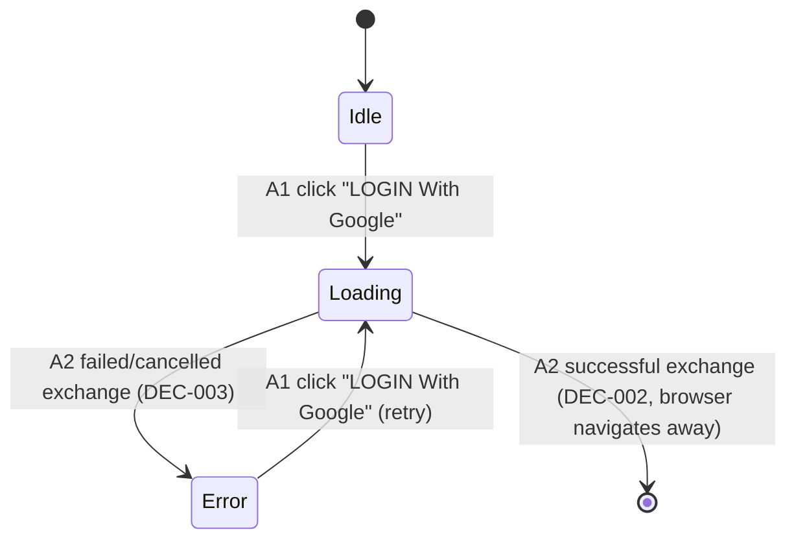

# F000_GoogleSignIn

**Priority**: P1
**Type**: mixed
**Generated**: 2026-09-06

**See also:** [`functional-spec.md`](./functional-spec.md) — plain-language overview, open
decisions, requirements/business rules stated in one-liners, screens, user stories, scenarios,
edge cases, and configuration for a BA/QA audience.

**How to read this file:** § 2 is the index — pick the action you care about and read its block
in § 3 straight through; each block is one complete thread, top to bottom. § 4 is the shared
appendix — jump in only when a § 3 block points you there.

## 1. Technical Overview

A Sun* member signs in to SAA 2025 with their Google account. The browser calls Supabase Auth
(GoTrue) via `@supabase/ssr`'s browser client, which runs the Google OAuth consent flow and
redirects back through `app/auth/callback/route.ts` (planned), which exchanges the returned code
for a session. `proxy.ts` (planned — the Next.js 16 successor to `middleware.ts`) refreshes that
session on every request and redirects an unauthenticated visitor to `/login`, and an already
signed-in visitor away from it. The UI shell (header, hero visual, Google button, footer) already
ships; this feature wires the button to real OAuth and adds the session/guard layer around it.

## 2. Action Index

| #      | Action (handler)                                | Method · Path                                                      | Codes                                                                 | Writes                                              | Detail |
| ------ | ----------------------------------------------- | ------------------------------------------------------------------ | --------------------------------------------------------------------- | --------------------------------------------------- | ------ |
| **A0** | _cross-cutting — session refresh + route guard_ | —                                                                  | FR-001, FR-002, FR-101, FR-102, FR-401, FR-601, BR-001, BR-002, US002 | — _(session cookie only, no DB table)_              | § 4.4  |
| **A1** | `HeroSection#handleLogin` (planned)             | — _(client-side interaction; invokes the browser Supabase client)_ | FR-201, SM-001, US001                                                 | — _(no DB write; browser-managed PKCE cookie only)_ | § 3.1  |
| **A2** | `app/auth/callback/route.ts#GET` (planned)      | `GET` `/auth/callback`                                             | FR-202, FR-203, DEC-001, DEC-002, DEC-003, US001                      | — _(session cookie only, no DB table)_              | § 3.1  |

## 3. Actions

### 3.1 CAP-01 — GoogleSignIn

#### A1 · Start Google sign-in

`—` → `` `HeroSection#handleLogin` `` (planned)
`FR-201` `SM-001` `US001` · `SCR-login`

**Who** · Sun* member (unauthenticated visitor) _(gate A0 — § 4.4)_
**FE** · `components/login/google-login-button.tsx:19-54` renders the "LOGIN With Google" button
via `GoogleLoginButton` — already accepts `onClick`/`loading` and shows a spinner +
`aria-busy="true"` while `loading` is true. The parent `HeroSection` currently wires `onClick` to
a no-auth stand-in (`components/login/hero-section.tsx:25-27`); this action replaces that body
with a real `signInWithOAuth` call, setting `loading` true first.
**Request** · no HTTP request from this action itself — it constructs the `redirectTo` option
passed to `supabase.auth.signInWithOAuth({ provider: "google", options: { redirectTo } })`
**BE** · none — this action runs entirely in the browser via the planned browser Supabase client
factory (`lib/supabase/client.ts`, not yet written)
**Rule** · this action makes NO routing decision. `redirectTo` is the fixed, query-string-free
value `${location.origin}/auth/callback`. The post-login destination is decided later, by A2
(DEC-001), so that no client-controlled value is ever reflected into a redirect.

**Result** · no DB write. The browser is redirected to Supabase's `/auth/v1/authorize` endpoint
(external, GoTrue) with a bare `redirectTo`;
`@supabase/ssr` stores its own PKCE verifier cookie internally. The button switches to its
`loading` visual state for the whole time the member is away on Google's consent screen.
**State** · `SM-001`: `idle` → `loading` _(§ 4.3)_
**Source:** `components/login/hero-section.tsx:25-27` (existing no-auth stand-in, to be rewired)
→ TBD (draft) (planned `signInWithOAuth` call, `lib/supabase/client.ts` not yet written)

<!-- No diagram: below threshold — single client-side call, no DB write, no background step. -->

---

#### A2 · Exchange OAuth code for a session

`GET` `/auth/callback` → `` `app/auth/callback/route.ts#GET` `` (planned)
`FR-202` `FR-203` `DEC-001` `DEC-002` `DEC-003` `US001` · `SCR-login` · `INT-001`

**Who** · Sun* member, mid-redirect — GoTrue sends the browser here; the member never
interacts with this route directly _(gate A0)_
**FE** · none — server-side Route Handler; no page renders at this URL
**Request** · query param `code` (PKCE authorization code, string) on success; `error` /
`error_description` on Google-side denial (exact param set MEDIUM confidence — see § 5.3)
**BE** · `app/auth/callback/route.ts#GET` (planned) reads `code` from `new URL(request.url)` and
calls the planned server Supabase client's `exchangeCodeForSession(code)`
**Rule** · decides whether the exchange succeeded and where to send the member next:

| DEC         | subtype | Condition                                                                                   | What the user sees                                                                | Source                          |
| ----------- | ------- | ------------------------------------------------------------------------------------------- | --------------------------------------------------------------------------------- | ------------------------------- |
| **DEC-001** | flow    | `isBeforeLaunch()` — `now < NEXT_PUBLIC_LAUNCH_AT`, evaluated server-side inside this route | redirected to `/countdown` when true, `/about` when false                         | `lib/countdown-config.ts:27-30` |
| **DEC-002** | flow    | `code` present AND `exchangeCodeForSession` returns no error                                | redirected to the DEC-001 target, recomputed here — never read from the request   | TBD (draft)                     |
| **DEC-003** | flow    | `code` missing, OR `exchangeCodeForSession` returns an error                                | redirected to `/login?error=oauth_failed`; the localized failure message is shown | TBD (draft)                     |

**Result** · no DB write — writes the Supabase session cookie
(`sb-<project-ref>-auth-token`, `base64-`-prefixed) via the server client's cookie adapter on
success (DEC-002). User sees a full-page redirect away from `/auth/callback` either way; the URL
itself never renders.
**Source:** TBD (draft) — `app/auth/callback/route.ts` not yet written; shape verified against
the official `vercel/next.js` canary reference implementation (research report §2).

<!-- No diagram: below threshold — single read-only exchange call, no DB table write, no
     background/queue step. -->

### 3.2 Edge cases

| Action | Scenario                                                                                              | Behavior                                                                                                                                                                              |
| ------ | ----------------------------------------------------------------------------------------------------- | ------------------------------------------------------------------------------------------------------------------------------------------------------------------------------------- |
| A2     | Google denies or the member cancels consent                                                           | GoTrue forwards `error`/`error_description` on the redirect; A2 finds no usable `code` (DEC-003), redirects to `/login?error=oauth_failed` without attempting an exchange             |
| A2     | `code` is expired or already used                                                                     | `exchangeCodeForSession` returns a non-null error (DEC-003); A2 redirects to `/login?error=oauth_failed` rather than surfacing the raw Supabase error                                 |
| A2     | `/auth/callback` reached with no `code` param at all (direct navigation)                              | Same DEC-003 path — no exchange is attempted                                                                                                                                          |
| A0     | Session refresh itself fails mid-navigation (Supabase Auth unreachable)                               | A0 treats an unrefreshable session as unauthenticated and redirects to `/login` rather than letting a stale session through                                                           |
| A0     | `NEXT_LOCALE` cookie present on the incoming request during a proxy-triggered `setAll` cookie rebuild | A0 must copy the existing `NEXT_LOCALE` cookie onto the rebuilt `NextResponse` alongside the refreshed session cookie — dropping it would silently reset the member's chosen language |

## 4. Shared Foundation

### 4.1 Components

| Component                          | Responsibility                                                     | Used in | File                                       |
| ---------------------------------- | ------------------------------------------------------------------ | ------- | ------------------------------------------ |
| `GoogleLoginButton`                | Presentational button; owns `loading`/disabled/spinner visuals     | A1      | `components/login/google-login-button.tsx` |
| `HeroSection`                      | Composes the hero visual + wires the button's `onClick`            | A1      | `components/login/hero-section.tsx`        |
| `proxy.ts` (planned)               | Root-level Next.js 16 Proxy — session refresh + route guard        | A0      | TBD (draft)                                |
| `lib/supabase/client.ts` (planned) | Browser Supabase client factory                                    | A1      | TBD (draft)                                |
| `lib/supabase/server.ts` (planned) | Server Supabase client factory (Server Components, Route Handlers) | A0, A2  | TBD (draft)                                |

### 4.2 Data Model

#### Key Entities

| Entity  | Table                                                                 | Key Columns                                           | Purpose                                                                                              |
| ------- | --------------------------------------------------------------------- | ----------------------------------------------------- | ---------------------------------------------------------------------------------------------------- |
| Session | — (browser cookie `sb-<project-ref>-auth-token`, not an app DB table) | `access_token`, `refresh_token`, `expires_at`, `user` | The GoTrue-issued session that `proxy.ts` and server Supabase clients read to authorize each request |

#### Polymorphic Behavior

N/A — no discriminator fields in Key Entities.

### 4.3 State Management

### Google sign-in button moves through idle, loading, and error as the flow starts, succeeds, or fails (SM-001)

**kind:** ui
**Linked FR:** FR-201
**Source:** TBD (draft)



**Action transitions:** the guard and side effect for each edge live in the **Result** rung of
the action named on that edge (§ 3.1) — not repeated here.

### 4.4 Shared Rules

#### Bin 3 — cross-cutting, belongs to no single action

**A0 · FR-001, FR-002, FR-101, FR-102, FR-601 — every route except `/login` and `/auth/*`
requires a valid, re-verified session.** `proxy.ts` (planned) calls `supabase.auth.getUser()` on
every request before any branching — never `getSession()`, which is not re-verified against the
Auth server. An unauthenticated request to a protected route redirects to `/login` before the
route renders; an authenticated request to `/login` redirects to the post-login target. This is
not any one action's own logic — it applies to all 5 protected routes uniformly.
**Source:** TBD (draft) — `proxy.ts` not yet written.

**A0 · FR-401 — the `NEXT_LOCALE` cookie must survive the proxy's session-refresh cookie
rebuild.** `@supabase/ssr`'s `setAll` cookie adapter inside `proxy.ts` must write to both the
mutated `request` and a freshly-built `NextResponse`; a naive rebuild that copies only the
Supabase session cookie onto the new response silently drops any other cookie already present,
including the member's chosen language.
**Source:** TBD (draft) — `proxy.ts` not yet written; cookie-rebuild footgun verified in research
report §1c. Existing cookie writer: `components/common/language-selector.tsx:44` (sets
`NEXT_LOCALE` client-side); existing reader: `app/layout.tsx:37-38`.

**BR-001 — no domain or email allowlist restricts which Google accounts may sign in.** No action
in this feature filters the exchanged session by email domain or address; Supabase/Google's own
accept-any-authenticated-Google-account default applies as-is.
Used in: **A0** (no restriction is added anywhere in the flow).
**Source:** TBD (draft) — confirmed as design intent in `clarifications.md`, not yet a line of
code to cite.

**BR-002 — every route except `/login` and `/auth/*` requires a valid session; the route guard,
not any per-page check, is the single enforcement point.**
Used in: **A0**. Server Components on protected routes MAY still call `getUser()` themselves as a
defense-in-depth measure (per the Next.js docs' own caveat that a matcher change can silently drop
Proxy coverage — research report §0), but the guard itself lives once, in `proxy.ts`.
**Source:** TBD (draft) — `proxy.ts` not yet written.

### 4.5 Algorithms & Integrations

None.

### Google OAuth via Supabase Auth (GoTrue) (INT-001)

**Linked FR:** FR-201, FR-202, FR-203
**Used in:** A1 → A2
**Source:** TBD (draft) — `lib/supabase/client.ts`, `lib/supabase/server.ts`,
`app/auth/callback/route.ts` not yet written; flow verified against the official `vercel/next.js`
canary reference implementation and Supabase docs (research report §2).
**Type:** api-call (redirect-based, 3-hop)
**Target:** Supabase Auth (`GET /auth/v1/authorize`) → Google OAuth consent → GoTrue's own
callback → this app's `/auth/callback`
**Payload:** `provider=google`, `redirectTo` (bare `${origin}/auth/callback`, no query string); GoTrue appends
`code` (or `error`/`error_description`) on its redirect back to the app
**Failure handling:** Google-side cancel/deny or an expired/reused `code` is caught by A2's DEC-003
branch, which redirects to `/login?error=oauth_failed` — no retry is attempted automatically; the
member must click the button again (A1) to restart the whole flow.

### 4.6 Configuration

```text
NEXT_PUBLIC_SUPABASE_URL              # Supabase API base URL — browser + server client factories (A0, A1, A2)
NEXT_PUBLIC_SUPABASE_ANON_KEY         # or NEXT_PUBLIC_SUPABASE_PUBLISHABLE_KEY — public anon/publishable key (A0, A1, A2)
GOOGLE_CLIENT_ID                      # read by supabase/config.toml's env(), NOT by Next.js code — root .env, gitignored (A0 config prerequisite)
GOOGLE_CLIENT_SECRET                  # same as above — never referenced from Next.js code
NEXT_PUBLIC_LAUNCH_AT                 # event start datetime; drives DEC-001's redirect target (A1)
```

**Client behavior:** see
[`behavior-logic.md`](../../docs/generated/behavior-logic.md) (client-side patterns — debounce, optimistic UI, polling, upload, realtime),
[`permissions.md`](../system/permissions.md) (feature flags / experiments / env / locale gates),
[`architecture.md`](../system/architecture.md) (guards / deep-link state restoration / unsaved-changes protection).

## 5. Verification & Technical Notes

### 5.1 Technical Verification

- **SC-001** _(A0)_ each of `/`, `/about`, `/countdown`, `/sun-kudos`, `/award-info` redirects to
  `/login` when there is no valid session (covers FR-101, BR-002)
- **SC-002** _(A0)_ visiting `/login` with a valid session redirects away to the post-login
  target (covers FR-102)
- **SC-003** _(A1)_ clicking the button sets `loading` true, disables the button, and shows
  `aria-busy="true"` (covers FR-201, SM-001)
- **SC-004** _(A1, A2)_ a successful sign-in lands on `/countdown` before `NEXT_PUBLIC_LAUNCH_AT`
  and `/about` after (covers FR-202, DEC-001, DEC-002)
- **SC-005** _(A2)_ a cancelled/denied/expired sign-in shows the localized error message and
  returns the button to idle (covers FR-203, DEC-003)

#### US001_SignInWithGoogle _(A1, A2)_

**Independent Test:** Click the Google button on a fresh, unauthenticated session and confirm the
loading state appears immediately, then (once real Google credentials are configured — see § 5.2)
that a completed consent redirects to the correct post-login target.

**Acceptance Scenarios:**

1. **Given** an unauthenticated visit to `/login`, **When** the member clicks "LOGIN With
   Google" and completes consent, **Then** the browser lands on `/countdown` or `/about` per
   DEC-001, with a valid session cookie set.
2. **Given** the same starting point, **When** the member cancels or denies consent, **Then**
   the browser returns to `/login?error=oauth_failed` with the button back in its idle state.

#### US002_GuardedNavigation _(A0)_

**Independent Test:** With no session, request `/about` directly and confirm a redirect to
`/login`; with a valid session cookie, request `/login` directly and confirm a redirect away.

**Acceptance Scenarios:**

1. **Given** no valid session, **When** a protected route is requested directly, **Then** the
   response redirects to `/login` before the route renders.
2. **Given** a valid session, **When** `/login` is requested directly, **Then** the response
   redirects to the post-login target instead of rendering the form.

### 5.2 Assumptions

- _(A0)_ The `NEXT_LOCALE` cookie must be explicitly re-applied onto any `NextResponse` the proxy
  constructs during session refresh — assumed necessary based on the documented `@supabase/ssr`
  cookie-rebuild footgun (research report §1c); not yet confirmed against a running local stack.
- _(A1, A2)_ Real Google OAuth credentials (`GOOGLE_CLIENT_ID`/`GOOGLE_CLIENT_SECRET`) are
  supplied by the user before this flow can be exercised end to end (clarifications.md —
  Unresolved); until then the happy path is validated manually, and the E2E suite asserts only
  the guard/redirect/click-contract behaviors it can drive deterministically.
- _(A1)_ `GoogleLoginButton`'s existing `onClick`/`loading` props are assumed sufficient for the
  real flow without visual rework; only a new error-message slot (E07 in the screen spec) is
  additive.

### 5.3 Unresolved Questions

1. **GoTrue-forwarded error query params** _(A2)_: the exact param set Google/GoTrue forward on
   user-cancel is not enumerated in any official doc (research report, MEDIUM confidence) —
   verify empirically against a local stack; A2's current design already degrades safely
   (treats "no usable `code`" as the general failure case) without knowing the exact names.
2. **`getUser()` vs `getClaims()`** _(A0)_: `clarifications.md` fixed `getUser()` as the
   server-side standard for this feature; confirm during implementation that no other server
   component in this feature needs `getClaims()`'s lower-latency path instead.
3. **Local Supabase key format** _(A0, A1)_: whether the installed `supabase` CLI prints legacy
   `anon`/`service_role` keys or the new `sb_publishable_*`/`sb_secret_*` format is unconfirmed —
   resolve by running `supabase start` once and reading its own output (research report §3).

### 5.4 Source References

| Action | Order | Symbol                         | Path                                             | Purpose                                                                                                      |
| ------ | ----- | ------------------------------ | ------------------------------------------------ | ------------------------------------------------------------------------------------------------------------ |
| A1     | 1     | `HeroSection`                  | `components/login/hero-section.tsx:18-88`        | Composes the hero visual + wires the button's `onClick` (currently a no-auth stand-in at line 25-27)         |
| A1     | 2     | `GoogleLoginButton`            | `components/login/google-login-button.tsx:19-54` | Presentational button; already accepts `onClick`/`loading`, renders spinner + `aria-busy`                    |
| A2     | 3     | `isBeforeLaunch`               | `lib/countdown-config.ts:27-30`                  | Existing post-login redirect predicate (DEC-001), reused unchanged; called server-side in the callback route |
| A0     | 4     | `resolveLocale` / `cookieName` | `lib/i18n/settings.ts:1-29`                      | `NEXT_LOCALE` cookie contract the proxy's `setAll` rebuild must preserve                                     |
| A0     | 5     | root layout cookie read        | `app/layout.tsx:37-38`                           | Confirms `NEXT_LOCALE` is read via `await cookies()` server-side today                                       |

#### Data Flow

```text
Click "LOGIN With Google" (A1) -> signInWithOAuth(redirectTo = ${origin}/auth/callback) ->
GoTrue authorize -> Google consent -> GoTrue callback -> app /auth/callback (A2) ->
exchangeCodeForSession -> session cookie set -> isBeforeLaunch() recomputed here (DEC-001)
-> redirect to /countdown or /about  (or /login?error=oauth_failed on DEC-003)
```

### 5.5 Artifact References

| Artifact        | File                                                     | Codes Used                                                           | Reviewed |
| --------------- | -------------------------------------------------------- | -------------------------------------------------------------------- | -------- |
| System Overview | system-overview.md                                       | TBD (draft)                                                          | [ ]      |
| Architecture    | [architecture.md](../system/architecture.md)             | TBD (draft)                                                          | [ ]      |
| Feature List    | feature-list.md                                          | F001 (provisional — no feature-list.md in single-feature discipline) | [ ]      |
| Permissions     | [permissions.md](../system/permissions.md)               | TBD (draft)                                                          | [ ]      |
| Screens         | [functional-spec.md § 6](./functional-spec.md#6-screens) | TBD (draft)                                                          | [ ]      |
| User Stories    | user-stories.md                                          | TBD (draft)                                                          | [ ]      |
