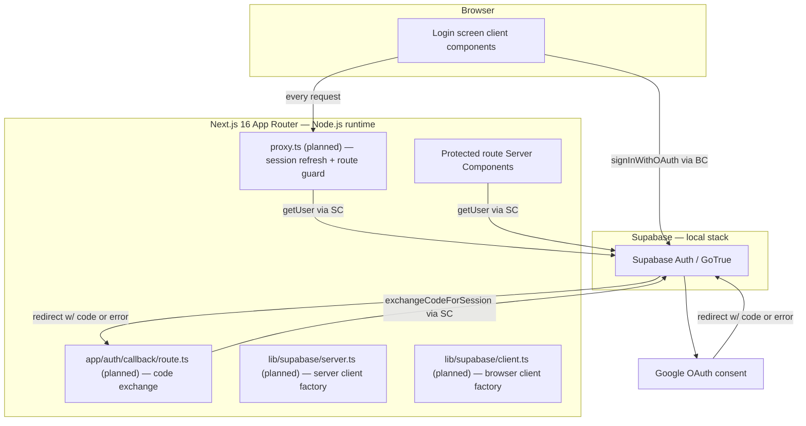
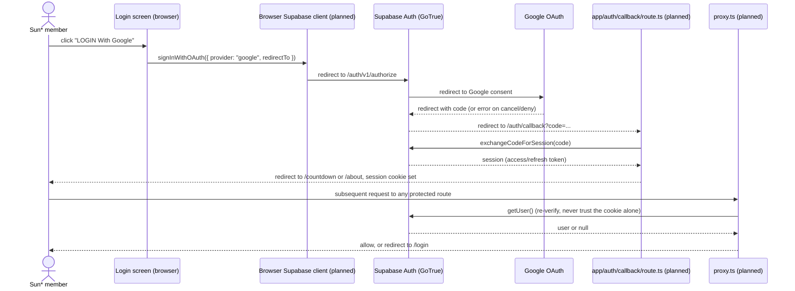

# Architecture

> **Draft scope:** this narrative currently covers the authentication layer introduced by the
> Google Sign-In feature (F000_GoogleSignIn, draft) — the route guard, Supabase client
> factories, the OAuth callback route, and the session/cookie trust boundary. It does not
> describe the rest of the application's architecture; a full pass is a Core reconcile task once
> this and any other architecture-touching feature ships.

## System Architecture

## Tech Stack

| Layer                      | Technology                                                                     | Version              |
| -------------------------- | ------------------------------------------------------------------------------ | -------------------- |
| Frontend                   | Next.js App Router, React                                                      | 16.3.1, 19.2.8       |
| Auth client (cookie-aware) | `@supabase/ssr`                                                                | ^0.12.6              |
| Auth client (core JS)      | `@supabase/supabase-js`                                                        | ^2.115.0             |
| Auth provider              | Supabase Auth (GoTrue) + Google OAuth                                          | local Supabase stack |
| Session transport          | HTTP cookie, `base64-`-prefixed (`sb-<project-ref>-auth-token`)                | —                    |
| Route guard                | `proxy.ts` (Next.js 16 Proxy, Node.js runtime — the `middleware.ts` successor) | Next.js 16.0.0+      |

## Data Flow

## Deployment View

N/A — no infrastructure-as-code found in this repository for the login/auth layer; the local
Supabase stack runs via the `supabase` CLI (Docker), not a checked-in docker-compose, Dockerfile,
or k8s manifest.

## Trust Boundaries

- **Browser ↔ Supabase Auth (GoTrue):** the only party that ever handles the Google OAuth code
  exchange is GoTrue — the app's own callback route only exchanges GoTrue's second-hop code, per
  the 3-hop flow above. `GOOGLE_CLIENT_SECRET` never reaches Next.js code; it is read by
  `supabase/config.toml`'s `env()` from a root `.env`, consumed entirely inside the Supabase CLI
  stack.
- **Proxy vs. Server Components:** the route guard's redirect is a UX convenience, not the only
  authorization boundary — a matcher change or a route moved outside its coverage could silently
  drop the guard. Every Server Component / Route Handler on a protected route independently calls
  `getUser()` (never `getSession()`) rather than trusting the proxy alone.
- **Cookie propagation:** `@supabase/ssr`'s `setAll` cookie adapter inside `proxy.ts` must write
  to both the mutated `request` and the rebuilt `NextResponse` — building a fresh `NextResponse`
  without copying the prior one's cookies desyncs browser and server auth state. The
  `NEXT_LOCALE` cookie set by the language selector must survive that same rebuild.

## Source References

TBD (draft) — `proxy.ts`, `lib/supabase/client.ts`, `lib/supabase/server.ts`, and
`app/auth/callback/route.ts` do not exist yet; this narrative is authored from the verified
`@supabase/ssr` v0.12 / Next.js 16 reference implementation documented in
`plans/260702-1448-login-page/research/researcher-260906-1503-supabase-google-oauth-next16.md`,
not from source in this repository. Existing, already-shipped files this layer builds on:
`components/login/hero-section.tsx:25-27` (current no-auth stand-in `onClick`),
`components/login/google-login-button.tsx:19-54` (loading/disabled UI already wired),
`app/layout.tsx:37-38` (the `NEXT_LOCALE` cookie read the proxy's rebuild must not break).
