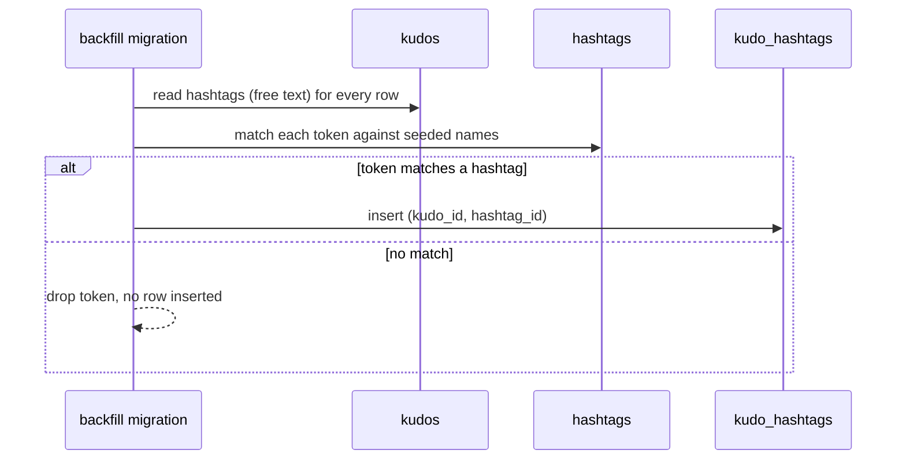
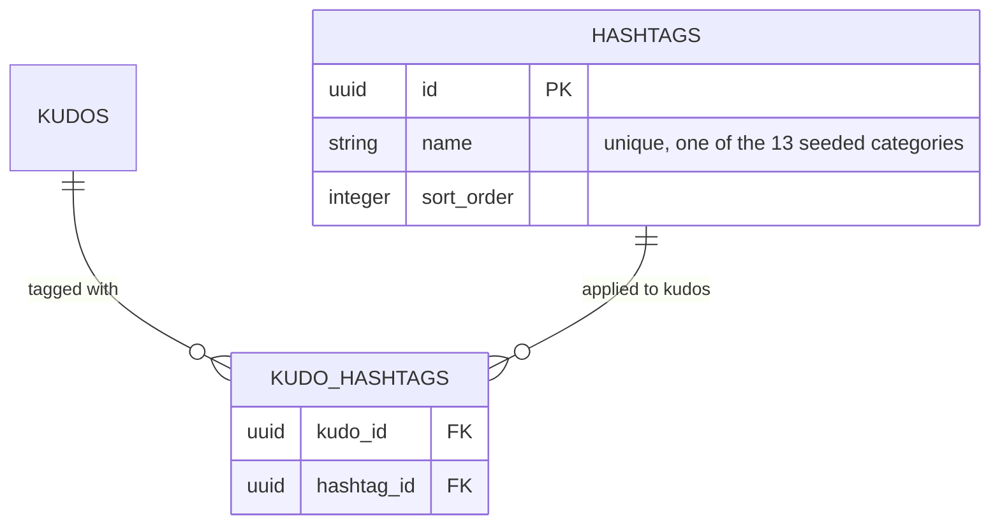
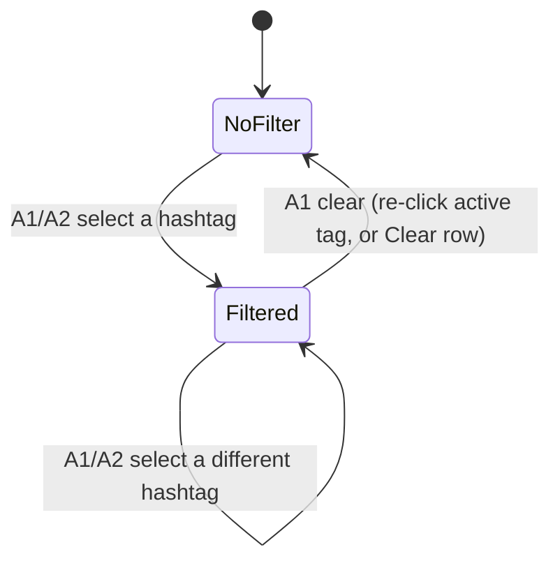

# F005_HashtagTaxonomy — Technical Spec

**Priority**: P1
**Type**: mixed
**Generated**: 2026-09-06

**See also:** [`functional-spec.md`](./functional-spec.md) — plain-language overview, requirements,
business rules, screens, user stories, scenarios, and edge cases for a BA/QA audience.

## 1. Technical Overview

Replaces two hardcoded, mutually-inconsistent hashtag lists — the board filter's
`SAA_HASHTAGS`/`DEPARTMENTS` constants and the write-form picker's own `SAA_HASHTAGS` copy — with
one DB-backed `hashtags` table seeded with the 13 canonical Vietnamese categories, plus a
`kudo_hashtags` join table recording which hashtags a kudo carries. Lifts the board's hashtag
filter out of `feed-list.tsx` (feed-only today) and `highlight-section.tsx` (Highlight-only today)
into one shared, page-level filter so a single selection — from either dropdown or a card's
hashtag chip — narrows both sections together and resets the carousel to page 1. Defines the RLS
policy that F003's kudo-submission Server Action needs to write `kudo_hashtags`.

## 2. Action Index

| #      | Action (handler)                                            | Method · Path                   | Codes                                  | Writes                                | Detail              |
| ------ | ----------------------------------------------------------- | ------------------------------- | -------------------------------------- | ------------------------------------- | ------------------- |
| **A0** | _cross-cutting — hashtag read/write gate_                   | —                               | FR-001, FR-601, BR-004                 | —                                     | § 4.4               |
| **A1** | `HighlightFilterDropdown` (planned: DB-backed options)      | — _(client selection, no HTTP)_ | FR-201, FR-202, BR-001, BR-002, US001  | — _(read-only)_                       | § 3.1               |
| **A2** | hashtag chip click (`onHashtagClick`, feed/highlight cards) | — _(client selection, no HTTP)_ | FR-401, BR-001, US002                  | — _(read-only)_                       | § 3.1               |
| **A3** | `KudosHashtagInput#toggleTag` (planned: DB-backed options)  | — _(client selection, no HTTP)_ | FR-301, FR-302, BR-003, DEC-001, US003 | — _(read-only — feeds F003's insert)_ | § 3.2               |
| **A4** | one-time backfill migration _(background, no FE)_           | migration · one-time            | FR-001                                 | `kudo_hashtags`                       | § 3.2 ▸ **diagram** |

## 3. Actions

### 3.1 CAP-01 — Filter the board by hashtag

#### A1 · Board hashtag filter dropdown

`—` _(client-side selection, no HTTP request)_ → `` `HighlightFilterDropdown` ``
`FR-201` `FR-202` `BR-001` `BR-002` `US001` · `SCR-hashtag-filter`

**Who** · any board visitor — the board is public _(gate A0 — § 4.4)_
**FE** · `components/kudos-board/highlight-filter-dropdown.tsx:34-93` renders the dropdown button +
option list; today its `options` prop is fed from the hardcoded `SAA_HASHTAGS`/`DEPARTMENTS`
constants (`constants/index.ts:6-22`) — this feature replaces that prop source with a DB-backed
hashtag list; the component's own select/toggle/close logic is unchanged.
`components/kudos-board/highlight-section.tsx:20,51-54` owns the `hashtag`/`setHashtag` state and
the "reset carousel index to 0 on select" behavior today. Per BR-001 this state must be LIFTED to
`app/sun-kudos/page.tsx` (planned, or a shared client provider) so
`components/kudos-board/all-kudos-section.tsx` and `components/kudos-board/feed-list.tsx:22-37`
(which currently owns its own separate feed-only `selectedHashtag` at `feed-list.tsx:25`) read the
same value instead of filtering independently.
**Request** · none — client selection only
**BE** · `` `getHashtags()` `` _(planned)_ — a shared read query returning the 13-row hashtag list,
used by both this dropdown and A3's picker
**Rule**

- **BR-001 — Selecting a hashtag from any entry point re-filters Highlight and All Kudos together and resets the carousel to page 1.** _(§ 4.4)_
- **BR-002 — The dropdown is single-select; clicking the already-active tag clears the filter, and the dropdown always closes after a click.** Mirrors the existing toggle-then-close behavior at `highlight-filter-dropdown.tsx:64-67` — clicking a selected option calls `onSelect(null)`.
  **Result** · No DB write. Sets the shared filter value; both `HighlightSection`'s carousel index and
  `FeedList`'s loaded posts recompute against it. Carousel index resets to slide 0
  (`highlight-section.tsx:51-54`'s existing `handleSelectHashtag`, unchanged by the lift).
  **State** · `SM-001`: `no-filter` → `filtered(hashtag)` _(§ 4.3)_
  **Source:** `highlight-filter-dropdown.tsx:60-67` → `highlight-section.tsx:20,51-54` → _(new,
  planned)_ `getHashtags()` query

<!-- No diagram — below threshold: single client-side selection, no DB write, no background step. -->

---

#### A2 · Hashtag chip click (highlight card, feed card, category chip)

`—` _(client-side selection, no HTTP request)_ → `` `onHashtagClick` ``
`FR-401` `BR-001` `US002` · `SCR-sun-kudos-board`

**Who** · any board visitor _(gate A0)_
**FE** · `components/kudos-board/feed-kudo-post-card.tsx:118-127` renders each card's hashtag chip
row and calls `onHashtagClick(tag)` on click. `components/kudos-board/highlight-kudo-card.tsx:111-114`
renders the equivalent chip line (`hashtagLine`, built at `:67-69`) but today has **no click
handler at all** — this feature must add one, wired to the same shared filter setter A1 uses.
`feed-list.tsx:60-62`'s `handleHashtagClick` is the existing feed-only implementation of this
toggle; it moves to the lifted page-level state per BR-001.
**Request** · none — client selection only
**BE** · none (pure client state write)
**Rule** · **BR-001 — Selecting a hashtag from any entry point re-filters Highlight and All Kudos together and resets the carousel to page 1.** _(§ 4.4 — same rule as A1; this action is its second user)_
**Result** · No DB write. Sets the same shared filter value A1 sets; both sections re-render
filtered, carousel resets to page 1.
**State** · `SM-001`: `no-filter` → `filtered(hashtag)`, or `filtered(tagA)` → `filtered(tagB)` _(§ 4.3)_
**Source:** `feed-kudo-post-card.tsx:118-127` → _(highlight-kudo-card.tsx — new handler, not yet wired)_

<!-- No diagram — below threshold. -->

### 3.2 CAP-02 — Tag a kudo while writing it

#### A3 · Write-form hashtag picker

`—` _(client-side selection, no HTTP request)_ → `` `KudosHashtagInput#toggleTag` ``
`FR-301` `FR-302` `BR-003` `US003` · `SCR-hashtag-picker`

**Who** · the Sunner composing a kudo (authenticated) _(gate A0)_
**FE** · `components/kudos/kudos-hashtag-input.tsx:38-44,99-124` renders the multi-select list and
its `toggleTag`; `atMax` (`:36`) already disables unselected rows at 5 and blocks `toggleTag` past
the cap (`:41`). Its `options` source is today the hardcoded `SAA_HASHTAGS`
(`constants/index.ts:6-15`) — this feature replaces that with the same DB-backed list A1 uses; the
component's own toggle/disable/chip-remove logic is unchanged.
**Request** · none — client selection only; the finished `tags: number[]` travels into F003's own
submission payload (out of this feature's scope)
**BE** · `` `getHashtags()` `` _(planned, shared with A1)_
**Rule**

- **BR-003 — At most 5 hashtags may be selected; once 5 are chosen, unselected rows disable until one is removed.** _(inline — Bin 1, this action's only consumer)_

| DEC         | subtype | Condition                                        | What the user sees                          | Source                                |
| ----------- | ------- | ------------------------------------------------ | ------------------------------------------- | ------------------------------------- |
| **DEC-001** | render  | `tags.length >= 5 AND !tags.includes(row.value)` | row renders disabled, dimmed, non-clickable | `kudos-hashtag-input.tsx:101,108,112` |

**Result** · No DB write here — the selected `tags` array is held in the write-form's own state and
inserted into `kudo_hashtags` only by F003's submission Server Action (out of scope for this
feature; see BR-004, § 4.4).
**Source:** `kudos-hashtag-input.tsx:38-44,99-124` → _(new, planned)_ `getHashtags()` query

<!-- No diagram — below threshold: single-component client state, no DB write in this action. -->

---

#### A4 · One-time backfill: existing free-text hashtags → kudo_hashtags _(background, no FE)_

`migration · one-time` → `` `<timestamp>_backfill_kudo_hashtags.sql` `` _(planned)_
`FR-001` `US003`

**Who** · _no human actor — one-time data migration run once at deploy_
**FE** · _none_
**Request** · _no HTTP request_ — reads every existing `kudos.hashtags` free-text value
**BE** · a one-time SQL migration (not yet written) that tokenizes each `kudos.hashtags` blob and
inserts a matching `kudo_hashtags` row per recognized token — see § 4.2 for the full proposed DDL
and matching strategy
**Rule** · **BR-005 — A free-text token that does not case-insensitively match one of the 13 seeded hashtag names is dropped, not fabricated into a new hashtag row.** _(inline — Bin 1, this action's only consumer)_ Confirmed against the live seed data (`supabase/seed.sql:69-101`): the seeded rows'
free text (`"#Dedicated #Inspring..."`) shares zero names with the 13-item canonical list, so every
existing seed row is expected to backfill to **zero** `kudo_hashtags` rows — this is the exact case
this rule exists to define.
**Result** · Writes `kudo_hashtags` — one row per `(kudo_id, hashtag_id)` match found; a kudo whose
free text matches nothing gets zero rows (not an error).
**Source:** TBD (draft) — new migration, not yet written; see § 4.2 for the proposed DDL



### 3.3 Edge cases

| Action     | Scenario                                                                                             | Behavior                                                                                                                                                 |
| ---------- | ---------------------------------------------------------------------------------------------------- | -------------------------------------------------------------------------------------------------------------------------------------------------------- |
| A1, A2     | Active filter matches zero kudos                                                                     | Both Highlight and All Kudos render their existing empty state; the filter stays visibly active so the Sunner can clear it                               |
| A1, A2     | Active filter's hashtag row is deleted while applied                                                 | `kudo_hashtags` rows cascade-delete with it (FK `on delete cascade`); the board falls back to showing all kudos rather than erroring on an unresolved id |
| A1, A2     | A kudo has zero hashtags (from a backfilled row with no free-text match, or any future zero-tag row) | The hashtag chip line is omitted entirely on that card; the kudo never matches any hashtag filter                                                        |
| A3         | Sunner attempts to select a 6th hashtag                                                              | Click has no effect (`atMax` blocks `toggleTag`); the "Tối đa 5 hashtag" message is shown per the field's guidance copy                                  |
| A4         | A backfilled kudo's free-text token matches none of the 13 seeded names                              | No `kudo_hashtags` row is inserted for that token; the kudo ends up with zero hashtags, same as the zero-hashtag case above                              |
| A1, A2, A3 | The shared hashtag list changes (a future admin edit) mid-session                                    | Both dropdowns re-query on next open; no client cache invalidation is defined by this feature                                                            |

## 4. Shared Foundation

### 4.1 Components

| Component                                                             | Responsibility                                                                    | Used in | File                                                   |
| --------------------------------------------------------------------- | --------------------------------------------------------------------------------- | ------- | ------------------------------------------------------ |
| `HighlightFilterDropdown`                                             | single-select hashtag/department filter button + menu                             | A1      | `components/kudos-board/highlight-filter-dropdown.tsx` |
| `KudosHashtagInput`                                                   | multi-select (max 5) hashtag picker for the write form                            | A3      | `components/kudos/kudos-hashtag-input.tsx`             |
| `getHashtags()` _(planned)_                                           | shared read query returning the 13-row hashtag list, ordered by `sort_order`      | A1, A3  | _(new, not yet written)_                               |
| Shared hashtag filter state _(planned — lifted from `feed-list.tsx`)_ | single source of truth for the active hashtag filter, read by both board sections | A1, A2  | `app/sun-kudos/page.tsx` _(planned)_                   |

### 4.2 Data Model



| Entity            | Table           | Used for                                                                                                           | Action     |
| ----------------- | --------------- | ------------------------------------------------------------------------------------------------------------------ | ---------- |
| Hashtag           | `hashtags`      | the 13-category master list served to both dropdowns                                                               | A1, A3     |
| KudoHashtag       | `kudo_hashtags` | which hashtags a given kudo carries; read by the board filter, written by F003's submission and by the A4 backfill | A1, A2, A4 |
| Kudo _(existing)_ | `kudos`         | source of the free-text `hashtags` column the A4 backfill reads; FK target for `kudo_hashtags.kudo_id`             | A4         |

**Proposed DDL (new tables, RLS, seed, backfill — not yet written to a migration file):**

```sql
-- New master list + join table (F005_HashtagTaxonomy).
create table public.hashtags (
  id uuid primary key default gen_random_uuid(),
  name text not null unique,
  sort_order integer not null default 0,
  created_at timestamptz not null default now()
);

create table public.kudo_hashtags (
  kudo_id uuid not null references public.kudos(id) on delete cascade,
  hashtag_id uuid not null references public.hashtags(id) on delete cascade,
  primary key (kudo_id, hashtag_id)
);

create index kudo_hashtags_hashtag_id_idx on public.kudo_hashtags (hashtag_id);

alter table public.hashtags enable row level security;
alter table public.kudo_hashtags enable row level security;

create policy "hashtags readable by all" on public.hashtags
  for select to anon, authenticated using (true);

create policy "kudo_hashtags readable by all" on public.kudo_hashtags
  for select to anon, authenticated using (true);

-- Write: only as part of the kudo's own sender (mirrors "kudos insert by
-- sender" in 20260716100000_write_kudos.sql) — exercised by F003's
-- submission Server Action, not by this feature directly.
create policy "kudo_hashtags insert by kudo sender" on public.kudo_hashtags
  for insert to authenticated
  with check (
    auth.uid() = (select sender_id from public.kudos where id = kudo_id)
  );

grant insert on public.kudo_hashtags to authenticated;

-- Seed: the 13 canonical Vietnamese categories (clarifications.md, gap
-- resolution session) — both dropdowns read this same table.
insert into public.hashtags (name, sort_order) values
  ('Toàn diện', 1),
  ('Giỏi chuyên môn', 2),
  ('Hiệu suất cao', 3),
  ('Truyền cảm hứng', 4),
  ('Cống hiến', 5),
  ('Aim High', 6),
  ('Be Agile', 7),
  ('Wasshoi', 8),
  ('Hướng mục tiêu', 9),
  ('Hướng khách hàng', 10),
  ('Chuẩn quy trình', 11),
  ('Giải pháp sáng tạo', 12),
  ('Quản lý xuất sắc', 13)
on conflict (name) do nothing;

-- Backfill: best-effort match of the existing free-text kudos.hashtags blob
-- against the 13 seeded names above. A token with no case-insensitive match
-- is dropped — confirmed against the live seed data (supabase/seed.sql:69-101),
-- whose free text ("#Dedicated #Inspring...") shares zero names with the
-- canonical list, so every existing seed row is expected to backfill to zero
-- rows (see A4's BR-005 and § 3.3 edge cases above).
insert into public.kudo_hashtags (kudo_id, hashtag_id)
select distinct k.id, h.id
from public.kudos k
cross join lateral regexp_split_to_table(k.hashtags, '\s+') as raw_token
join public.hashtags h
  on lower(trim(leading '#' from raw_token)) = lower(h.name)
where k.hashtags <> ''
on conflict do nothing;
```

#### Polymorphic Behavior

N/A — no discriminator fields in Key Entities.

### 4.3 State Management

**kind:** ui
**Threshold met:** 2 states, 3 distinct transitions (select-first, clear, re-select) — see below.

### The shared board hashtag filter (SM-001)

**kind:** ui
**Linked FR:** FR-202
**Source:** TBD (draft) — planned lift into `app/sun-kudos/page.tsx`; today split across
`highlight-section.tsx:20` (Highlight's own copy) and `feed-list.tsx:25` (the feed's separate copy)



**Action transitions:** the guard and side effect for each edge live in the **Result** rung of the
action named on that edge (§ 3.1) — not repeated here.

### 4.4 Shared Rules

#### Bin 3 — cross-cutting, belongs to no single action

**A0 · FR-001, FR-601 — the hashtag master list is public-read; writing a kudo's hashtags is gated to that kudo's own sender.**
`hashtags`/`kudo_hashtags` SELECT policies grant read to `anon, authenticated` — same "readable by
all" shape as `kudos`/`profiles` (`20260714070000_profile_schema.sql:53-60`); the `kudo_hashtags`
INSERT policy (§ 4.2 DDL above) restricts writes to `auth.uid() = kudos.sender_id`, mirroring the
existing `"kudos insert by sender"` policy. Not any one action's own rule — it gates whichever
action ends up inserting `kudo_hashtags` (F003's submission Server Action, out of this feature's
scope) and every read in A1/A2/A3. Per the security report on this project, every public table's
pre-existing default ACL grants ALL privileges to `anon`/`authenticated`, so these explicit RLS
policies are the ONLY real access control for both new tables — they are not optional hardening.
**Source:** _(new migration, not yet written — see § 4.2 DDL)_ · `20260716100000_write_kudos.sql:13-15` (the existing sibling pattern this policy mirrors)

#### Bin 2 — used by ≥2 named actions

**BR-001 — Selecting a hashtag from ANY entry point re-filters Highlight and All Kudos together and resets the carousel to page 1.**
Used in: **A1** · **A2**. Today `feed-list.tsx:25`'s `selectedHashtag` filters only the feed
(`feed-list.tsx:28-37`), and `highlight-section.tsx:20`'s `hashtag` filters only Highlight
(`highlight-section.tsx:37-46`) — two independent copies of the same conceptual filter. This
feature lifts the state to one shared owner (`app/sun-kudos/page.tsx`, planned) so both sections
read the same value; picking a hashtag anywhere resets `highlight-section.tsx`'s carousel `index`
to 0 (existing behavior at `:51-54`, unchanged) and re-triggers `FeedList`'s post filtering.
**Source:** `feed-list.tsx:25,28-37,60-62` · `highlight-section.tsx:20,37-46,51-54`

```text
function setActiveHashtag(tag):
  if activeFilter == tag: activeFilter = null   # BR-002's toggle-off, when triggered from A1
  else: activeFilter = tag
  carouselIndex = 0
  # both HighlightSection and FeedList re-derive their visible list from activeFilter
```

### 4.5 Algorithms & Integrations

None — no non-trivial computation or external integration in this feature beyond the filter
set-and-reset logic already captured as BR-001 (§ 4.4).

### 4.6 Configuration

```text
KUDOS_MAX_HASHTAGS = 5   # max hashtags selectable in the write-form picker (constants/index.ts:56)
```

**Client behavior:** see `docs/generated/behavior-logic.md` (client-side patterns — none beyond the
shared filter state already covered in § 4.3), `docs/system/permissions.md` (feature flags /
experiments / env / locale gates — none apply to this feature), `docs/system/architecture.md`
(guards / deep-link state restoration / unsaved-changes protection — none apply to this feature).

## 5. Verification & Technical Notes

### 5.1 Technical Verification

- **SC-001** _(A1, A2)_ picking any hashtag (dropdown or chip) narrows both Highlight and All Kudos
  to kudos carrying it, in the same render pass (covers FR-202, BR-001)
- **SC-002** _(A1)_ re-clicking the currently active dropdown tag clears the filter and closes the
  dropdown (covers FR-201, BR-002)
- **SC-003** _(A3)_ selecting a 6th hashtag in the write-form picker is a no-op; the remaining
  unselected rows stay disabled (covers FR-302, BR-003, DEC-001)
- **SC-004** _(A0)_ a `kudo_hashtags` insert attempted by a user who is not the kudo's sender is
  rejected by RLS (covers FR-601, BR-004)

#### US001 _(A1)_

**Independent Test:** Apply the board filter to a hashtag with at least one known kudo, confirm
both sections narrow and the carousel shows "1/N"; then apply a hashtag with zero kudos and
confirm both empty states render.

**Acceptance Scenarios:**

1. **Given** the board shows all kudos, **When** the Sunner picks a hashtag with matches, **Then**
   Highlight and All Kudos both narrow to it and the carousel resets to slide 1.
2. **Given** a hashtag filter is active, **When** the Sunner re-clicks the same tag, **Then** the
   filter clears and both sections show all kudos again.

#### US002 _(A2)_

**Independent Test:** Click a hashtag chip on a feed card and confirm the resulting filtered state
is identical (by hashtag id) to picking the same tag from the dropdown.

**Acceptance Scenarios:**

1. **Given** a feed card shows "#Cống hiến", **When** the Sunner clicks that chip, **Then** the
   board filter becomes "Cống hiến", matching A1's own effect.
2. **Given** the clicked chip's hashtag has been deleted since page load, **When** the Sunner clicks
   it, **Then** the filter falls back to showing all kudos with no crash (§ 3.3 edge cases).

#### US003 _(A3)_

**Independent Test:** Select 5 hashtags one at a time in the write-form picker, confirming each
unselected row disables only once the 5th is chosen, then remove one and confirm the rows
re-enable.

**Acceptance Scenarios:**

1. **Given** 4 hashtags are selected, **When** the Sunner picks a 5th, **Then** it is added and all
   remaining rows render disabled.
2. **Given** 5 hashtags are selected, **When** the Sunner clicks a disabled row, **Then** nothing
   changes — the click has no effect.

### 5.2 Assumptions

- _(A1, A2)_ The shared filter state lift targets `app/sun-kudos/page.tsx` directly (a plain lifted
  `useState`) rather than a separate context provider — no other feature in this batch needs the
  filter value outside the two board sections, so a provider would be premature.
- _(A4)_ The backfill migration runs once, after the `hashtags` seed, as part of the same migration
  that creates both new tables — not a separately scheduled job.
- _(A0)_ `kudo_hashtags` inherits the same pre-existing default-ACL condition the security report
  identified for every public table (ALL privileges granted to `anon`/`authenticated`) — the
  explicit RLS policies in § 4.2 are assumed to be the only real gate, consistent with that
  report's finding that RLS is the only access control on this project.

### 5.3 Unresolved Questions

1. **Tokenization edge cases** _(A4)_: the proposed backfill regex (`\s+` split + leading `#` trim)
   has not been run against every historical `kudos.hashtags` value in a real environment — a value
   with punctuation other than a leading `#` (e.g. a comma-separated list) may not tokenize
   cleanly. Needs a dry run against the actual data before the migration ships.
2. **Where `getHashtags()` lives** _(A1, A3)_: not yet decided whether this is a plain server-side
   data-access function, a cached Server Component fetch, or a route handler — deferred to
   implementation.

### 5.4 Source References

| Action | Order | Symbol                                          | Path                                                        | Purpose                                                   |
| ------ | ----- | ----------------------------------------------- | ----------------------------------------------------------- | --------------------------------------------------------- |
| —      | 1     | `hashtags` / `kudo_hashtags` _(planned)_        | _(new migration, not yet written)_                          | the two new tables this feature adds                      |
| A1     | 2     | `HighlightFilterDropdown`                       | `components/kudos-board/highlight-filter-dropdown.tsx:1-93` | board filter button + menu                                |
| A1, A2 | 3     | `HighlightSection`                              | `components/kudos-board/highlight-section.tsx:1-213`        | today's Highlight-only filter state + carousel reset      |
| A2     | 4     | `FeedList`                                      | `components/kudos-board/feed-list.tsx:1-95`                 | today's feed-only filter state, to be removed once lifted |
| A2     | 5     | `KudoPostCard`                                  | `components/kudos-board/feed-kudo-post-card.tsx:1-213`      | feed card's hashtag chip click                            |
| A3     | 6     | `KudosHashtagInput`                             | `components/kudos/kudos-hashtag-input.tsx:1-130`            | write-form multi-select picker                            |
| —      | 7     | `SAA_HASHTAGS` / `saaHashtagLabel` _(retiring)_ | `constants/index.ts:6-31`                                   | the hardcoded list this feature replaces                  |

#### Data Flow

```text
board filter click (A1) or chip click (A2) -> shared filter state, page-level
  -> HighlightSection re-derives filtered top-5 -> re-render, carousel index=0
  -> FeedList re-derives filtered feed page(s) -> re-render
```

### 5.5 Artifact References

| Artifact           | File                                                     | Codes Used                             | Reviewed |
| ------------------ | -------------------------------------------------------- | -------------------------------------- | -------- |
| System Overview    | TBD (draft)                                              | TBD (draft)                            | [ ]      |
| Architecture       | TBD (draft)                                              | TBD (draft)                            | [ ]      |
| Feature List       | [feature-list.md](../feature-list.md)                    | F005                                   | [ ]      |
| API Map            | TBD (draft)                                              | TBD (draft)                            | [ ]      |
| Entities           | TBD (draft)                                              | TBD (draft)                            | [ ]      |
| Screens            | [functional-spec.md § 6](./functional-spec.md#6-screens) | SCR-hashtag-filter, SCR-hashtag-picker | [ ]      |
| Behavior Logic     | TBD (draft)                                              | TBD (draft)                            | [ ]      |
| Permissions Matrix | TBD (draft)                                              | TBD (draft)                            | [ ]      |
| User Stories       | TBD (draft)                                              | TBD (draft)                            | [ ]      |
