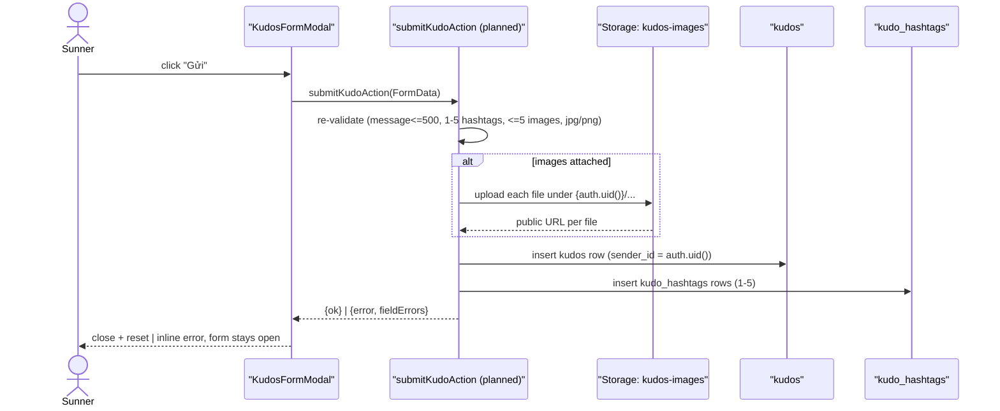
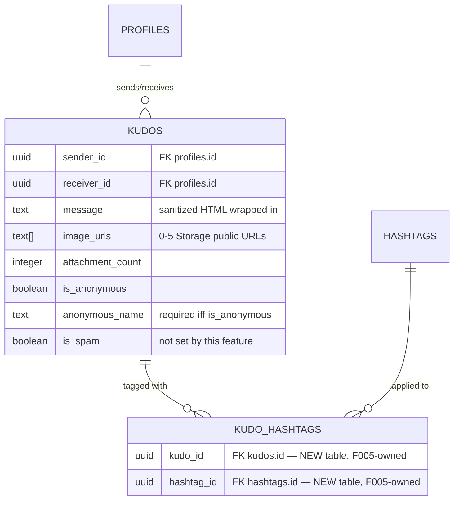
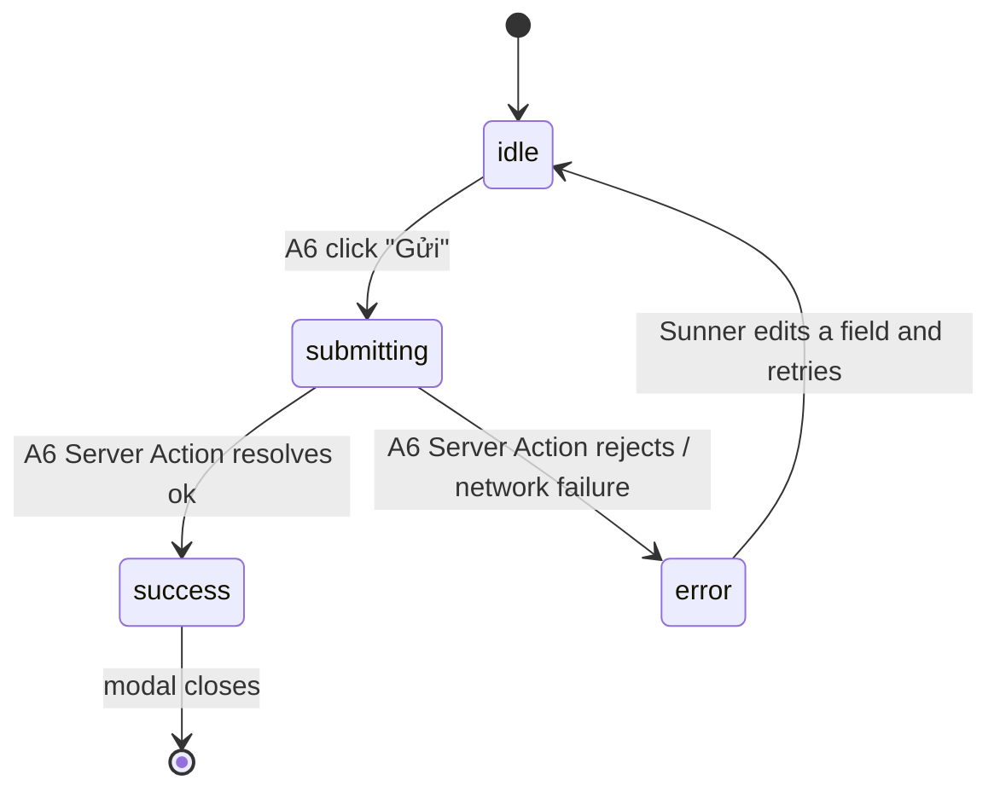

# F003_KudoAuthoring — Technical Spec

**Priority**: P0
**Type**: ui
**Generated**: 2026-09-06

**See also:** [`functional-spec.md`](./functional-spec.md) — plain-language overview, open
decisions, requirements/business rules stated in one-liners, screens, user stories, scenarios,
edge cases, and configuration for a BA/QA audience.

**How to read this file:** § 2 is the index — pick the action you care about and read its block
in § 3 straight through. § 4 is the shared appendix — jump in only when a § 3 block points you
there.

## 1. Technical Overview

A Sunner composes a kudo to a colleague from the "Viết Kudo" modal (opened from the board's
write-kudos bar): pick a recipient, write a message (≤500 chars), attach up to 5 hashtags, attach
up to 5 images, optionally send anonymously, optionally insert a link via the new Addlink Box, then
submit. Submission runs through a Next.js Server Action that re-validates every field server-side
and inserts one `kudos` row plus its `kudo_hashtags` join rows; any attached images are uploaded to
the existing `kudos-images` Storage bucket first. Today `KudosFormModal` and its four field
components are wired to mock data and a client-only fake submit (`kudos-form-modal.tsx:137-140`);
this feature replaces `components/kudos/kudos-mock-data.ts` and adds the missing Addlink Box.

## 2. Action Index

| #      | Action (handler)                              | Method · Path                                | Codes                                                                    | Writes                                                       | Detail              |
| ------ | --------------------------------------------- | -------------------------------------------- | ------------------------------------------------------------------------ | ------------------------------------------------------------ | ------------------- |
| **A0** | _cross-cutting — belongs to no single action_ | —                                            | {FR-001, FR-601, FR-602}                                                 | —                                                            | § 4.4               |
| **A1** | `WriteKudosBar#onClick`                       | — (client only)                              | {FR-101, US001}                                                          | — _(read-only)_                                              | § 3.1               |
| **A2** | `KudosRecipientSelect#onSearch`               | browser query · `profiles`                   | {FR-201, US001}                                                          | — _(read-only)_                                              | § 3.1               |
| **A3** | `KudosHashtagInput#toggleTag`                 | browser query · `hashtags` _(planned, F005)_ | {FR-203, BR-002, US001}                                                  | — _(read-only)_                                              | § 3.1               |
| **A4** | `KudosImageUpload#handleFiles`                | — (client only)                              | {FR-204, BR-003, US001}                                                  | — _(read-only until submit)_                                 | § 3.1               |
| **A5** | `KudosFormModal#toggleAnonymous`              | — (client only)                              | {FR-205, DEC-001, US001}                                                 | — _(read-only)_                                              | § 3.1               |
| **A6** | `submitKudoAction` _(planned Server Action)_  | server action · `.../actions/submit-kudo`    | {FR-202, FR-206, FR-601, FR-602, BR-001, BR-002, BR-003, DEC-002, US001} | `kudos`, `kudo_hashtags`                                     | § 3.1 ▸ **diagram** |
| **A7** | `KudosContentEditor#onLinkClick`              | — (client only)                              | {FR-401, US002}                                                          | — _(read-only)_                                              | § 3.2               |
| **A8** | `AddlinkBox#onSave` _(planned)_               | — (client only)                              | {FR-301, FR-302, DEC-003, BR-004, BR-005, US002}                         | — _(no DB write — returns `{text, url}` to the parent form)_ | § 3.2               |
| **A9** | `AddlinkBox#onCancel` _(planned)_             | — (client only)                              | {FR-402, US002}                                                          | — _(read-only)_                                              | § 3.2               |

**Rung set** (every § 3 block, absent rungs omitted, never rendered `N/A`):
**Who** → **FE** → **Request** → **BE** → **Rule** → **Result** → **State** → **Source**.

## 3. Actions

### 3.1 CAP-01 — Compose & send a kudo

#### A1 · Open the Viết Kudo modal

`— (client only)` → `` `WriteKudosBar#onClick` ``
`FR-101` `US001`

**Who** · Sunner _(gate A0 — § 4.4)_
**FE** · Write-kudos pill click sets `open=true` on `KudosFormModal` — `components/kudos-board/write-kudos-bar.tsx:14-23,58`.
**Result** · read-only — **no DB write**. The modal renders empty (no `initialValues`).
**Source:** `components/kudos-board/write-kudos-bar.tsx:14-23` → `components/kudos/kudos-form-modal.tsx:67-71`

<!-- No diagram: below threshold — a single client-side open toggle, no table write. -->

---

#### A2 · Search for a recipient

`browser query · profiles` → `` `KudosRecipientSelect#onSearch` ``
`FR-201` `US001` · `SCR-write-kudo`

**Who** · Sunner _(gate A0)_
**FE** · Typing in the recipient field filters as-you-type — `components/kudos/kudos-recipient-select.tsx:48-50`. **Currently filters a hardcoded `MOCK_SUNNERS` array** (`kudos-recipient-select.tsx:6`) instead of a real query — this feature replaces that import with a live `profiles` read.
**BE** · _(planned)_ browser Supabase client `select id, display_name, avatar_url from profiles where display_name ilike '%{query}%'` — `lib/supabase/client.ts:8-9` (factory exists; the query call site is new). RLS already permits this: `supabase/migrations/20260714070000_profile_schema.sql:58-59` (`profiles readable by all`, `anon, authenticated`).
**Rule** · **BR-req-recipient — a recipient is required and must resolve to an existing Sunner.** Selecting a row commits the recipient id; free text alone never submits. _(Bin 1 — used only by A2; not tagged BR-### since it is a plain required-field check, not a shared rule — see § 4.4 note.)_
**Result** · read-only — **no DB write**. On empty results shows `t("kudos:recipient.empty")` — `kudos-recipient-select.tsx:84-87`.
**Source:** `components/kudos/kudos-recipient-select.tsx:1-111` → `lib/supabase/client.ts:8-9`

<!-- No diagram: read-only, single table, synchronous. -->

---

#### A3 · Pick up to 5 hashtags

`browser query · hashtags (planned, F005)` → `` `KudosHashtagInput#toggleTag` ``
`FR-203` `BR-002` `US001` · `SCR-write-kudo`

**Who** · Sunner _(gate A0)_
**FE** · "+ Hashtag" opens a multi-select dropdown; selected rows show a check-circle, unselected rows disable once 5 are picked — `components/kudos/kudos-hashtag-input.tsx:36-44,99-125`. **Currently reads the hardcoded `SAA_HASHTAGS` list** (`constants/index.ts:6-15`, imported at `kudos-hashtag-input.tsx:7`) instead of the shared master list F005 introduces — this action's data source becomes a `hashtags` table read once F005 lands (dependency, see `functional-spec.md § 12`).
**Rule** · **BR-002 — between 1 and 5 hashtags may be selected; a 6th pick is rejected client-side and re-checked server-side in A6.** `atMax` disables further picks once `tags.length >= KUDOS_MAX_HASHTAGS` (`constants/index.ts:56`). _(§ 4.4)_
**Result** · read-only until A6 submits — selection lives in the form's local `hashtags: number[]` state (`kudos-form-modal.tsx:27`).
**Source:** `components/kudos/kudos-hashtag-input.tsx:1-129` → `constants/index.ts:6-15,56`

<!-- No diagram: client-only selection, below threshold. -->

---

#### A4 · Attach up to 5 images

`— (client only)` → `` `KudosImageUpload#handleFiles` ``
`FR-204` `BR-003` `US001` · `SCR-write-kudo`

**Who** · Sunner _(gate A0)_
**FE** · "+ Image" opens a native file picker (`accept="image/*"`); selected files get a local
`URL.createObjectURL` preview, the button hides at 5 and reappears on removal —
`components/kudos/kudos-image-upload.tsx:44-53,88-106`.
**Rule** · **BR-003 — at most 5 images, and only `.jpg`/`.png` are accepted; a rejected file shows an inline error and is never added.** The current `accept="image/*"` attribute (`kudos-image-upload.tsx:566`) is a picker filter only — it does not stop a drag-and-drop or "all files" bypass, so this feature adds an explicit post-selection MIME/extension check (new code) plus the server-side re-check in A6. _(§ 4.4)_
**Result** · read-only until A6 submits — previews live in the form's local `images: KudosImagePreview[]` state (`kudos-form-modal.tsx:28`); object URLs are revoked on remove/unmount (`kudos-image-upload.tsx:33-41,55-59`).
**Source:** `components/kudos/kudos-image-upload.tsx:1-110`

<!-- No diagram: client-only, no table write yet. -->

---

#### A5 · Toggle anonymous send

`— (client only)` → `` `KudosFormModal#toggleAnonymous` ``
`FR-205` `US001`

**Who** · Sunner _(gate A0)_
**FE** · Checkbox at `kudos-form-modal.tsx:228-238` currently flips `form.anonymous` only — **it does not yet reveal an anonymous-name input**, which the MoMorph spec (item G) requires. New code adds a conditional text field bound to a new `anonymousName` form key.
**Rule**

| DEC         | subtype     | Condition               | What the user sees                                                                               | Source                                                                      |
| ----------- | ----------- | ----------------------- | ------------------------------------------------------------------------------------------------ | --------------------------------------------------------------------------- |
| **DEC-001** | interaction | checkbox checked → true | reveals a required "anonymous display name" text input; unchecking hides it and clears the value | `kudos-form-modal.tsx:228-238` _(handler exists; the reveal branch is new)_ |

**Result** · read-only — no DB write. `anonymous`/`anonymousName` live in local form state until A6 submits, where they map to `kudos.is_anonymous`/`kudos.anonymous_name`.
**Source:** `components/kudos/kudos-form-modal.tsx:228-238`

<!-- No diagram: single boolean toggle plus a render branch — a table would not clarify this
     one-condition reveal. -->

---

#### A6 · Submit the kudo

`server action · .../actions/submit-kudo` → `` `submitKudoAction` `` _(planned)_
`FR-202` `FR-206` `FR-601` `FR-602` `BR-001` `BR-002` `BR-003` `DEC-002` `US001` · `SCR-write-kudo`

**Who** · Sunner _(gate A0 — § 4.4)_
**FE** · "Gửi" button — `kudos-form-modal.tsx:249-257`. On click: disable the button, show a loading
state, call the Server Action with `FormData` (recipient id, message, hashtag ids, image `File`s,
anonymous flag/name); on success close and reset the draft, on failure show an inline error and
re-enable the button. **Today's `handleSubmit` (`kudos-form-modal.tsx:137-140`) is a client-only
fake — it never calls a backend and always "succeeds" after a 1200ms timeout; this whole handler
is replaced.**
**Request** · `recipientId` _(uuid)_, `message` _(string, ≤500 chars raw text)_, `hashtagIds`
_(number[], 1-5)_, `images` _(File[], 0-5)_, `isAnonymous` _(boolean)_, `anonymousName`
_(string, required iff `isAnonymous`)_.
**BE** · `` `submitKudoAction` `` _(planned)_ — calls `createClient()` from
`lib/supabase/server.ts:8-29` (cookie-bound, RLS applies as the caller) → `getUser()` to confirm
the session → uploads each image to the `kudos-images` Storage bucket via `INT-001` (§ 4.5,
required before any row is written) → inserts one `kudos` row → inserts up to 5 `kudo_hashtags`
rows.
**Rule**

- **BR-001 — the message body must be ≤500 characters; the client-side counter is UX only, the
  Server Action re-validates the same limit as the actual control.** No length check exists in the
  form today — `kudos-form-modal.tsx` has no message-length state at all; this is new validation
  logic, both the FE counter and the BE re-check. **Source:** `TBD (draft)` _(Bin 1 — used only by
  A6, no § 4.4 companion)_
- **BR-002 — 1 to 5 hashtags, re-checked server-side (see A3's inline gloss above for the client
  half).** _(§ 4.4)_
- **BR-003 — ≤5 images, `.jpg`/`.png` only, re-checked server-side (see A4's inline gloss above
  for the client half).** _(§ 4.4)_

| DEC         | subtype | Condition                                            | What the user sees                | Source                                                                                                                                                |
| ----------- | ------- | ---------------------------------------------------- | --------------------------------- | ----------------------------------------------------------------------------------------------------------------------------------------------------- |
| **DEC-002** | render  | `recipient && message.trim() && hashtags.length > 0` | "Gửi" enabled; otherwise disabled | `kudos-form-modal.tsx:86-92` _(`isValid` memo — currently also requires the "Danh hiệu" field per D001; message-length is not yet part of this memo)_ |

**Result**

- Writes `kudos` ← `sender_id = auth.uid()` (forced server-side, ignoring any client value —
  matches the existing policy `supabase/migrations/20260716100000_write_kudos.sql:13-15`),
  `receiver_id`, `message` (sanitized HTML wrapped in `<p>`), `hashtag_title` _(unused by this
  feature — see `functional-spec.md § 3` D003)_, `attachment_count` ← `image_urls.length`,
  `image_urls` ← the uploaded Storage public URLs, `is_anonymous`, `anonymous_name`. —
  `TBD (draft)` (Server Action not yet written).
- Writes `kudo_hashtags` ← one row per selected hashtag id — `TBD (draft)` (table and policy owned
  by F005, not yet created; see `functional-spec.md § 12` Dependencies).
- User sees: success → modal closes, draft resets (mirrors today's `handleClose`,
  `kudos-form-modal.tsx:78-83`); failure → inline error banner, form stays open with the entered
  data intact.
  **State** · `SM-001`: `idle` → `submitting` → `success` | `error` _(§ 4.3)_
  **Source:** `components/kudos/kudos-form-modal.tsx:137-140` _(current fake submit, to be replaced)_
  → `TBD (draft)` (planned `submitKudoAction`) → `lib/supabase/server.ts:8-29`



### 3.2 CAP-02 — Insert a link via the Addlink Box

#### A7 · Open the Addlink Box

`— (client only)` → `` `KudosContentEditor#onLinkClick` ``
`FR-401` `US002`

**Who** · Sunner _(gate A0)_
**FE** · Editor toolbar's link button — `components/kudos/kudos-content-editor.tsx:11-19,41-50`.
**Today this button renders with no `onClick` at all** (the whole toolbar is documented
presentational/no-op) — this feature adds the handler that opens `AddlinkBox` (planned, § screen
spec `SCR-addlink-box`).
**Rule** · **only one Addlink Box instance may be open at a time** (spec-stated constraint; enforced
by gating the open call on the modal's own `open` state, mirroring `KudosFormModal`'s pattern at
`kudos-form-modal.tsx:67-71`).
**Result** · read-only — no DB write. Opens the dialog with both fields empty.
**Source:** `components/kudos/kudos-content-editor.tsx:11-19,41-50` → `TBD (draft)` (planned
`AddlinkBox` component)

---

#### A8 · Validate & save the link

`— (client only)` → `` `AddlinkBox#onSave` `` _(planned)_
`FR-301` `FR-302` `US002`

**Who** · Sunner _(gate A0)_
**FE** · "Lưu" button. Text field validated on blur and on save; Link field validated on blur and
on save (URL format + length). Focus on the "Text" label moves focus into its input (spec item
B.1). — `TBD (draft)` (component not yet written).
**Rule**

- **BR-004 — "Text" is required, 1-100 characters, and rejects a whitespace-only value.**
  **Source:** `TBD (draft)` _(Bin 1 — used only by A8, component not yet written)_
- **BR-005 — "Link" is required, a valid `http`/`https` URL, 5-2048 characters, checked on blur
  and again on save.** **Source:** `TBD (draft)` _(Bin 1 — used only by A8)_

| DEC         | subtype     | Condition                          | What the user sees                                                                     | Source        |
| ----------- | ----------- | ---------------------------------- | -------------------------------------------------------------------------------------- | ------------- |
| **DEC-003** | interaction | both fields pass BR-004 and BR-005 | saves and closes, inserting `{text, url}` into the message at the point of composition | `TBD (draft)` |
| **DEC-003** | interaction | either field fails                 | modal stays open, per-field inline error, nothing is saved                             | `TBD (draft)` |

**Result** · no DB write — returns `{text, url}` to `KudosContentEditor`, which inserts it into the
draft message (the exact insertion mechanics are an implementation detail — see § 5.3).
**Source:** `TBD (draft)` (planned `AddlinkBox` component)

---

#### A9 · Cancel the Addlink Box

`— (client only)` → `` `AddlinkBox#onCancel` `` _(planned)_
`FR-402` `US002`

**Who** · Sunner _(gate A0)_
**FE** · "Hủy" button, the `Escape` key, or clicking the backdrop all close without saving; a
double-click on "Hủy" is harmless (idempotent close). — `TBD (draft)`.
**Result** · no DB write — the message is unchanged; both fields are discarded.
**Source:** `TBD (draft)` (planned `AddlinkBox` component)

<!-- A7/A8/A9 stay below the diagram threshold: single table (none), synchronous, no background
     step — a sequence diagram would add nothing a plain rung set doesn't already say. -->

### 3.3 Edge cases

| Action | Scenario                                                                   | Behavior                                                                                                                                                                            |
| ------ | -------------------------------------------------------------------------- | ----------------------------------------------------------------------------------------------------------------------------------------------------------------------------------- |
| A6     | Message body empty                                                         | "Gửi" stays disabled (DEC-002); if forced, server rejects with `Không được để trống` on the message field                                                                           |
| A6     | Message body > 500 chars                                                   | Client counter goes red past 500 (new UI, not yet built); server rejects the whole submission, no partial insert                                                                    |
| A3, A6 | 6th hashtag attempted                                                      | Client: unselected rows disable at 5 (BR-002), toast/inline `Tối đa 5 hashtag`; server: re-validates and rejects a payload with >5 ids regardless of client state                   |
| A6     | No recipient selected                                                      | "Gửi" stays disabled (DEC-002); if forced, server rejects with `Không được để trống` on the recipient field                                                                         |
| A4, A6 | Invalid image type (`.pdf`/`.mp4`/`.txt`)                                  | Client: file rejected before preview, inline error, not added to the upload list; server re-checks MIME/extension on every uploaded file as a defense-in-depth backstop             |
| A6     | Image upload fails mid-submission (e.g. network drop after 2 of 5 uploads) | Server Action aborts before inserting the `kudos` row — no partial kudo with a partial `image_urls` array (see § 4.5 INT-001 failure handling)                                      |
| A6     | Submitting while offline                                                   | The Server Action call itself fails (fetch/network error); client shows a generic "couldn't reach the server, try again" error, form data is preserved, no optimistic success shown |
| A8     | Malformed URL in the Addlink Box (e.g. `not-a-url`)                        | BR-005 fails on blur and again on save; inline error under "Link", modal stays open, nothing is inserted into the message                                                           |
| A5, A6 | Anonymous checked but name left blank                                      | "Gửi" stays disabled once the name field is required (extends DEC-002); server also rejects a submission with `is_anonymous=true` and an empty `anonymous_name`                     |

## 4. Shared Foundation

### 4.1 Components

| Component                      | Responsibility                                                                 | Used in    | File                                                                  |
| ------------------------------ | ------------------------------------------------------------------------------ | ---------- | --------------------------------------------------------------------- |
| `KudosFormModal`               | Compose-form shell — orchestrates all fields, owns submit state                | A1, A5, A6 | `components/kudos/kudos-form-modal.tsx`                               |
| `KudosRecipientSelect`         | Recipient autocomplete                                                         | A2         | `components/kudos/kudos-recipient-select.tsx`                         |
| `KudosHashtagInput`            | Hashtag multi-select, max 5                                                    | A3         | `components/kudos/kudos-hashtag-input.tsx`                            |
| `KudosImageUpload`             | Image attach/remove, max 5                                                     | A4         | `components/kudos/kudos-image-upload.tsx`                             |
| `KudosContentEditor`           | Message textarea + formatting toolbar (link button is this feature's new work) | A6, A7     | `components/kudos/kudos-content-editor.tsx`                           |
| `AddlinkBox` _(planned)_       | URL-insert dialog                                                              | A7, A8, A9 | `TBD (draft)` — new file under `components/kudos/`                    |
| `submitKudoAction` _(planned)_ | Server Action: re-validate + insert `kudos`/`kudo_hashtags` + upload images    | A6         | `TBD (draft)` — new file, e.g. `app/sun-kudos/actions/submit-kudo.ts` |
| `createClient` (server)        | Cookie-bound Supabase client for Server Actions — RLS applies as the caller    | A6         | `lib/supabase/server.ts:8-29`                                         |
| `createClient` (browser)       | Browser Supabase client for read-only autocomplete queries                     | A2, A3     | `lib/supabase/client.ts:8-9`                                          |

### 4.2 Data Model



| Entity        | Table                                  | Used for                                     | Action |
| ------------- | -------------------------------------- | -------------------------------------------- | ------ |
| `Profile`     | `profiles`                             | recipient autocomplete (read-only)           | A2     |
| `Kudo`        | `kudos`                                | the row this feature inserts                 | A6     |
| `KudoHashtag` | `kudo_hashtags` _(NEW, owned by F005)_ | join rows this feature inserts, 1-5 per kudo | A6     |
| `Hashtag`     | `hashtags` _(NEW, owned by F005)_      | master list A3 picks from (read-only here)   | A3     |

#### Polymorphic Behavior

N/A — no discriminator fields in Key Entities. `entities.md` has not been generated for this
greenfield project yet (only `F001_GoogleSignIn` is registered); `kudos.is_spam` and
`profiles.hero_badge` are enum/boolean columns on referenced tables, but neither is read or
rendered by this feature.

### 4.3 State Management

### The Viết Kudo composer's submit lifecycle (SM-001)

**kind:** ui
**Linked FR:** FR-206
**Source:** `components/kudos/kudos-form-modal.tsx:73` _(current code tracks only a `submitted`
boolean — `TBD (draft)` for the full `idle`/`submitting`/`success`/`error` shape this SM
describes)_



**Action transitions:** the guard and side effect for each edge live in A6's **Result** rung
(§ 3.1) — not repeated here.

### 4.4 Shared Rules

#### Bin 3 — cross-cutting, belongs to no single action

**A0 · `FR-001` / `FR-601` / `FR-602` — every action in this feature requires an authenticated
Sunner session, and the Server Action always forces `sender_id` to the caller's own id.**
Read actions (A2, A3) rely on the existing public-read policies; A6's insert relies on the existing
`kudos insert by sender` policy (`with check (sender_id = auth.uid())`) — a forged `sender_id` in
the request payload is silently overwritten server-side, never trusted from the client.
**Source:** `supabase/migrations/20260716100000_write_kudos.sql:13-15` ·
`supabase/migrations/20260714070000_profile_schema.sql:58-59`

#### Bin 2 — used by ≥2 named actions

**BR-002 — hashtags: minimum 1, maximum 5.**
Used in: **A3** · **A6**. A3 disables further picks once the count reaches 5
(`kudos-hashtag-input.tsx:36-44`); A6 re-validates the same bound server-side before inserting any
`kudo_hashtags` rows, rejecting the whole submission (not truncating) on a violation.
**Source:** `components/kudos/kudos-hashtag-input.tsx:36-44` · `constants/index.ts:56` ·
`TBD (draft)` (server-side re-check)

```text
if (hashtagIds.length < 1 || hashtagIds.length > 5) reject("hashtag count out of range")
```

**BR-003 — images: maximum 5, `.jpg`/`.png` only.**
Used in: **A4** · **A6**. A4 caps the count client-side (`kudos-image-upload.tsx:44-53`) but has no
type check today beyond the picker's `accept` filter; A6 re-validates both count and MIME/extension
server-side before uploading anything, rejecting the whole submission on a violation.
**Source:** `components/kudos/kudos-image-upload.tsx:44-53` · `TBD (draft)` (server-side type
check)

```text
if (files.length > 5) reject("too many images")
for f in files: if f.type not in ["image/jpeg", "image/png"] reject("unsupported file type")
```

<!-- BR-001 (message ≤500 chars) is Bin 1 — used by exactly one action (A6) — so its full
     statement + Source lives ONLY inline in A6's Rule rung (§ 3.1), not repeated here. -->

### 4.5 Algorithms & Integrations

None.

### Upload attached images to Storage before inserting the kudo (INT-001)

**Linked FR:** FR-204
**Used in:** A6
**Source:** `TBD (draft)` (planned Server Action) · bucket/policy already exist at
`supabase/migrations/20260716100000_write_kudos.sql:18-31`
**Type:** api-call
**Target:** `kudos-images` Storage bucket (public bucket, `20260716100000_write_kudos.sql:18-20`)
**Payload:** each attached file's bytes, written to `{auth.uid()}/{uuid}-{filename}` — the folder
prefix must equal the caller's own id to satisfy the existing insert policy
(`20260716100000_write_kudos.sql:25-31`).
**Failure handling:** all uploads must succeed before the `kudos` row is inserted — if any file
fails, the Server Action aborts the whole submission (no partial `image_urls`) and returns a
retryable error; no compensating delete of already-uploaded files is specified yet (see
`functional-spec.md § 3` — this is not a domain question, it stays here as an implementation
detail, § 5.3).

### 4.6 Configuration

```text
KUDOS_MAX_IMAGES = 5        # constants/index.ts:53 — image attach cap (A4, A6)
KUDOS_MAX_HASHTAGS = 5      # constants/index.ts:56 — hashtag pick cap (A3, A6)
```

`N/A — no additional technical configuration beyond the two constants above.`

**Client behavior:** see
[`behavior-logic.md`](../../docs/generated/behavior-logic.md) (client-side patterns — debounce, optimistic UI, polling, upload, realtime),
[`permissions.md`](../../docs/system/permissions.md) (feature flags / experiments / env / locale gates),
[`architecture.md`](../../docs/system/architecture.md) (guards / deep-link state restoration / unsaved-changes protection).

## 5. Verification & Technical Notes

### 5.1 Technical Verification

- **SC-001** _(A6)_ A kudo submitted with a valid recipient, ≤500-char message, and 1-5 hashtags
  inserts exactly one `kudos` row and 1-5 `kudo_hashtags` rows, with `sender_id` equal to the
  caller's own id regardless of any client-supplied value (covers FR-601, FR-602, BR-002).
- **SC-002** _(A6)_ A submission with a >500-char message, 0 or >5 hashtags, or an invalid image is
  rejected server-side even if the client-side checks were bypassed (covers FR-601, BR-001, BR-002,
  BR-003).
- **SC-003** _(A8)_ An Addlink Box save with an invalid URL or an out-of-range Text length is
  rejected client-side and the modal stays open (covers FR-301, FR-302).

#### US001 _(A1, A2, A3, A4, A5, A6)_

**Independent Test:** Open the modal, fill recipient + message + 1 hashtag, submit, and confirm one
new `kudos` row exists with `sender_id` equal to the logged-in user and the entered `receiver_id`.

**Acceptance Scenarios:**

1. **Given** the modal is open and all required fields are valid, **When** the Sunner clicks
   "Gửi", **Then** the Server Action inserts the row, the client shows a loading state, then closes
   on success.
2. **Given** the message exceeds 500 characters, **When** the Sunner forces a submit (e.g. via a
   direct request bypassing the disabled client button), **Then** the Server Action rejects it and
   no row is inserted.

#### US002 _(A7, A8, A9)_

**Independent Test:** Click the editor's link button, enter a valid Text and Link, click "Lưu", and
confirm the inserted `{text, url}` appears in the draft message before the outer form is submitted.

**Acceptance Scenarios:**

1. **Given** the Addlink Box is open, **When** the Sunner enters a valid Text (1-100 chars) and a
   valid `https://` Link (5-2048 chars) and clicks "Lưu", **Then** the link is inserted into the
   message and the dialog closes.
2. **Given** the Sunner enters an invalid URL, **When** they click "Lưu" or blur the Link field,
   **Then** an inline error appears under "Link" and the dialog stays open.

### 5.2 Assumptions

- _(A6)_ Assumes this project's Next.js/React versions support passing `File` objects to a Server
  Action via `FormData` directly, so no separate upload endpoint is needed before the row insert.
- _(A2, A3)_ Assumes the `profiles`/`hashtags` read volumes stay small (dozens to low hundreds of
  rows org-wide), so a plain `ilike`/full-list browser query is adequate without a dedicated
  debounce or server-side search endpoint.
- _(A6)_ Assumes image uploads run sequentially inside the same Server Action invocation as the row
  inserts (no background job) — the ≤5-image cap keeps this within one request/response cycle.

### 5.3 Unresolved Questions

1. **Sanitizer choice** _(A6)_: which HTML allow-list/sanitizer library wraps the message in
   `<p>`/`<a>` before storage — no such library is in `package.json` today; this is an
   implementation detail to resolve at build time, not a business question.
2. **Cursor-insertion mechanics** _(A7, A8)_: exactly how `{text, url}` from the Addlink Box is
   spliced into the plain-`<textarea>` draft (append at end vs. at last cursor position) — not
   confirmable from source since no rich-text state exists yet.
3. **Upload rollback** _(A6)_: whether a failed image upload needs to delete any files that
   already succeeded in the same submission, or whether leaving orphaned Storage objects is
   acceptable — an implementation detail, see § 4.5 INT-001.

### 5.4 Source References

| Action     | Order | Symbol                         | Path                                                          | Purpose                                                                            |
| ---------- | ----- | ------------------------------ | ------------------------------------------------------------- | ---------------------------------------------------------------------------------- |
| —          | 1     | `kudos` (table)                | `supabase/migrations/20260714070000_profile_schema.sql:20-31` | the entity this feature inserts into                                               |
| A2         | 2     | `KudosRecipientSelect`         | `components/kudos/kudos-recipient-select.tsx:1-111`           | recipient autocomplete — mock-backed today, must switch to a real `profiles` query |
| A3         | 3     | `KudosHashtagInput`            | `components/kudos/kudos-hashtag-input.tsx:1-129`              | hashtag multi-select, currently backed by hardcoded `SAA_HASHTAGS`                 |
| A4         | 4     | `KudosImageUpload`             | `components/kudos/kudos-image-upload.tsx:1-110`               | image attach/remove, local preview only today                                      |
| A7         | 5     | `KudosContentEditor`           | `components/kudos/kudos-content-editor.tsx:1-74`              | message editor + no-op toolbar; the link button is this feature's new work         |
| A1, A5, A6 | 6     | `KudosFormModal`               | `components/kudos/kudos-form-modal.tsx:1-263`                 | compose-form shell; today's fake client-only submit is replaced by A6              |
| A6         | 7     | `submitKudoAction` _(planned)_ | `TBD (draft)`                                                 | validates + inserts `kudos`/`kudo_hashtags`, uploads images                        |

#### Data Flow

```text
{FormData: recipientId, message, hashtagIds[], images[], isAnonymous, anonymousName}
  -> submitKudoAction re-validates (BR-001, BR-002, BR-003)
  -> uploads images to kudos-images bucket (INT-001) -> image_urls[]
  -> inserts kudos row (sender_id = auth.uid(), receiver_id, message, image_urls, attachment_count, is_anonymous, anonymous_name)
  -> inserts kudo_hashtags rows (kudo_id, hashtag_id) x 1..5
  -> {ok} | {error, fieldErrors}
```

### 5.5 Artifact References

| Artifact           | File                                                                                        | Codes Used                      | Reviewed |
| ------------------ | ------------------------------------------------------------------------------------------- | ------------------------------- | -------- |
| System Overview    | `TBD (draft)` — `docs/system/system-overview.md` not yet created in this project            | —                               | [ ]      |
| Architecture       | [architecture.md](../../docs/system/architecture.md)                                        | —                               | [ ]      |
| Feature List       | [feature-list.md](../feature-list.md)                                                       | F003                            | [ ]      |
| API Map            | `TBD (draft)` — no new route; this feature is a modal within the existing `/sun-kudos` page | —                               | [ ]      |
| Entities           | `TBD (draft)` — `docs/generated/entities.md` not yet generated                              | `TBD (draft)`                   | [ ]      |
| Screens            | [functional-spec.md § 6](./functional-spec.md#6-screens)                                    | SCR-write-kudo, SCR-addlink-box | [ ]      |
| Behavior Logic     | `TBD (draft)`                                                                               | —                               | [ ]      |
| Permissions Matrix | `TBD (draft)`                                                                               | —                               | [ ]      |
| User Stories       | [functional-spec.md § 7](./functional-spec.md#7-user-stories)                               | US001, US002                    | [ ]      |
