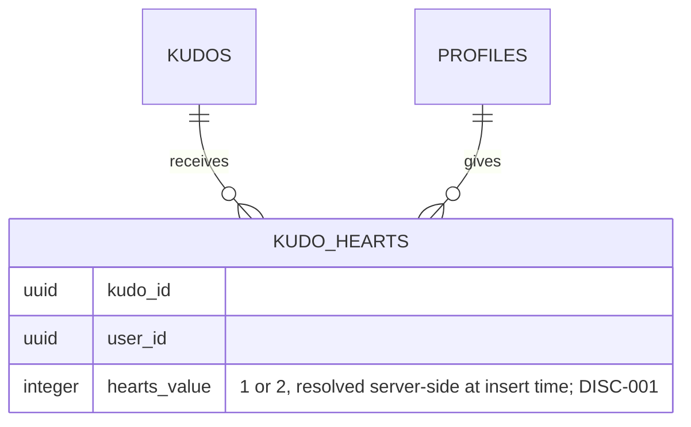

# F000_KudoHearts

**Priority**: P1
**Type**: mixed
**Generated**: 2026-09-06

**See also:** [`functional-spec.md`](./functional-spec.md) — plain-language overview, open
decisions, requirements/business rules stated in one-liners, screens, user stories, scenarios,
edge cases, and configuration for a BA/QA audience.

**How to read this file:** § 2 is the index — pick the action you care about and read its block
in § 3 straight through; each block is one complete thread, top to bottom. § 4 is the shared
appendix — jump in only when a § 3 block points you there.

## 1. Technical Overview

A signed-in member adds or removes one heart on any kudo they did not send, from the existing
feed and highlight cards on `SCR-sun-kudos-board` (owned by F002). Two planned Server Actions
(`heartKudo` / `unheartKudo`) resolve the day's active multiplier from `event_settings` and write
a single `kudo_hearts` row whose `hearts_value` (1 or 2) is later read back unchanged to revoke
exactly what was granted. `kudo_hearts`'s composite primary key and existing RLS policies
(`supabase/migrations/20260722100000_kudo_hearts.sql:8-14,41-47`) already enforce one-heart-per-user
and the self-heart guard at the database layer; this feature replaces the two cards' local
`useState` toggle with real, persisted mutations.

## 2. Action Index

| #      | Action (handler)                                 | Method · Path                                             | Codes                                                                          | Writes        | Detail |
| ------ | ------------------------------------------------ | --------------------------------------------------------- | ------------------------------------------------------------------------------ | ------------- | ------ |
| **A0** | _cross-cutting — authenticated session required_ | —                                                         | FR-601                                                                         | —             | § 4.4  |
| **A1** | `heartKudo` (planned, Server Action)             | — _(Server Action, invoked from the card's heart button)_ | FR-001, FR-201, FR-203, FR-204, FR-401, BR-001, BR-002, BR-003, DEC-001, US001 | `kudo_hearts` | § 3.1  |
| **A2** | `unheartKudo` (planned, Server Action)           | — _(same trigger surface, delete branch)_                 | FR-202, FR-204, FR-402, BR-001, BR-004, US002                                  | `kudo_hearts` | § 3.1  |

## 3. Actions

### 3.1 CAP-01 — Heart & Un-heart a Kudo

#### A1 · Heart a kudo

`—` → `` `heartKudo` `` (planned, Server Action)
`FR-001` `FR-201` `FR-203` `FR-204` `FR-401` `BR-001` `BR-002` `BR-003` `DEC-001` `US001` · `SCR-sun-kudos-board`

**Who** · Sunner (authenticated member), not the kudo's sender _(gate A0 — § 4.4)_
**FE** · `components/kudos-board/feed-kudo-post-card.tsx:28,35-37,140-154` and
`components/kudos-board/highlight-kudo-card.tsx:58-65,148-167` (lifted state in
`components/kudos-board/highlight-section.tsx:26-33`) currently render the heart as a local
`useState` boolean with no server call — this action replaces that body with a call to
`heartKudo(kudoId)`, applying an optimistic fill + count+1 immediately, ahead of the Server
Action's response.
**Request** · `kudoId` (string, the kudo being hearted) — no other params
**BE** · `heartKudo` (planned) reads the caller's session via `getUser()`
(`lib/supabase/server.ts:8-29`), reads `event_settings` for the active special-day range, then
inserts one `kudo_hearts` row
**Rule**

- **BR-001 — a member holds at most one heart per kudo.** The composite `(kudo_id, user_id)`
  primary key on `kudo_hearts` makes a second heart from the same member on the same kudo
  structurally impossible at the database layer; the FE only calls `heartKudo` when the card is
  not already showing a heart, so this is defense-in-depth rather than the primary UI gate. _(§ 4.4)_
- **BR-002 — a kudo's own sender cannot heart it.** The button is rendered disabled client-side
  whenever `sender_id === current user`; the insert is ALSO rejected at the database layer by the
  existing RLS policy (`auth.uid() <> kudos.sender_id`,
  `supabase/migrations/20260722100000_kudo_hearts.sql:42-47`), so a tampered client-side request
  cannot bypass the guard. _(§ 4.4)_
- **BR-003 — hearting credits the sender 1 heart, or 2 on an admin-configured special day.**
  `heartKudo` resolves the multiplier server-side by comparing `now()` against the special-day
  range on `event_settings` (planned columns — no migration exists yet, see § 5.3), and inserts
  `kudo_hearts.hearts_value` as 1 or 2 accordingly; the value is never taken from the client. _(§ 4.4)_

| DEC         | subtype | Condition                                       | What the user sees                                                  | Source                            |
| ----------- | ------- | ----------------------------------------------- | ------------------------------------------------------------------- | --------------------------------- |
| **DEC-001** | render  | `!authenticated OR sender_id === currentUserId` | heart control renders disabled, non-interactive, no count animation | TBD (draft) — not yet implemented |

**Result** · Writes one `kudo_hearts` row (`kudo_id`, `user_id = auth.uid()`, `hearts_value`
resolved by BR-003). The existing `sync_kudo_hearts_count()` trigger
(`supabase/migrations/20260722100000_kudo_hearts.sql:63-85`) increments `kudos.hearts_count` by
that same `hearts_value` — this feature never writes `hearts_count` directly, so the two can never
drift. User sees the heart icon fill red and the count increase by 1 or 2 immediately (optimistic);
on a server rejection (own kudo, expired session, or the kudo having been deleted — a foreign-key
violation) the icon and count revert to their pre-click state and a generic retry message shows.
**Source:** TBD (draft) — `heartKudo` Server Action not yet written; DB enforcement already exists
at `supabase/migrations/20260722100000_kudo_hearts.sql:8-14` (composite PK, `hearts_value` CHECK),
`:41-47` (self-heart RLS), `:63-85` (sync trigger).

<!-- No diagram: below threshold — single table write (kudo_hearts; kudos.hearts_count is a
     DB-trigger side effect, not a second application-level write), synchronous, no background
     step. -->

---

#### A2 · Un-heart a kudo

`—` → `` `unheartKudo` `` (planned, Server Action)
`FR-202` `FR-204` `FR-402` `BR-001` `BR-004` `US002` · `SCR-sun-kudos-board`

**Who** · Sunner (authenticated member) who has previously hearted this kudo _(gate A0)_
**FE** · same two card components as A1 — clicking an already-filled heart calls
`unheartKudo(kudoId)` instead, applying an optimistic un-fill + count-1 immediately.
**Request** · `kudoId` (string) — no other params
**BE** · `unheartKudo` (planned) reads the caller's session, then reads the caller's existing
`kudo_hearts` row for `(kudoId, auth.uid())` to recover its stored `hearts_value` BEFORE deleting
it
**Rule**

- **BR-001 — the same one-heart-per-member guarantee applies in reverse here:** deleting a row
  that is already gone (e.g. a raced double-click) is simply a no-op delete, never an error, so a
  duplicate un-heart click cannot under-flow the count. _(§ 4.4)_
- **BR-004 — un-hearting revokes exactly the amount that heart originally granted.** The delete
  reads `hearts_value` off the existing row first — it never recomputes today's multiplier — so
  un-hearting a kudo that was hearted on a special day still revokes 2, even after the special day
  has ended. _(§ 4.4)_

**Result** · Deletes the caller's `kudo_hearts` row. The same `sync_kudo_hearts_count()` trigger
decrements `kudos.hearts_count` by the deleted row's own `hearts_value`, floored at 0
(`supabase/migrations/20260722100000_kudo_hearts.sql:74-75`). User sees the heart icon un-fill and
the count decrease by that same amount, optimistically; a server-side failure (row already
gone, or session expired) rolls the icon back to hearted and a generic retry message shows.
**Source:** TBD (draft) — `unheartKudo` Server Action not yet written; DB enforcement already
exists at `supabase/migrations/20260722100000_kudo_hearts.sql:50-52` (delete-own-row RLS),
`:63-85` (sync trigger).

<!-- No diagram: below threshold — single table write, synchronous, no background step. -->

### 3.2 Edge cases

| Action  | Scenario                                                                                         | Behavior                                                                                                                                                                                                                                                                                          |
| ------- | ------------------------------------------------------------------------------------------------ | ------------------------------------------------------------------------------------------------------------------------------------------------------------------------------------------------------------------------------------------------------------------------------------------------- |
| A1 · A2 | Double-click / rapid repeated toggling of the same kudo's heart                                  | Each click alternates the optimistic UI state and fires the matching action; the composite `(kudo_id, user_id)` primary key makes a duplicate `kudo_hearts` insert impossible and a repeated delete a no-op, so the stored state always settles to exactly one row or zero — never double-counted |
| A1      | Hearting the caller's own kudo (a tampered client bypassing the disabled control)                | RLS `with check (auth.uid() <> kudos.sender_id)` rejects the insert; the Server Action surfaces a generic error and no row is written                                                                                                                                                             |
| A2      | Un-hearting a kudo hearted during a special day, attempted after the special day has ended       | `hearts_value` is read from the stored row (2), not recomputed from today's date — the sender's total drops by 2, matching what was originally granted                                                                                                                                            |
| A1      | The kudo is deleted (e.g. by a moderation action) between the card rendering and the heart click | The `kudo_id` foreign key (`references public.kudos(id) on delete cascade`) means the referenced kudo no longer exists, so the insert has no valid `kudo_id` and fails; A1 rolls back its optimistic UI update                                                                                    |
| A1 · A2 | The Server Action call fails for any other reason (network, expired session)                     | The optimistic UI change (fill/count or un-fill/count) reverts to its pre-click value; a generic retry message is shown                                                                                                                                                                           |

## 4. Shared Foundation

### 4.1 Components

| Component                             | Responsibility                                                                     | Used in    | File                                             |
| ------------------------------------- | ---------------------------------------------------------------------------------- | ---------- | ------------------------------------------------ |
| `KudoPostCard`                        | Feed card; owns local `liked` state today (to be replaced)                         | A1, A2     | `components/kudos-board/feed-kudo-post-card.tsx` |
| `HighlightKudoCard`                   | Highlight-carousel card; receives `liked`/`onToggleLike` as props from its parent  | A1, A2     | `components/kudos-board/highlight-kudo-card.tsx` |
| `HighlightSection`                    | Owns the lifted `likedIds` state for all 5 carousel slides today (to be replaced)  | A1, A2     | `components/kudos-board/highlight-section.tsx`   |
| `heartKudo` / `unheartKudo` (planned) | Server Actions — session check, multiplier resolution, `kudo_hearts` insert/delete | A0, A1, A2 | TBD (draft)                                      |

### 4.2 Data Model



| Entity        | Table                              | Used for                                                                                                  | Action |
| ------------- | ---------------------------------- | --------------------------------------------------------------------------------------------------------- | ------ |
| KudoHeart     | `kudo_hearts`                      | one row per (kudo, user); `hearts_value` records the multiplier granted so un-heart can revoke it exactly | A1, A2 |
| Kudo          | `kudos`                            | `hearts_count` (display total) kept in sync by the trigger; `sender_id` drives the self-heart guard       | A1, A2 |
| EventSettings | `event_settings` (planned columns) | admin-set special-day range, read at heart time                                                           | A1     |

#### Polymorphic Behavior

##### DISC-001 — KudoHeart.hearts_value

| Value | Render                                                     | Validation                               | Persistence                                                                                                         |
| ----- | ---------------------------------------------------------- | ---------------------------------------- | ------------------------------------------------------------------------------------------------------------------- |
| 1     | Heart icon fills; count shown increases by 1 (normal day)  | `hearts_value` CHECK constraint allows 1 | `kudo_hearts.hearts_value = 1`; sync trigger adds 1 to `kudos.hearts_count` (A1)                                    |
| 2     | Heart icon fills; count shown increases by 2 (special day) | `hearts_value` CHECK constraint allows 2 | `kudo_hearts.hearts_value = 2`; sync trigger adds 2 to `kudos.hearts_count` (A1); A2 later revokes exactly 2, not 1 |

**Source:** `supabase/migrations/20260722100000_kudo_hearts.sql:11,21-29` (column + CHECK
constraint). `DISC-001` is provisional — no `docs/generated/entities.md` exists yet in this
greenfield project to assign the canonical project-scoped code; a future DataModel pass should
confirm or renumber it.

### 4.3 State Management

None. <!-- A 2-state boolean toggle already fully described by BR-001/BR-002's Rule-rung glosses
     above — modeling it as a formal SM-### would restate the same fact a second way (below the
     kind:ui threshold of ≥3 states or ≥2 meaningfully distinct transitions). -->

### 4.4 Shared Rules

#### Bin 3 — cross-cutting, belongs to no single action

**A0 · FR-601 — hearting/un-hearting requires an authenticated session.** Both `heartKudo` and
`unheartKudo` (planned) call `getUser()` (`lib/supabase/server.ts:8-29`) before doing anything
else; an unauthenticated visitor sees the board but the heart control's click handler must be a
no-op for them client-side, and the RLS policies on `kudo_hearts` already restrict insert/delete
to the `authenticated` role regardless
(`supabase/migrations/20260722100000_kudo_hearts.sql:42-52`).
**Source:** TBD (draft) — Server Actions not yet written; RLS already exists at the cited lines.

#### Bin 2 — used by ≥2 named actions

**BR-001 — a member holds at most one heart per kudo; repeated toggling never creates a duplicate
or a negative count.**
Used in: **A1** · **A2**. Enforced structurally by `kudo_hearts`'s composite primary key
(`kudo_id, user_id`) — a second insert for the same pair is rejected by Postgres itself, a repeated
delete is simply a no-op, and the sync trigger floors `kudos.hearts_count` at 0, so no client-side
race can double-count or go negative.
**Source:** `supabase/migrations/20260722100000_kudo_hearts.sql:8-14` (composite PK),
`:70-75` (`greatest(..., 0)` floor on both INSERT and DELETE branches).

```text
# conceptual — the DB, not application code, enforces this
insert into kudo_hearts (kudo_id, user_id, hearts_value) values (:kudo_id, :uid, :value)
-- a second insert for the same (kudo_id, user_id) raises a unique_violation (23505)
delete from kudo_hearts where kudo_id = :kudo_id and user_id = :uid
-- deleting a row that is already gone affects 0 rows, not an error
```

### 4.5 Algorithms & Integrations

None.

### 4.6 Configuration

```text
special_day_start / special_day_end (event_settings, planned columns)   # admin-set date range;
                                                                          # heartKudo compares
                                                                          # now() against it to
                                                                          # resolve hearts_value (A1)
```

**Client behavior:** see
[`behavior-logic.md`](../../docs/generated/behavior-logic.md) (client-side patterns — debounce, optimistic UI, polling, upload, realtime),
[`permissions.md`](../../docs/system/permissions.md) (feature flags / experiments / env / locale gates),
[`architecture.md`](../../docs/system/architecture.md) (guards / deep-link state restoration / unsaved-changes protection).

## 5. Verification & Technical Notes

### 5.1 Technical Verification

- **SC-001** _(A1)_ clicking the heart on a kudo not sent by the caller fills the icon and
  increments the displayed count within one optimistic render cycle (covers FR-201, BR-002)
- **SC-002** _(A1)_ the heart control renders disabled with no click handler firing when
  `sender_id === currentUserId` (covers FR-203, DEC-001)
- **SC-003** _(A1, A2)_ the sender's hearts-received total (the sum of `kudos.hearts_count` across
  their sent kudos) increases by exactly the multiplier active at click time, and decreases by
  that same stored amount on un-heart (covers FR-401, BR-003, BR-004)
- **SC-004** _(A1, A2)_ rapid repeated clicks on the same kudo never leave more than one
  `kudo_hearts` row for that (kudo, user) pair (covers FR-402, BR-001)
- **SC-005** _(A0)_ an unauthenticated request to either Server Action is rejected before any
  `kudo_hearts` write (covers FR-601)

#### US001_HeartAKudo _(A1)_

**Independent Test:** As a signed-in member, click the heart on a kudo sent by someone else and
confirm the icon fills, the count increments, and (via a direct query) the sender's
`kudos.hearts_count` for that row increased by 1 (or 2 on a seeded special day).

**Acceptance Scenarios:**

1. **Given** a kudo not sent by the caller with no existing heart, **When** the member clicks the
   heart icon, **Then** the icon fills, the count increments by 1 (or 2 on a special day), and a
   `kudo_hearts` row is created with the matching `hearts_value`.
2. **Given** a kudo sent by the caller themselves, **When** the member attempts to click the heart
   icon, **Then** no request is sent — the control is rendered disabled.

#### US002_UnheartAKudo _(A2)_

**Independent Test:** As a signed-in member who has already hearted a kudo, click the filled heart
and confirm the icon un-fills, the count decreases by the exact amount that heart granted, and the
`kudo_hearts` row is gone.

**Acceptance Scenarios:**

1. **Given** a kudo the caller previously hearted for 2 (a special-day heart), **When** the member
   clicks un-heart after the special day has ended, **Then** the count decreases by 2, not 1, and
   the `kudo_hearts` row is deleted.
2. **Given** the un-heart request fails server-side, **When** the response returns an error,
   **Then** the UI reverts to the hearted state.

### 5.2 Assumptions

- _(A1)_ `heartKudo` is assumed to run as a single Server Action performing session check →
  multiplier resolution → insert, with no separate round trip for the multiplier lookup — not yet
  confirmed against a running implementation.
- _(A1, A2)_ The optimistic UI update is assumed to follow the existing components' pattern
  (state flips immediately on click, no spinner) rather than a wait-for-server pattern, since both
  current cards already render instantly on click — not yet implemented, so unconfirmed.
- _(A1)_ `event_settings`'s special-day columns are assumed to be a single contiguous date/time
  range (start, end) rather than a list of discrete dates, matching the singular "an
  admin-configured special day" wording in `clarifications.md` — genuinely unresolved, see § 5.3.

### 5.3 Unresolved Questions

1. **`event_settings` special-day column shape** _(A1)_: `clarifications.md` settles WHERE the
   special-day config lives (`event_settings`) but not its column names/types (a date range vs. a
   list of discrete dates vs. a boolean-per-day) — no migration exists yet for this addition.
2. **Optimistic-UI mechanism** _(A1, A2)_: whether the replacement implementation keeps the
   existing plain `useState` optimistic pattern or adopts React's `useOptimistic` is not decided —
   both are consistent with the FE rungs above.
3. **Anonymous-kudo crediting** _(A1)_: `functional-spec.md § 3` Open Decisions (D001) proposes
   crediting `kudos.sender_id` regardless of `is_anonymous`; this file assumes that default but
   flags it as the same open question, since it changes what BR-003's "the sender" resolves to.

### 5.4 Source References

| Action | Order | Symbol                                   | Path                                                                                                          | Purpose                                                                                |
| ------ | ----- | ---------------------------------------- | ------------------------------------------------------------------------------------------------------------- | -------------------------------------------------------------------------------------- |
| —      | 1     | `kudo_hearts` table + trigger            | `supabase/migrations/20260722100000_kudo_hearts.sql:1-85`                                                     | The persistence + count-sync mechanism this feature reads and writes                   |
| A1, A2 | 2     | `KudoPostCard`                           | `components/kudos-board/feed-kudo-post-card.tsx:22-183`                                                       | Feed card's current local-only heart toggle, to be replaced                            |
| A1, A2 | 3     | `HighlightKudoCard` / `HighlightSection` | `components/kudos-board/highlight-kudo-card.tsx:55-171`, `components/kudos-board/highlight-section.tsx:17-33` | Highlight card's current local-only heart toggle (lifted state), to be replaced        |
| A0     | 4     | `createClient`                           | `lib/supabase/server.ts:8-29`                                                                                 | Server-side Supabase client factory `heartKudo`/`unheartKudo` will use for `getUser()` |

#### Data Flow

```text
Click heart icon (A1/A2) -> optimistic fill/count update -> heartKudo|unheartKudo(kudoId) ->
getUser() -> [A1 only: read event_settings, resolve hearts_value] -> insert|delete kudo_hearts ->
sync_kudo_hearts_count() trigger adjusts kudos.hearts_count -> revalidated data replaces the
optimistic value (or the optimistic value is rolled back on error)
```

### 5.5 Artifact References

| Artifact        | File                                                     | Codes Used  | Reviewed |
| --------------- | -------------------------------------------------------- | ----------- | -------- |
| System Overview | system-overview.md                                       | TBD (draft) | [ ]      |
| Architecture    | architecture.md                                          | TBD (draft) | [ ]      |
| Feature List    | feature-list.md                                          | F004        | [ ]      |
| Permissions     | permissions.md                                           | TBD (draft) | [ ]      |
| Screens         | [functional-spec.md § 6](./functional-spec.md#6-screens) | TBD (draft) | [ ]      |
| User Stories    | user-stories.md                                          | TBD (draft) | [ ]      |
