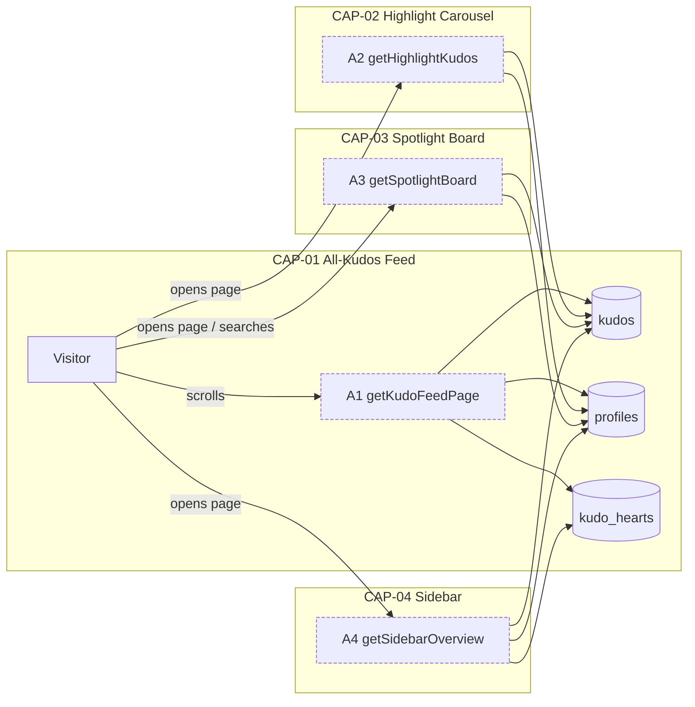
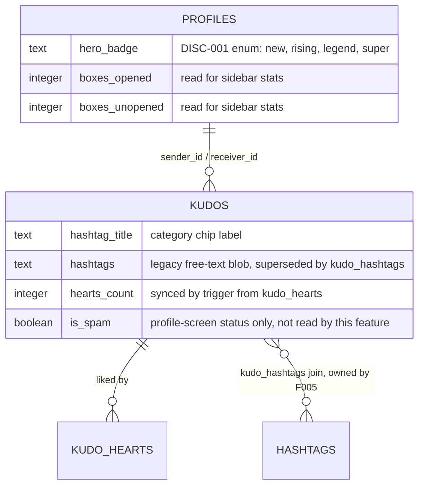

# F002_KudosBoardData — Technical Spec

**Priority**: P0
**Type**: ui
**Generated**: 2026-09-06

**See also:** [`functional-spec.md`](./functional-spec.md) — plain-language overview, open
decisions, requirements/business rules stated in one-liners, screens, user stories, scenarios,
edge cases, and configuration for a BA/QA audience.

**How to read this file:** § 2 is the index — pick the action you care about and read its block
in § 3 straight through; each block is one complete thread, top to bottom. § 4 is the shared
appendix — jump in only when a § 3 block points you there.

## 1. Technical Overview

`/sun-kudos` renders four read-only capabilities from real data instead of the four mock-data
modules it uses today: the All-Kudos feed (infinite scroll, `created_at DESC`), the Highlight
carousel (top 5 by `hearts_count`, event-wide), the Spotlight name cloud (+ a `COUNT(*)` total),
and the sidebar (personal stats + two 10-row leaderboards). The screen is already a server
component (`app/sun-kudos/page.tsx`) composing five `"use client"` sections; this feature's job is
to fetch real rows server-side and pass them as props into the existing client components instead
of those components importing the mock modules directly. No table is in the `supabase_realtime`
publication, so every read here is a plain server-side query — no subscription, no polling.



_(dashed border = planned handler, not yet implemented — see § 2)_

## 2. Action Index

| #      | Action (handler)                              | Method · Path                           | Codes                                                                          | Writes          | Detail |
| ------ | --------------------------------------------- | --------------------------------------- | ------------------------------------------------------------------------------ | --------------- | ------ |
| **A0** | _cross-cutting — belongs to no single action_ | —                                       | {FR-601}                                                                       | —               | § 4.4  |
| **A1** | `getKudoFeedPage()` _(planned)_               | — _(RSC server-fetch, no HTTP surface)_ | {FR-001, FR-101, FR-201, FR-402, FR-401, BR-001, BR-002, BR-003, US001, US005} | — _(read-only)_ | § 3.1  |
| **A2** | `getHighlightKudos()` _(planned)_             | — _(RSC server-fetch)_                  | {FR-202, FR-401, BR-001, BR-002, BR-004, US002, US005}                         | — _(read-only)_ | § 3.2  |
| **A3** | `getSpotlightBoard()` _(planned)_             | — _(RSC server-fetch)_                  | {FR-203, BR-005, US003}                                                        | — _(read-only)_ | § 3.3  |
| **A4** | `getSidebarOverview()` _(planned)_            | — _(RSC server-fetch)_                  | {FR-204, BR-001, BR-006, US004}                                                | — _(read-only)_ | § 3.4  |

Every action is a planned Next.js Server Component data-fetch (no controller class exists in this
stack) — `` `functionName()` `` stands in for the handler identity (D2 fallback: this project has
no `Class#method` shape to key on). `FR-401`/`BR-002`/`US005` (board-wide hashtag filtering) are
claimed by both A1 and A2 — one requirement fanning out to the two actions it actually filters,
not a violation (see `docs/decisions/ADR-0006.md`'s addendum). `BR-001` (star tier) fans out to
A1, A2, A4 the same way — every action that renders a person block needs it.

**Diagram threshold:** none of A1-A4 crosses it — each is a single read against ≤3 tables with no
background/async step — so no `sequenceDiagram` appears under any § 3 block below.

## 3. Actions

### 3.1 CAP-01 — All-Kudos Feed

#### A1 · Fetch a page of the All-Kudos feed

`—` → `` `getKudoFeedPage()` `` _(planned)_
`FR-001` `FR-101` `FR-201` `FR-402` `FR-401` · `SCR-sun-kudos-board`

**Who** · any visitor, authenticated or anonymous _(gate A0 — § 4.4, board reads need no login)_
**FE** · `FeedList` renders the column and currently drives pagination itself off an in-memory
array (`components/kudos-board/feed-list.tsx:22-58`); it becomes a consumer of server-fetched,
already-paginated pages instead of calling `getKudoPostsPage` client-side. The hashtag-filter
state it owns locally today (`components/kudos-board/feed-list.tsx:25,60-62`) must be lifted to
the page per `BR-002` — `feed-list.tsx` keeps only the render, not the filter state.
**Request** · cursor/keyset param `after` _(created_at + id)_, optional `hashtag_id`, optional
`department` — page size not yet decided (§ 5.3).
**BE** · _(planned)_ — joins `kudos` to `profiles` twice (`sender:profiles!kudos_sender_id_fkey`,
`receiver:profiles!kudos_receiver_id_fkey`) and left-joins `kudo_hearts` for the viewer's own like
row. `is_spam` rows are assumed excluded (§ 5.2 assumption 4).
**Rule**

- **BR-001 — A person block's star tier (1/2/3) comes from the receiver's total received-kudos
  count against fixed thresholds (10/20/50).** New display element — no star count exists in
  `PersonBlock` today (`components/kudos-board/feed-kudo-post-card.tsx:187-212`). _(§ 4.4)_
- **BR-002 — An active hashtag/department filter is AND-composed and applies to both this feed
  and the Highlight carousel together, resetting the carousel to slide 1.** _(§ 4.4)_
- **BR-003 — The feed sorts newest-first (`created_at DESC`).** Settled in clarifications.md;
  `is_spam` stays unused for ordering this pass.
  **Result** · read-only — no DB write. Each row carries `hearts_count` (from `kudos`), a computed
  `liked_by_me` (does a `kudo_hearts` row exist for the viewer + this kudo — F004 owns the mutation,
  this feature only reads the flag), and `is_own_kudos` (`sender_id = auth.uid()`) so F004's heart
  control can render its disabled/active state. Empty result → `'Hiện tại chưa có Kudos nào.'`
  (`FR-402`).
  **Source:** TBD (draft) — no server-fetch code written yet; existing FE citations above are the
  code this action replaces, not this action's own implementation.

<!-- No diagram: single read against ≤3 tables, no background step, below threshold. -->

---

### 3.2 CAP-02 — Highlight Carousel

#### A2 · Fetch the top-5 Highlight kudos

`—` → `` `getHighlightKudos()` `` _(planned)_
`FR-202` `FR-401` · `SCR-sun-kudos-board`

**Who** · any visitor, authenticated or anonymous _(gate A0)_
**FE** · `HighlightSection` currently filters an in-memory 5-item mock array client-side
(`components/kudos-board/highlight-section.tsx:17-65`); the filter dropdowns it renders
(`highlight-filter-dropdown.tsx`) stay as-is, only their `onSelect` now drives a server re-fetch
instead of an in-memory `.filter()`.
**Request** · optional `hashtag_id`, optional `department` — same filter params as A1 (`BR-002`).
**BE** · _(planned)_ — `ORDER BY kudos.hearts_count DESC LIMIT 5`, filter-aware, same
sender/receiver join shape as A1.
**Rule**

- **BR-001 — star tier, same rule as A1.** _(§ 4.4)_
- **BR-002 — filter AND-composition, same rule as A1.** _(§ 4.4)_
- **BR-004 — exactly 5 kudos, ordered by `hearts_count` DESC, over the whole event (no time
  window), filter-aware.** Tie-break order for equal `hearts_count` is not stated anywhere in
  source (§ 5.3).
  **Result** · read-only — no DB write. Empty result → `'Hiện tại chưa có Kudos nào.'` and the
  carousel index resets to 0 (`FR-402`).
  **Source:** TBD (draft).

<!-- No diagram: single read, below threshold. -->

---

### 3.3 CAP-03 — Spotlight Board

#### A3 · Fetch the Spotlight name cloud + total count

`—` → `` `getSpotlightBoard()` `` _(planned)_
`FR-203` · `SCR-sun-kudos-board`

**Who** · any visitor, authenticated or anonymous _(gate A0)_
**FE** · `SpotlightBoard` currently searches an in-memory mock array client-side
(`components/kudos-board/spotlight-board.tsx:42-48`); node position/size/accent
(`xPct`/`yPct`/`size`/`accent`) stay **client-computed and decorative — no DB source** (per task
brief; the layout math has no server-side equivalent to replace).
**Request** · optional `q` (Sunner name search, ≤100 chars, non-empty when present — enforced
today by the input's `maxLength` attribute, `spotlight-board.tsx:107`).
**BE** · _(planned)_ — one query returns the recipient node set (name, `received_at`); a second,
independent aggregate returns `COUNT(*)` over ALL kudos, unfiltered by hashtag/department or by
the search term (`BR-005`).
**Rule**

- **BR-005 — the total count is a single unfiltered `COUNT(*)` over all kudos; the node set is
  every kudos recipient with no stated limit.** _(§ 4.4)_
  **Result** · read-only — no DB write. Zero search matches → existing empty-state block renders
  (`spotlight-board.tsx:131-139`); exact copy not specified in any source (open decision, see
  functional-spec.md § 3 D003).
  **Source:** TBD (draft).

<!-- No diagram: two independent single-table reads, below threshold. -->

---

### 3.4 CAP-04 — Sidebar Stats & Leaderboards

#### A4 · Fetch the current user's sidebar overview

`—` → `` `getSidebarOverview()` `` _(planned)_
`FR-204` · `SCR-sun-kudos-board`

**Who** · the signed-in viewer only _(gate A0 — but see § 5.3: whether an anonymous visitor sees
this block at all is not confirmed from source)_
**FE** · `SidebarStats` and `SidebarLeaderboard` currently render `OVERVIEW_STATS` /
`GIFT_LEADERBOARD` / `RISING_LEADERBOARD` mocks (`components/kudos-board/sidebar-stats.tsx:13`,
`components/kudos-board/sidebar-panel.tsx:22-32`).
**Request** · implicit — current viewer id, no user-supplied params.
**BE** · _(planned)_ — 5 stat counters (`kudos received`, `kudos sent`, `hearts received`,
`secret boxes opened`, `secret boxes unopened`) derived from `kudos`/`kudo_hearts`/`profiles`; both
leaderboard lists have **no backing table this batch** (`BR-006`).
**Rule**

- **BR-001 — star tier, same rule as A1**, applied to each leaderboard row's person block.
  _(§ 4.4)_
- **BR-006 — both leaderboards are always exactly 10 rows when data exists; neither has a
  backing table this batch, so both render the literal empty state unconditionally.** See
  functional-spec.md § 12 Dependencies.
  **Result** · read-only — no DB write. Both leaderboards render `'Chưa có dữ liệu'`
  (`sidebar-leaderboard.tsx:25-27`) until a future batch adds a rank-up event log and a prize-draw
  results table.
  **Source:** TBD (draft).

<!-- No diagram: single read, below threshold. -->

---

### 3.5 CAP-05 — Board-Wide Hashtag Filtering

_(No dedicated handler of its own — this capability is the filter parameter A1 and A2 both accept;
documented here as its own capability because it is one distinct user-facing behavior — "pick a
tag anywhere, both sections react" — not a variation of either action alone.)_

**BR-002 full statement, source, and pseudocode live once in § 4.4** (Bin 2, used in A1 · A2); this
bucket exists only to satisfy the twin `functional-spec.md § 2` CAP-05 row and carries no action
block of its own.

### 3.6 Edge cases

| Action  | Scenario                                                              | Behavior                                                                                                                            |
| ------- | --------------------------------------------------------------------- | ----------------------------------------------------------------------------------------------------------------------------------- |
| A1      | Feed has zero kudos, or the active filter matches none                | `'Hiện tại chưa có Kudos nào.'`                                                                                                     |
| A2      | Active hashtag/department filter matches no kudos                     | `'Hiện tại chưa có Kudos nào.'`, carousel resets to slide 1                                                                         |
| A1 · A2 | A new kudos is inserted while a visitor is mid-scroll or mid-carousel | cursor/keyset boundary behavior not confirmed from source (§ 5.3)                                                                   |
| A3      | Spotlight search matches no Sunner name                               | existing empty-state block renders; exact copy not specified (functional-spec.md § 3 D003)                                          |
| A4      | Rising-leaderboard or gift-leaderboard query has zero rows            | `'Chưa có dữ liệu'` — always true this batch, no backing table exists (functional-spec.md § 12)                                     |
| A1-A4   | Unauthenticated visitor loads the board                               | all four reads succeed — `profiles`/`kudos`/`kudo_hearts` policies grant `select` to `anon` and `authenticated` alike (`A0`, § 4.4) |

## 4. Shared Foundation

### 4.1 Components

| Component                                              | Responsibility                                                                                       | Used in    | File                                                                                       |
| ------------------------------------------------------ | ---------------------------------------------------------------------------------------------------- | ---------- | ------------------------------------------------------------------------------------------ |
| `AllKudosSection`                                      | Client-boundary wrapper composing the feed column + sidebar                                          | A1, A4     | `components/kudos-board/all-kudos-section.tsx`                                             |
| `FeedList`                                             | Renders the All-Kudos column; today reads+filters an in-memory mock array, owns filter state locally | A1         | `components/kudos-board/feed-list.tsx`                                                     |
| `HighlightSection`                                     | Renders the 5-slide carousel + both filter dropdowns; today filters an in-memory mock array          | A2         | `components/kudos-board/highlight-section.tsx`                                             |
| `SpotlightBoard`                                       | Renders the name cloud, search box, and pan/zoom controls; today searches an in-memory mock array    | A3         | `components/kudos-board/spotlight-board.tsx`                                               |
| `SidebarPanel` / `SidebarStats` / `SidebarLeaderboard` | Renders the personal-stats box + both leaderboard boxes                                              | A4         | `components/kudos-board/sidebar-panel.tsx`, `sidebar-stats.tsx`, `sidebar-leaderboard.tsx` |
| `HeroBadge`                                            | Renders the `profiles.hero_badge` discriminator as an image pill or a text fallback                  | A1, A2, A4 | `components/common/hero-badge.tsx`                                                         |

### 4.2 Data Model



| Entity                          | Table           | Used for                                                                              | Action     |
| ------------------------------- | --------------- | ------------------------------------------------------------------------------------- | ---------- |
| `Profile`                       | `profiles`      | sender/receiver identity, `hero_badge` tier, box counts for sidebar stats             | A1, A2, A4 |
| `Kudo`                          | `kudos`         | feed rows, highlight ranking, spotlight recipients + total count                      | A1, A2, A3 |
| `KudoHeart`                     | `kudo_hearts`   | `hearts_count` display + the viewer's own `liked_by_me` flag (F004 owns the mutation) | A1, A2     |
| `Hashtag` _(owned by F005)_     | `hashtags`      | resolves a hashtag id to its display label for chips and the filter dropdown          | A1, A2     |
| `KudoHashtag` _(owned by F005)_ | `kudo_hashtags` | join between a kudo and its structured hashtag ids, once F005 backfills it            | A1, A2     |

#### Polymorphic Behavior

##### DISC-001 — Profile.hero_badge

| Value    | Render                                                                                                    | Validation                      | Persistence                                  |
| -------- | --------------------------------------------------------------------------------------------------------- | ------------------------------- | -------------------------------------------- |
| `new`    | `HeroBadge` renders the navy fallback pill with the label text (no exported artwork exists for this tier) | N/A — read-only in this feature | N/A — this feature never writes `hero_badge` |
| `rising` | renders `/kudos/badges/rising-hero.png`                                                                   | N/A                             | N/A                                          |
| `super`  | renders `/kudos/badges/super-hero.png`                                                                    | N/A                             | N/A                                          |
| `legend` | renders `/kudos/badges/legend-hero.png`                                                                   | N/A                             | N/A                                          |

**Source:** `components/common/hero-badge.tsx:13-19,27-45` · `supabase/migrations/20260714070000_profile_schema.sql:8-15` (the `check (hero_badge in (...))` constraint)

### 4.3 State Management

None. This feature is read-only and reaches no entity lifecycle or persisted client state of its
own — the carousel index and Spotlight pan/zoom/search are local view state below the `kind: ui`
threshold (no ≥3-state / ≥2-transition machine).

### 4.4 Shared Rules

#### Bin 3 — cross-cutting, belongs to no single action

**A0 · `FR-601` — board reads require no authentication.** `profiles`, `kudos`, and `kudo_hearts`
all carry a `for select to anon, authenticated using (true)` policy — this applies uniformly to
every read in this feature, not any one capability.
**Source:** `supabase/migrations/20260714070000_profile_schema.sql:53-61` · `supabase/migrations/20260722100000_kudo_hearts.sql:29-31`

#### Bin 2 — used by ≥2 named actions

**BR-001 — A person block's star tier (1/2/3) is derived from the receiver's total received-kudos
count via fixed thresholds.**
Used in: **A1** · **A2** · **A4**. Thresholds: 10 kudos → 1 star, 20 → 2 stars, 50 → 3 stars, each
with a fixed tooltip sentence (see functional-spec.md § 13 Configuration for the exact copy). This
is a wholly new display element — no star-count UI exists in any current person block
(`feed-kudo-post-card.tsx:187-212`, `highlight-kudo-card.tsx:21-53`,
`sidebar-leaderboard.tsx:17-52`).
**Source:** TBD (draft) — `ALG-001` computes the value; no rendering code written yet.

```text
tier(receivedCount):
  if receivedCount >= 50: return 3
  if receivedCount >= 20: return 2
  if receivedCount >= 10: return 1
  return 0
```

**BR-002 — An active hashtag/department filter is AND-composed and applies to the Highlight
carousel and the All-Kudos feed together; selecting or clearing a filter (from either dropdown, or
a chip on either card type) resets the carousel to slide 1.**
Used in: **A1** · **A2**. Filter state currently lives inside `FeedList`
(`components/kudos-board/feed-list.tsx:25`) and must be lifted to the page
(`app/sun-kudos/page.tsx`) so both sections read the same selection.
**Source:** TBD (draft) — the lift-to-page refactor has not been written yet.

```text
onSelectHashtagOrDepartment(value):
  pageState.filter = { ...pageState.filter, [kind]: value }
  highlightIndex = 0
  refetch(A1, pageState.filter)
  refetch(A2, pageState.filter)
```

### 4.5 Algorithms & Integrations

None beyond the one algorithm below. No external integration (API call, webhook, queue job,
notification) exists in this read-only feature.

### Star tier derivation (ALG-001)

**Linked FR:** FR-201
**Used in:** A1, A2, A4
**Source:** TBD (draft)
**Input:** a receiver's total received-kudos count (`integer`) · **Output:** tier ∈ `{0, 1, 2, 3}` ·
**Complexity:** O(1) per row, assuming the count itself is either pre-aggregated or backed by
`kudos_receiver_id_created_at_idx` (leading column `receiver_id`).
**Description:** compares the receiver's lifetime received-kudos count against three fixed
thresholds (10/20/50) to pick a star tier; each tier also carries a fixed tooltip sentence
(functional-spec.md § 13). Pure function of one integer input — no side effects.

**Pseudocode:**

```text
function starTier(receivedCount: number): 0 | 1 | 2 | 3 {
  if (receivedCount >= 50) return 3;
  if (receivedCount >= 20) return 2;
  if (receivedCount >= 10) return 1;
  return 0;
}
```

### 4.6 Configuration

```text
HIGHLIGHT_CAROUSEL_SIZE = 5          # hard limit, event-wide, filter-aware (A2)
LEADERBOARD_ROW_COUNT = 10           # both sidebar leaderboards (A4)
SPOTLIGHT_SEARCH_MAX_LEN = 100       # existing input maxLength, spotlight-board.tsx:107 (A3)
FEED_PAGE_SIZE = <unresolved>        # never stated in any spec — see § 5.3 (A1)
```

**Client behavior:** see
[`behavior-logic.md`](../../docs/generated/behavior-logic.md) (client-side patterns — debounce, optimistic UI, polling, upload, realtime),
[`permissions.md`](../../docs/system/permissions.md) (feature flags / experiments / env / locale gates),
[`architecture.md`](../../docs/system/architecture.md) (guards / deep-link state restoration / unsaved-changes protection).

## 5. Verification & Technical Notes

### 5.1 Technical Verification

- **SC-001** _(A1)_ Every scroll-triggered page load appends strictly older rows (by the same
  cursor) with no duplicate and no skipped row across the page boundary (covers FR-201).
- **SC-002** _(A2)_ The carousel never renders more than 5 slides, always ordered by
  `hearts_count` DESC within the active filter (covers FR-202, BR-004).
- **SC-003** _(A3)_ The Spotlight total count always equals `COUNT(*)` over all kudos, unaffected
  by any active hashtag/department filter or by the search term (covers FR-203, BR-005).
- **SC-004** _(A4)_ Both leaderboards render exactly 10 rows when data exists, and the literal
  empty-state string when it does not (covers FR-204, BR-006).
- **SC-005** _(A1, A2)_ Selecting a hashtag from either dropdown, or clicking a chip on either card
  type, re-filters both sections identically and resets the carousel index to 0 (covers FR-401,
  BR-002).

#### US001 _(A1)_

**Independent Test:** Load `/sun-kudos` with ≥1 seeded kudos row; confirm the feed renders
newest-first and a scroll-triggered load appends the next page without duplicating any row.

**Acceptance Scenarios:**

1. **Given** more than one page of kudos exist, **When** the visitor scrolls to the sentinel,
   **Then** the next page appends below the last rendered row.
2. **Given** zero kudos exist, **When** the page loads, **Then** the feed shows
   `'Hiện tại chưa có Kudos nào.'`.

#### US002 _(A2)_

**Independent Test:** Seed kudos with distinct `hearts_count` values; confirm the carousel shows
exactly the top 5 by `hearts_count` DESC and the pagination indicator reads `n/5`.

**Acceptance Scenarios:**

1. **Given** more than 5 kudos exist, **When** the carousel loads, **Then** only the top 5 by
   `hearts_count` render, in descending order.
2. **Given** an active hashtag filter matches zero kudos, **When** the filter is applied,
   **Then** the carousel shows the empty state and the slide index resets to 0.

#### US003 _(A3)_

**Independent Test:** Seed several kudos with distinct receivers; confirm the Spotlight total count
equals the true `COUNT(*)` and the node set includes every recipient.

**Acceptance Scenarios:**

1. **Given** N total kudos exist, **When** the Spotlight board loads, **Then** it displays exactly
   N as the total count regardless of any board-wide filter.
2. **Given** a search term matches no name, **When** the visitor searches, **Then** the empty-state
   block renders.

#### US004 _(A4)_

**Independent Test:** Sign in as a seeded user with known counts; confirm all 5 stat rows match the
true counts and both leaderboards render the literal empty state (no backing table this batch).

**Acceptance Scenarios:**

1. **Given** a signed-in viewer with N received kudos, **When** the sidebar loads, **Then** the
   "kudos received" stat reads N.
2. **Given** neither leaderboard has a backing table, **When** the sidebar loads, **Then** both
   render `'Chưa có dữ liệu'`.

#### US005 _(A1, A2)_

**Independent Test:** Click a hashtag chip on a feed card; confirm both the Highlight carousel and
the All-Kudos feed re-filter to that tag and the carousel index resets to 0.

**Acceptance Scenarios:**

1. **Given** the board is showing unfiltered data, **When** the visitor clicks a hashtag chip,
   **Then** both sections re-filter to that tag and the carousel resets to slide 1.
2. **Given** a filter is active, **When** the visitor clears it (re-clicking the active tag, or the
   dropdown's clear action), **Then** both sections return to unfiltered data.

### 5.2 Assumptions

- _(A1)_ `created_at DESC` full-feed ordering is assumed to perform acceptably at current data
  volume even though the existing composite index (`kudos_receiver_id_created_at_idx`) leads on
  `receiver_id`, not `created_at` alone — this pass does not benchmark the query, it records the
  index shape as observed.
- _(A2)_ "Top 5 by hearts, event-wide" is assumed to mean unbounded by any date window, with ties
  on `hearts_count` broken by `created_at DESC` as a secondary key — unconfirmed from any spec.
- _(A3)_ The Spotlight name cloud is assumed to need no server-side pagination for this release —
  the design gives no stated limit and the feature's current kudos volume is assumed small.
- _(A4)_ `kudos.is_spam` rows are assumed excluded from every board read (feed, highlight,
  spotlight, leaderboards) even though no source states this explicitly — the column exists for
  the Profile screen's own status badge, not a board-visibility gate.

### 5.3 Unresolved Questions

1. **Feed page size** _(A1)_: the infinite-scroll page size is never stated in any source spec or
   clarification — only the sort key (`created_at DESC`) was settled.
2. **Full-feed ordering index** _(A1)_: whether `kudos_receiver_id_created_at_idx` (leading on
   `receiver_id`) adequately serves an unfiltered, feed-wide `ORDER BY created_at DESC` at scale,
   or whether a dedicated `(created_at desc)` index is needed, is not confirmed from source.
3. **Highlight tie-break** _(A2)_: the order of kudos tied on `hearts_count` within the top-5
   window is not stated anywhere in source.
4. **Anonymous-viewer sidebar** _(A4)_: whether an unauthenticated visitor sees the sidebar stats
   block at all (and if so, in what state) is not confirmed from source — the design's stats are
   framed as "your" counts, which implies a signed-in viewer, but no source states the
   logged-out behavior.

### 5.4 Source References

| Action | Order | Symbol                      | Path                                                         | Purpose                                                     |
| ------ | ----- | --------------------------- | ------------------------------------------------------------ | ----------------------------------------------------------- |
| —      | 1     | `profiles` / `kudos` schema | `supabase/migrations/20260714070000_profile_schema.sql:8-33` | entities this feature revolves around                       |
| —      | 2     | `kudo_hearts` schema        | `supabase/migrations/20260722100000_kudo_hearts.sql:9-31`    | `hearts_count` sync trigger + read source for `liked_by_me` |
| A1-A4  | 3     | `SunKudosPage`              | `app/sun-kudos/page.tsx:32-48`                               | server component composing all 4 capabilities               |
| A1     | 4     | `AllKudosSection`           | `components/kudos-board/all-kudos-section.tsx:15-34`         | client boundary wrapping feed + sidebar                     |
| A1     | 5     | `FeedList`                  | `components/kudos-board/feed-list.tsx:22-94`                 | current mock-backed feed implementation to replace          |
| A1     | 6     | `feed-mock-data.ts`         | `components/kudos-board/feed-mock-data.ts:121-133`           | mock query shape (`getKudoPostsPage`) to replace            |
| A2     | 7     | `HighlightSection`          | `components/kudos-board/highlight-section.tsx:17-65`         | current mock-backed highlight + filter implementation       |
| A2     | 8     | `highlight-mock-data.ts`    | `components/kudos-board/highlight-mock-data.ts:67-70`        | mock query shape to replace                                 |
| A3     | 9     | `SpotlightBoard`            | `components/kudos-board/spotlight-board.tsx:28-176`          | current mock-backed spotlight implementation                |
| A3     | 10    | `spotlight-mock-data.ts`    | `components/kudos-board/spotlight-mock-data.ts:79-94`        | mock total count + node set to replace                      |
| A4     | 11    | `SidebarStats`              | `components/kudos-board/sidebar-stats.tsx:10-56`             | current mock-backed stats implementation                    |
| A4     | 12    | `SidebarLeaderboard`        | `components/kudos-board/sidebar-leaderboard.tsx:17-52`       | leaderboard rendering, both lists currently mock            |

#### Data Flow

```text
{GET /sun-kudos, RSC render} -> {A1-A4 planned data-fetch functions query profiles/kudos/kudo_hearts
  (+ hashtags via F005)} -> {rows passed as props into FeedList/HighlightSection/SpotlightBoard/
  SidebarPanel} -> {existing client components render, unchanged apart from the prop source}
```

### 5.5 Artifact References

| Artifact           | File                                                     | Codes Used                        | Reviewed |
| ------------------ | -------------------------------------------------------- | --------------------------------- | -------- |
| System Overview    | TBD (draft)                                              | —                                 | [ ]      |
| Architecture       | TBD (draft)                                              | —                                 | [ ]      |
| Feature List       | [feature-list.md](../feature-list.md)                    | F002                              | [ ]      |
| API Map            | TBD (draft)                                              | TBD (draft)                       | [ ]      |
| Entities           | TBD (draft)                                              | TBD (draft)                       | [ ]      |
| Screens            | [functional-spec.md § 6](./functional-spec.md#6-screens) | SCR-sun-kudos-board               | [ ]      |
| Behavior Logic     | TBD (draft)                                              | TBD (draft)                       | [ ]      |
| Permissions Matrix | TBD (draft)                                              | TBD (draft)                       | [ ]      |
| User Stories       | TBD (draft)                                              | US001, US002, US003, US004, US005 | [ ]      |
