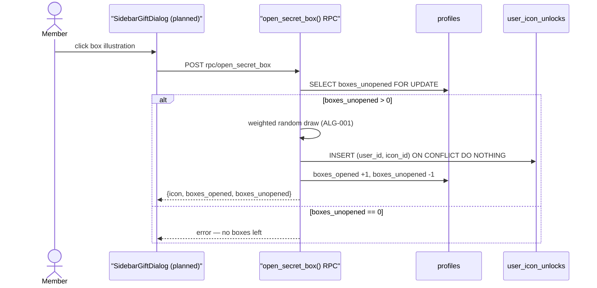
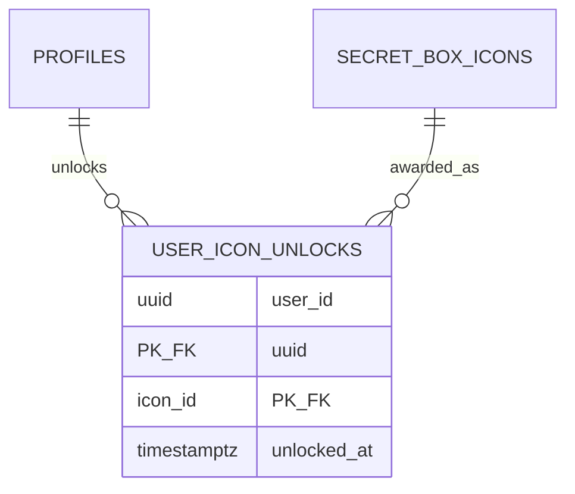

# F006_SecretBoxReveal

**See also:** [`functional-spec.md`](./functional-spec.md) — plain-language overview, open
decisions, requirements/business rules stated in one-liners, screens, user stories, scenarios,
edge cases, and configuration for a BA/QA audience.

## 1. Technical Overview

A member spends one of their unopened secret boxes for a single, weighted-random collectible
badge. The whole draw — the fixed probability table, the `user_icon_unlocks` insert, and the
`profiles.boxes_opened`/`boxes_unopened` counter update — runs inside one `security definer`
Postgres RPC (`open_secret_box()`, planned) so the odds and the mutation never reach the client.
Today `sidebar-gift-dialog.tsx` only renders the pre-draw "chưa mở" shell (`components/kudos-board/sidebar-gift-dialog.tsx:1-130`); this spec adds the click-to-reveal flow on top of it.

**Why not a plain authenticated Server Action:** two facts rule it out. (1) `public.user_icon_unlocks`
carries only a SELECT policy — an authenticated client `INSERT` fails with `42501`
(`supabase/migrations/20260714070000_profile_schema.sql:64-65`, no INSERT/UPDATE/DELETE policy
exists on that table). (2) the phase-0 privilege-escalation hardening (see security report
`security-260906-1740-profiles-privilege-escalation.md`) revokes column-level UPDATE on `profiles`
down to `display_name, avatar_url, language` — `boxes_opened`/`boxes_unopened` become
non-user-writable by design. A Server Action running as the signed-in user hits both walls. Moving
to a **service-role** Server Action does not fix this either: the Supabase JS client has no
multi-statement transaction — a service-role action calling `.update()` then `.insert()` is two
separate HTTP round trips, so a network failure between them can decrement the counter with no
badge granted (or the reverse). A `security definer` RPC is one Postgres function, one transaction:
if anything raises, the row lock, the counter update, and the insert all roll back together — no
partial state is ever observable. **The probability table itself must never ship to the client** —
if the weights lived in browser code, a user could compute (or forge) which badge "should" have
been drawn; keeping the draw server-side is what the two MoMorph security test cases below require.

## 2. Action Index

<!-- COMPLETENESS RULE: every FR/BR/DEC/SM/US code declared anywhere in § 3 or § 4 MUST be
     claimed by AT LEAST ONE row here (or by A0). -->

| #      | Action (handler)                              | Method · Path                | Codes                                                         | Writes                          | Detail              |
| ------ | --------------------------------------------- | ---------------------------- | ------------------------------------------------------------- | ------------------------------- | ------------------- |
| **A0** | _cross-cutting — belongs to no single action_ | —                            | FR-601                                                        | —                               | § 4.4               |
| **A1** | `SunKudosPage#loadProfileStats` (planned)     | — _(Server Component read)_  | FR-001, FR-101, FR-201, BR-004, US001                         | — _(read-only)_                 | § 3.1               |
| **A2** | `open_secret_box#rpc` (planned)               | `POST` `rpc/open_secret_box` | FR-201, FR-401, FR-601, BR-001, BR-002, BR-003, BR-004, US001 | `user_icon_unlocks`, `profiles` | § 3.1 ▸ **diagram** |

## 3. Actions

### 3.1 CAP-01 — SecretBoxReveal

#### A1 · Load current box counts

`—` _(Server Component read, no REST endpoint)_ → `` `SunKudosPage#loadProfileStats` (planned) ``
`FR-001` `FR-101` `FR-201` · `SCR-secret-box`

**Who** · Member (authenticated viewer of `/sun-kudos`) _(gate A0 — § 4.4)_
**FE** · `SidebarStats` (planned) renders `boxes_opened`/`boxes_unopened` from the loaded profile
row instead of the current `OVERVIEW_STATS` mock (`components/kudos-board/sidebar-stats.tsx:1-66`);
its existing "Mở quà" button (FR-101 — already implemented, unchanged by this feature) opens
`SidebarGiftDialog` (planned), which receives `unopenedCount` as a prop and derives the
instruction-line visibility and the box-click affordance from it
(`components/kudos-board/sidebar-gift-dialog.tsx:88-100`).
**Request** · none — a direct table read under the existing `profiles readable by all` SELECT
policy (`supabase/migrations/20260714070000_profile_schema.sql:58-59`); no new policy needed.
**BE** · reads `profiles.boxes_opened`, `profiles.boxes_unopened` for `auth.uid()`.
**Rule** · **BR-004 — the box art and the instruction line are shown only while
`boxes_unopened > 0`.** Read once per page load; the same threshold is independently re-enforced
server-side by A2, so this is a UX convenience, never the actual guard. _(§ 4.4)_
**Result** · read-only — **no DB write**. Feeds the sidebar counters and gates the box-click
affordance client-side; A2 is the enforced check, not this read.
**Source:** TBD (draft)

<!-- No diagram: below threshold — read-only, single table, synchronous. -->

---

#### A2 · Open one secret box

`POST` `rpc/open_secret_box` → `` `open_secret_box#rpc` (planned) ``
`FR-201` `FR-401` `FR-601` `US001` · `SCR-secret-box`

**Who** · Member _(gate A0 — § 4.4)_
**FE** · Click on the box illustration in `SidebarGiftDialog` (planned;
`components/kudos-board/sidebar-gift-dialog.tsx:95-106`) — disabled client-side when
`unopenedCount === 0` — calls the RPC and, on success, swaps in the returned badge image and
re-renders the footer counter from the response. Debounced/disabled while a call is in flight so a
second click cannot fire before the first resolves.
**Request** · no parameters — the acting user is resolved from the session (`auth.uid()`), never
from a client-supplied id, so there is no payload a tampered client could use to name a different
user, badge, or decrement amount (covers the "tampering with the request payload" edge case
directly — see § 3.2).
**BE** · `` `open_secret_box()` `` (planned, `security definer`) — locks the caller's `profiles`
row, re-checks the count, draws, writes. TBD (draft) — file does not exist yet.
**Rule**

**BR-001 — The badge draw uses six fixed weighted outcomes summing to 100%.** Stay Gold 30 / Flow
to Horizon 25 / Touch of Light 20 / Beyond the Boundary 10 / Revival 10 / Root Further 5 — weights
are fixed product config, never read from a client-supplied value or an admin-editable column.
_(§ 4.5 — ALG-001)_
**BR-002 — Opening a box decrements `boxes_unopened` and increments `boxes_opened` atomically with
the draw.** Both counter changes and the unlock write happen in one DB transaction — a box can
never be "half-consumed" by a mid-transaction failure (see § 1's Server Action rejection above).
_(§ 4.4)_
**BR-003 — A draw landing on an already-owned icon still consumes the box and shows that badge
again; no second `user_icon_unlocks` row is written.** Resolves the `(user_id, icon_id)`
composite-PK conflict with `ON CONFLICT DO NOTHING` rather than re-rolling — see Open Decision D001
in `functional-spec.md § 3` for the product-facing tradeoff this default makes. _(§ 4.4)_
**BR-004 — the RPC re-checks `boxes_unopened > 0` under a row lock immediately before drawing, and
raises if it is not**, even if the client's UI let the click through (stale render, tampered
client). _(§ 4.4)_

**Result**

- Writes `user_icon_unlocks(user_id, icon_id)` ← inserted with `ON CONFLICT (user_id, icon_id) DO
NOTHING` (BR-003) — TBD (draft)
- Writes `profiles.boxes_opened` +1, `profiles.boxes_unopened` -1 — TBD (draft)
- On `boxes_unopened <= 0` at call time (BR-004), the RPC raises and writes nothing — no partial
  state is ever observable (see § 3.2 Edge cases)
- User sees: `SidebarGiftDialog` refreshes with the newly drawn badge's image and the decremented
  counter, both taken verbatim from the RPC response — never computed client-side
  **Source:** TBD (draft)



### 3.2 Edge cases

| Action | Scenario                                                                | Behavior                                                                                                                       |
| ------ | ----------------------------------------------------------------------- | ------------------------------------------------------------------------------------------------------------------------------ |
| A2     | `boxes_unopened = 0` at call time                                       | RPC raises "no unopened secret boxes"; no write occurs (BR-004)                                                                |
| A2     | two overlapping open calls for the same user, only 1 box available      | the row lock serializes them — the first succeeds, the second sees `boxes_unopened = 0` and raises (BR-004, BR-002)            |
| A2     | draw lands on an icon already in `user_icon_unlocks` for this user      | insert uses `ON CONFLICT (user_id, icon_id) DO NOTHING`; the box is still consumed and the same badge is returned (BR-003)     |
| A2     | the RPC raises partway through (e.g. the icon lookup fails)             | the whole transaction rolls back — no counter change, no unlock row; client sees an error and may retry                        |
| A2     | client sends a request with a forged/edited badge id, count, or user id | irrelevant — the RPC takes no parameters and reads the user from the session; there is no field to forge (see A2 Request rung) |
| A1, A2 | request arrives with no valid session                                   | rejected before any table is touched — A0, § 4.4                                                                               |

## 4. Shared Foundation

### 4.1 Components

| Component                   | Responsibility                                                            | Used in | File                                                 |
| --------------------------- | ------------------------------------------------------------------------- | ------- | ---------------------------------------------------- |
| `SidebarGiftDialog`         | renders the secret box modal — unopened shell today, reveal state planned | A1, A2  | `components/kudos-board/sidebar-gift-dialog.tsx`     |
| `SidebarStats`              | renders sidebar counters, launches the dialog                             | A1      | `components/kudos-board/sidebar-stats.tsx`           |
| `open_secret_box` (planned) | server-side weighted draw + atomic counter/unlock write                   | A2      | `supabase/migrations/` (new migration file, planned) |

### 4.2 Data Model



| Entity           | Table               | Used for                                                                  | Action |
| ---------------- | ------------------- | ------------------------------------------------------------------------- | ------ |
| `Profile`        | `profiles`          | tracks `boxes_opened`/`boxes_unopened` per member                         | A1, A2 |
| `SecretBoxIcon`  | `secret_box_icons`  | the 6 fixed collectible badges (`name`, `image_url`, `sort_order`)        | A2     |
| `UserIconUnlock` | `user_icon_unlocks` | records which icons a member has drawn; `(user_id, icon_id)` composite PK | A2     |

**Source:** `supabase/migrations/20260714070000_profile_schema.sql:7-18` (profiles), `:37-42`
(secret_box_icons), `:44-49` (user_icon_unlocks).

#### Polymorphic Behavior

N/A — no discriminator fields in Key Entities.

### 4.3 State Management

None.

### 4.4 Shared Rules

#### Bin 3 — cross-cutting, belongs to no single action

**A0 · FR-601 — Only an authenticated member may reach either action in this feature.**
`auth.uid()` must be non-null — applies to both A1's read and A2's write, not a rule of one
action alone. On failure: A1 falls back to the public (signed-out) board view; A2 rejects with an
authentication error and performs no draw.
**Source:** TBD (draft)

#### Bin 2 — used by ≥2 named actions

**BR-004 — A member may see the open-box affordance, and successfully draw, only while
`boxes_unopened > 0`.**
Used in: **A1** · **A2**. A1 reads the count once per page load and drives the client-side
hide/disable; A2 independently re-checks the same threshold under a row lock immediately before
drawing, so a stale client render or a tampered request can never draw against zero boxes.
**Source:** TBD (draft)

```text
if boxes_unopened <= 0:
    # A1: hide instruction line, disable box-click affordance (client convenience only)
    # A2: raise "no unopened secret boxes"; write nothing (the enforced check)
```

### 4.5 Algorithms & Integrations

### Draw one badge using six fixed weighted probabilities (ALG-001)

**Linked FR:** FR-201
**Used in:** A2
**Source:** TBD (draft)
**Input:** none (weights are compile-time constants) · **Output:** one `secret_box_icons.id` ·
**Complexity:** O(1) — 6-way lookup
**Description:** Picks exactly one of the six fixed icons per call, weighted so the long-run
frequency matches the product-specified percentages; never reads a weight from a client-supplied
value or a mutable column.

**Pseudocode:**

```text
WEIGHTS = [
  (StayGold, 30), (FlowToHorizon, 25), (TouchOfLight, 20),
  (BeyondTheBoundary, 10), (Revival, 10), (RootFurther, 5)
]  -- sums to 100, fixed at deploy time, never admin-editable
roll = random() * 100          -- uniform draw in [0, 100)
cumulative = 0
for (name, weight) in WEIGHTS:
  cumulative += weight
  if roll < cumulative:
    return secret_box_icons row where name = name
```

None — no external integration (event publish, webhook, queue) in this feature; the draw is a
single internal DB transaction.

### 4.6 Configuration

N/A — no technical configuration beyond framework defaults. The weight table is a fixed constant
inside `open_secret_box()`, not an env var or feature flag (see BR-001).

**Client behavior:** see
[`behavior-logic.md`](../../docs/generated/behavior-logic.md) (client-side patterns — debounce, optimistic UI, polling, upload, realtime),
[`permissions.md`](../../docs/system/permissions.md) (feature flags / experiments / env / locale gates),
[`architecture.md`](../../docs/system/architecture.md) (guards / deep-link state restoration / unsaved-changes protection).

## 5. Verification & Technical Notes

### 5.1 Technical Verification

- **SC-001** _(A2)_ Opening a box with `boxes_unopened > 0` always: decrements `boxes_unopened` by
  1, increments `boxes_opened` by 1, and inserts (or no-ops on conflict) exactly one
  `user_icon_unlocks` row — all three in the same DB transaction (covers FR-201, BR-002)
- **SC-002** _(A2)_ Two overlapping open calls for the same user with only one box available never
  both succeed — exactly one succeeds, the other errors with no state change (covers FR-401,
  BR-004)
- **SC-003** _(A1, A2)_ Client-side tampering with the displayed counter or badge has no server
  effect — a refresh or reopen always shows the value read fresh from `profiles`/
  `user_icon_unlocks` (covers FR-601)

#### US001_OpenSecretBox _(A1, A2)_

**Independent Test:** Seed a profile with `boxes_unopened = 1`, call the RPC once, assert the
response badge is one of the six known icons, `boxes_unopened = 0`, `boxes_opened` incremented by
1, and exactly one `user_icon_unlocks` row exists for that `(user_id, icon_id)` pair.

**Acceptance Scenarios:**

1. **Given** `boxes_unopened = 3`, **When** `open_secret_box()` is called, **Then** it returns one
   icon, `boxes_unopened = 2`, `boxes_opened` +1.
2. **Given** `boxes_unopened = 0`, **When** `open_secret_box()` is called, **Then** it raises an
   error and no row changes.

### 5.2 Assumptions

- _(A2)_ Postgres's `random()` is assumed uniform enough for a 6-outcome weighted draw at this
  feature's scale; no cryptographic RNG requirement was stated anywhere in the batch specs.
- _(A1)_ The sidebar's profile read is assumed to run per page load (server-fetch), consistent
  with the batch-level decision that no table is in the `supabase_realtime` publication — not
  independently re-confirmed for this exact screen.

### 5.3 Unresolved Questions

1. **RPC return shape** _(A2)_: whether `open_secret_box()` returns a single row (`returns
table(...)`) or a JSON object is an implementation detail not yet decided — either satisfies
   this spec.
2. **Retry/backoff on RPC network failure** _(A2)_: whether the client auto-retries a failed open
   call or requires an explicit user-triggered retry is not yet decided.

### 5.4 Source References

| Action | Order | Symbol              | Path                                                          | Purpose                                                            |
| ------ | ----- | ------------------- | ------------------------------------------------------------- | ------------------------------------------------------------------ |
| —      | 1     | `profiles`          | `supabase/migrations/20260714070000_profile_schema.sql:7-18`  | holds `boxes_opened`/`boxes_unopened` per member                   |
| —      | 2     | `secret_box_icons`  | `supabase/migrations/20260714070000_profile_schema.sql:37-42` | the 6 fixed collectible badges                                     |
| —      | 3     | `user_icon_unlocks` | `supabase/migrations/20260714070000_profile_schema.sql:44-49` | composite-PK unlock ledger, SELECT-only today (`:64-65`)           |
| A1, A2 | 4     | `SidebarGiftDialog` | `components/kudos-board/sidebar-gift-dialog.tsx:1-130`        | current unopened-state shell to be extended with the reveal flow   |
| A1     | 5     | `SidebarStats`      | `components/kudos-board/sidebar-stats.tsx:1-66`               | current mock-data counters to be replaced with a real profile read |

#### Data Flow

```text
{click box illustration} -> {POST rpc/open_secret_box} -> {profiles row locked, weighted draw,
user_icon_unlocks upsert, both counters updated — one transaction} -> {response: icon + counts}
-> {SidebarGiftDialog re-renders badge image + footer counter}
```

### 5.5 Artifact References

| Artifact           | File                                                                | Codes Used  | Reviewed |
| ------------------ | ------------------------------------------------------------------- | ----------- | -------- |
| System Overview    | [system-overview.md](../../docs/system/system-overview.md)          | TBD (draft) | [ ]      |
| Architecture       | [architecture.md](../../docs/system/architecture.md)                | TBD (draft) | [ ]      |
| Feature List       | [feature-list.md](../feature-list.md)                               | F006        | [ ]      |
| API Map            | [api-map.md](../../docs/generated/api-map.md)                       | TBD (draft) | [ ]      |
| Entities           | [entities.md](../../docs/generated/entities.md)                     | TBD (draft) | [ ]      |
| Screens            | [functional-spec.md § 6](./functional-spec.md#6-screens)            | TBD (draft) | [ ]      |
| Behavior Logic     | [behavior-logic.md](../../docs/generated/behavior-logic.md)         | TBD (draft) | [ ]      |
| Permissions Matrix | [permissions-matrix.md](../../docs/generated/permissions-matrix.md) | TBD (draft) | [ ]      |
| User Stories       | [user-stories.md](../../docs/generated/user-stories.md)             | TBD (draft) | [ ]      |
