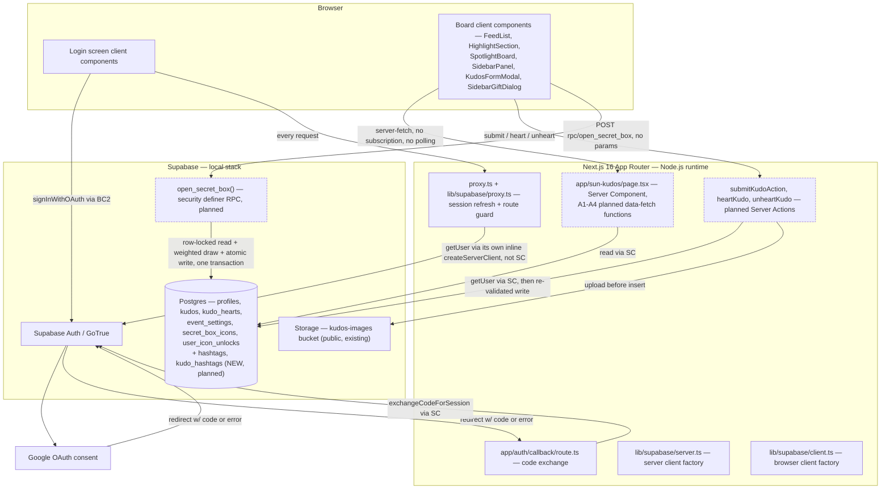
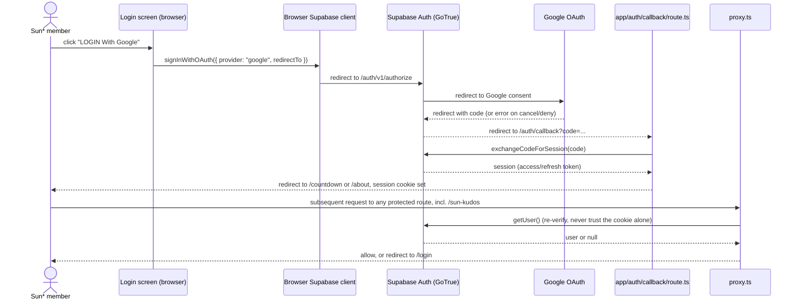
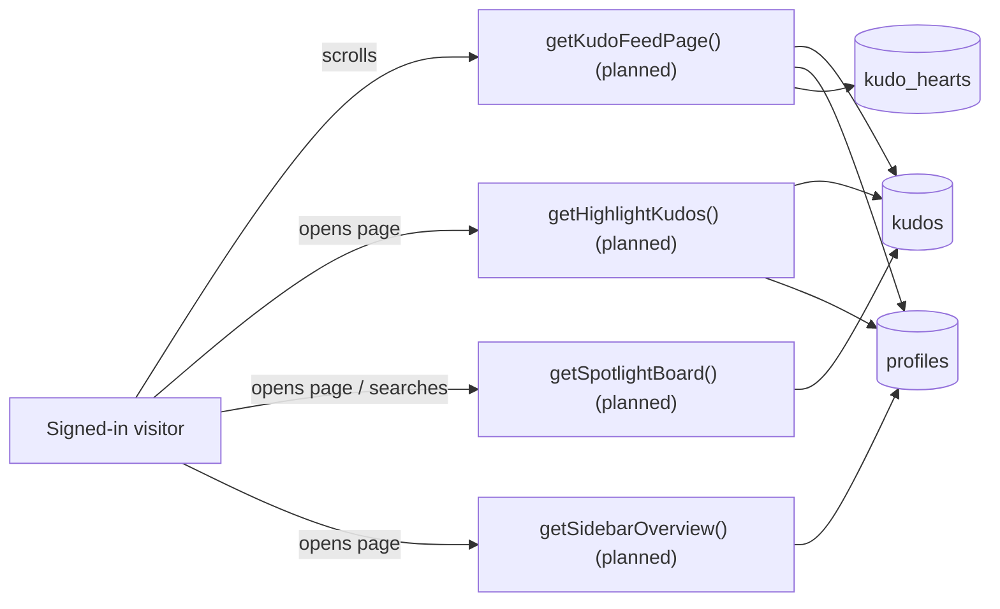
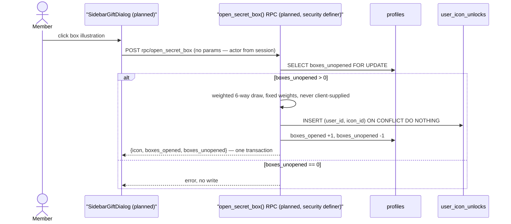

# Architecture

> **Draft scope:** this is a forward-draft of `docs/system/architecture.md`, extended to narrate
> the system AFTER Batch A lands (F002_KudosBoardData, F003_KudoAuthoring, F004_KudoHearts,
> F005_HashtagTaxonomy, F006_SecretBoxReveal, plus phase-0 `profiles` privilege-escalation
> hardening). Everything the promoted document states about the auth/login layer
> (F001_GoogleSignIn) stays true unchanged and is not repeated in full below — read it first. This
> draft adds the kudos data plane on top of it. Every Batch A element below is **planned, not yet
> implemented**, verified only against the technical specs and the live local schema as of
> 2026-09-06 — no Batch A migration, Server Action, or RPC exists in the repo yet. This file gets
> promoted alongside the Batch A code, not before.

## System Architecture

_(dashed border = planned, not yet implemented)_

## Tech Stack

| Layer                            | Technology                                                                                                                         | Version              |
| -------------------------------- | ---------------------------------------------------------------------------------------------------------------------------------- | -------------------- |
| Frontend                         | Next.js App Router, React                                                                                                          | 16.3.1, 19.2.8       |
| Auth client (cookie-aware)       | `@supabase/ssr`                                                                                                                    | ^0.12.6              |
| Auth client (core JS)            | `@supabase/supabase-js`                                                                                                            | ^2.115.0             |
| Auth provider                    | Supabase Auth (GoTrue) + Google OAuth                                                                                              | local Supabase stack |
| Session transport                | HTTP cookie, `base64-`-prefixed (`sb-<project-ref>-auth-token`)                                                                    | —                    |
| Route guard                      | `proxy.ts` (Next.js 16 Proxy, Node.js runtime)                                                                                     | Next.js 16.0.0+      |
| Board data reads _(planned)_     | Server Component fetch inside `app/sun-kudos/page.tsx`, no HTTP surface, no realtime subscription                                  | —                    |
| Kudo/heart mutations _(planned)_ | Next.js Server Actions (`"use server"`), cookie-bound via `lib/supabase/server.ts`, RLS applies as the caller                      | —                    |
| Secret-box mutation _(planned)_  | `security definer` Postgres RPC (`open_secret_box()`), called via `supabase.rpc()` — bypasses RLS by running as the function owner | —                    |
| File storage                     | Supabase Storage, `kudos-images` bucket (public, already migrated)                                                                 | local Supabase stack |

## Data Flow

**Board read flow** _(planned)_ — one Server Component fetch per page load, no client-side pagination
beyond the existing infinite-scroll sentinel, no subscription:

**Secret-box reveal flow** _(planned)_ — the one Batch A mutation that cannot be a plain Server
Action; see Trust Boundaries below for why:

Kudo submission (`submitKudoAction`, planned) and heart/un-heart (`heartKudo`/`unheartKudo`,
planned) are plain Server Actions: session check via `getUser()`, server-side re-validation, then a
single-table insert/delete — below this document's diagram threshold; see
`spec/kudo-authoring/technical-spec.md` § 3.1 and `spec/kudo-hearts/technical-spec.md` § 3.1 for
their full sequence diagrams.

## Deployment View

N/A — unchanged from the promoted document. No infrastructure-as-code exists in this repository for
Batch A either; the Storage bucket and the planned RPC both live inside the same local Supabase
stack the auth layer already uses, run via the `supabase` CLI (Docker). Batch A introduces no new
deployment surface.

## Trust Boundaries

- **Browser ↔ Supabase Auth (GoTrue):** unchanged — see the promoted document.
- **Proxy vs. Server Components (known gap):** unchanged — `app/sun-kudos/page.tsx` is one more
  protected Server Component with no independent `getUser()` check of its own; it still relies
  entirely on `proxy.ts` having already redirected an unauthenticated request away. This gap is not
  closed by Batch A.
- **Cookie propagation:** unchanged — see the promoted document.
- **Board reads require no authentication at the RLS layer, but the route itself does.** `profiles`,
  `kudos`, `kudo_hearts`, `event_settings`, `secret_box_icons`, and `user_icon_unlocks` all carry a
  `for select to anon, authenticated using (true)` policy (confirmed live on all 7 tables) — so a
  direct API call needs no session to read board data. `proxy.ts`'s `isPublicPath()` does **not**
  list `/sun-kudos`, though, so the web route itself is still gated behind login; the public-read
  policies are a data-layer default, not evidence that the page is reachable while signed out.
- **Server Action re-validation boundary (`submitKudoAction`, planned):** the client-side character
  counter (500 chars), hashtag cap (5), and image type filter are UX only. The Server Action
  re-checks every one of them server-side and rejects the whole submission on a violation — no
  partial insert. `sender_id` is always forced to `auth.uid()` server-side, never trusted from the
  client payload, matching the existing `kudos insert by sender` policy.
- **Storage upload boundary:** images upload to the `kudos-images` bucket under
  `{auth.uid()}/{uuid}-{filename}` — the folder prefix must equal the caller's own id to satisfy the
  existing Storage insert policy (`supabase/migrations/20260716100000_write_kudos.sql:25-31`). All
  uploads must succeed before the `kudos` row is inserted; a mid-upload failure aborts the whole
  submission rather than leaving a partial `image_urls` array.
- **Why the secret-box draw is a `security definer` RPC, not a Server Action (planned):**
  three independent facts rule out a plain authenticated or service-role Server Action. (1)
  `user_icon_unlocks` carries only a SELECT policy today — a client `INSERT` fails with `42501`
  (confirmed live). (2) once phase-0 hardening lands, `profiles.boxes_opened`/`boxes_unopened`
  become non-user-writable by column-level GRANT. (3) the Supabase JS client has no multi-statement
  transaction, so a service-role action doing `.update()` then `.insert()` is two HTTP round trips —
  a network failure between them could decrement the counter with no badge granted. One Postgres
  function, one transaction, closes all three: the row lock, the draw, the counter update, and the
  unlock insert either all commit or all roll back. The six draw weights are a compile-time
  constant inside the function — they never reach the client, so a user cannot compute or forge
  which outcome "should" have been drawn.
- **Realtime is explicitly NOT adopted.** `select * from pg_publication_tables where
pubname='supabase_realtime'` returns 0 rows (confirmed live) — every Batch A read is a plain
  server-fetch, no subscription, no polling. This is a stated design choice for this batch, not an
  oversight; adopting realtime later needs its own migration and subscription code.
- **The pre-existing default ACL on schema `public` is not a safety net.** Every public table
  (confirmed live for `profiles`) grants `INSERT/SELECT/UPDATE/DELETE/...` to both `anon` and
  `authenticated` from a postgres-owned default ACL, independent of any RLS policy. RLS is therefore
  the only real access boundary on this project. The two new tables Batch A introduces —
  `hashtags` and `kudo_hashtags` — inherit that same default ACL and must assert their own explicit
  RLS policies at creation time; nothing is safely inherited. (See `permissions.md` for the full
  detail — this is a permissions concern surfaced here because it shapes every new-table migration
  in this architecture.)

## Source References

- `proxy.ts`, `lib/supabase/proxy.ts`, `lib/supabase/client.ts`, `lib/supabase/server.ts`,
  `app/auth/callback/route.ts` — unchanged, see the promoted document for line-level references.
- `app/sun-kudos/page.tsx:1-48` — existing Server Component, no `"use client"` directive; composes
  the five board sections. Batch A's job is to fetch real rows here and pass them as props, not to
  change this component's shape.
- `supabase/migrations/20260714070000_profile_schema.sql` — `profiles`, `kudos`, `secret_box_icons`,
  `user_icon_unlocks` schema.
- `supabase/migrations/20260716100000_write_kudos.sql` — `kudos` INSERT policy, `kudos-images`
  Storage bucket + policy.
- `supabase/migrations/20260722100000_kudo_hearts.sql` — `kudo_hearts` schema, RLS, and the
  `sync_kudo_hearts_count()` trigger.
- `supabase/migrations/20260714080000_event_settings.sql` — `event_settings` singleton table,
  read-only RLS. Live-confirmed 2026-09-06: no special-day columns exist yet — F004's multiplier
  range is a planned addition, not yet migrated.
- `hashtags` / `kudo_hashtags` — confirmed absent from the live schema 2026-09-06; both are new
  tables this batch introduces, proposed DDL in `spec/hashtag-taxonomy/technical-spec.md` § 4.2.
  Do NOT treat that DDL as applied — it is a draft in a spec file, not a migration.
- `spec/kudos-board-data/technical-spec.md`, `spec/kudo-authoring/technical-spec.md`,
  `spec/kudo-hearts/technical-spec.md`, `spec/hashtag-taxonomy/technical-spec.md`,
  `spec/secret-box-reveal/technical-spec.md` — the five Batch A feature specs this document
  synthesizes; each carries its own action-level detail this file does not repeat.
- `reports/security-260906-1740-profiles-privilege-escalation.md` — the phase-0 hardening this
  document assumes lands before Batch B's admin surface.
