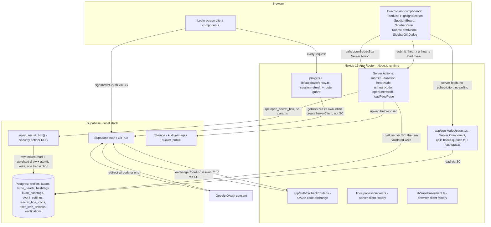
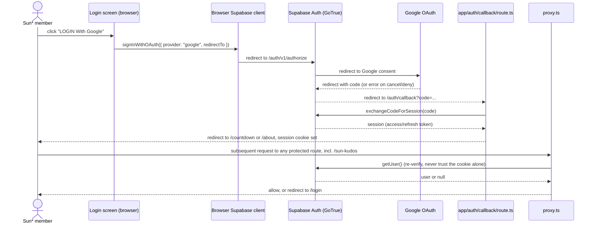
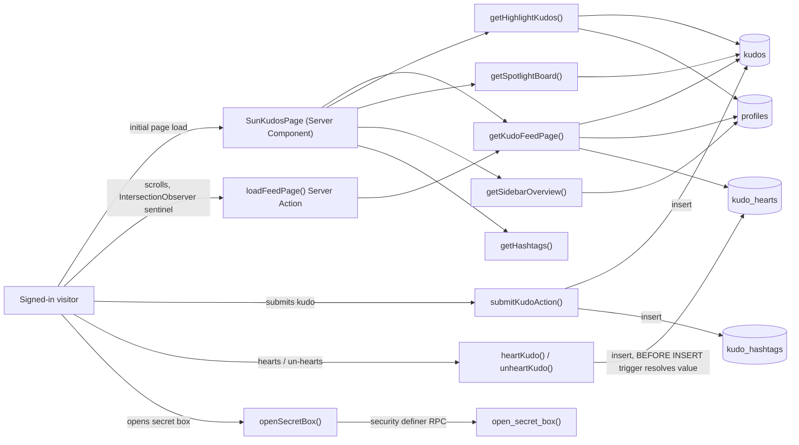

# Architecture

## System Architecture

## Tech Stack

| Layer                     | Technology                                                                           | Version                             |
| ------------------------- | ------------------------------------------------------------------------------------ | ----------------------------------- |
| Frontend                  | Next.js App Router, React, TypeScript (strict)                                       | 16.3.1, 19.2.8, TS 5                |
| Styling / UI kit          | Tailwind CSS, shadcn/ui on Base UI primitives                                        | Tailwind 4, `@base-ui/react` ^1.7.0 |
| i18n                      | i18next + react-i18next, 11 namespaces x en/vi                                       | i18next 26.4.2                      |
| Backend                   | — none in-repo (see Notes)                                                           | —                                   |
| Auth                      | Supabase Auth (GoTrue) + Google OAuth, via `@supabase/ssr` / `@supabase/supabase-js` | ^0.12.6 / ^2.115.0                  |
| Database                  | Supabase-managed Postgres (local Docker stack for dev)                               | local Supabase stack                |
| File storage              | Supabase Storage, `kudos-images` bucket (public)                                     | local Supabase stack                |
| Cache                     | — none in-repo (see Notes)                                                           | —                                   |
| Queue                     | — none in-repo (see Notes)                                                           | —                                   |
| Test runner               | Playwright (E2E only, no unit-test runner in-repo)                                   | @playwright/test 1.63.0             |
| Package manager / runtime | pnpm, Node.js                                                                        | 10.28.0, 22+                        |

**Notes on the scoping above** (mirrors `AGENTS.md`'s own "Stack" section, which lists framework,
runtime, styling, and component tooling but omits lint/format/git-hook tooling as non-architectural):

- **Backend row**: there is no custom backend service or `app/api/**` directory. The Next.js server
  itself is the only application tier; it calls Supabase directly. This is a deliberate BaaS
  architecture, not a gap — see [system-overview.md](system-overview.md) § Decision 1.
- **Cache / Queue rows**: no cache layer (Redis, in-memory, CDN cache-control beyond framework
  defaults) or queue/worker system exists anywhere in the scanned inventory (confirmed absent by the
  Wave 0 scout's Background Logic Source Inventory: `queue-worker` and all cache-adjacent BL types
  return zero hits).
- ESLint, Prettier, Husky, commitlint, `lint-staged` are dev tooling, not architecture — excluded
  here as `AGENTS.md` itself excludes them from its "Stack" section.

## Data Flow

Two flows exist: the auth handshake (every visitor) and the board's data flow (signed-in members on
`/sun-kudos`). Diagram division of labor: this section carries temporal/handshake ordering; the
System Architecture graph above carries which files/services exist and talk to each other.

**Board data flow** — one Server Component fetch per page load (`app/sun-kudos/page.tsx`), plus a
keyset-paginated Server Action for infinite scroll, plus write actions:

Kudo submission, hearting, and the secret-box draw are covered in temporal detail by the Trust
Boundaries section below (they are single-transaction or single-insert operations too short to
warrant their own sequence diagram).

## Deployment View

N/A — no infrastructure-as-code found in repository. No Dockerfile, docker-compose, Kubernetes
manifest, Terraform, systemd unit, Procfile, nginx config, or PaaS manifest (`vercel.json`,
`netlify.toml`) exists anywhere in the repo tree. The only Docker usage is the `supabase` CLI's own
local dev stack (`supabase/config.toml`), which provisions Postgres/Auth/Storage for local
development — it is not a deployment target for the application itself.

## Trust Boundaries

- **Browser <-> Supabase Auth (GoTrue)**: `proxy.ts` refreshes the session cookie and calls
  `getUser()` (re-verifies against the Auth server) on every matched request — never trusts the
  locally-stored cookie payload alone. `redirectPreservingCookies()` exists specifically so a
  token-rotation refresh mid-request is not discarded by a bare redirect, which would otherwise
  cause random sign-outs.
- **`app/auth/callback/route.ts` never reflects an inbound redirect target.** The post-login
  destination is always recomputed from `isBeforeLaunch()` server-side; no `next` query param is
  ever read — a deliberate open-redirect countermeasure. Every redirect is host-relative
  (`next/navigation`'s `redirect()`), verified against the Host header not mattering under
  `next start`.
- **`SunKudosPage` has its own session check**, contradicting the pre-existing `docs/system/*`
  draft's claim that Server Components rely entirely on `proxy.ts`: it calls `getViewerId()` and
  `redirect("/login")` itself (`app/sun-kudos/page.tsx`), described in its own comment as
  "defense in depth, not the primary gate."
- **Server Action re-validation boundary**: every Server Action in `app/sun-kudos/actions/`
  independently calls `supabase.auth.getUser()` and treats every argument (`FormData` fields,
  `kudoId`, cursor/filter objects) as untrusted client input, re-validating shape and existence
  (e.g. `submitKudoAction` re-confirms the recipient id and every hashtag id actually exist before
  writing, never trusting a client-supplied id as a fact). `sender_id`/`user_id` are always taken
  from the session's `user.id`, never from client payload.
- **Heart-value forgery is closed at the database layer, not the Server Action.** `heartKudo` never
  sends a `hearts_value` — the `resolve_heart_value()` `BEFORE INSERT` trigger on `kudo_hearts`
  unconditionally overwrites it from `event_settings.special_day_start/end`. This trigger is
  `SECURITY INVOKER` (confirmed live: `resolve_heart_value` shows `INVOKER` in
  `information_schema.routines`) — a later migration
  (`20260906193000_resolve_heart_value_no_definer.sql`) deliberately removed an earlier, unnecessary
  `SECURITY DEFINER` on it, reasoning that every `SECURITY DEFINER` function is a privilege-escalation
  surface that should not exist unless load-bearing.
- **Secret-box draw is a `SECURITY DEFINER` RPC, not a Server Action**, because: (1)
  `user_icon_unlocks` carries only a SELECT policy — a client INSERT would fail `42501`; (2)
  `profiles.boxes_opened/boxes_unopened` are not authenticated-writable by column GRANT; (3) the
  Supabase JS client cannot express "lock row, draw, write two tables" as one multi-statement
  transaction from a Server Action — a network failure between two round trips could decrement a
  counter with no badge granted. `open_secret_box()` (confirmed live `SECURITY DEFINER`) closes all
  three by doing the row lock (`FOR UPDATE`), the weighted draw (weights are a compile-time constant,
  never sent to the client), the unlock insert, and the counter update in one Postgres transaction.
- **Realtime is explicitly not adopted.** `select * from pg_publication_tables where
pubname='supabase_realtime'` returns 0 rows (confirmed live, 2026-09-06). Every board read is a
  plain per-request server-fetch; no table is published for subscription.
- **[RESOLVED 2026-09-06, re-verified live 2026-09-07] The default-ACL privilege-escalation hole is
  closed on all nine tables.** Postgres' postgres-owned default ACL on schema `public` grants `ALL`
  (`arwdDxtm`) to both `anon` and `authenticated` the instant a table is created. Two migrations were
  needed to deal with it, and only together do they cover the schema:
  `supabase/migrations/20260906193500_default_privileges_baseline.sql` narrows the default for
  **future** tables only — `ALTER DEFAULT PRIVILEGES` never touches privileges already granted, as its
  own comment states — while `supabase/migrations/20260906195000_table_grants_hardening.sql` issues the
  explicit `REVOKE ALL ... FROM anon, authenticated` plus a narrow re-grant on the six tables that had
  been missed: `kudos`, `kudo_hearts`, `notifications`, `secret_box_icons`, `user_icon_unlocks` and
  `event_settings`. (`profiles`, `hashtags`, `kudo_hashtags` and `profile_kudo_stats` had each already
  revoked in their own migration.) The gap mattered because **RLS does not govern `TRUNCATE` at all** —
  it was proven exploitable before the fix, by truncating `kudo_hearts` to zero rows as an ordinary
  member inside a rolled-back transaction.
  Live re-verification (`information_schema.role_table_grants`, 2026-09-07) shows the current grant
  shape for `anon`/`authenticated`: `event_settings`, `hashtags`, `profiles`, `profile_kudo_stats`,
  `secret_box_icons`, `user_icon_unlocks` → `SELECT`; `kudos` → `INSERT, SELECT`; `kudo_hashtags` →
  `INSERT, SELECT`; `kudo_hearts` → `DELETE, INSERT, SELECT`; `notifications` → `SELECT, UPDATE`.
  No `TRUNCATE`, `REFERENCES` or `TRIGGER` grant remains anywhere in the schema for either role.
  Per-gate detail: `permissions-matrix.md` PERM003/PERM005/PERM006/PERM011/PERM012.
- **Storage upload boundary**: uploads to `kudos-images` are scoped to `{auth.uid()}/...` — the
  Storage INSERT policy requires the first path segment equal the caller's own id
  (`supabase/migrations/20260716100000_write_kudos.sql`).

## Source References

- `proxy.ts`, `lib/supabase/proxy.ts` — session refresh + route guard, `isPublicPath()` allowlists
  only `/login` and `/auth/**`.
- `lib/supabase/server.ts`, `lib/supabase/client.ts` — server/browser Supabase client factories.
- `app/auth/callback/route.ts` — OAuth code-exchange route handler.
- `app/sun-kudos/page.tsx` — board Server Component; composes `lib/kudos/board-queries.ts` reads.
- `app/sun-kudos/actions/submit-kudo.ts`, `heart-kudo.ts`, `open-secret-box.ts`,
  `load-feed-page.ts` — the four Server Actions.
- `lib/kudos/board-queries.ts`, `board-query-helpers.ts`, `board-aggregates.ts`, `hashtags.ts`,
  `kudo-validation.ts`, `upload-kudo-images.ts`, `render-kudo-message.tsx`, `types.ts` — board query
  and validation layer.
- `lib/countdown-config.ts` — `isBeforeLaunch()`, drives post-login routing.
- `supabase/migrations/20260714070000_profile_schema.sql` — `profiles`, `kudos`,
  `secret_box_icons`, `user_icon_unlocks` schema + initial "readable by all" RLS.
- `supabase/migrations/20260714080000_event_settings.sql` — singleton config table.
- `supabase/migrations/20260716100000_write_kudos.sql` — kudos INSERT policy, `kudos-images`
  Storage bucket + policy.
- `supabase/migrations/20260722070000_grant_table_privileges.sql` — first GRANT pass + the original
  (additive, not corrective) default-privileges entry.
- `supabase/migrations/20260722090000_create_profile_on_signup.sql` — `handle_new_user()` trigger
  (`SECURITY DEFINER`), profile auto-creation on signup.
- `supabase/migrations/20260722100000_kudo_hearts.sql` — `kudo_hearts` schema, RLS,
  `sync_kudo_hearts_count()` trigger (`SECURITY DEFINER`).
- `supabase/migrations/20260723090000_notifications.sql` — `notifications` schema + self-scoped RLS.
- `supabase/migrations/20260723091000_profiles_role.sql` — adds `profiles.role`, gates nothing yet.
- `supabase/migrations/20260906190000_profiles_column_privileges.sql` — closes the
  `profiles`-self-promote-to-admin hole via column-scoped GRANT.
- `supabase/migrations/20260906191000_kudo_hashtags.sql` — `hashtags`, `kudo_hashtags` schema + RLS
  - explicit REVOKE/GRANT.
- `supabase/migrations/20260906191500_profile_stats_view.sql` — `profile_kudo_stats` view,
  `security_invoker = on`.
- `supabase/migrations/20260906192000_heart_multiplier.sql` — `resolve_heart_value()` trigger
  (originally `SECURITY DEFINER`).
- `supabase/migrations/20260906192500_secret_box_draw.sql` — `open_secret_box()` RPC.
- `supabase/migrations/20260906193000_resolve_heart_value_no_definer.sql` — removes the unnecessary
  `SECURITY DEFINER` from `resolve_heart_value()`.
- `supabase/migrations/20260906193500_default_privileges_baseline.sql` — narrows the default-ACL for
  future tables only; does not retroactively fix existing tables (see Trust Boundaries).
- `supabase/migrations/20260906194000_kudos_message_backfill.sql` — rewrites `
`-wrapped kudo
  messages to plain text (paired with `lib/kudos/render-kudo-message.tsx`).
- `supabase/migrations/20260906195000_table_grants_hardening.sql` — the retroactive `REVOKE ALL` +
  narrow re-grant on the six tables the baseline could not reach; closes the hole described in
  Trust Boundaries.
- `docs/system/architecture.md`, `docs/system/permissions.md` — pre-existing forward-drafted specs;
  superseded by this document wherever the shipped code disagrees (see
  [system-overview.md](system-overview.md) § Notes).
