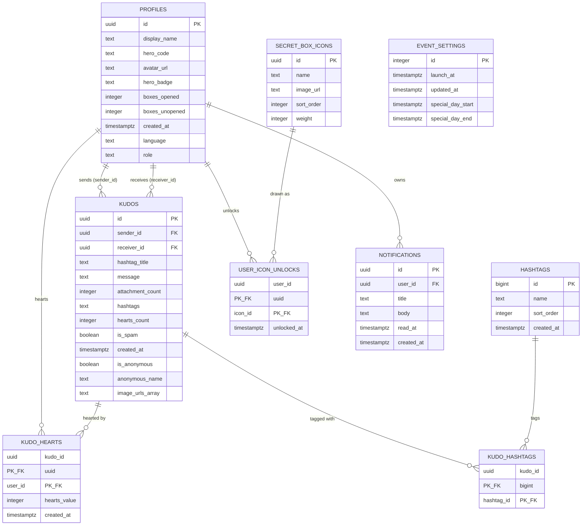

<!-- layout-exempt: rebuild-spec owns all docs/system|features|generated|flows paths — all references here are output targets or internal definitions -->
<!-- Output path: docs/generated/entities.md -->

# Entities

**Project**: Sun\* Annual Awards 2025 / Sun\* Kudos App
**Generated**: 2026-09-06

**Verification method**: LIVE schema inspected via `docker exec supabase_db_mock-aidd-kudo-app psql -U postgres -d postgres -c "\d public.<table>"` against the running local Supabase instance, cross-checked against `supabase/migrations/*.sql` (17 files, `20260714070000`..`20260906194000`) and consuming code (`app/sun-kudos/actions/*.ts`, `lib/kudos/*.ts`, `lib/supabase/database.types.ts`). All 9 tables + 1 view below are EXTRACTED from the live `\d` output, not inferred from migrations alone — migrations are cited only for trigger/function bodies and rationale (`\d` does not print function source).

## Entity Relationship Diagram

`PROFILE_KUDO_STATS` (view, `security_invoker=on`) is deliberately omitted from the ERD — it is a derived read model over `profiles`/`kudos`, not a stored entity; see its own subsection below.

## Entities

### MODEL001_PROFILES

**Description**: One row per authenticated user (`auth.users.id` 1:1, `ON DELETE CASCADE`). Backs the account menu, profile screen stats, hero badge, and secret-box counters. Auto-created by the `handle_new_user()` trigger on signup; also backfilled once for pre-existing `auth.users` rows (`20260722090000_create_profile_on_signup.sql`).

| Attribute      | Type        | Constraints                                                           | Description                                                                                                                                                                                                                                                                                                                                                                                                                                                                               |
| -------------- | ----------- | --------------------------------------------------------------------- | ----------------------------------------------------------------------------------------------------------------------------------------------------------------------------------------------------------------------------------------------------------------------------------------------------------------------------------------------------------------------------------------------------------------------------------------------------------------------------------------- |
| id             | uuid        | PK, NOT NULL, FK → auth.users(id) ON DELETE CASCADE                   | Same id as the Supabase auth user                                                                                                                                                                                                                                                                                                                                                                                                                                                         |
| display_name   | text        | NOT NULL                                                              | Shown across kudos board, profile, leaderboard                                                                                                                                                                                                                                                                                                                                                                                                                                            |
| hero_code      | text        | NOT NULL                                                              | Placeholder hero code, auto-generated as `upper(left(md5(id),6))` on signup — no real assignment flow exists yet                                                                                                                                                                                                                                                                                                                                                                          |
| avatar_url     | text        | nullable                                                              | From OAuth `avatar_url` metadata, if present                                                                                                                                                                                                                                                                                                                                                                                                                                              |
| hero_badge     | text        | NOT NULL, DEFAULT `'new'`, CHECK IN (`new`,`rising`,`legend`,`super`) | UI badge tier (`HeroBadgeVariant` union in code)                                                                                                                                                                                                                                                                                                                                                                                                                                          |
| boxes_opened   | integer     | NOT NULL, DEFAULT 0                                                   | Counter, written only by `open_secret_box()` RPC                                                                                                                                                                                                                                                                                                                                                                                                                                          |
| boxes_unopened | integer     | NOT NULL, DEFAULT 0                                                   | Counter, written only by `open_secret_box()` RPC; gates whether a draw is allowed                                                                                                                                                                                                                                                                                                                                                                                                         |
| created_at     | timestamptz | NOT NULL, DEFAULT now()                                               |                                                                                                                                                                                                                                                                                                                                                                                                                                                                                           |
| language       | text        | nullable, DEFAULT `'vi'`, CHECK IN (`vi`,`en`)                        | Persisted i18n preference; read-time precedence is cookie > this column > default `vi`                                                                                                                                                                                                                                                                                                                                                                                                    |
| role           | text        | NOT NULL, DEFAULT `'user'`, CHECK IN (`user`,`admin`)                 | Schema-only placeholder — declared but unconsumed. No code path reads `profiles.role` today: exhaustive grep of `app/`, `components/`, `lib/`, `hooks/`, `constants/` finds it only in generated `lib/supabase/database.types.ts`. `components/homepage/user-menu.tsx:90-99` renders the "Admin Dashboard" menu `<li>`/`<button>` unconditionally for every user, with no role check. Admin gating is planned (Batch B, `plans/260906-1903-profile-and-menus` phase 06), not implemented. |

**Relationships**:

- One-to-Many with KUDOS via `sender_id` and, separately, via `receiver_id` (two distinct FK relationships, same target table)
- One-to-Many with KUDO_HEARTS via `user_id`
- One-to-Many with NOTIFICATIONS via `user_id`
- One-to-Many with USER_ICON_UNLOCKS via `user_id`

**RLS**: SELECT `USING (true)` for `anon, authenticated` ("profiles readable by all"); UPDATE scoped to `auth.uid() = id` ("profiles updatable by owner", added `20260716090000`). No INSERT/DELETE policy — rows are created only by the `handle_new_user()` trigger or `service_role` (seed).

**Discriminator Fields**:

> **Scope:** enum fields with ≥2 distinct behavioral values. Boolean flags are NOT discriminators — see Business Rules in the owning feature spec.

| Field      | DISC-### | Values                             | Description                                                                                                                  |
| ---------- | -------- | ---------------------------------- | ---------------------------------------------------------------------------------------------------------------------------- |
| hero_badge | DISC-001 | `new`, `rising`, `legend`, `super` | Badge tier rendered on profile/board UI; each value maps to a distinct badge visual (`HeroBadgeVariant`)                     |
| language   | DISC-002 | `vi`, `en`                         | Drives which i18n locale bundle (`lib/i18n/locales/{vi,en}/*.json`) renders for this user when no cookie override is present |

`role` is deliberately NOT assigned a DISC-### here: it is a real 2-value enum with a live CHECK constraint (`user`,`admin`), but a discriminator requires ≥2 values with distinct _behavioral_ outcomes, and there is currently none — `components/homepage/user-menu.tsx:90-99` renders the "Admin Dashboard" menu item unconditionally for every user, and grep across `app/`, `components/`, `lib/`, `hooks/`, `constants/` finds zero consuming code beyond generated types. Admin gating is planned (Batch B, `plans/260906-1903-profile-and-menus` phase 06) but not implemented, so `role` stays a plain attribute above, not a DISC entry.

---

### MODEL002_KUDOS

**Description**: One row per kudo message posted from one profile to another. Central content entity for the Sun\* Kudos board (feed, highlights, spotlight). `hearts_count` is a denormalized counter kept in sync by the `sync_kudo_hearts_count()` trigger on `kudo_hearts`.

| Attribute        | Type        | Constraints                                   | Description                                                                                                                                                                                                                                                                                                                                                                                                                                                                                                                                                                                                                                                                           |
| ---------------- | ----------- | --------------------------------------------- | ------------------------------------------------------------------------------------------------------------------------------------------------------------------------------------------------------------------------------------------------------------------------------------------------------------------------------------------------------------------------------------------------------------------------------------------------------------------------------------------------------------------------------------------------------------------------------------------------------------------------------------------------------------------------------------- |
| id               | uuid        | PK, NOT NULL, DEFAULT gen_random_uuid()       |                                                                                                                                                                                                                                                                                                                                                                                                                                                                                                                                                                                                                                                                                       |
| sender_id        | uuid        | NOT NULL, FK → profiles(id) ON DELETE CASCADE | Always taken from the authenticated session server-side (`submitKudoAction`), never from client `formData`                                                                                                                                                                                                                                                                                                                                                                                                                                                                                                                                                                            |
| receiver_id      | uuid        | NOT NULL, FK → profiles(id) ON DELETE CASCADE | Verified to exist server-side before insert                                                                                                                                                                                                                                                                                                                                                                                                                                                                                                                                                                                                                                           |
| hashtag_title    | text        | NOT NULL, DEFAULT `''`                        | Legacy column from the original profile-screen schema (`20260714070000`) — actively read, NOT dead: `lib/kudos/board-query-helpers.ts:34` selects it in the shared `KUDO_SELECT` (feed + Highlight carousel), and `board-query-helpers.ts:131` maps it to the card's `category` field, documented at `lib/kudos/types.ts:38` as "the free-text category chip, e.g. 'YOUTH IDOL'". It drives the single category chip, a distinct concern from the structured `hashtags`/`kudo_hashtags` tables below (which drive filter chips) — not superseded, just a separate concern.                                                                                                            |
| message          | text        | NOT NULL                                      | Free text, cap enforced app-side at 500 chars (`KUDOS_MESSAGE_MAX_LENGTH`, `lib/kudos/kudo-validation.ts`) — not a DB CHECK constraint                                                                                                                                                                                                                                                                                                                                                                                                                                                                                                                                                |
| attachment_count | integer     | NOT NULL, DEFAULT 0                           | `[UNVERIFIED]` — no write-site found in `submit-kudo.ts` (image count is implicit in `image_urls` array length instead); likely superseded, not removed                                                                                                                                                                                                                                                                                                                                                                                                                                                                                                                               |
| hashtags         | text        | NOT NULL, DEFAULT `''`                        | **Legacy free-text column, deliberately retained this batch.** The structured taxonomy (`hashtags` + `kudo_hashtags` tables below) is the source of truth for new writes; this column is a pre-taxonomy holdover. `20260906191000_kudo_hashtags.sql`'s backfill attempted a best-effort token match of this column against the 13 seeded hashtag names and inserted 0 rows (seed data uses English tags like `#Dedicated`, none matching the 13 Vietnamese canonical names) — confirmed by that migration's own `raise notice`. Two sources of truth exist on purpose pending a later cleanup batch (per migration comment: "Cleanup happens in a later batch once nothing reads it") |
| hearts_count     | integer     | NOT NULL, DEFAULT 0                           | Denormalized; sole writer is `sync_kudo_hearts_count()` trigger — never written directly by application code                                                                                                                                                                                                                                                                                                                                                                                                                                                                                                                                                                          |
| is_spam          | boolean     | NOT NULL, DEFAULT false                       | Status badge shown on profile screen                                                                                                                                                                                                                                                                                                                                                                                                                                                                                                                                                                                                                                                  |
| created_at       | timestamptz | NOT NULL, DEFAULT now()                       |                                                                                                                                                                                                                                                                                                                                                                                                                                                                                                                                                                                                                                                                                       |
| is_anonymous     | boolean     | NOT NULL, DEFAULT false                       | When true, sender identity is hidden and `anonymous_name` is shown instead                                                                                                                                                                                                                                                                                                                                                                                                                                                                                                                                                                                                            |
| anonymous_name   | text        | nullable                                      | Only set when `is_anonymous = true`                                                                                                                                                                                                                                                                                                                                                                                                                                                                                                                                                                                                                                                   |
| image_urls       | text[]      | NOT NULL, DEFAULT `'{}'`                      | Public URLs of uploaded attachment images                                                                                                                                                                                                                                                                                                                                                                                                                                                                                                                                                                                                                                             |

**Relationships**:

- Many-to-One with PROFILES via `sender_id`
- Many-to-One with PROFILES via `receiver_id`
- One-to-Many with KUDO_HEARTS via `kudo_id`
- One-to-Many with KUDO_HASHTAGS via `kudo_id`

**Indexes**: `kudos_receiver_id_created_at_idx (receiver_id, created_at DESC)` — feed pagination by recipient; `kudos_sender_id_idx (sender_id)`.

**RLS**: SELECT `USING (true)` for `anon, authenticated`; INSERT scoped to `sender_id = auth.uid()`. No UPDATE/DELETE policy.

**Discriminator Fields**: None assigned. `is_spam`/`is_anonymous` are booleans driving single-field conditional rendering — they qualify as DISC-### candidates per `code-formats.md`'s "boolean single-field" clause, but this artifact intentionally does NOT assign them one: **a boolean DISC entry is flagged critical at the W1.5 gate** per this run's explicit instruction. Documented instead as plain boolean flags, belonging in feature-spec Business Rules (e.g. `is_anonymous` → hide sender identity, `is_spam` → show spam badge).

---

### MODEL003_KUDO_HEARTS

**Description**: One row per (kudo, user) "like". Composite PK enforces at-most-one heart per user per kudo. `hearts_value` is **resolved server-side, never client-supplied** — see Business Rules.

| Attribute    | Type        | Constraints                                                   | Description                                                                                                                                                                                                                                         |
| ------------ | ----------- | ------------------------------------------------------------- | --------------------------------------------------------------------------------------------------------------------------------------------------------------------------------------------------------------------------------------------------- |
| kudo_id      | uuid        | PK (composite), NOT NULL, FK → kudos(id) ON DELETE CASCADE    |                                                                                                                                                                                                                                                     |
| user_id      | uuid        | PK (composite), NOT NULL, FK → profiles(id) ON DELETE CASCADE |                                                                                                                                                                                                                                                     |
| hearts_value | integer     | NOT NULL, DEFAULT 1, CHECK IN (1, 2)                          | **Overwritten by the `resolve_heart_value()` BEFORE INSERT trigger regardless of what the client/PostgREST insert payload sends.** 2 = special-day multiplier (window from `event_settings.special_day_start/end`), 1 = normal. See Business Rules. |
| created_at   | timestamptz | NOT NULL, DEFAULT now()                                       |                                                                                                                                                                                                                                                     |

**Relationships**:

- Many-to-One with KUDOS via `kudo_id`
- Many-to-One with PROFILES via `user_id`

**Triggers** (verified via `\d` + migration source, function bodies not visible in `\d` output):

- `before_kudo_hearts_insert` BEFORE INSERT → `resolve_heart_value()` — `language plpgsql`, **not** `security definer` as of `20260906193000_resolve_heart_value_no_definer.sql` (an earlier version, `20260906192000_heart_multiplier.sql`, WAS `security definer`; downgraded because the function only reads a table already SELECT-granted to `anon`/`authenticated`, so owner privileges were unneeded — reviewer finding). Pins `search_path = public` regardless, as hygiene.
- `on_kudo_hearts_change` AFTER INSERT OR DELETE → `sync_kudo_hearts_count()` (`security definer`) — updates `kudos.hearts_count` by `+NEW.hearts_value` (insert) or `-OLD.hearts_value` (delete), floored at 0 via `greatest(...,0)`. BEFORE-trigger ordering guarantees `resolve_heart_value()` always runs first, so this always reads the DB-resolved value, never a forged one.

**RLS**: SELECT `USING (true)`; INSERT scoped to `user_id = auth.uid() AND auth.uid() <> (kudo's sender_id)` (self-heart blocked); DELETE scoped to `user_id = auth.uid()`.

**Discriminator Fields**: None. (`hearts_value`'s 1/2 split is a server-resolved computed value, not a client-facing category the entity models as a discriminator — captured instead as a Business Rule.)

---

### MODEL004_HASHTAGS

**Description**: Structured hashtag taxonomy master list (13 seeded Vietnamese names), replacing two previously hardcoded, mutually-inconsistent hashtag lists in the UI layer.

| Attribute  | Type        | Constraints                                  | Description                                                                         |
| ---------- | ----------- | -------------------------------------------- | ----------------------------------------------------------------------------------- |
| id         | bigint      | PK, NOT NULL, `generated always as identity` | Deliberately `bigint`, not `uuid` — the whole UI already types hashtags as `number` |
| name       | text        | NOT NULL, UNIQUE                             |                                                                                     |
| sort_order | integer     | NOT NULL, DEFAULT 0                          |                                                                                     |
| created_at | timestamptz | NOT NULL, DEFAULT now()                      |                                                                                     |

**Relationships**:

- One-to-Many with KUDO_HASHTAGS via `hashtag_id`

**RLS**: SELECT `USING (true)` for `anon, authenticated`. No INSERT/UPDATE/DELETE policy (writes are seed/migration only).

**Discriminator Fields**: None.

---

### MODEL005_KUDO_HASHTAGS

**Description**: Join table recording which hashtags a kudo carries (many-to-many, `kudos` ↔ `hashtags`).

| Attribute  | Type   | Constraints                                                    | Description                                                    |
| ---------- | ------ | -------------------------------------------------------------- | -------------------------------------------------------------- |
| kudo_id    | uuid   | PK (composite), NOT NULL, FK → kudos(id) ON DELETE CASCADE     |                                                                |
| hashtag_id | bigint | PK (composite), NOT NULL, FK → hashtags(id) ON DELETE RESTRICT | `RESTRICT`, not `CASCADE` — a hashtag in use cannot be deleted |

**Indexes**: `kudo_hashtags_hashtag_id_idx (hashtag_id)`.

**Relationships**:

- Many-to-One with KUDOS via `kudo_id`
- Many-to-One with HASHTAGS via `hashtag_id`

**RLS**: SELECT `USING (true)`; INSERT scoped to `auth.uid() = (the kudo's sender_id)` — mirrors the `kudos` insert policy.

**Discriminator Fields**: None.

---

### MODEL006_SECRET_BOX_ICONS

**Description**: Catalog of collectible badge icons awarded by the secret-box draw. `weight` drives a weighted random draw (RPC `open_secret_box()`).

| Attribute  | Type    | Constraints                             | Description                                                                                                                                                                         |
| ---------- | ------- | --------------------------------------- | ----------------------------------------------------------------------------------------------------------------------------------------------------------------------------------- |
| id         | uuid    | PK, NOT NULL, DEFAULT gen_random_uuid() |                                                                                                                                                                                     |
| name       | text    | NOT NULL                                | 6 seeded rows: Stay Gold, Flow to Horizon, Touch of Light, Beyond the Boundary, Revival, Root Further                                                                               |
| image_url  | text    | NOT NULL                                | `[UNVERIFIED]` — migration comment states seeded rows point at a "non-existent `/profile/icons/` directory"; artwork is a known, separately-tracked gap, UI falls back to name-text |
| sort_order | integer | NOT NULL, DEFAULT 0                     | Also determines draw iteration order (cumulative weight walk in `sort_order`)                                                                                                       |
| weight     | integer | NOT NULL, DEFAULT 0                     | Live values: 30/25/20/10/10/5 (sum 100) for sort_order 1..6 respectively — added by `20260906192500_secret_box_draw.sql`                                                            |

**Relationships**:

- One-to-Many with USER_ICON_UNLOCKS via `icon_id`

**RLS**: SELECT `USING (true)`. No INSERT/UPDATE/DELETE policy.

**Discriminator Fields**: None (name/weight are catalog data, not a behavioral enum — draw behavior is uniform across all rows, only the probability differs).

---

### MODEL007_USER_ICON_UNLOCKS

**Description**: One row per (user, icon) unlock. Composite PK — a user can own each icon at most once; a re-draw of an already-owned icon still consumes a box but writes no second row (`ON CONFLICT ... DO NOTHING`, see Business Rules).

| Attribute   | Type        | Constraints                                                           | Description |
| ----------- | ----------- | --------------------------------------------------------------------- | ----------- |
| user_id     | uuid        | PK (composite), NOT NULL, FK → profiles(id) ON DELETE CASCADE         |             |
| icon_id     | uuid        | PK (composite), NOT NULL, FK → secret_box_icons(id) ON DELETE CASCADE |             |
| unlocked_at | timestamptz | NOT NULL, DEFAULT now()                                               |             |

**Relationships**:

- Many-to-One with PROFILES via `user_id`
- Many-to-One with SECRET_BOX_ICONS via `icon_id`

**RLS**: SELECT `USING (true)`. No INSERT/UPDATE/DELETE policy — sole writer is the `open_secret_box()` `security definer` RPC, which bypasses RLS by design.

**Discriminator Fields**: None.

---

### MODEL008_NOTIFICATIONS

**Description**: One row per in-app notification for one user (bell panel). Unread state is `read_at IS NULL`, not a boolean column.

| Attribute  | Type        | Constraints                                   | Description                     |
| ---------- | ----------- | --------------------------------------------- | ------------------------------- |
| id         | uuid        | PK, NOT NULL, DEFAULT gen_random_uuid()       |                                 |
| user_id    | uuid        | NOT NULL, FK → profiles(id) ON DELETE CASCADE |                                 |
| title      | text        | NOT NULL                                      |                                 |
| body       | text        | NOT NULL                                      |                                 |
| read_at    | timestamptz | nullable                                      | NULL = unread; set on mark-read |
| created_at | timestamptz | NOT NULL, DEFAULT now()                       |                                 |

**Indexes**: `notifications_user_id_created_at_idx (user_id, created_at DESC)`.

**Relationships**:

- Many-to-One with PROFILES via `user_id`

**RLS**: SELECT scoped to `user_id = auth.uid()` ("notifications readable by self" — self-scoped, unlike `profiles`/`kudos`' "readable by all"); UPDATE scoped to `user_id = auth.uid()` (mark-read), no column restriction. No INSERT/DELETE policy — rows are seed/`service_role` only.

**Discriminator Fields**: None (`read_at` null-vs-set is a state transition, not a fixed enum — documented as a Business Rule in the owning feature spec, not DISC).

---

### MODEL009_EVENT_SETTINGS

**Description**: Singleton config row (enforced by `CHECK (id = 1)`, not a sequence) holding the event launch instant and an optional "special day" window that drives the hearts x2 multiplier.

| Attribute         | Type        | Constraints                             | Description                                                                                                                                                                                                                                                                                                                                             |
| ----------------- | ----------- | --------------------------------------- | ------------------------------------------------------------------------------------------------------------------------------------------------------------------------------------------------------------------------------------------------------------------------------------------------------------------------------------------------------- |
| id                | integer     | PK, NOT NULL, DEFAULT 1, CHECK (id = 1) | Singleton guard                                                                                                                                                                                                                                                                                                                                         |
| launch_at         | timestamptz | NOT NULL                                | Countdown-page target instant — `[UNVERIFIED]` whether the app ever reads this column at runtime (no query against `event_settings.launch_at` found in `app/`/`lib/` during this pass). Confirmed instead: the app reads the `NEXT_PUBLIC_LAUNCH_AT` env var (`lib/countdown-config.ts`) for `isBeforeLaunch()`, entirely independently of this column. |
| updated_at        | timestamptz | NOT NULL, DEFAULT now()                 |                                                                                                                                                                                                                                                                                                                                                         |
| special_day_start | timestamptz | nullable                                | Added `20260906192000_heart_multiplier.sql`; both this and `special_day_end` must be non-null for the x2 window to apply                                                                                                                                                                                                                                |
| special_day_end   | timestamptz | nullable                                |                                                                                                                                                                                                                                                                                                                                                         |

**Relationships**: None (no FK in or out; referenced only by the `resolve_heart_value()` trigger function body, a runtime read, not a schema FK).

**RLS**: SELECT `USING (true)`. No INSERT/UPDATE/DELETE policy.

**Discriminator Fields**: None.

---

### PROFILE_KUDO_STATS (view, not a table)

**Description**: `security_invoker = on` read-model view aggregating per-profile stats (kudos received/sent, hearts received) for the sidebar stats, star tier, and leaderboard — one shared view instead of three near-identical queries. `security_invoker=on` is load-bearing: without it the view would run with the view owner's privileges and silently bypass RLS on `profiles`/`kudos` for both `anon` and `authenticated` callers.

| Column          | Type   | Description                                                                                                                             |
| --------------- | ------ | --------------------------------------------------------------------------------------------------------------------------------------- |
| id              | uuid   | = `profiles.id`                                                                                                                         |
| kudos_received  | bigint | `count(*)` of kudos where `receiver_id = id`                                                                                            |
| kudos_sent      | bigint | `count(*)` of kudos where `sender_id = id`                                                                                              |
| hearts_received | bigint | `sum(kudos.hearts_count)` where `receiver_id = id` — reads the already-trigger-maintained counter, does not re-sum `kudo_hearts` itself |

**RLS**: `revoke all` then `grant select` to `anon, authenticated` explicitly (schema-level default ACL covers views too, per the migration's own comment — cannot rely on an assumed narrow inherited grant).

**Discriminator Fields**: None (view has no enum columns).

---

## Validation Rules

### PROFILES

| Rule              | Field      | Constraint                                 | Error Message                                                       |
| ----------------- | ---------- | ------------------------------------------ | ------------------------------------------------------------------- |
| hero_badge_enum   | hero_badge | CHECK IN (`new`,`rising`,`legend`,`super`) | DB constraint violation (no custom message; enforced only by CHECK) |
| language_enum     | language   | CHECK IN (`vi`,`en`)                       | DB constraint violation                                             |
| role_enum         | role       | CHECK IN (`user`,`admin`)                  | DB constraint violation                                             |
| owner_update_only | id         | RLS `auth.uid() = id` on UPDATE            | RLS denial (Postgres error, no app-level message)                   |

### KUDOS

| Rule                     | Field                   | Constraint                                                                                                                                                     | Error Message                                                                            |
| ------------------------ | ----------------------- | -------------------------------------------------------------------------------------------------------------------------------------------------------------- | ---------------------------------------------------------------------------------------- |
| message_max_length       | message                 | App-level, 500 chars (`KUDOS_MESSAGE_MAX_LENGTH`, `lib/kudos/kudo-validation.ts`) — **not a DB CHECK**                                                         | `tooLong` field error code                                                               |
| recipient_required       | (n/a, FK target)        | App-level: `recipientId` must be non-null and must resolve to an existing `profiles.id` (re-verified server-side, not trusted from client)                     | `required` / `notFound`                                                                  |
| hashtag_ids_exist        | (n/a)                   | App-level: every submitted `hashtagIds` entry must resolve to an existing `hashtags.id`                                                                        | `notFound`                                                                               |
| sender_from_session_only | sender_id               | Structural: never read from client `formData`; always the authenticated `getUser()` id                                                                         | n/a (no client-facing error — this is a non-bypassable code path, not a validated field) |
| image_type_allowlist     | image_urls (pre-upload) | App-level: MIME type in (`image/jpeg`,`image/png`) AND extension in (`.jpg`,`.jpeg`,`.png`) — both checked, not just one, to block a spoofed-MIME renamed file | `invalidType`                                                                            |

### KUDO_HEARTS

| Rule                        | Field              | Constraint                                                                        | Error Message                                                                                         |
| --------------------------- | ------------------ | --------------------------------------------------------------------------------- | ----------------------------------------------------------------------------------------------------- |
| hearts_value_domain         | hearts_value       | DB CHECK IN (1, 2)                                                                | DB constraint violation (defense-in-depth; the BEFORE INSERT trigger already only ever writes 1 or 2) |
| no_self_heart               | user_id            | RLS INSERT `WITH CHECK (user_id = auth.uid() AND auth.uid() <> kudo's sender_id)` | Server Action maps Postgres `42501` → `"forbidden"`                                                   |
| one_heart_per_user_per_kudo | (kudo_id, user_id) | Composite PK uniqueness                                                           | Server Action treats Postgres `23505` (conflict) as a no-op, not an error                             |

### EVENT_SETTINGS

| Rule          | Field | Constraint     | Error Message           |
| ------------- | ----- | -------------- | ----------------------- |
| singleton_row | id    | CHECK (id = 1) | DB constraint violation |

---

## Business Rules — Server-Resolved / Trigger-Driven Values (not DISC, not simple CHECKs)

These are documented here (data-model level) because they explain _why_ a column's value cannot be taken at face value from a client write — full BR-### numbering belongs to the owning feature spec, out of scope for this artifact.

- **`kudo_hearts.hearts_value` is resolved server-side, always.** The BEFORE INSERT trigger `resolve_heart_value()` unconditionally overwrites `NEW.hearts_value` based solely on whether `now()` falls inside `event_settings.special_day_start`/`special_day_end` (both non-null required) — 2 if inside the window, 1 otherwise. This closes a real forgeability gap: the RLS INSERT policy only checks `user_id`/self-heart, never `hearts_value`, so a direct PostgREST call with the anon/authenticated key could otherwise set `hearts_value = 2` on any day. The Server Action (`heartKudo`) never sends `hearts_value` at all.
- **Un-hearting revokes the exact granted amount.** `sync_kudo_hearts_count()`'s DELETE branch subtracts `OLD.hearts_value` (whatever was actually stored on that row), not a hardcoded 1 — so un-hearting a kudo hearted during a special-day window correctly revokes 2, even after the window has closed.
- **`open_secret_box()` draw is atomic and idempotent on repeat icons.** The RPC locks the caller's own `profiles` row (`FOR UPDATE`) before checking `boxes_unopened`, so two concurrent calls serialize — the second observes `boxes_unopened = 0` under the same lock and raises `no_unopened_boxes` before drawing anything. A draw landing on an already-owned icon still consumes the box (`boxes_opened`/`boxes_unopened` counters move) but writes no second `user_icon_unlocks` row (`ON CONFLICT ON CONSTRAINT user_icon_unlocks_pkey DO NOTHING`) — the same badge is simply returned again.
- **`kudos.hashtags` (legacy) vs `hashtags`/`kudo_hashtags` (structured) are two sources of truth on purpose, pending cleanup.** New kudo submissions write ONLY the structured tables (`submitKudoAction` inserts into `kudo_hashtags`, never touches the legacy `hashtags` text column). The legacy column is retained this batch per an explicit clarification decision; a one-time backfill attempt matched 0 rows because seed data's free-text tags share no names with the 13 canonical seeded hashtags.

## Summary

- **Total Entities**: 9 tables + 1 view (`profile_kudo_stats`)
- **Total Relationships**: 10 FK relationships (PROFILES→KUDOS ×2, PROFILES→KUDO_HEARTS, PROFILES→NOTIFICATIONS, PROFILES→USER_ICON_UNLOCKS, KUDOS→KUDO_HEARTS, KUDOS→KUDO_HASHTAGS, HASHTAGS→KUDO_HASHTAGS, SECRET_BOX_ICONS→USER_ICON_UNLOCKS, PROFILES→auth.users)
- **Seeded row counts (live local DB, verified via `SELECT count(*)`)**: profiles 15 · kudos 44 · kudo_hearts 48 · kudo_hashtags 105 · hashtags 13 · secret_box_icons 6 · notifications 4 · user_icon_unlocks 1 · event_settings 1. (Task brief estimated kudos "40+", kudo_hashtags "100", user_icon_unlocks "3" — live counts of 44 / 105 / 1 respectively supersede those estimates.)
- **Discriminators assigned**: DISC-001 (`profiles.hero_badge`), DISC-002 (`profiles.language`) — both multi-value enums with distinct behavioral/rendering outcomes. `profiles.role` is a real 2-value enum but was NOT assigned a DISC-### — no consuming code branches on it yet (see MODEL001_PROFILES note). No boolean fields were assigned a DISC-### (see KUDOS entity note) per this run's explicit critical-severity instruction.
